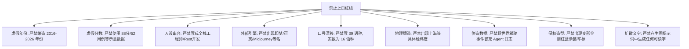
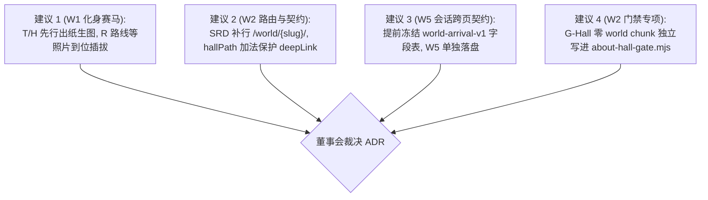

# AH-G0｜Step 0 起手调研包 digest（adopt / adapt / drop）

> **文档性质**：Step 0 起手调研包综合吸收报告（CURRENT AUTHORITY 支撑文档）  
> **写入路径**：`docs/local-cmd/STEP0-DIGEST.md`（唯一 write root）  
> **基线分支**：`codex/about-hall-20260902` @ `main (c585df9)`  
> **执行席位**：多面 worker（Gemini 3.7 Flash / agy）  
> **关联票册**：`docs/local-cmd/ABOUT-HALL-INDEX.md`（AH-G0 / AH-D1 / AH-D2 / AH-W1..W6）

---

## 1. adopt / adapt / drop 三栏总表（54 条）

本表系统梳理 4 个起手研究包（12 楼脑暴、About 三路、Paidax 拆解与发现、Agent Nexus N2）与站内定位单源，逐条判定对「我是谁」（About Hall）工程的处置与落地点：

| # | 来源文件 & 章节 | 调研核心结论 | 处置判定（adopt / adapt / drop & 理由） | 归属波次与票号 |
|---|---|---|---|---|
| 1 | `lane-tech-grok-4.6.md` §1.1 | 进站使用整页 `location.assign`，不带 query、不写 sessionStorage，导致驾驶会话与成就数据丢失 | **adopt**：必须在 `location.assign` 之前将驾驶会话状态同步快照写入 `sessionStorage['world-arrival-v1']` | W5 (`AH-W5`) / W0 (`AH-D2`) |
| 2 | `lane-tech-grok-4.6.md` §1.2 | 采用 URL 身份（`?from=city&poi=`）+ `sessionStorage` 载荷双通道传递，兼顾可分享性与隐私体积 | **adopt**：采纳双通道契约，URL 负责路由身份识别，Storage 负责高维驾驶数据承载 | W5 (`AH-W5`) / W0 (`AH-D2`) |
| 3 | `lane-tech-grok-4.6.md` §1.2 | 建筑名称、`neonColor` 绝不进 URL 或 Storage，展厅与横幅构建期统一查 `cyber-city-buildings.json` | **adopt**：严格执行单一事实源，避免 Storage/URL 中的静态配置与 JSON 表发生色彩与文案漂移 | W2 (`AH-W2a`) / W5 (`AH-W5`) |
| 4 | `lane-tech-grok-4.6.md` §1.3 | C 路线到达横幅统一挂载在 `BaseLayout.astro` 开槽之后，`/` 与 `/world-spike/` 独立壳天然豁免 | **adopt**：确保全站所有内容页、案例页与 Lab 页均具备统一的赛博城市到达感知 | W5 (`AH-W5`) |
| 5 | `lane-tech-grok-4.6.md` §1.4 | 到达横幅脚本采用纯内联 `is:inline`，首行检测 `if (location.search.indexOf('from=city') === -1) return;`，无参默认 `hidden` | **adopt**：彻底隔绝常规无参访问与 LHCI collect 爬虫的布局占用，实现零 CLS 与零 LCP 干扰 | W4 (`AH-W4`) / W5 (`AH-W5`) |
| 6 | `lane-tech-grok-4.6.md` §1.5 | `BaseLayout.astro` 的 `canonical` 与 `og:url` 原生剔除 query 参数，`?from=city` 不影响 SEO 权重 | **adopt**：继承既有 SEO 去参机制，无需额外配置 `noindex` 或修改 `robots.txt` | W2 (`AH-W2a`) |
| 7 | `lane-tech-grok-4.6.md` §1.6 | 沿用站内既有声明式 `@view-transition { navigation: auto; }`，不做自定义 named VT 扫描线 | **adopt**：避免在 SwiftShader 无 GPU 环境及特定浏览器下触发 View Transition 导致的 flake 崩溃 | W2 (`AH-W2a`) |
| 8 | `lane-tech-grok-4.6.md` §2.1 | 展厅页采用 `src/pages/world/[slug].astro` + `WorldHallLayout.astro`，绝不挂载进 `src/lab/manifest.json` | **adopt**：展厅是动效叙事区而非可交互实验台，避免污染 Lab 注册表及抢占 `viewTransitionName` | W2 (`AH-W2a`) |
| 9 | `lane-tech-grok-4.6.md` §2.2 | `SRD.md` §12.7.1「不再建立 `/world/`」系指世界引擎独立入口；楼内展厅 HTML 需在 SRD 路由表补充说明 | **adopt**：在 `SRD.md` 补齐 `/world/{slug}/` 展厅路由说明，明确其为轻量 HTML 展厅，消除审计争议 | W2 (`AH-W2a`) / W0 (`AH-D2`) |
| 10 | `lane-tech-grok-4.6.md` §2.3 | `Building` 数据结构增加可选字段 `hallPath?: string`，城里 E 键走展厅，正文 CTA 仍保留原 `deepLink` | **adopt**：纯加法演进，不破坏原有内容页 `deepLink` 与外链可达性 | W2 (`AH-W2a`) / W0 (`AH-D2`) |
| 11 | `lane-tech-grok-4.6.md` §2.4 | 展厅 HTML 严禁静态 `import` `src/lab/world/**`；必须建立 G-Hall 门禁拦截 `_astro/world.`、模型及 rapier | **adopt**：填补 `audit-budget.mjs` 中 G-D 规则排除 `world/` 前缀的结构漏洞，严防 3D 引擎字节偷渡 | W2 (`AH-W2c`) |
| 12 | `lane-tech-grok-4.6.md` §2.4 | `/world/about-pavilion/` 展厅页第一刀不加入 `lighthouserc.json` 的 collect URL 列表 | **adopt**：展厅定位为动效豁免区，先确保纸面 `/about/` LHCI ≥95，展厅待稳定后再作为第二刀评估 | W2 (`AH-W2c`) / DEFERRED |
| 13 | `lane-tech-grok-4.6.md` §2.5 | 探索进度系统仅作为 `localStorage['world-explore-v1']` 数组长度的 DOM 只读投影，禁造第二套计数器 | **adopt**：严格单源化，展厅直接读取 ExploreProgress 既有持久化状态 | W2 (`AH-W2a`) |
| 14 | `lane-tech-grok-4.6.md` §3 | Garage 跨页车辆状态同步机制（`world-vehicle-v1` + 材质热更） | **adapt**：确认为 Concept Garage 专属 A 路线，About Hall 不继承车辆装配，但继承其跨页 Storage 设计模式 | W0 (`AH-D2`) |
| 15 | `lane-tech-grok-4.6.md` §4.0 | `SessionTimeline` 仅为 500 条环形缓冲区与漏斗计数器，无真实坐标与速度时序，无法生成轨迹报告 | **drop**：彻底放弃“试车轨迹热力图/赛道网”设想，避免因伪造数据破坏真实性原则 | W5 (`AH-W5`) |
| 16 | `lane-tech-grok-4.6.md` §4.1 | 建筑文案中出现的“39 语种巴别塔”为产品口号，全站真实语料与 TTS Manifest 严格为 16 语种 | **drop**：放弃 39 层巴别塔设定；全面收敛为“16 语种全链路量产交付”，数据单源对齐 `tts-manifest.json` | W3 (`AH-W3`) |
| 17 | `lane-vis-gemini-3.1-pro.md` §0 | 视觉延续低模暗底与单色高饱和霓虹（#49c5b6），进入展厅瞬间切换为“微距/特写”工业控制台视角 | **adopt**：确立 About Hall 从宏观城市街景转入微观数字化工坊与工作台的视觉跳变基调 | W2 (`AH-W2a`) / W3 (`AH-W3`) |
| 18 | `lane-vis-gemini-3.1-pro.md` §1.11 | About Pavilion 候选 A：能力星图与履历地铁线交互方案 | **adapt**：地铁站映射为 PRD ABT-01 钦定的职业演进六站节点，放弃无数据支撑的 WebGL 3D 星图 | W3 (`AH-W3`) |
| 19 | `lane-vis-gemini-3.1-pro.md` §1.11 | About Pavilion 候选 B：三块几何碎片磁吸拼接爆发耀眼光芒显现 3D 头像 | **drop**：属于典型缺乏业务信息密度的空洞动效与廉价模板感设计，予以废除 | W3 (`AH-W3`) |
| 20 | `lane-vis-gemini-3.1-pro.md` §2 | 进楼门禁扫描线 View Transition 与回城时空隧道缩放特效 | **drop**：自定义跨文档转场在特定内核下极易导致断流与崩溃，统一收敛为稳健的 auto fade 与深链直达 | W2 (`AH-W2a`) |
| 21 | `lane-vis-gemini-3.1-pro.md` §5 | 提出“数据驱动动效（Data-Driven Animation）”铁律，所有动画必须依附于真实数据与佐证链接 | **adopt**：确立本楼设计宪法——每一个动效背后必须有真实信息（六站/三支柱/佐证 URL），零装饰性粒子 | W3 (`AH-W3`) |
| 22 | `lane-content-glm-5.3-flash.md` §0 | 全站内容资产盘点（3 篇 Work + 2 篇 Insights + 2 篇 AI Lab） | **adopt**：以此 7 篇真实内容作为展厅所有 `proofHref` 佐证链接的唯一合法源头，杜绝死链与空链接 | W3 (`AH-W3`) |
| 23 | `lane-content-glm-5.3-flash.md` §1.11 | About Pavilion 30 秒结论「十余年只做一件事：在技术与落地之间架桥」与到达横幅文案 | **adopt**：直接吸纳为 About Pavilion 展厅与 C 横幅的标准文案口径 | W2 (`AH-W2a`) / W3 (`AH-W3`) |
| 24 | `lane-content-glm-5.3-flash.md` §2.1 | 智驾交叉主题必须严格停留在座舱域与智驾域交叉处（HMI 呈现/提示多语种），不碰底层感知规控 | **adopt**：恪守王磊“座舱与 AI 解决方案经理”的职业定位与边界，不越界包装底层算法 | W3 (`AH-W3`) |
| 25 | `p1-benchmark-grok-4.6.md` §1.1 | Bruno Simon 标杆启示：不要再造第二座城，About 楼应是城里认识的那台机器人的老家，馆内不变形 | **adopt**：确立化身“馆长”身份而非载具，不与赛博城市主世界发生形态与职能冲突 | W1 (`AH-W1c`) / W3 (`AH-W3`) |
| 26 | `p1-benchmark-grok-4.6.md` §1.2 | Henry Heffernan 标杆启示：房间即人，化身需要生活与工位场景（工作台、案卷、门禁灯） | **adopt**：第 8 幕收官落脚于数字化工作台与讲者简介，用道具与空间细节衬托专业信用 | W3 (`AH-W3`) |
| 27 | `p1-benchmark-grok-4.6.md` §1.9 | Eduard Bodak 标杆启示：手艺示范即作品集，克制触感（问题卡翻转、复制反馈、时间轴聚焦）代替 3D 堆砌 | **adopt**：作为 `/about/` 纸面双胞胎触感升级的核心范式，确保纯静态正文具有极高工艺质感 | W4 (`AH-W4`) |
| 28 | `p1-benchmark-grok-4.6.md` §1.13 | Stefan Vitasović 标杆启示：移动端剥 3D 双体验标准（桌面端视差/视频，移动端剥皮轻量化） | **adopt**：移动端走 9:16 单独压制视频或剥离 3D 直接呈现静态排版，确保移动端丝滑秒开 | W4 (`AH-W4`) |
| 29 | `p1-benchmark-grok-4.6.md` §1.18 | Brittany Chiang 标杆启示：10 秒可读完的第一人称专业叙事，3D 展厅不能淹没文字结构 | **adopt**：展厅 DOM 层必须完整保留三问题、六站主线与讲者简介，3D/视频只做视觉赋能 | W3 (`AH-W3`) / W4 (`AH-W4`) |
| 30 | `p1-benchmark-grok-4.6.md` §1.21 | Piper Morgan 标杆启示：非工程师靠高密度工程产物（提分循环、真实 receipt、e2e JSON、ADR）建立壁垒 | **adopt**：在第 6 幕与第 8 幕将真实的五维质量门禁与契约流水线作为核心证据呈现 | W3 (`AH-W3`) |
| 31 | `p1-benchmark-grok-4.6.md` §4 | 2026 个人站反面清单：淘汰 5s 预加载、无意义粒子、打字机 Hero、技能百分比条、奖杯墙 | **adopt**：固化为 About Hall 人门与批评者审查的强制负向清单 | W2 (`AH-W2c`) / W3 (`AH-W3`) |
| 32 | `p1-benchmark-grok-4.6.md` §3 | 三方向选型收敛：方向 A（档案室）为主，方向 C（证据编辑部）为纸面与降级层 | **adopt**：确立双胞胎路线：`/world/about-pavilion/` 为 A 档炫技版，`/about/` 为 C 档高触感纸面版 | W0 (`AH-D1`) / W4 (`AH-W4`) |
| 33 | `p3-storyboard-gemini-3.7-flash.md` §1 | 8 幕 Scrollytelling 叙事框架（唤醒 → 地基 → 光影 → 声波 → 天平 → 流水线 → 六向交汇 → 收官） | **adopt**：作为 W3 8 幕长滚动区间的主干结构，按 60–90 秒访客心流编排 | W3 (`AH-W3`) |
| 34 | `p3-storyboard-gemini-3.7-flash.md` §2 | HeroRobot 动作体系：利用原生 `Idle`/`Walk` + 程序化骨骼驱动（注视/托举/致意），零新资产增量 | **adopt**：完全复用既有 338KB Draco 模型，不增加额外网络请求与 3D 资产体积 | W3 (`AH-W3`) |
| 35 | `p3-storyboard-gemini-3.7-flash.md` §3 | 四大出海口导流策略（/work/ 案例、/now/ 近况、/contact/ 合作、`/?poi=about-pavilion` 回城） | **adopt**：落地为展厅第 8 幕与底部的标准化转化面板 | W3 (`AH-W3`) |
| 36 | `p3-storyboard-gemini-3.7-flash.md` §4 | 主人素材需求清单与零阻塞替代方案（无照片走机甲、无签名走等宽字体、无年份走阶段序号） | **adopt**：确保管线在缺失私人素材时 100% 具备高质量纯程序化兜底能力 | W1 (`AH-W1a`) / W3 (`AH-W3`) |
| 37 | `p3-storyboard-gemini-3.7-flash.md` §1.1 | 第 1 幕 HUD 中出现的上海经纬度坐标 `31°12'N 121°29'E` | **drop**：属于未经核实的臆造地理信息，禁止上页，移除具体经纬度数值 | W3 (`AH-W3`) |
| 38 | `p3-storyboard-gemini-3.7-flash.md` §1.6 | 第 6 幕引用的质量门禁示意数据「综合分 88 / e2e 52/52」 | **adapt**：纠正为真实生产登记口径：综合分 80 / 视觉 73 / 功能 87 / 性能 —，e2e 分母 86 用例 | W3 (`AH-W3`) |
| 39 | `p4-avatar-gemini-3.7-flash.md` §1 | 6 种非真人脸手法横评（化身机甲、粒子点云、数据雕塑、工作台、声纹、符号） | **adopt**：选用“化身机甲 + 数据雕塑（六向晶体）+ 数字化工作台”作为主视觉载体 | W3 (`AH-W3`) |
| 40 | `p4-avatar-gemini-3.7-flash.md` §2.1 | 概念一【机甲整备坞（The Hangar Dock）】设计与资产体积控制（总 3D 资产 < 500KB） | **adopt**：采纳整备坞与地轨能量网的视觉意象，严格遵从 ≤5 处循环动画预算 | W3 (`AH-W3`) |
| 41 | `p4-avatar-gemini-3.7-flash.md` §2.1 | 概念一中为六站职业演进编造的年份序列（2017 物联网 → 2018 整车前瞻 → 2020 AR-HUD...） | **drop**：严重违反「六站无年份」铁律，彻底剔除所有具体年份，改为纯阶段序号（01–06） | W3 (`AH-W3`) |
| 42 | `p4-avatar-gemini-3.7-flash.md` §5 | 反 IP 侵权红线（禁红蓝涂装、禁车窗前脸、禁派系徽章，采用光幕热交换而非机械变形） | **adopt**：锁死机甲配色为钛灰 `#5c6472` + 工业橙 `#ff6b35` + 青色 `#49c5b6`，杜绝任何变形金刚元素 | W1 (`AH-W1c`) |
| 43 | `01-作品集官网-生成鼠标可交互Hero.md` | Paidax 两段交互提示词（Pointer scrub 映射 与 Sticky scroll progress 映射） | **adopt**：改写为零依赖原生 TypeScript 播放器 `ScrubVideo.ts`（≤20KB gzip）的核心算法 | W2 (`AH-W2b`) |
| 44 | `01-作品集官网-生成鼠标可交互Hero.md` | 构图法则：人物与工作台占画面右侧 45%，左侧保留 ≥40% 纯净深蓝负空间 | **adopt**：完全固化进 LOCKED 提示词硬门规范，为 DOM 标题与叙事文本预留绝对排版空间 | W1 (`AH-W1a`) |
| 45 | `02-角色首尾帧交互效果.md` | 动效交付方案横评（视频图层变亮混合 vs PAG BMP 预合成 vs APNG/WebP） | **adopt**：选定暗底全屏 MP4 + `video.currentTime` 映射 + CSS 滤色混合，舍弃重型 PAG Wasm 运行时 | W1 (`AH-W1b`) / W2 (`AH-W2b`) |
| 46 | `03-作品集官网提示词内容.md` | 官网设计专家三阶段引导与作品详情页 IA 模板（背景→挑战→方案→成果） | **adapt**：吸纳其工程叙事逻辑，用于指导展厅内三问题卡片与落地案例的微文案组织 | W3 (`AH-W3`) / W4 (`AH-W4`) |
| 47 | `x1-dissect-gemini-3.7-flash.md` §3.1 | 首屏 Pointer Scrub 生产避坑指南（iOS playsinline、loadedmetadata 0.02s 防黑屏、video.seeking 节流、RAF 30fps） | **adopt**：作为 `ScrubVideo.ts` 播放器必须实现的硬性防御代码 | W2 (`AH-W2b`) |
| 48 | `x1-dissect-gemini-3.7-flash.md` §3.2 | 滚动 Scrub 严禁 `wheel + preventDefault` 劫持，使用长滚动区间 + `position: sticky` | **adopt**：保护 Mac 触控板与移动端原生平滑滚动体验，支持页面刷新按 scrollY 精准复位帧 | W2 (`AH-W2b`) |
| 49 | `x1-dissect-gemini-3.7-flash.md` §5.1 | 路线 C「真人 + 机器人化身双形态共生」（真人工作台 → 首尾帧粒子解构 → 赛博机甲化身） | **adopt**：确立 S0 首屏与 S6 过渡视频的叙事母本，实现物理世界专家到赛博城市化身的完美接力 | W1 (`AH-W1a..c`) |
| 50 | `x1-dissect-gemini-3.7-flash.md` §5.2 | X1 中误将王磊人设写为“独立全栈工程师 / Full-Stack / Rust / 2016-2026 年份” | **drop**：彻底废弃该错误人设，文案 100% 回归「汽车智能座舱与 AI 解决方案经理」定位单源 | W1 (`AH-W1a`) / W3 (`AH-W3`) |
| 51 | `x1-dissect-gemini-3.7-flash.md` §4.3 | X1/X2 中提及即梦 AI、可灵 AI、Midjourney 等外部生图生视频引擎 | **drop**：违背「外部生成引擎零引用」铁律，生成栈严格限定为本地 Grok Build CLI | W1 (`AH-W1a`) |
| 52 | `x2-discover-gemini-3.7-flash.md` §1 & §2 | 48 组交互与视觉关键词矩阵、24 条业界高水准参考池（Codrops OPTIKKA / KAI 等） | **adapt**：提炼短 GOP（`-g 15` / All-Intra）与 Canvas 序列帧思路，作为视频解码调优与后备方案 | W1 (`AH-G1`) / W2 (`AH-W2b`) |
| 53 | `n2-webide-grok-4.6.md` §2.4 & §4.1 | G-Hall 零 world 引擎字节门禁要求，以及展厅绝不挂载进 Lab manifest 的 8 条硬理由 | **adopt**：展厅独立自建，机器门严格断言产物 HTML 不含 `_astro/world.`、`models/` 及 rapier wasm | W2 (`AH-W2a`, `AH-W2c`) |
| 54 | `n2-webide-grok-4.6.md` §5 | 真实派单数据流结构与机器收据 `identity_ok=true` 呈现方式 | **adapt**：启发第 6 幕 AI 原生工作流展台上“契约输入输出 + 质量门禁 + 独立审计”的真实数据展示 | W3 (`AH-W3`) |

---

## 2. 已知瑕疵与红线清单（禁止上页）

综合审查所有研究稿件（含已标红项与本轮新检出项），以下 **9 大瑕疵条目在后续任务书、LOCKED 提示词及前端代码中严禁出现**：



### 瑕疵 1：六站演进编造年份（来源：P4 概念一、X1 §5.2）
*   **具体表现**：在描述职业演进时，臆造出“2017 物联网 → 2018 整车前瞻 → 2020 AR-HUD → 2022 多语种座舱 → 2024 端云大模型 → 2026 AI 工作流”或“2016 传统全栈”。
*   **红线定谳**：**【禁止上页】**。PRD ABT-01 与定位单源钦定六站职业演进**无年份**。在磊哥主动提供官方起止年份之前，界面严格使用序号阶梯（`01 → 02 → 03 → 04 → 05 → 06`）及站名展示，禁止任何模型自作主张编造时间戳。

### 瑕疵 2：示意工程分数与假指标（来源：P3 第 6 幕）
*   **具体表现**：在展示工程质量门禁时，使用了“综合分 88 / e2e 52/52 全绿”的占位示意文案。
*   **红线定谳**：**【禁止上页】**。网站生产环境登记矩阵为唯一事实单源：综合 **80** / 视觉 **73** / 功能 **87** / 性能 **—**（性能待真机 human-gate 六腿解锁），当前 e2e 自动化用例分母为 **86**（86/86 通过）。所有门禁展示与 HUD 标签必须与实际测试产物严格对账，禁止出现任何非真实登记分数。

### 瑕疵 3：错误人设与职位定位（来源：X1 §5.2）
*   **具体表现**：将王磊身份写为“独立全栈工程师 / Full-Stack Architect / Rust 开发者”，声称其专长为微服务、单机工程到多智能体。
*   **红线定谳**：**【禁止上页】**。定位单源（`docs/website-plan/positioning-onepager.md`）明确：王磊是「汽车智能座舱与 AI 解决方案经理」，站在技术、产品、客户与交付交叉点；差异化标签是「AI 原生方案工作流」。严禁降格或串台为通用软件程序员人设。

### 瑕疵 4：引用外部生图生视频引擎名（来源：X1 全文、X2 全文、02/03 飞书抓稿）
*   **具体表现**：提及即梦 AI、可灵 AI、Midjourney、Runway Gen-3、DeepSeek 辅助提示词、Sora 等外部工具名。
*   **红线定谳**：**【禁止上页】**。根据《AGENTS.md》与任务书铁律，本工程生成栈唯一为本地 Grok Build CLI（`image_gen` / `image_edit` / `image_to_video` {6,10}s）。所有提示词、代码、文档与日志中严禁出现任何外部生图生视频平台名称。

### 瑕疵 5：39 语种产品口号混淆真实数据集（来源：L-VIS §1.1、L-TECH §4.1）
*   **具体表现**：提案中出现“39 语种巴别塔”、“展开 39 种语言平行翻译”等描述。
*   **红线定谳**：**【禁止上页】**。39 语种系概念口号，全站真实可运行证据与 TTS 语料库严格为 `tts-manifest.json` 在册的 **16 语种**（含阿拉伯语、希伯来语等 RTL 语种）。展厅文案与可视化声波环必须统一口径为“16 语种”，禁止宣传无真实数据支撑的 39 语种。

### 瑕疵 6：臆造具体经纬度坐标（来源：P3 第 1 幕）
*   **具体表现**：首屏 HUD 出现 `[COORDINATES: ABOUT-PAVILION // 31°12'N 121°29'E]`（上海人民广场经纬度）。
*   **红线定谳**：**【禁止上页】**。未经磊哥书面确认的现实地理定位信息禁止上屏，HUD 坐标仅允许使用赛博城市建筑相对坐标（如 `X: -45.0, Z: 60.0`）或概念空间代码。

### 瑕疵 7：伪造实时集群与用驾驶事件冒充日志（来源：L-VIS §1.3、N2 §5.5）
*   **具体表现**：试图在展厅内运行 WebGL 实时 Ops 大屏，或用城内驾驶的 `SessionTimeline` 碰撞/漂移事件冒充 Agent 内部任务派单流。
*   **红线定谳**：**【禁止上页】**。展厅内的派单展示只能由构建期确定的真实任务收据（`receipt.json`）确定性生成，明确标注为“真实历史派单回放”，严禁伪造不存在的实时智能体集群。

### 瑕疵 8：变形金刚侵权视觉要素（来源：P4 §5、README 反 IP 论证）
*   **具体表现**：机甲外观出现红蓝红白经典配色、汽车前脸进气格栅胸甲、汽车人/霸天虎派系徽标、火焰贴花或复杂的汽车零件拼合变形。
*   **红线定谳**：**【禁止上页】**。化身严格限定为原创 CC0 块面机甲 `HeroRobot`，材质严格锁定钛灰 `#5c6472` + 工业橙 `#ff6b35` + 青色眼灯 `#49c5b6`；人机转换采用光幕遮蔽与粒子解构，严禁机械折叠变形。

### 瑕疵 9：Diffusion 画面内直接生成文字（来源：座舱 MA 经验、WBS-01）
*   **具体表现**：在生图/生视频提示词中要求画面生成包含具体中英文字符、Slogan 或技术标签的标牌。
*   **红线定谳**：**【禁止上页】**。Diffusion 模型无法稳定控制字符像素边界。所有场景提示词必须包含负向词 `no text, no letters, no words, no subtitles, no watermark`，所有文字一律由前端 HTML/SVG/Canvas 渲染。

---

## 3. 8 幕分镜文案初稿（W3 直接输入）

以 `p3-storyboard-gemini-3.7-flash.md` 为叙事骨架，全面剔除虚构年份与示意分数，文案 100% 收敛至定位单源（`docs/website-plan/positioning-onepager.md`）与 `src/pages/about/index.astro` 钦定事实。

```
┌──────────────────────────────────────────────────────────────────────────────────┐
│                            ABOUT-PAVILION 8 幕叙事总览                            │
├──────────────┬──────────────────────────────────────────┬────────────────────────┤
│ 幕次         │ 核心命题与绑定信息                       │ data-bind 契约属性     │
├──────────────┼──────────────────────────────────────────┼────────────────────────┤
│ 第 1 幕 首屏 │ 唤醒 · 在技术与落地之间架桥              │ stage:none;proof:/...  │
│ 第 2 幕 地基 │ 演进 01-02 · 物联网与整车前瞻            │ stage:1,2;proof:...    │
│ 第 3 幕 光影 │ 演进 03 · AR-HUD 视界与安全边界          │ stage:3;proof:...      │
│ 第 4 幕 声波 │ 演进 04 × 支柱 1 × 问题 1 · 多语种座舱   │ stage:4;pillar:...     │
│ 第 5 幕 天平 │ 演进 05 × 支柱 2 × 问题 2 · 端云大模型   │ stage:5;pillar:...     │
│ 第 6 幕 流水 │ 演进 06 × 支柱 3 × 问题 3 · AI 原生交付 │ stage:6;pillar:...     │
│ 第 7 幕 交汇 │ 六向能力交汇 · 差异化交叉护城河          │ pillar:all;proof:...   │
│ 第 8 幕 收官 │ 数字化工作台 · 讲者简介、近况与出海口    │ proof:/contact/        │
└──────────────┴──────────────────────────────────────────┴────────────────────────┘
```

---

### 第 1 幕：【唤醒 · 在技术与落地之间架桥】（Hero 首屏）

*   **`data-bind` 属性**：`data-scene="s1" data-bind="stage:none;pillar:none;proof:/about/"`
*   **核心文案（定位单源）**：
    *   **主标题**：我解决的是「复杂技术 → 可决策方案」这段路
    *   **身份标签**：王磊｜汽车智能座舱与 AI 解决方案经理
    *   **叙事正文**：十余年从物联网到 AI 工作流的演进里，我反复做的是同一件事：把不确定的新技术，变成团队敢拍板、能交付、可复用的方案。这一页不罗列职责，只讲我解决什么问题。
    *   **核心标语**：把复杂技术转化为可决策、可交付、可复用的解决方案。
*   **3D / 视频画面与动作**：
    *   **机位与环境**：深钴蓝摄影棚微光背景，中远景机位。左侧保留 40% 纯净负空间供 DOM 文字排版；右侧 55% 为工作台前沉静安坐的王磊（或精致 3D 风格化化身）。
    *   **交互动作**：鼠标在屏幕横向移动（Pointer Scrub），驱动人物头部与视线随光标平滑微转 ±15°，发光眼镜与肩部琥珀色边缘光随之产生细腻光学折射；移出后平滑回弹。
*   **绑定的真实信息源**：`src/pages/about/index.astro` L77–81；`docs/website-plan/positioning-onepager.md` 一句话定位与核心标语。
*   **交互动作**：鼠标指针横向拖拽（Pointer Scrub）；点击右上角「跳过动效，查看纯文本版（Alt+T）」。
*   **降级等价物（Reduced-motion / 无 JS / 移动端）**：
    *   静态呈现 1080p 高清 Poster 海报（`public/media/about-hall/hero-s0-poster.webp`）；
    *   DOM 标题与身份标签静态排版，不执行任何 JS 视频 seek 逻辑。

---

### 第 2 幕：【地基 · 从物联到底盘】（演进 01–02：物理连接到整车系统）

*   **`data-bind` 属性**：`data-scene="s2" data-bind="stage:1,2;pillar:none;proof:/about/#timeline-title"`
*   **核心文案（定位单源）**：
    *   **大标题**：从物理连接到整车系统视角
    *   **阶段 01（物联网）**：设备连接与数据链路的工程地基。[[占位：磊哥物联网阶段代表性工程类型/里程碑]]
    *   **阶段 02（整车前瞻）**：从单点技术转向整车级系统视角。[[占位：磊哥整车前瞻阶段系统架构代表性成果]]
    *   **叙事正文**：每一站都在把「更复杂的技术」推向「更接近决策与交付的位置」。打牢设备通信与整车数据链路的地基，建立起理解一辆车、一套复杂硬件系统的全局视野。
*   **3D / 视频画面与动作**：
    *   **画面演进**：长滚动进入 Sticky 区间。镜头前推，地面升起蓝青色数据总线光缆，身侧由半透明线框凝聚成整车底盘透视模型，数据在总线节点间高速流动。
*   **绑定的真实信息源**：`src/pages/about/index.astro` L52–53（`timeline[0..1]`）；`master-plan.md` §1.3 演进主线。
*   **交互动作**：页面纵向滚动驱动视频进度与数据管线点亮；悬停数据节点浮现协议气泡（`CAN-FD` / `Ethernet`）。
*   **降级等价物**：双阶段结构化时间轴卡片，清晰呈现序号 `01` 物联网 与 `02` 整车前瞻及说明文案。

---

### 第 3 幕：【光影 · 视界与安全边界】（演进 03：AR-HUD 空间交互）

*   **`data-bind` 属性**：`data-scene="s3" data-bind="stage:3;pillar:none;proof:/about/#timeline-title"`
*   **核心文案（定位单源）**：
    *   **大标题**：把空间交互锚定在物理路面与安全边界上
    *   **阶段 03（AR-HUD）**：人机界面：显示链路、安全边界与工程落地。[[占位：磊哥 AR-HUD 显示链路/畸变校正代表性攻坚项目]]
    *   **叙事正文**：AR-HUD 不是单纯的视觉炫技，而是显示链路时延、光学畸变校正与严苛安全边界的综合博弈。把虚拟光影稳定锚定在瞬息万变的真实道路上。
*   **3D / 视频画面与动作**：
    *   **画面演进**：视角切入座舱第一人称视界。前方展开弯曲道路，指尖向前投出一道透明梯形光学视锥，全息引导箭头精准贴合在道路曲面上，侧边标尺展示毫秒级时延校准。
*   **绑定的真实信息源**：`src/pages/about/index.astro` L54（`timeline[2]`）；`master-plan.md` 领域标签 `AR-HUD` / `HMI`。
*   **交互动作**：滑动滚轮观察视锥与道路曲面的贴合度；点击侧边安全边界标签，高亮 120km/h 视线遮挡红线区。
*   **降级等价物**：AR-HUD 光学投影与显示链路架构示意图，附带阶段 03 核心说明卡片。

---

### 第 4 幕：【声波 · 16 语种的全球化律动】（演进 04 × 支柱 1 × 问题 1）

*   **`data-bind` 属性**：`data-scene="s4" data-bind="stage:4;pillar:cockpit-i18n;proof:/lab/tts-cockpit/"`
*   **核心文案（定位单源）**：
    *   **大标题**：多语种座舱：从「翻译一遍」到可验收交付
    *   **阶段 04（多语种座舱）**：16 语种从需求定义到量产交付的全链路。[[占位：磊哥 16 语种全球化出海量产项目代号/交付体量]]
    *   **核心问题 1**：多语种座舱，怎么把「翻译一遍」变成可验收的交付？
    *   **核心解法**：多语种不是文案问题，是时间轴、排版与验收口径问题。我的做法是建立「语种 × 功能」能力地图与分级验收标准，把 RTL 镜像、字宽膨胀、语音节奏差异全部纳入可回归的单一口径——需求定义到量产交付全链路把控。
*   **3D / 视频画面与动作**：
    *   **画面演进**：空间中展开由 16 圈霓虹光环组成的球形声波网格，阿拉伯语（RTL）、德语（字宽膨胀）等文字粒子流流动；手势一挥，杂乱文字流对齐入框，全屏亮起绿色 PASS 验收灯。
*   **绑定的真实信息源**：`src/pages/about/index.astro` L30–35（`problems[0]` & `timeline[3]`）；可交互佐证链接指向 [`/lab/tts-cockpit/`](file:///Users/wanglei/studio-data-root/worktrees/website-about-hall/src/pages/about/index.astro#L33-L35)。
*   **交互动作**：点击「可交互佐证 · 16 语种 TTS 座舱可视化 →」直达 Lab 体验；点击语言标签切换不同语种波形。
*   **降级等价物**：二维多语种验收矩阵卡片，包含 RTL 镜像与字宽膨胀对照表，附带高对比度跳转按钮。

---

### 第 5 幕：【天平 · 端云大模型算力博弈】（演进 05 × 支柱 2 × 问题 2）

*   **`data-bind` 属性**：`data-scene="s5" data-bind="stage:5;pillar:edge-cloud-llm;proof:/work/llm-capability-layering/"`
*   **核心文案（定位单源）**：
    *   **大标题**：端侧算力有限、云端能力强，大模型应该放在哪一侧？
    *   **阶段 05（端云大模型）**：车端/云端能力分层架构与场景化选型。[[占位：磊哥端云大模型芯片选型/分层决策代表性案例]]
    *   **核心问题 2**：端侧算力有限、云端能力强，大模型能力应该放在哪一侧？
    *   **核心解法**：「端云怎么分」不该靠评审会上反复摇摆。我用能力分层框架回答：把每类场景（车控/闲聊/生成/多轮任务）按算力档位、网络状态与时延要求归入端/云/降级三路径，让选型变成有据可依的决策表。
*   **3D / 视频画面与动作**：
    *   **画面演进**：双手托起全息动态天平，左盘为冷青色车规 NPU 芯片（标注“端侧 50ms 车控 / 离线确定性”），右盘为深紫色星云大模型（标注“云端知识 / 复杂生成”）。金色数据包根据意图动态分流。
*   **绑定的真实信息源**：`src/pages/about/index.astro` L36–41（`problems[1]` & `timeline[4]`）；案例佐证链接指向 [`/work/llm-capability-layering/`](file:///Users/wanglei/studio-data-root/worktrees/website-about-hall/src/pages/about/index.astro#L39-L41)。
*   **交互动作**：点击弱网模拟开关，观察天平右侧云端变暗，关键指令秒级切入端侧降级通道；点击查看旗舰案例 B。
*   **降级等价物**：三路径分层决策表（场景分类 × 算力约束 × 时延指标 × 降级链路），清晰直观。

---

### 第 6 幕：【流水线 · AI 原生交付的特种部队】（演进 06 × 支柱 3 × 问题 3）

*   **`data-bind` 属性**：`data-scene="s6" data-bind="stage:6;pillar:ai-workflow;proof:/work/ai-native-workflow/"`
*   **核心文案（定位单源）**：
    *   **大标题**：AI 提效停留在个人技巧，怎么升格为组织流程？
    *   **阶段 06（AI 工作流）**：用 AI 重构需求到复盘的交付流程本身。[[占位：磊哥 AI 工作流提效量化指标/落地组织规模]]
    *   **核心问题 3**：AI 提效停留在个人技巧，怎么升格为组织流程？
    *   **核心解法**：把 AI 当工位而不是外挂：在需求、开发、测试、复盘四个阶段定义节点输入输出契约与风险分级人审点，提效可量化、产出可审计——个人经验变成可复制的工作流资产。
*   **3D / 视频画面与动作**：
    *   **画面演进**：空间延展为立体 DAG 流水线（输入契约 ➔ 多模型工位 ➔ 独立审计 ➔ 门禁验证）。右侧悬浮真实生产登记矩阵（综合 80 / 视觉 73 / 功能 87 / 性能 —，e2e 86 用例全绿）。
    *   **形态转换（S6 终态）**：周身泛起细密光栅，真人解构为青色光子向上飘升，并在同位置凝聚为钛灰机甲化身 `HeroRobot`（青眼常亮），完成向赛博城市馆长的接力。
*   **绑定的真实信息源**：`src/pages/about/index.astro` L42–47（`problems[2]` & `timeline[5]`）；案例佐证链接指向 [`/work/ai-native-workflow/`](file:///Users/wanglei/studio-data-root/worktrees/website-about-hall/src/pages/about/index.astro#L45-L47)；`AGENTS.md` 治理体系。
*   **交互动作**：点击查看真实节点输入输出契约 Schema；点击查看旗舰案例 C。
*   **降级等价物**：四阶段 AI 原生工作流门禁图谱卡片，展示工位契约与独立审计机制。

---

### 第 7 幕：【六向交汇 · 差异化交叉护城河】（能力交汇与双入口）

*   **`data-bind` 属性**：`data-scene="s7" data-bind="stage:none;pillar:cockpit-i18n,edge-cloud-llm,ai-workflow;proof:/#about"`
*   **核心文案（定位单源）**：
    *   **大标题**：单项不稀缺，交叉即壁垒
    *   **差异化定义**：汽车行业经验 × 智能座舱 × 多语种全球化 × 大模型 × AI 工作流 × 复杂项目交付——单项不稀缺，交叉即壁垒；差异化标签是 **AI 原生方案工作流**。
    *   **两个岗位入口**：
        1.  **汽车 AI 座舱方向**：座舱方案 · 多语种全球化 · 端云大模型 · 芯片选型 · 复杂交付 → 看旗舰案例与方案方法论
        2.  **AI 提效 / Agent 方向**：AI 工作流 · Benchmark 评测 · Agent 搭建 · 知识管理 · 自动化 → 看工作流实践与工具沉淀
*   **3D / 视频画面与动作**：
    *   **画面演进**：前六幕的所有能量光线向中央汇聚，机甲化身身前凝聚成一颗旋转的六角能量晶体（六顶点分别标注：`汽车行业`、`智能座舱`、`多语种`、`大模型`、`AI工作流`、`项目交付`）。
*   **绑定的真实信息源**：`docs/website-plan/positioning-onepager.md` 差异化交叉能力与两个岗位入口定义；`master-plan.md` §1.3。
*   **交互动作**：点击六维晶体顶点高亮对应能力卡片；悬停两个岗位入口，晶体发生对应偏转高亮。
*   **降级等价物**：SVG 高质感六维能力雷达图谱卡片，并列呈现两大岗位入口导航。

---

### 第 8 幕：【收官 · 讲者简介、近况与出海口】（数字化工作台与行动转化）

*   **`data-bind` 属性**：`data-scene="s8" data-bind="stage:none;pillar:none;proof:/contact/"`
*   **核心文案（定位单源）**：
    *   **大标题**：想验证这些说法？
    *   **讲者简介（第三人称，可一键复制）**：
        > 王磊，汽车智能座舱与 AI 解决方案经理，专注智能座舱多语种本地化、端云大模型架构与 AI 原生工作流三个交叉领域，主张「把复杂技术转化为可决策、可交付、可复用的解决方案」。他的个人网站以可交互 Demo 与脱敏案例公开工程方法（rayw-lab.github.io/website），当前研究方向与开放的合作类型见站内 Now 页。
    *   **副文案**：演讲与播客署名请统一外链 /now/（实时近况）；合作与邀约方式见 Contact。
*   **3D / 视频画面与动作**：
    *   **画面演进**：全息光效归拢为一个沉静温暖的数字化工作台，HeroRobot 机甲右手抚胸颔首致意（程序化骨骼驱动），随后保持待命姿态。台面上浮现讲者简介卡片与四大出海口。
*   **绑定的真实信息源**：`src/pages/about/index.astro` L60–65（`speakerBio`）、L133–170（一键复制与 CTA）；`src/content/now/entries.json`。
*   **交互动作**：
    *   点击「一键复制讲者简介」按钮（剪贴板复制 + 2 秒 `已复制 ✓` 提示）；
    *   四大出口分流：`[ 查阅三大旗舰案例 (/work/) → ]`、`[ 看可交互 Demo (/lab/) ]`、`[ 正在进行 (/now/) ]`、`[ 联系我 (/contact/) ]`；
    *   点击「🚗 驾车回城」按钮，触发 `/?poi=about-pavilion` 深链返回赛博城市。
*   **降级等价物**：完全对齐现有 `about/index.astro` 页面底部的纸面卡片布局与一键复制功能。

---

## 4. 改变波次计划的条目（提交董事会 DEC 审议）

在消化全套研究包后，识别出以下 4 项需要提交董事会（Grok 4.6 xhigh 一路）裁决或备案的波次调整与口径确认建议：



### 条目 1：化身路线赛马与管线解耦（提交 ADR-1 裁决）
*   **现状与张力**：磊哥真人照片尚未到达，但 W1 资产管线需要立即开工。
*   **调整建议**：确认 **T（卡通 3D）与 H（手绘炭笔）先行出纸并跑通 Grok 生图生视频管线**；真人 R 路线在 `docs/local-cmd/locked/S0-R-LOCKED-v0.md` 预埋，照片到位后单路追加。三者独立生成 first 帧后由磊哥人选定谳。任何形态遭遇 3 连 REJECT 立即熔断切换，不阻滞 W1/W2 推进。
*   **对应票号**：`AH-D1`、`AH-W1a..d`。

### 条目 2：路由口径与 SRD 加法声明（提交 ADR-2 裁决）
*   **现状与张力**：`SRD.md` §12.7.1 曾有“`/world/` 不再建立”的历史条目，容易在后续门禁与审计中被判为回归。
*   **调整建议**：明确 `/world/about-pavilion/` 属于“楼内展厅 HTML”而非世界引擎入口；在 `docs/spec/SRD.md` 路由表中显式增补一行 `/world/{slug}/` 展厅说明；同时在 `Building` 类型中增加加法字段 `hallPath?: string`，城内 E 键优先读 `hallPath`，正文 CTA 仍指向既有 `deepLink`，彻底避免破坏站内链接网。
*   **对应票号**：`AH-D2`、`AH-W2a`。

### 条目 3：进楼会话快照契约提前冻结（提交 ADR-2 备案）
*   **现状与张力**：城市端进站 `location.assign` 丢会话，需在 W5 改动 `Areas.ts`；但展厅端 `HallChrome` 在 W2 就要读取驾驶卡。
*   **调整建议**：在 W0 提前冻结 `sessionStorage['world-arrival-v1']` 的 JSON 字段契约（版本号、POI、耗时、撞锥数、重生数、探索进度、最高时速）。W2 展厅壳先行按契约做只读投影与默认隐藏；W5 再集中改动 `src/lab/world/areas/Areas.ts` 单 writer 接线，避免多波次交叉修改世界热点代码。
*   **对应票号**：`AH-D2`、`AH-W2a`、`AH-W5`。

### 条目 4：G-Hall 门禁专项与 LHCI 进表策略
*   **现状与张力**：既有 `audit-budget.mjs` 中的 G-D 规则排除了 `world/` 前缀，导致展厅 HTML 即使错误打入庞大的 `_astro/world.` chunk 也能假绿。
*   **调整建议**：W2 的 `scripts/about-hall-gate.mjs` 必须专项断言 `dist/world/about-pavilion/index.html` 不含 `_astro/world.`、`models/`、`rapier` wasm；同时明确 `/world/about-pavilion/` 第一刀不进入 `lighthouserc.json` 的 collect 列表，确保 `/about/` 纸面双胞胎四项 ≥95 不受干扰。
*   **对应票号**：`AH-W2c`、`DEFERRED`。

---

## 5. Receipt

*   **执行时间**：2026-09-02T22:15:00+08:00
*   **执行席位**：多面 worker（调研 / 分镜 / 文档）
*   **模型标识**：`gemini-3.7-flash`（agy rescue cli / Google Antigravity）
*   **输入读取文件清单（15 份）**：
    1.  `/Users/wanglei/.codex/state/about-hall/prompts/_shared.md`
    2.  `docs/local-cmd/ABOUT-HALL-CHARTER-2026-09-02.md`
    3.  `docs/local-cmd/ABOUT-HALL-INDEX.md`
    4.  `docs/local-cmd/ABOUT-HALL-WBS-01-HERO-ASSETS.md`
    5.  `docs/local-cmd/ABOUT-HALL-TECH-ARCH.md`
    6.  `docs/website-plan/positioning-onepager.md`
    7.  `src/pages/about/index.astro`
    8.  `docs/research/cc-halls-brainstorm-2026-09-02/README.md`
    9.  `docs/research/cc-halls-brainstorm-2026-09-02/lane-tech-grok-4.6.md`
    10. `docs/research/cc-halls-brainstorm-2026-09-02/lane-vis-gemini-3.1-pro.md`
    11. `docs/research/cc-halls-brainstorm-2026-09-02/lane-content-glm-5.3-flash.md`
    12. `docs/research/about-showcase-research-2026-09-02/README.md`
    13. `docs/research/about-showcase-research-2026-09-02/p1-benchmark-grok-4.6.md`
    14. `docs/research/about-showcase-research-2026-09-02/p3-storyboard-gemini-3.7-flash.md`
    15. `docs/research/about-showcase-research-2026-09-02/p4-avatar-gemini-3.7-flash.md`
    16. `docs/research/x-paidax-hero-research-2026-09-02/01-作品集官网-生成鼠标可交互Hero.md`
    17. `docs/research/x-paidax-hero-research-2026-09-02/02-角色首尾帧交互效果.md`
    18. `docs/research/x-paidax-hero-research-2026-09-02/03-作品集官网提示词内容.md`
    19. `docs/research/x-paidax-hero-research-2026-09-02/x1-dissect-gemini-3.7-flash.md`
    20. `docs/research/x-paidax-hero-research-2026-09-02/x2-discover-gemini-3.7-flash.md`
    21. `docs/research/agent-nexus-research-2026-09-02/n2-webide-grok-4.6.md`
*   **输出落盘文件**：`docs/local-cmd/STEP0-DIGEST.md`（唯一写根）
*   **代码改动**：零业务代码，零外部依赖变动，无 Git 提交。
