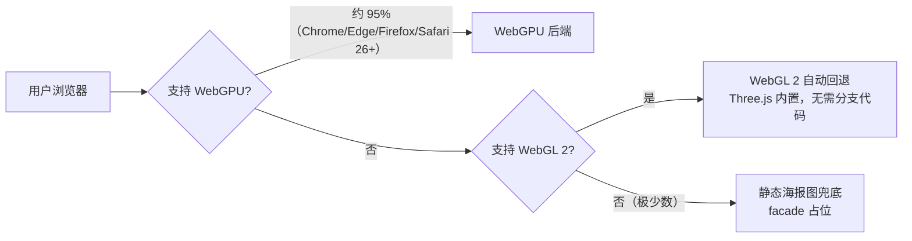
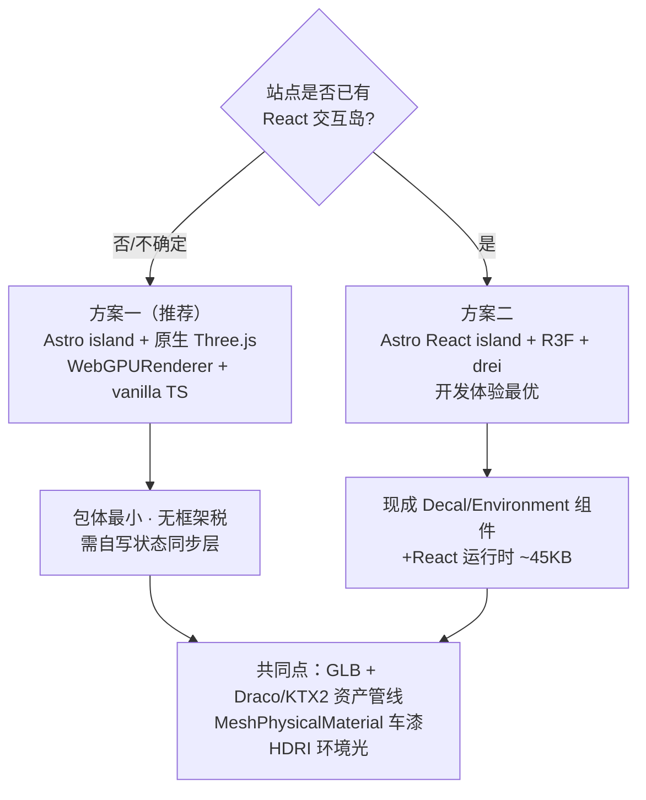
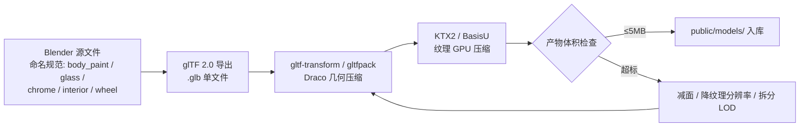
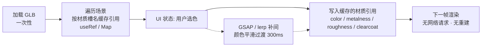
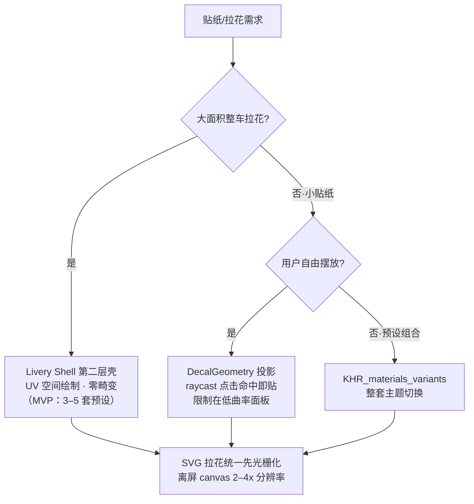
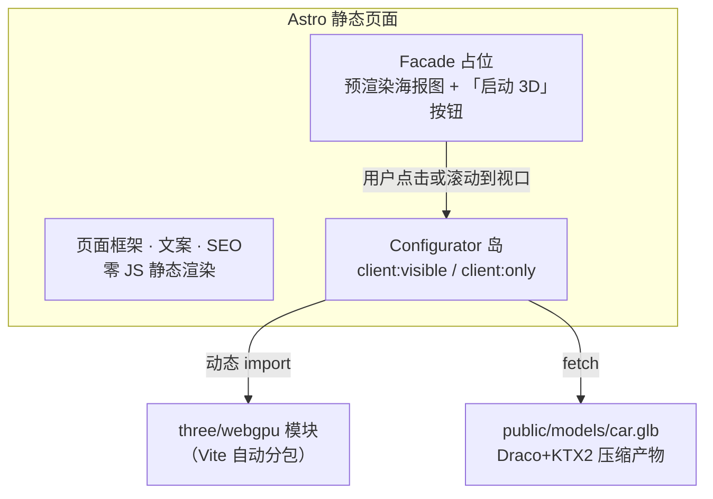
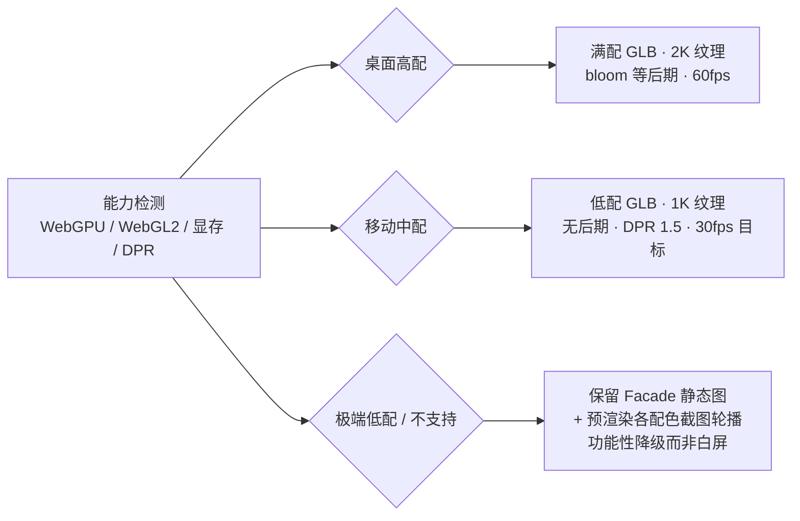

# 路线 B 调研报告：网页 3D 汽车配色 / 贴纸 Configurator

> **文档性质**：前端 / UI / UE 技术选型初步调研（只调研，不含实现代码）
> **适用站点**：王磊｜汽车智能座舱与 AI 解决方案经理 · 个人专业信用系统
> **技术底座**：Astro + TypeScript + GitHub Pages 静态部署
> **视觉基调**：技术编辑部 × 工业设计，专业克制
> **版本**：v0.1（初步调研，待磊哥确认开放问题后细化）

---

## 目录

- [1. 场景定义与演示价值](#1-场景定义与演示价值)
- [2. 3D 技术栈对比](#2-3d-技术栈对比)
- [3. 模型资产来源](#3-模型资产来源)
- [4. 换色实现](#4-换色实现)
- [5. 贴纸 / 拉花实现](#5-贴纸--拉花实现)
- [6. 与 Astro 集成 + GitHub Pages 部署](#6-与-astro-集成--github-pages-部署)
- [7. 性能预算](#7-性能预算)
- [8. 酷炫 UI 参考](#8-酷炫-ui-参考)
- [9. 推荐方案表](#9-推荐方案表mvp-酷炫版--完整版)
- [10. 脱敏与合规](#10-脱敏与合规)
- [11. 开放问题（需磊哥确认）](#11-开放问题需磊哥确认)
- [附录：参考资料](#附录参考资料)

---

## 1. 场景定义与演示价值

### 1.1 产品场景（结构化后的用户设想）

在个人网站中嵌入一个**交互式 3D 汽车 Configurator** 页面：

| 要素 | 设想 | 结构化定义 |
|------|------|-----------|
| 主体 | 一辆真实感 3D 汽车模型 | 一辆**通用概念车**（非任何真实在售/未公开车型），PBR 材质、影棚级打光 |
| 交互 1 | 换颜色 | 车漆（金属漆/哑光/珠光预设）+ 轮毂 + 内饰配色，实时切换、平滑过渡 |
| 交互 2 | 换贴纸/拉花 | 预设涂装方案（Livery）一键切换；进阶：自由摆放贴纸 |
| 体验要求 | 酷炫、流畅、专业感 | 60fps 交互、相机运镜动画、主机厂选配页式 UI（色卡、缩略图、分区导航） |
| 约束 | 个人站、静态托管、移动端 | GitHub Pages 纯静态、模型资产轻量化、移动端降级策略 |

### 1.2 这个页面证明什么专业能力

这不是一个「炫技玩具」，而是与站点定位强相关的**能力证据**：

| # | 证明的能力 | 与职业定位的映射 |
|---|-----------|----------------|
| 1 | **车载 HMI 语感** | 量产智能座舱中控普遍内置「3D 车模控制界面」（车门/车窗/灯光可视化控制）。网页 Configurator 与座舱 3D HMI 在交互范式、材质渲染、状态管理上高度同构——这是「懂座舱 HMI 的人做的 demo」，而非泛前端作品 |
| 2 | **3D 可视化工程能力** | 模型管线（Blender→glTF→压缩）、PBR 材质系统、性能预算管理，对应座舱 3D 渲染选型与供应商对话能力 |
| 3 | **产品化与克制** | 主机厂选配器是「技术服务于转化」的典型产品。做出专业感而非堆特效，体现解决方案经理的产品判断 |
| 4 | **全球化/工程约束意识** | 在静态托管、移动端、弱网等约束下交付流畅体验，对应全球化市场的工程适配经验 |

**站内位置建议**：挂在 AI Lab（或独立 `/playground`）下，配一篇「制作复盘」文章（技术选型 + 性能优化记录），让 demo 本身和 demo 的复盘各贡献一层信用。

---

## 2. 3D 技术栈对比

### 2.1 自研渲染层：四大引擎/框架

| 维度 | Three.js（原生） | React Three Fiber (R3F) | Babylon.js | PlayCanvas |
|------|-----------------|------------------------|------------|------------|
| 定位 | 通用 3D 渲染库，事实标准 | Three.js 的 React 声明式封装 | 全功能 3D 引擎（微软支持） | 引擎开源 + 云端编辑器 SaaS |
| 许可 | MIT | MIT | Apache-2.0 | 引擎 MIT，编辑器订阅制 |
| 生态 | 周下载 270 万+，示例/教程最丰富 | drei 工具集极其成熟（Decal、Environment、Stage 等现成组件） | 官方文档完善，playground 强 | 2024 年被 Snap 收购，重心偏 AR |
| WebGPU | r182（2025-12）起 `WebGPURenderer` 为**推荐渲染器**，自动回退 WebGL 2 | 经 `gl` 工厂函数支持 WebGPU | v8 起 WebGPU 一等公民，自动回退 | 支持中 |
| 包体 | 按需 tree-shaking，核心较小 | Three.js + React + R3F + drei，最重 | 全家桶偏大 | 运行时精简 |
| 与 Astro 契合度 | **最高**（vanilla `<script>` 或任意 island） | 需引入 React island（本站原本可不依赖 React） | 高（vanilla 可用） | 低（编辑器工作流为主） |
| Configurator 案例密度 | 极高（官方 car materials 示例、大量社区项目） | 极高（PorscheLab 等被 three.js 官方转发的项目） | 中 | 中 |
| 学习/维护成本 | 中（命令式，需自己组织状态→场景同步） | 低-中（声明式，状态驱动天然契合配置器） | 中 | 编辑器依赖，长期锁定风险 |

**小结**：

- **Three.js（原生 + vanilla TS）**：与 Astro 零框架负担最契合，包体最小；代价是要自己写「配置状态 → 场景变更」的同步层（约一两百行，可控）。
- **R3F + drei**：开发体验最好、现成组件最多（`<Decal>`、`<Environment>`、`<Stage>` 直接可用），代价是给站点引入 React 运行时（~45KB gzip）——若站点其他交互岛已用 React 则无额外成本。
- **Babylon.js**：能力全面但对「单车配色器」属于超配，包体和心智负担偏大。
- **PlayCanvas**：编辑器工作流对个人静态站不友好，被 Snap 收购后方向偏 AR，不推荐。

### 2.2 现成 Automotive Configurator 方案（低代码/SaaS）

| 方案 | 模式与价格感 | 优点 | 对本项目的致命短板 |
|------|------------|------|------------------|
| **Verge3D**（Soft8Soft） | 商业许可买断，Freelance 档约 $290 起；Blender/3ds Max 插件 + Puzzles 可视化脚本 | Blender 直出交互应用，运行时 ~300KB，不依赖云 | 付费买断对个人 demo 性价比低；Puzzles 产物难体现「工程能力」 |
| **Sketchfab**（Epic 旗下） | 免费/订阅；上传模型 + iframe embed，viewer 自带材质/配置 API | 零开发成本、托管在其 CDN | iframe 嵌入感强、UI 定制受限、体现不了自研能力；品牌 logo 水印（免费档） |
| **Spline** | 订阅 $12–15/席/月起 | 设计师友好、酷炫模板多、导出 web 组件 | 车规级 PBR 表现力有限；订阅依赖；性能黑盒 |
| **Vectary** | 订阅 $12/席/月起，Configurator API 在高级档 | 浏览器内建模 + AR 分享链 | 核心配置器能力锁在付费高档；平台锁定 |
| **主机厂级方案**（MHP ECP / Unreal Pixel Streaming，Porsche、BMW、Pagani 在用） | 云 GPU 流式渲染，企业级报价 | 照片级画质 | 需要云 GPU 服务器，与 GitHub Pages 静态托管**完全不兼容**；仅作为「行业上限」认知参照 |

**小结**：现成方案都与「展示自研 HMI/3D 工程能力」的演示目的相悖——用 Sketchfab embed 证明不了任何工程能力。**现成方案仅推荐用于快速原型验证资产效果，正式版必须自研渲染层。**

### 2.3 WebGL vs WebGPU 现状（2026 年中）

| 项 | 现状 |
|----|------|
| 浏览器覆盖 | Chrome/Edge 113+（2023-05）、Firefox 141+（Windows）/145+（macOS）、Safari 26+（2025-09，含 iOS/iPadOS）均默认开启 WebGPU；全球覆盖约 **95%** |
| Three.js 支持 | r171 起 `WebGPURenderer` 零配置可用；**r182（2025-12）起为官方推荐渲染器**，`WebGLRenderer` 转为维护态 |
| 回退机制 | `WebGPURenderer` 内置 WebGL 2 自动回退，开发者无需分支代码 |
| 收益 | 复杂场景 2–10 倍性能提升（主要在 draw call 密集与 compute 场景）；TSL 着色语言同时编译到 WGSL/GLSL |
| 对本项目的意义 | 单车 + 少量材质的场景，WebGL 2 已完全够用；但**直接采用 `three/webgpu` 入口**可零成本获得未来性能红利与「技术前沿性」叙事点，且不牺牲兼容性 |

### 2.4 选型结论

**推荐**：方案一（Astro + 原生 Three.js，`three/webgpu` 入口）为默认；若后续站点确定引入 React，可平滑升级为方案二。两者资产管线与材质方案完全一致，切换成本低。

---

## 3. 模型资产来源

### 3.1 三条路线对比

| 路线 | 代表来源 | 成本 | 质量/契合度 | 版权风险 | 推荐度 |
|------|---------|------|-----------|---------|--------|
| **A. 开源 GLB** | Khronos glTF-Sample-Assets（ToyCar：CC0；**CarConcept：CC BY 4.0，通用概念车**）；Kenney Car Kit（CC0 低多边形）；Quaternius / Poly Pizza（CC0）；Sketchfab（筛选 Downloadable + CC0/CC-BY） | 0 | CarConcept 是**官方 PBR 概念车**，与「不用真实车型」的合规要求天然匹配；低多边形包风格化强但「真实感」不足 | 低（CC0 零风险；CC-BY 需署名） | ★★★★★ |
| **B. 购买商业模型** | CGTrader / TurboSquid（Royalty-Free 条款） | $20–200+ | 真实车型细节丰富 | **高**：RF 条款通常禁止「原始模型文件再分发」，而浏览器可直接下载到网页加载的 GLB，属条款灰色地带；且真实车型造型受主机厂外观设计权/商标保护，与磊哥主机厂在职身份冲突 | ★☆☆☆☆ |
| **C. Blender 自建概念车** | 自建 → glTF 导出管线 | 时间成本 | 完全可控：命名规范、UV 分区、材质槽、面数预算全部按配置器需求设计；「自建资产管线」本身即是履历叙事点 | 零（原创资产） | ★★★★☆（作为 A 的升级路径） |

### 3.2 推荐策略：A 起步，C 收尾

1. **MVP 阶段**：直接采用 **Khronos CarConcept**（CC BY 4.0，Darmstadt Graphics Group + Khronos 出品）——它就是为展示 glTF PBR 车漆材质设计的通用概念车，无任何真实品牌关联，页脚署名即可合规。
2. **完整版阶段**：以 CarConcept 的拓扑为参考，Blender 自建（或深度改造）一辆「无品牌概念车」，按第 4、5 节的材质槽与 UV 规范重新组织，形成 100% 自有资产。

### 3.3 Blender → glTF 资产管线

关键规范（无论哪条路线都要满足，即「节点契约」）：

- **材质槽命名固定**：`body_paint`、`glass`、`chrome_trim`、`interior_main`、`interior_accent`、`wheel_rim`、`tire`——配置器代码按名字寻址，模型可整体替换而不改代码。
- **车身独立 UV 且不重叠**：为贴纸/拉花的动态贴图预留（详见第 5 节）。
- **AO/阴影预烘焙**到贴图，运行时不算实时阴影（移动端关键优化）。

### 3.4 版权与商用注意（速查）

| 许可类型 | 能否用于本站 | 注意 |
|---------|------------|------|
| CC0 / Public Domain | ✅ 随意使用 | 无需署名（署名是礼貌） |
| CC BY 4.0 | ✅ 可用 | **必须署名**：作者 + 平台 + 许可链接（页脚或 About/Credits） |
| CC BY-SA / NC / ND | ❌ 避免 | SA 传染、NC 与个人品牌站的「职业推广」性质有冲突风险、ND 禁改 |
| Sketchfab Standard / Editorial | ❌ 避免 | 非 CC 协议，Editorial 禁止商用场景 |
| TurboSquid/CGTrader Royalty-Free | ⚠️ 原则上避免 | 网页分发 GLB ≈ 分发原始文件，多数 RF 条款禁止 |
| 真实车型（即使模型文件本身 CC0） | ❌ 禁用 | 车辆外观设计权与商标（车标、格栅、轮毂造型）归主机厂；与在职身份叠加风险更高，详见第 10 节 |

---

## 4. 换色实现

### 4.1 核心机制：加载一次，原地改材质

行业通行做法（所有流畅的 web configurator 的共同点）：**模型只加载一次**，换色不重新请求任何资产，只修改内存中材质对象的属性，下一帧即生效。

要点：

- **初始化时一次性遍历**场景缓存材质引用，绝不在渲染循环或每次换色时 `scene.traverse()`（社区项目验证的关键反模式）。
- **clone-on-write**：若多个网格共享材质而只想改其中一个（如仅引擎盖），先克隆材质再改，避免「改一处全车变色」与 GPU 资源泄漏。

### 4.2 车漆材质：`MeshPhysicalMaterial` 三件套

真实感车漆的三个决定性参数（比多边形数量重要得多）：

| 参数 | 作用 | 典型值 |
|------|------|--------|
| `clearcoat` / `clearcoatRoughness` | 清漆层——车漆区别于普通塑料的关键 | 1.0 / 0.03–0.1 |
| `metalness` / `roughness` | 金属漆 vs 哑光漆的切换轴 | 金属漆 0.9/0.35；哑光 0.2/0.8 |
| 环境贴图（HDRI） | **金属漆之所以像金属，靠的是反射内容**；影棚 HDRI 经 PMREM 预滤波 | Poly Haven CC0 影棚 HDRI，1–2K 分辨率足够 |

预设色卡建议按「漆面类型 × 色相」二维组织（金属漆/哑光/珠光 × 6–8 色），与主机厂选配页心智一致。

### 4.3 车身/内饰分离

- 外观与内饰是**不同材质槽 + 不同 UI 分区**（Exterior / Interior 标签页），对应第 3.3 节命名规范。
- 内饰换色本质相同（改 `interior_main` / `interior_accent` 材质），但需要**相机内视角**支撑（进阶功能，MVP 可只做外观 + 轮毂）。
- 轮毂可用「多套网格 + visibility 切换」（换轮毂样式）叠加材质换色，两者正交。

---

## 5. 贴纸 / 拉花实现

四种技术路线，适用场景不同，可组合使用：

| # | 方案 | 原理 | 优点 | 缺点 | 适用 |
|---|------|------|------|------|------|
| 1 | **Decal 投影**（`DecalGeometry` / drei `<Decal>`） | 从某方向把贴图平面投影到网格表面，生成贴片几何体 | 自由位置摆放、点哪贴哪（raycast 命中即贴） | 曲率大处**畸变拉伸**（平面投影固有缺陷）；大面积拉花效果差 | 小面积 logo / 编号贴纸的自由摆放 |
| 2 | **第二层壳网格（Livery Shell）** | 车身复制一层微外扩壳（或同 UV 第二材质层），使用独立透明 PNG/KTX2 涂装贴图 | 大面积拉花**零畸变**（美术在 UV 上画）、切换 = 换贴图、质量上限最高 | 涂装是预设的，用户不能自由摆放；需要规范 UV | **预设涂装方案一键切换（MVP 首选）** |
| 3 | **CanvasTexture 动态合成** | 2D canvas 上合成底色 + 多张贴纸（位置/缩放/旋转），`needsUpdate = true` 推给 GPU 作为车身贴图 | 用户自由编辑（上传图片、拖动、缩放）、SVG 可先光栅化到 canvas 再上纹理 | 需 UV 均匀展开否则 2D→3D 位置直觉断裂；实现复杂度最高 | 完整版「自由贴纸编辑器」 |
| 4 | **`KHR_materials_variants`** | glTF 官方材质变体扩展，模型内预打包多套材质，运行时按名切换 | 标准化、资产自包含、Sketchfab/三方 viewer 也认 | 变体在建模期定死，运行时不可自由组合 | 「运动版/竞速版/城市版」整套主题切换 |

**SVG → 纹理**：矢量拉花（几何图形、线条、文字）先在离屏 canvas 以 2–4 倍分辨率光栅化，再作为纹理/Decal 贴图，兼得矢量的清晰与位图管线的通用性。设计语言上建议使用几何/条纹/编号风格拉花，与「技术编辑部 × 工业设计」视觉基调一致。

**推荐组合**：MVP 用**方案 2（预设涂装）**保证酷炫且稳定；完整版叠加**方案 1（小贴纸自由摆放）**增加可玩性；方案 3 仅在确认要做「用户上传贴纸」时才投入。

---

## 6. 与 Astro 集成 + GitHub Pages 部署

### 6.1 Astro 集成模式

Astro 岛屿架构与 3D demo 是天然搭配——页面主体仍是零 JS 静态 HTML，只有配置器区域按需水合：

- **原生 Three.js 路线**：`<script>` 内动态 `import('three/webgpu')`，或封装为无框架自定义元素；不需要任何 Astro 集成包。
- **R3F 路线**：`@astrojs/react` + `client:only="react"`（Three.js 场景无 SSR 意义，直接跳过服务端渲染）。
- **Facade 模式（关键）**：首屏只出静态海报图（构建期截好的车模渲染图），用户点击/滚动可见后才加载 3D bundle 与 GLB——保证 Configurator 页不拖垮站点 LCP，也尊重移动端流量。

### 6.2 GitHub Pages 限制与对策

| 限制 | 数值 | 对策 |
|------|------|------|
| 单文件上限 | 100MB（Git 硬限制） | 压缩后车模 ≤5MB，远低于限制 |
| 仓库体积建议 | <1GB | 只入库压缩产物 GLB，Blender 源文件放 Release 附件或单独资产仓 |
| **不支持 Git LFS 出站** | Pages 不会解析 LFS 指针文件 | 模型**不要**用 LFS 存，直接常规提交（压缩后体积小，可接受） |
| 带宽 | 100GB/月（软限制） | 个人站流量远不及此；若单模型 >10MB 且流量增长，可将 GLB 挪到 jsDelivr（引用 GitHub Release）或 Cloudflare R2 免费层 |
| 无服务端 | 纯静态 | 本方案本就全前端；配置分享用 URL query 编码（`?paint=red&livery=02`），无需后端 |
| 构建 | GitHub Actions 构建 Astro | 常规流程，无特殊要求 |
| 缓存 | Pages CDN 默认 `max-age=600` | GLB/纹理文件名带内容 hash（Vite 产物默认行为），换版本即换 URL |

**大文件与懒加载纪律**：GLB 与 HDRI 都从 `public/` 走 fetch 按需加载，绝不打进 JS bundle；HDRI 用 1K 影棚图（几百 KB）而非 4K。

---

## 7. 性能预算

### 7.1 预算表

| 指标 | 预算 | 说明 |
|------|------|------|
| 页面首屏 LCP | ≤2.5s（4G） | Facade 海报图保证——3D 资产不参与首屏 |
| 3D 就绪时间（点击后） | ≤3s（4G） | JS 分包 ~150–300KB gz + GLB ≤5MB + HDRI ≤0.5MB |
| 车模三角面 | 桌面 ≤30 万，移动 ≤15 万 | Draco 压缩后几何体积约为原始 1/5–1/10 |
| 纹理 | KTX2/BasisU，车身 2K、其余 1K | GPU 直接解码，省内存带宽 |
| 帧率 | 桌面 60fps，移动 ≥30fps | 按需渲染下静止时为 0（见下） |
| GLB 总体积 | MVP ≤5MB；完整版（含涂装贴图集）≤12MB | 超标即回炉减面/降分辨率 |

### 7.2 关键优化手段（社区项目验证）

1. **按需渲染**（`frameloop="demand"` / 手动 invalidate）：只在相机运动或配置变更时渲染，静止画面零 GPU 消耗——对续航敏感的移动端至关重要。
2. **DPR 封顶 1.5**：3x 屏按 1.5x 渲染，移动 GPU 像素负载直降约 40%，肉眼几乎无损。
3. **预烘焙**：AO、软阴影、地面接触影全部烘进贴图，运行时不开实时阴影。
4. **离屏暂停**：`IntersectionObserver` 检测画布滚出视口即停渲染循环。
5. **LOD 策略**：单车场景通常不需要多级 LOD 网格；更划算的是「**设备分级**」——移动端加载低配 GLB（减面 + 1K 纹理）+ 关闭部分后期效果，桌面端满配。两套产物由同一 Blender 源文件导出。

### 7.3 移动端降级链

---

## 8. 酷炫 UI 参考

| # | 站点 | 链接 | 技术 | 值得借鉴 | 需规避 |
|---|------|------|------|---------|--------|
| 1 | **Porsche 911 官方配置器** | [porsche.com 配置器](https://configurator.porsche.com/) | 云渲染（MHP ECP + Porsche Rendering Solution，AWS 流式） | 选配 UI 信息架构标杆：分区导航（外观/轮毂/内饰）、色卡带价格语义、配置摘要栏 | 云 GPU 流式渲染与静态托管不兼容，只学 UI 不学架构 |
| 2 | **Bruno Simon 个人作品集** | [bruno-simon.com](https://bruno-simon.com/) | Three.js + TSL（WebGPU/WebGL 双跑），[MIT 开源](https://github.com/brunosimon/folio-2025) | 「个人站 + 3D 汽车」的天花板级先例；WebGPU 落地姿势、Blender 资产管线全开源可研读 | 游戏化路线与本站「专业克制」基调不同，取技术不取风格 |
| 3 | **PorscheLab（社区项目）** | [演示](https://everymatrix-porchelab.netlify.app) · [源码](https://github.com/ASTRICKK/PorscheLab) | R3F + GSAP，被 three.js 官方账号转发 | 与本项目体量最接近的完整参考：材质引用缓存、GSAP 换色过渡、HDRI 环境切换、玻璃拟态 UI、移动端 60fps 实践 | 使用真实保时捷车型——恰是本站合规上必须规避的做法 |
| 4 | **Plus 360 Degrees Car Visualizer** | [carvisualizer.plus360degrees.com/threejs](https://carvisualizer.plus360degrees.com/threejs/) | 原生 Three.js | 经典轻量级车漆配色 demo：极简 UI、快加载，证明「小而精」路线在低预算下的效果上限 | 交互维度较少（仅换色），本项目需叠加贴纸维度 |
| 5 | **Polestar 官方配置器** | [polestar.com](https://www.polestar.com/) | 预渲染序列图 + 实时混合 | **视觉基调最契合**：北欧极简、大留白、克制动效——「工业设计感」选配 UI 的直接参照 | 大量预渲染图集的资产量个人站难以复制 |

**UI 设计提炼**（酷炫 ≠ 花哨，主机厂式专业感来自）：

- **影棚场景**：中性深/浅背景 + 地面反射 + 边缘光，而非花哨天空盒；
- **相机编排**：切换配置区时相机自动运镜到对应部位（选轮毂→镜头推近轮毂），GSAP 时间线驱动；
- **克制的 UI 层**：色卡圆片 + 当前配置名称 + 极少文案，UI 覆层玻璃拟态或纯扁平均可，与站点视觉系统一致；
- **微反馈**：换色 300ms 补间、贴纸落位轻微缩放回弹，不做粒子爆炸式特效。

---

## 9. 推荐方案表（MVP 酷炫版 / 完整版）

> 注：工作量以「模块数 × 改动面」计，不做日历时间估计。基准单位为「模块」：一个可独立开发验收的功能单元。

| 维度 | MVP 酷炫版 | 完整版 |
|------|-----------|--------|
| 技术栈 | Astro island + 原生 Three.js（`three/webgpu`）+ vanilla TS | 同左（或升级 R3F，若站点已有 React 岛） |
| 模型 | Khronos CarConcept（CC BY 4.0）直用 | Blender 自建无品牌概念车（100% 自有） |
| 换色 | 车漆（金属/哑光 × 8 色）+ 轮毂 2 款 | + 内饰配色 + 内视角相机 + 卡钳等细节件 |
| 贴纸/拉花 | 预设涂装 3–5 套（Livery Shell 切换） | + Decal 自由贴纸摆放 + SVG 拉花库 |
| 场景 | 影棚 HDRI + 烘焙地影 + 轨道控制 | + 相机运镜编排 + 环境切换（影棚/户外） |
| 分享 | URL query 编码配置 | + 画布截图导出 PNG |
| 移动端 | DPR 封顶 + 按需渲染 + facade | + 双档 GLB 设备分级 |
| 功能模块数 | **约 6 个**（资产管线 / 场景搭建 / 材质换色 / 涂装切换 / UI 层 / 性能与降级） | **约 11 个**（+自建模型 / Decal 编辑 / 内饰 / 运镜 / 截图分享） |
| 工作量 | 低-中：全部为新增独立页面，不侵入现有站点代码；资产用现成 CC 模型，风险集中在材质调参 | 中-高：Blender 自建模型是最大的单项投入且依赖建模技能；Decal 编辑器交互细节多 |
| 维护成本 | 极低（纯静态、无订阅、无后端；Three.js 年度升级一次即可） | 低（同左 + 自有资产迭代） |
| 酷炫度 | ★★★★☆（换色丝滑 + 预设涂装一键切换已达「哇」阈值） | ★★★★★（自由贴纸 + 运镜 + 内饰 = 准主机厂体验） |
| 合规风险 | 低（CC BY 署名即可） | 零（全自有资产） |

**推荐路径**：先发 MVP（验证性能与传播效果），复盘文章同步发布；完整版按开放问题的确认结果分批追加,优先级建议 自建模型 > 相机运镜 > Decal 编辑 > 内饰。

---

## 10. 脱敏与合规

### 10.1 红线（不可触碰）

| # | 红线 | 原因 |
|---|------|------|
| 1 | **禁用任何未公开车型**（自家在研项目、客户项目车型、竞品谍照复刻） | 违反保密义务，职业风险远大于演示收益 |
| 2 | **禁用可识别的真实在售车型**（即使模型文件标注 CC0） | 车辆外观受主机厂外观设计权保护，车标/格栅/标志性轮毂受商标权保护；模型作者无权授予这些权利 |
| 3 | **禁用真实品牌 logo 作贴纸素材** | 商标侵权 + 可能被解读为品牌背书 |
| 4 | **禁止复用公司内部 HMI 设计资产**（图标、界面截图、设计规范） | 客户/雇主资产，即使「只是像」也应规避 |

### 10.2 通用概念车策略（推荐）

- **首选**：Khronos CarConcept——标准化组织出品、专为展示 glTF 车漆而设计、无任何品牌关联，是「合规演示车」的官方答案。
- **升级**：Blender 自建概念车时，刻意做**类型化而非品牌化**设计（如「一台中性的两厢电动概念车」），不模仿任何具体车型的标志性特征（DRG 前脸、灯组签名）。
- **贴纸库**：全部使用自制几何图形、条纹、编号（如「01」「LAB」）、抽象图案；文字类贴纸使用开源字体。
- **页面声明**：配置器页脚放一行免责声明——「本演示使用通用概念车模型与原创图形，与任何汽车品牌无关；不代表任何雇主或客户的产品」。同时按 CC BY 要求署名模型作者。

### 10.3 叙事上的正向利用

「为什么用概念车而不是真车」本身可以写进复盘文章——展示对汽车行业 IP 合规、供应商资产授权链的职业敏感度，这在主机厂/供应商语境里是加分项而非遗憾。

---

## 11. 开放问题（需磊哥确认）

| # | 问题 | 选项与影响 | 建议默认值 |
|---|------|-----------|-----------|
| 1 | **车型抽象程度**：写实概念车还是风格化低多边形？ | 写实（CarConcept 路线）酷炫度高、资产重；低多边形（Kenney 路线）轻快但「Configurator 专业感」弱 | 写实概念车 |
| 2 | **贴纸库来源**：只用预设涂装，还是开放用户上传？ | 用户上传需做内容脱敏考量（上传的图无法审核），且实现复杂度显著上升 | MVP 仅预设；完整版再议上传 |
| 3 | **是否要 AR**？ | `model-viewer` 可低成本加 AR 快看（iOS USDZ / Android SceneViewer），但会引入第二套渲染路径与 USDZ 资产转换 | 暂缓，列入 backlog |
| 4 | **是否做内饰视角**？ | 内饰需要模型有完整座舱建模（资产工作量约翻倍）；但与「智能座舱」定位呼应最强 | 完整版纳入，MVP 不做 |
| 5 | **UI 语言**：中英双语还是仅英文？ | 与站点全球化策略联动;配置器 UI 文案量小，双语成本低 | 跟随站点整体 i18n 决策 |
| 6 | **站内挂载位置**：AI Lab 子项目还是独立 `/playground`？ | 影响导航信息架构与复盘文章的归属栏目 | AI Lab 子项目 + 首页入口卡片 |
| 7 | **配置分享**：URL 分享是否够用，要不要截图导出？ | 截图导出（canvas→PNG）成本低、传播价值高 | MVP 用 URL,截图放完整版首位 |
| 8 | **自建模型的投入意愿**：是否接受学习/外包 Blender 建模？ | 决定完整版资产路线（自建 vs 长期使用 CarConcept 改造版） | 待确认后再排完整版 |

---

## 附录：参考资料

- Three.js WebGPURenderer 官方手册：https://threejs.org/manual/en/webgpurenderer.html
- WebGPU 迁移清单（2026，浏览器覆盖数据）：https://www.utsubo.com/blog/webgpu-threejs-migration-guide
- WebGPU/WebGL 2026 引擎全景（Three.js r182 / Babylon 8 / PlayCanvas）：https://www.youngju.dev/blog/culture/2026-05-16-webgpu-webgl-2026-three-js-r3f-babylon-playcanvas-tres-needle-native-webgpu-wgsl-deep-dive.en
- 3D 汽车配置器构建实践（材质槽/Draco/KTX2/性能纪律）：https://www.hontran.dev/blog/car-configurator-website-case-study
- PorscheLab（R3F 配置器，three.js 官方转发）：https://github.com/ASTRICKK/PorscheLab
- drei Decal 组件源码：https://github.com/pmndrs/drei/blob/master/src/core/Decal.tsx
- three.js 官方 Decal 示例：https://threejs.org/examples/#webgl_decals
- CanvasTexture 官方手册：https://threejs.org/manual/en/canvas-textures.html
- Khronos glTF 示例资产（ToyCar CC0 / CarConcept CC BY 4.0）：https://github.com/KhronosGroup/glTF-Sample-Assets
- Kenney Car Kit（CC0）：https://kenney.nl/assets/car-kit
- Poly Pizza（CC0 低多边形库）：https://poly.pizza/
- Poly Haven（CC0 HDRI）：https://polyhaven.com/hdris
- Verge3D vs Unity vs Sketchfab 对比（Soft8Soft 官方）：https://www.soft8soft.com/comparing-unity-sketchfab-and-verge3d/
- 主机厂云渲染配置器现状（Porsche/MHP ECP，2026-01）：https://ecommercenews.co.nz/story/porsche-debuts-cloud-3d-configurator-for-cayenne-evs
- BMW 3D 流式配置器架构（AWS）：https://aws.amazon.com/blogs/industries/the-evolution-of-bmw-groupss-3d-streaming-experience/
- Bruno Simon 作品集（Three.js + TSL，MIT 开源）：https://bruno-simon.com/ · https://github.com/brunosimon/folio-2025
