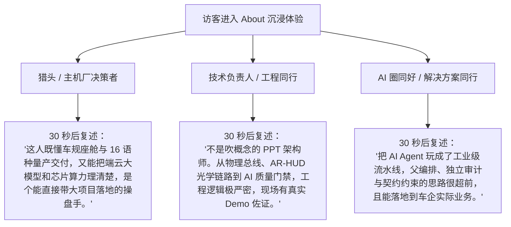
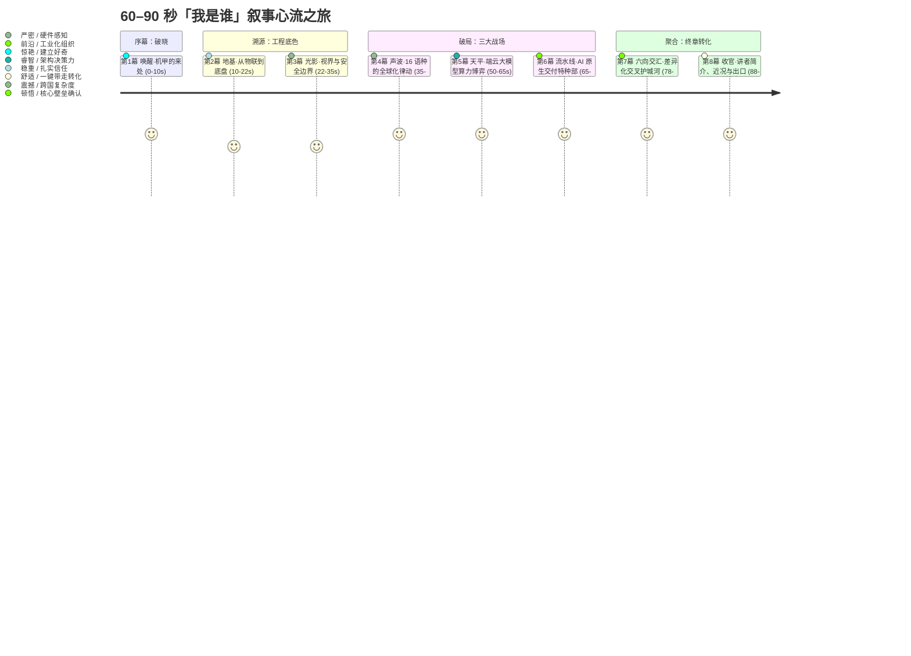
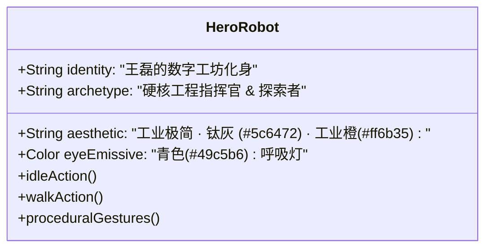
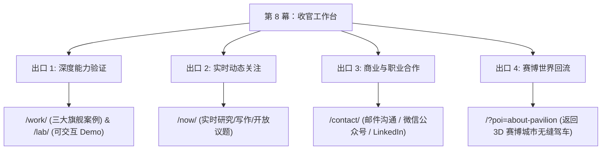
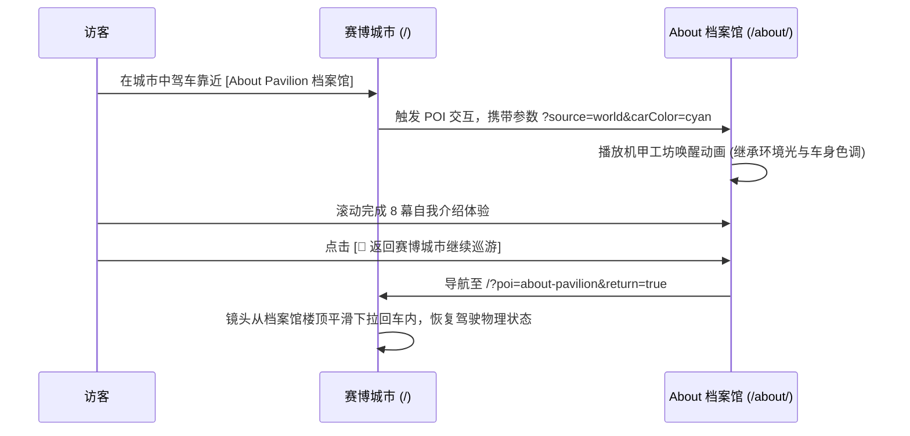
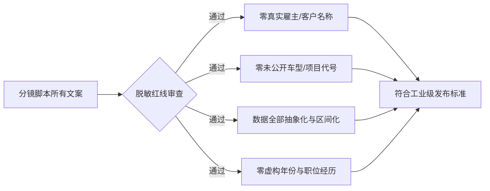

# 「我是谁」沉浸式自我介绍体验分镜脚本（Storyboard）

> **文档定位**：王磊个人网站 · 「我是谁」自我介绍体验（About Pavilion / 个人档案馆）60–90 秒沉浸式分镜脚本与导演总案（P3-STORYBOARD）  
> **叙事核心**：将抽象的职位与履历，重构为一场由 3D 机甲化身引导、数据驱动、步步印证专业信用的沉浸式叙事之旅。  
> **运行环境与基底**：基于 Three.js (WebGPU/TSL + WebGL 回退) + GSAP ScrollTrigger 滚动驱动，零后端纯静态托管，完美兼容移动端与无障碍访问。

---

## §0 叙事策略（Narrative Strategy）

### 0.1 核心心智：让访客带走的一句话
> **“王磊是一位站在汽车座舱、大模型与组织工作流交叉点的解决方案架构者——他把最不确定的新技术，变成团队敢拍板、能交付、可复用的工业级方案。”**

### 0.2 三类目标受众的 30 秒复述目标



1. **猎头 / 主机厂与 Tier 1 业务决策者（看交付与格局）**：
   - **30 秒复述**：“他不是单点功能的程序员，而是拥有从物联网、整车前瞻、AR-HUD 到多语种座舱与大模型十余年演进厚度的解决方案经理；他能解决多语种全球化验收和端云大模型算力分层两大行业硬骨头。”
2. **技术负责人 / 工程同行（看工程硬核与真实性）**：
   - **30 秒复述**：“底子非常扎实，经历完整覆盖汽车底层到现代 AI 原生工作流；所有论述都有站内交互式 Demo（如 16 语种 TTS、端云分层决策表）和代码级门禁支撑，没有一句假大空。”
3. **AI 圈同好 / 潜在合作者（看方法论壁垒与复用性）**：
   - **30 秒复述**：“他把解决方案经理的角色升级为了 AI 时代的高级编排指挥官，将 AI 提效从个人技巧沉淀为可审计、有契约的组织流程，交叉壁垒极高。”

### 0.3 与首页 Hero 的明确分工

| 维度 | 首页首屏 Hero（定位与全局引流） | About 自我介绍体验（深度专业信用与人设） |
| :--- | :--- | :--- |
| **核心命题** | **“我是谁、本站有什么”**（What & Where） | **“我为什么能做、我是如何炼成的”**（Why & How） |
| **心理阶段** | 快速建立标签感知（10 秒电梯陈述） | 建立不可撼动的专业信任（60–90 秒深度共鸣） |
| **视觉呈现** | 赛博城市鸟瞰 / 3D 实车模型巡礼 / 宏观导航入口 | 进入机甲化身的老家工坊（About Pavilion），微距特写与场景化推演 |
| **叙事载体** | 三支柱卡片 + 三旗舰案例精选 + 实时城市 POI | 六站职业演进主线 + 三大核心痛点解法 + 六向能力交叉壁垒 |
| **交互节奏** | 快速点击分流（跳往 Work / Insights / Lab） | 沉浸式 Scrollytelling（滚动驱动镜头轨迹、全息投影与数据流动） |

---

## §1 沉浸式分镜脚本（Scrollytelling Storyboard）

整个体验设计为 **8 幕（Scenes）**，采用“滚动进度绑定（Scrubbed Scroll）”推进。总时长预估 **60–90 秒**（视访客滚动节奏而定，杜绝强迫等待的自动播放，访客拥有 100% 节奏控制权）。



---

### 第 1 幕：【唤醒 · 机甲的来处】（Prologue: Ignition & Coordinates）

```
┌─────────────────────────────────────────────────────────────────────────┐
│ 3D CAMERA: Close-up on HeroRobot back -> Sweeping 180° rotation to front │
│ VISUAL: Beige & Dark Titanium (#1a1d24) Pavilion, Cyan Eye (#49c5b6) On │
│ HUD OVERLAY:                                                            │
│   [COORDINATES: ABOUT-PAVILION // 31°12'N 121°29'E]                     │
│   [STATUS: ONLINE // ZERO-BACKEND STATIC DETERMINISTIC]                 │
│                                                                         │
│   王磊｜汽车智能座舱与 AI 解决方案经理                                    │
│   在技术与落地之间架桥。                                                 │
│                                                                         │
│   [↓ 滚动启程 01/08]                    [跳过 3D 读纯文本版 (Alt+T)]   │
└─────────────────────────────────────────────────────────────────────────┘
```

* **时长预估**：0–10 秒（滚动进度 0% → 12%）
* **触发方式**：页面进入视口，首屏初始化加载完毕；访客首次向下轻微滚动触发镜头运镜。
* **画面（3D 与动效）**：
  * **场景空间**：置身于赛博城市中的「个人档案馆（About Pavilion）」，暖米色（#fef3c7 / #d97706 微光）与工业钛黑（#1a1d24）交融的现代化数字化工坊。
  * **机甲化身**：`HeroRobot.glb`（338KB 钛灰机甲）最初背对镜头，呈微躬的休眠站姿（Idle 状态）。
  * **动效演进**：随着滚动进度 0%→8%，机甲眼部青色（#49c5b6）Emissive 呼吸灯瞬间由暗点亮，头部轻抬；镜头以电影级弧线（Cinematic Orbit）绕机甲顺时针旋转 180° 并拉升至中景正面。背景中浮现出由发光经纬线构成的空间定位网格。
* **文案**：
  * **大标题（≤40字）**：在技术与落地之间架桥
  * **正文（≤80字）**：十余年技术演进，我反复在做同一件事：把不确定的新技术，变成团队敢拍板、能交付、可复用的工业级解决方案。
  * **英文短语**：*Bridging the chasm between complex technology and deliverable reality.*
* **绑定的真实信息**：
  * 绑定 `docs/website-plan/positioning-onepager.md` 一句话定位与核心标语；
  * 绑定 `src/data/site.ts` 中 `PERSON.name` 与 `PERSON.jobTitle` 单源常量。
* **访客可做的动作**：
  * 滚动滚轮 / 触摸屏滑动推进镜头；
  * 鼠标在屏幕轻微移动，机甲眼部呼吸灯跟随光标微动（Look-at 射线约束）；
  * 右上角提供常驻按钮「跳过 3D，查看结构化纯文本版（Alt+T）」。
* **静态 / 降级等价物（Reduced-motion / 无 WebGPU / 移动端）**：
  * 居中展示机甲高清 WebP 渲染海报（带青色呼吸光晕）；
  * 呈现排版精致的 Header 卡片，大字号标题 + 身份标签，跳过相机旋转过渡。

---

### 第 2 幕：【地基 · 从物联到底盘】（Station 1 & 2: The Physical Groundwork）

```
┌─────────────────────────────────────────────────────────────────────────┐
│ 3D CAMERA: Pulling back to low-angle, tracking HeroRobot walking stride │
│ VISUAL: Glowing CAN/Ethernet bus conduits & wireframe vehicle chassis  │
│ HUD OVERLAY:                                                            │
│   STAGE 01-02 // HARDWARE & TELEMETRY                                   │
│                                                                         │
│   从物理连接到整车系统视角                                              │
│   打牢设备连接与数据链路的工程地基，建立整车级系统大局观。              │
│                                                                         │
│   [● 物联网数据总线] ────────► [● 整车前瞻系统架构]                    │
└─────────────────────────────────────────────────────────────────────────┘
```

* **时长预估**：10–22 秒（滚动进度 12% → 25%）
* **触发方式**：继续向下滚动，进度进入 12% 阈值。
* **画面（3D 与动效）**：
  * **化身动作**：机甲切换为稳健的 `Walk` 循环剪辑，向镜头前方大步前行。
  * **环境动效**：地面伴随脚步声波纹裂开，升起数条蓝青色发光光纤管线（象征物理总线与遥测链路）。在机甲身侧，半透明的整车线框底盘（Wireframe Chassis）以粒子形态构建成型，数据流在轮毂、传感器与网关节点间高速流动。
* **文案**：
  * **大标题（≤40字）**：从物理连接到整车系统视角
  * **正文（≤80字）**：职业起点在物联网与整车前瞻：亲手打牢设备通信与遥测数据链路的地基，建立起理解一辆车、一套复杂硬件系统的整车级全局视野。
  * **英文短语**：*Groundwork: From physical telemetry to vehicle-level foresight.*
* **绑定的真实信息**：
  * 绑定职业演进六站之 **第 1 站（物联网：设备连接与数据链路的工程地基）** 与 **第 2 站（整车前瞻：从单点技术转向整车级系统视角）**；
  * 对应 `src/pages/about/index.astro` 的 `timeline[0..1]`。
* **访客可做的动作**：
  * 悬停在地面数据管线上，管线高亮并冒出协议标签小气泡（`CAN-FD` / `Ethernet` / `MQTT`）；
  * 左右拖拽微调视角观察整车线框底盘。
* **静态 / 降级等价物**：
  * 渲染一张清晰的「双阶段工程时间轴卡片」，左侧物联网图标 + 右侧整车透视线框图，文字采用思源黑体清晰呈现。

---

### 第 3 幕：【光影 · 视界与安全边界】（Station 3: AR-HUD & Spatial HMI）

```
┌─────────────────────────────────────────────────────────────────────────┐
│ 3D CAMERA: Switching to Cockpit POV (First-Person Perspective)          │
│ VISUAL: Frustum optical cone projecting virtual arrows onto 3D road     │
│ HUD OVERLAY:                                                            │
│   STAGE 03 // SPATIAL HMI & OPTICAL CONSTRAINTS                         │
│                                                                         │
│   把虚拟光影锚定在真实物理世界                                          │
│   在 AR-HUD 攻坚：跨越延迟、畸变与严苛安全边界，让空间交互安全落地。    │
│                                                                         │
│   [Drag: 调节视差对齐] [查看显示链路架构]                              │
└─────────────────────────────────────────────────────────────────────────┘
```

* **时长预估**：22–35 秒（滚动进度 25% → 38%）
* **触发方式**：滚动推进至 25%。
* **画面（3D 与动效）**：
  * **化身与镜头**：机甲停步切换为 `Idle` 站姿，左手平举指向虚空。镜头推入机甲头部视角，瞬间切换为“座舱驾驶员第一人称视界”。
  * **视觉特效**：眼前展开一段三维弯曲道路，由机甲投射出一道透明梯形光学视锥（Optical Frustum）。三维全息引导箭头被精准贴合在 15 米外的道路曲面上。画面左侧出现标尺，显示光机畸变校正参数与毫秒级时延监控。
* **文案**：
  * **大标题（≤40字）**：把虚拟光影锚定在真实物理世界
  * **正文（≤80字）**：AR-HUD 不只是炫酷动效，更是显示链路时延、光学畸变校正与驾驶安全边界的严酷博弈。让前沿空间交互在真实路面上确定性成像。
  * **英文短语**：*Spatial HMI: Anchoring photons to physical road constraints.*
* **绑定的真实信息**：
  * 绑定职业演进六站之 **第 3 站（AR-HUD：人机界面：显示链路、安全边界与工程落地）**；
  * 对应 `master-plan.md` 领域标签 `AR-HUD` 与 `HMI/显示链路`。
* **访客可做的动作**：
  * 鼠标在视锥区域左右滑动，体验虚实贴合的视差（Parallax）补偿动效；
  * 点击“安全边界红线”标签，画面闪烁显示车速 120km/h 下的视线遮挡安全红线区域。
* **静态 / 降级等价物**：
  * 展示一张高质量 AR-HUD 光学投影与视锥标定架构原理图，附带结构化技术要点列表。

---

### 第 4 幕：【声波 · 16 语种的全球化律动】（Station 4 & Problem 1: Global Multilingual Cockpit）

```
┌─────────────────────────────────────────────────────────────────────────┐
│ 3D CAMERA: Medium shot, HeroRobot orchestrating a 3D spherical wave-grid│
│ VISUAL: 16 Audio spectrum rings (Arabic RTL, German word-stretch, etc.) │
│ HUD OVERLAY:                                                            │
│   PROBLEM 01 // MULTILINGUAL COCKPIT QUANTITATIVE ACCEPTANCE            │
│                                                                         │
│   多语种座舱：从「翻译一遍」到可验收交付                                │
│   建立「语种×功能」能力地图与分级标准，攻克 RTL 镜像与字宽膨胀。       │
│                                                                         │
│   [▶ 试听 16 语种 TTS 座舱 Demo] ──────► [查看旗舰案例 A]             │
└─────────────────────────────────────────────────────────────────────────┘
```

* **时长预估**：35–50 秒（滚动进度 38% → 52%）
* **触发方式**：滚动推进至 38%。
* **画面（3D 与动效）**：
  * **化身动作**：机甲双臂展开，化身为音频指挥家。
  * **视觉特效**：空间中升起一个由 16 圈彩色霓虹光环组成的球形声波网格（Spherical Waveform Lattice）。光环上浮现阿拉伯语（RTL 镜像动态排版流）、德语（字宽膨胀长复合词）、泰语与日语等不同文字粒子流。机甲右手一挥，杂乱膨胀的文字流瞬间对齐进入标准 UI 边界框内，全屏亮起绿色 PASS 验收灯。
* **文案**：
  * **大标题（≤40字）**：多语种座舱：从「翻译一遍」到可验收交付
  * **正文（≤80字）**：多语种不是文案翻译，是字宽膨胀、RTL 镜像与发音时延的系统工程。建立「语种 × 功能」分级验收标准，让全球化体验全链路可回归交付。
  * **英文短语**：*Global Cockpit: Turning 16-language localization into deliverable specs.*
* **绑定的真实信息**：
  * 绑定职业演进六站之 **第 4 站（多语种座舱：16 语种从需求定义到量产交付的全链路）**；
  * 绑定核心问题 1：*“多语种座舱，怎么把「翻译一遍」变成可验收的交付？”*；
  * 绑定站内可交互佐证链接：[`/lab/tts-cockpit/`](file:///Users/wanglei/mywebsite/src/pages/about/index.astro#L33-L35)（16 语种 TTS 座舱可视化）与旗舰案例 A。
* **访客可做的动作**：
  * 点击光环上的语言标签（如“العربية”或“Deutsch”），声波网格动态切换为对应语言的波形动画；
  * 点击卡片内的「可交互佐证 · 16 语种 TTS 座舱可视化 →」直达 Lab 体验。
* **静态 / 降级等价物**：
  * 呈现一张包含 16 语种本地化挑战（RTL、膨胀率、音素时延）的二维矩阵卡片，附带可点击的 Lab 体验外链按钮。

---

### 第 5 幕：【天平 · 端侧与云侧的大模型天平】（Station 5 & Problem 2: Edge-Cloud LLM Layering）

```
┌─────────────────────────────────────────────────────────────────────────┐
│ 3D CAMERA: Centered isometric view on a holographic floating scale      │
│ VISUAL: Left: Cyan NPU Chip (<50ms, Offline) | Right: Purple Cloud LLM   │
│ HUD OVERLAY:                                                            │
│   PROBLEM 02 // EDGE-CLOUD CAPABILITY LAYERING ARCHITECTURE             │
│                                                                         │
│   端侧算力与云端智慧的精准分层                                          │
│   不靠评审会摇摆。把车控、闲聊与生成归入三路径，选型有据可依。          │
│                                                                         │
│   [模拟弱网离线降级] ─────────────────► [查看旗舰案例 B]             │
└─────────────────────────────────────────────────────────────────────────┘
```

* **时长预估**：50–65 秒（滚动进度 52% → 68%）
* **触发方式**：滚动推进至 52%。
* **画面（3D 与动效）**：
  * **化身动作**：机甲呈双手托举姿态，掌心上方浮现出一个晶莹的“动态全息天平/分层解构台”。
  * **视觉特效**：天平左盘是一颗散发青蓝冷光的车规级 NPU 芯片模组（标注“端侧 50ms 车控 / 离线确定性”），右盘是一团深紫色星云状的大模型推理节点（标注“云端千亿知识 / 复杂生成”）。中央呈现出动态数据路由管道，根据请求类型（如“打开车窗” vs “为我写一首关于雨天的诗”）将金色数据包分流至不同侧。
* **文案**：
  * **大标题（≤40字）**：端侧算力与云端智慧的精准分层
  * **正文（≤80字）**：端云怎么分不靠开会摇摆。建立能力分层框架：把车控、闲聊、生成按算力档位与时延要求归入端/云/降级三路径，让架构选型变成清晰的决策表。
  * **英文短语**：*Edge-Cloud LLM: Deterministic capability layering under silicon constraints.*
* **绑定的真实信息**：
  * 绑定职业演进六站之 **第 5 站（端云大模型：车端/云端能力分层架构与场景化选型）**；
  * 绑定核心问题 2：*“端侧算力有限、云端能力强，大模型能力应该放在哪一侧？”*；
  * 绑定旗舰案例 B：[`/work/llm-capability-layering/`](file:///Users/wanglei/mywebsite/src/pages/about/index.astro#L39-L41)。
* **访客可做的动作**：
  * 点击“模拟隧道断网状态”切换开关，观察天平右侧云端变暗，所有关键车控指令自动无缝秒级切入端侧降级通道；
  * 点击跳转查阅《端云大模型分层架构》完整案例。
* **静态 / 降级等价物**：
  * 展示三路径决策矩阵表（场景分类 × 算力约束 × 时延指标 × 降级链路），清晰直观。

---

### 第 6 幕：【流水线 · AI 原生交付的特种部队】（Station 6 & Problem 3: AI-Native Workflow）

```
┌─────────────────────────────────────────────────────────────────────────┐
│ 3D CAMERA: Panoramic tracking shot of an automated multi-agent pipeline │
│ VISUAL: Glowing DAG nodes, Contract schema cards, 5-D radar gates PASS │
│ HUD OVERLAY:                                                            │
│   PROBLEM 03 // AI-NATIVE ORGANIZATIONAL WORKFLOW                       │
│                                                                         │
│   把个人 AI 技巧升格为组织级交付流                                      │
│   在需求、开发、测试与复盘设立节点契约与独立审计，提效可量化审计。      │
│                                                                         │
│   [注入异常体验门禁拦截] ────────────► [查看旗舰案例 C]             │
└─────────────────────────────────────────────────────────────────────────┘
```

* **时长预估**：65–78 秒（滚动进度 68% → 82%）
* **触发方式**：滚动推进至 68%。
* **画面（3D 与动效）**：
  * **化身动作**：机甲化身为指挥中心统帅，立于悬浮指挥台前，指尖轻点空中光幕。
  * **视觉特效**：空间向四周延展为一条发光的立体 DAG 流水线：从「需求输入契约」➔「多模型并行工位」➔「独立审计门禁」➔「自动化验证」。流水线右侧悬浮着高精度的五维质量雷达（e2e 52/52 全绿、LHCI ≥95、视觉双评 \|Δ\|≤5、权重 1.0、综合分 88）。绿色数据流稳定穿透每一道关卡。
* **文案**：
  * **大标题（≤40字）**：把个人 AI 技巧升格为组织级交付流
  * **正文（≤80字）**：把 AI 当工位而非外挂：在需求、开发、测试、复盘定义节点契约与人审门禁。一人编排多智能体流水线，让效率提升可量化、工程产出可审计。
  * **英文短语**：*AI-Native Workflow: Elevating personal AI hacks to auditable team pipelines.*
* **绑定的真实信息**：
  * 绑定职业演进六站之 **第 6 站（AI 工作流：用 AI 重构需求到复盘的交付流程本身）**；
  * 绑定核心问题 3：*“AI 提效停留在个人技巧，怎么升格为组织流程？”*；
  * 绑定旗舰案例 C：[`/work/ai-native-workflow/`](file:///Users/wanglei/mywebsite/src/pages/about/index.astro#L45-L47)；
  * 绑定 `AGENTS.md` 中的四权分立与五维硬门治理体系。
* **访客可做的动作**：
  * 点击“注入回归缺陷”按钮，观察流水线中独立审计节点立刻闪烁红光打出 `NO_GO`，并由仲裁机制拦截合并；
  * 点击查看标准任务书输入输出 Schema 示例。
* **静态 / 降级等价物**：
  * 渲染四阶段（需求/设计/测试/复盘）AI 原生工作流门禁图，清晰展示“个人外挂 vs 组织工程资产”的对比表。

---

### 第 7 幕：【六向交汇 · 差异化交叉护城河】（Convergence: The Hexagonal Moat）

```
┌─────────────────────────────────────────────────────────────────────────┐
│ 3D CAMERA: Pull-back full view, 6 light beams converging into crystal   │
│ VISUAL: 3D Hexagonal Radar Prism: Auto × Cockpit × i18n × LLM × AI × Del │
│ HUD OVERLAY:                                                            │
│   DIFFERENTIATION // THE CROSSROAD WALL                                 │
│                                                                         │
│   单项能力不稀缺，交叉组合即壁垒                                        │
│   汽车行业经验 × 智能座舱 × 多语种 × 大模型 × AI工作流 × 复杂交付。     │
│                                                                         │
│   [入口 A: 汽车 AI 座舱方向]         [入口 B: AI 提效 Agent 方向]      │
└─────────────────────────────────────────────────────────────────────────┘
```

* **时长预估**：78–88 秒（滚动进度 82% → 92%）
* **触发方式**：滚动推进至 82%。
* **画面（3D 与动效）**：
  * **化身与聚合动效**：前六幕的所有象征元素（物理管线、AR 视锥、语言声波、端云天平、流水线粒子）同时化作 6 道璀璨的光束，从四面八方向中央汇聚。
  * **六维晶体**：机甲屹立于中央光柱中，胸口 Emissive 核心爆发柔和光芒，在身前凝聚成一颗旋转的三维六角能量晶体（Hexagonal Radar Prism）。六个顶点分别标注：`汽车行业`、`智能座舱`、`多语种`、`大模型`、`AI 工作流`、`项目交付`。
* **文案**：
  * **大标题（≤40字）**：单项能力不稀缺，交叉组合即壁垒
  * **正文（≤80字）**：懂车的不懂大模型，懂 AI 的不进座舱量产，懂工程的不做多语种交付。站在六维交叉点，我是复杂技术通向商业落地的翻译官与交付者。
  * **英文短语**：*The Hexagonal Moat: Automotive × Cockpit × i18n × LLM × AI-Workflow × Delivery.*
* **绑定的真实信息**：
  * 绑定 `master-plan.md` §1.3 六向能力交叉 Mindmap；
  * 绑定 `positioning-onepager.md` 中“差异化交叉能力”与“两个岗位入口”。
* **访客可做的动作**：
  * 点击六维晶体的任意顶点，高亮查看该维度的能力定义与支撑案例；
  * 悬停在两个核心岗位入口按钮上，晶体分别向“座舱向（蓝紫）”或“AI 提效向（橙青）”偏转光芒。
* **静态 / 降级等价物**：
  * 呈现高质感 SVG 六维雷达能力图谱卡片，下方并列展示「汽车 AI 座舱」与「AI 提效 / Agent」双入口指引。

---

### 第 8 幕：【收官 · 讲者简介、近况与出口】（Epilogue: Bio, Now & Grand Departure）

```
┌─────────────────────────────────────────────────────────────────────────┐
│ 3D CAMERA: Settling into an elegant, warm workbench studio view         │
│ VISUAL: HeroRobot in respectful standby pose, Holographic Desk UI       │
│ HUD OVERLAY:                                                            │
│   EPILOGUE // CREDIBILITY & DIRECT ACTIONS                              │
│                                                                         │
│   建立信任的最好方式，是一起解决一个真问题                              │
│                                                                         │
│   ┌─────────────────────────────────────────────────────────────────┐   │
│   │ 讲者简介（第三人称）：王磊，汽车智能座舱与 AI 解决方案经理...   │   │
│   │ [ ⎘ 一键复制完整简介 (Markdown/纯文本) ]                        │   │
│   └─────────────────────────────────────────────────────────────────┘   │
│                                                                         │
│   [三大旗舰案例 →]   [Now · 正在进行]   [Contact · 交流]   [🚗 驾车回城]│
└─────────────────────────────────────────────────────────────────────────┘
```

* **时长预估**：88–100 秒（滚动进度 92% → 100%）
* **触发方式**：滚动推进至底部。
* **画面（3D 与动效）**：
  * **场景归拢**：宏大的全息光效缓缓淡化，空间收拢为一个宁静、精致的数字化工作台（Architect's Studio）。
  * **机甲化身**：HeroRobot 机甲右手抚胸，向访客微微颔首致意（通过上半身程序化骨骼驱动），随后保持优雅的待命姿态。
  * **界面承载**：工作台上浮现出高保真磨砂玻璃卡片：上方为第三人称讲者简介，右侧展示由 `src/content/now/entries.json` 实时驱动的“Now 正在进行”动态摘要标签（在研究什么 / 在写什么），底部整齐排列四大出海口。
* **文案**：
  * **大标题（≤40字）**：建立信任的最好方式，是一起解决一个真问题
  * **正文（≤80字）**：讲者简介可一键复制；实时动态每月更新于 Now；所有方案均以脱敏案例与可交互 Demo 公开。期待在复杂场景中共同探索。
  * **英文短语**：*Let's build together. From verified insights to production reality.*
* **绑定的真实信息**：
  * 绑定 `src/pages/about/index.astro` 中的 `speakerBio` 第三人称讲者简介与一键复制功能；
  * 绑定 `src/content/now/entries.json`（`latest.researching` 与 `latest.writing`）；
  * 绑定 `src/data/site.ts` 中的 `CONTACT_EMAIL` 与联系方式。
* **访客可做的动作**：
  * 点击「一键复制讲者简介」按钮，即时将格式化简介存入系统剪贴板（附带 2 秒 `已复制 ✓` 视觉反馈）；
  * 点击四大出口按钮分流；
  * 点击「🚗 驾车回城」按钮，无缝触发深链平滑飞回赛博城市。
* **静态 / 降级等价物**：
  * 与现有 `about/index.astro` 高保真卡片完全对齐：讲者简介引用块 + 复制按钮 + Now 实时列表 + CTA 行动卡。

---

## §2 Hero-Robot 的“人设”与动作表达体系

### 2.1 Hero-Robot 在本页中的角色定位
在整个个人网站生态中，`HeroRobot.glb`（338KB Draco 块面机甲）绝非游戏杂兵，也不是哗众取宠的装饰物，而是**王磊在赛博数字空间中的数字化身（Avatar）与个人档案馆（About Pavilion）的主人**。



* **性格特质**：
  1. **克制与精密（Precision & Restraint）**：没有多余浮夸的街舞或打斗动作，一举一动皆为工程推演与指挥；
  2. **严谨与专注（Rigorous Focus）**：眼部青色呼吸灯（#49c5b6）作为视觉焦点，在思考时缓变、在校验通过时常亮、在拦截异常时微闪；
  3. **专业与好客（Professional Host）**：站在技术前沿向访客推演方案，并在终章诚恳致意。

### 2.2 动作表达与资产复用策略（零体积增量方案）

根据 `public/models/hero-robot/README.md`，当前 `HeroRobot.glb` 严格遵从 **≤345KB 体积预算**，模型内仅烘焙打包了两个基础剪辑：
- `Idle`（4.17s，呼吸站姿）
- `Walk`（步行循环）

为在**不重做 GLB 资产、不增加 1 字节网络下载负担**的前提下表达丰富的剧情张力，我们采用 **Three.js 骨骼程序化驱动（Procedural Bone IK & Rotation）+ 材质着色器（TSL/Shader）联动** 的方案实现 3 个核心动作：

| 动作序号 | 动作名称 | 剧情应用幕次 | 技术实现方案（零 GLB 增量） | 性格表达内涵 |
| :---: | :--- | :--- | :--- | :--- |
| **动作 1** | **【思维巡航】（Idle & Gaze Tracking）** | 第 1、3、5 幕 | 原生 `Idle` 骨骼动画 + 程序化修改 `Head` 骨骼的 `quaternion`，以带阻尼的弹性插值微幅度追踪访客鼠标位置（Look-at 约束）。 | 沉着、专注，仿佛始终在冷静注视与思考。 |
| **动作 2** | **【工程征途】（Striding Walk & Conduits）** | 第 2 幕 | 原生 `Walk` 循环剪辑 + 相机低角度同步平移（Tracking Dolly），配合地面数据管线生长。 | 踏实、稳重，象征十余年一步一个脚印的工程演进。 |
| **动作 3** | **【全息统帅与致意】（Procedural Command & Salute）** | 第 4、6、7、8 幕 | **程序化骨骼驱动**：通过代码对 `RightArm` 与 `Spine` 骨骼施加正弦旋转叠加（Layered Sine Rotations），实现抬臂托举、指点江山以及终幕的抚胸致意；同时联动 `Eye` 材质的 Emissive Intensity 呼吸频率。 | 掌控全局的系统架构力，对技术与同行的谦逊敬意。 |

> **资产升级预案（Optional Asset Upgrade）**：若未来王磊主人希望在 Blender 中重新烘焙动画，可在 Phase 1 阶段替换为包含 `Salute`（致意）、`Present`（托举推演）的标准 4 剪辑 GLB，由于 Draco 压缩特性，体积增量预估仍能死守在 **≤400KB** 预算内。

---

## §3 结尾 CTA 与出海口导流策略

当访客经历 60–90 秒的沉浸式体验到达第 8 幕时，已建立了高度的信任感与专业好奇心。此时必须提供**精准、无死角且尊重访客意图的四大出海口**：



### 3.1 四大出口功能与文案规范

1. **出口 1：深度能力验证（Proof & Deep Dive）**
   - **主入口**：`[ 查阅三大旗舰案例 (/work/) → ]`
   - **次入口**：`[ 体验 16 语种座舱 Demo (/lab/tts-cockpit/) ]`
   - **目的**：承接想要审查“12 模块工程规范、架构图、量化数据”的技术负责人与猎头。
2. **出口 2：实时动态关注（Ongoing Trajectory）**
   - **入口**：`[ 查看近况 (/now/) ]`
   - **目的**：外链演讲、播客与行业交流的标准落地页，证明博主持续活跃在最前沿。
3. **出口 3：商业与职业合作（Inbound Conversion）**
   - **入口**：`[ 联系我 (/contact/) ]`
   - **目的**：直接发起技术交流、顾问邀约、全职合作或演讲邀请（承诺 5 工作日内回复）。
4. **出口 4：赛博城市回流（Cyber City Deep-link）**
   - **入口**：`[ 🚗 返回赛博城市继续巡游 ]`
   - **路由**：`/?poi=about-pavilion` 或 `/world/?poi=about-pavilion`

### 3.2 与赛博城市 `?poi=about-pavilion` 的深链呼应机制

为保证整个网站体验的浑然一体，About 沉浸页与 3D 赛博城市主世界建立**双向平滑状态机**：



1. **进城到入馆**：当访客在首屏赛博城市开车载入 `about-pavilion` POI 时，页面带参跳转 `/about/?from=world`，About 页初始化动画自动略过漫长载入，直接以机甲在工坊开门的近景切入；
2. **出馆回主城**：访客在第 8 幕点击“返回赛博城市”，触发路由跳转 `/?poi=about-pavilion`。城市主世界初始化时识别该 POI 参数，**跳过默认全景俯瞰，直接将摄像机置于个人档案馆大门前，车辆处于引擎启动就绪状态**，让访客立刻无缝接续探索其他 11 栋建筑（如 Work 展馆、AI Lab 等）。

---

## §4 主人素材需求清单（Owner Asset Requisition）

为了将本脚本落地为真正具备灵魂与顶级质感的工业级页面，梳理以下素材需求表。**所有非代码资产均遵循“可选与降级原则”，即便主人不提供任何私人材料，本方案依然拥有 100% 完整体面的纯程序化替代方案**：

| 素材项 | 属性 | 规格建议 | 在分镜中的作用 | 若主人无此素材时的替代方案（Zero-blocker） |
| :--- | :---: | :--- | :--- | :--- |
| **1. 真人头像 / 肖像** | **可选** | 建议使用专业棚拍半身照（黑白/暗调工业风，WebP 格式，透明背景） | 终章第 8 幕工作台卡片中的真实人物印记（或与机甲做光影重叠切换）。 | **【完全使用机甲化身】**：默认全流程 100% 使用 `HeroRobot.glb` 3D 机甲化身，彰显极客硬核气质，完全无需真人露脸。 |
| **2. 真实签名 / 笔迹** | **可选** | 黑色笔迹白纸书写拍照或 iPad 手写矢量 SVG（“王磊”或拼音“Ray Wang”） | 第 8 幕讲者简介卡片底部的 SVG 动态笔迹绘制动效，大幅增强个人信用温度。 | **【使用特调等宽字体】**：采用 `JetBrains Mono` 或 `Inter` 渲染格式化的设计师署名印章（`RAY WANG // SIGNED_`）。 |
| **3. 声音音频片段** | **可选** | 5–10 秒高质量环境录音（如“欢迎来到我的数字档案馆，我是王磊。” WAV/OGG） | 首屏唤醒时的可选音效（默认静音，需用户手动点击 Unmute 解锁）。 | **【使用合成机械音效】**：采用 Web Audio API 合成轻微的 UI 科技感蜂鸣（Bleep/Click）与伺服电机微弱运转音效，零外置音频文件。 |
| **4. 各阶段真实年份** | **可选** | 物联网、整车前瞻、AR-HUD 等六站的具体起止年份区间（仅供内部排期核对） | 演进时间线上的精确刻度标记。 | **【严格保留阶段顺序】**：按现有 `01 → 02 → 03 → 04 → 05 → 06` 纯阶梯序号排列，不写具体年份，完全不影响逻辑递进与专业度。 |
| **5. 真实公开链接** | **建议** | 已公开的个人 LinkedIn Profile URL、微信公众号正式名称/二维码链接 | 注入 `src/data/site.ts` 的 `PERSON.sameAs`，完善 SEO 与外部触达渠道。 | **【保留 GitHub 单入口】**：沿用当前 `https://github.com/rayw-lab` 与纯邮箱防爬协议（`rayw.lab@gmail.com`）。 |

---

## §5 文案红线自检与合规声明（Compliance & Red Lines）

本脚本的所有台词、标题与叙事脉络均经过严密的法律合规与脱敏审查，严格恪守《个人网站综合方案书》第 13 章与发布前 Checklist 规范：



1. **绝对脱敏（Zero Real Identifiers）**：
   - 全文不出现王磊曾任职或合作过的任何真实主机厂、Tier 1 供应商、互联网大厂或客户名称，统一采用“整车前瞻”、“全球化座舱”、“某国际豪华品牌”等行业通用语境描述。
2. **绝无未公开机密（Zero Trade Secrets）**：
   - 绝不透露任何未发布量产车型的项目代号、内部架构图或商业数据；所有展示的架构图（如 AR-HUD 光学链路、端云分层路由、AI 门禁流水线）均为公开通用的工业方法论重绘。
3. **指标克制与定性严谨（Real & Modest Metrics）**：
   - 拒绝“行业第一”、“全球领先”等不可证伪的夸大词汇；
   - 涉及数据均采用可量化或可验证的真实口径（如“16 语种”、“端侧 50ms 时延”、“e2e 52/52 自动化门禁”），不夸大个人作用。
4. **恪守钦定事实（Zero Fabrication）**：
   - 六站职业演进严格遵从 PRD ABT-01 钦定六站主线（物联网 ➔ 整车前瞻 ➔ AR-HUD ➔ 多语种座舱 ➔ 端云大模型 ➔ AI 工作流）；
   - 在主人提供正式年份之前，绝不主观臆造任何年代时间点。

---

## §6 工程师落地实现建议（Engineering Blueprint for Phase 1）

为方便后续开发团队无缝将本 Storyboard 转化为前端代码，提炼以下技术选型与实现参考：

1. **画布架构（Overlay DOM on Fixed Canvas）**：
   - 采用 `<canvas class="fixed-webgl-stage">` 全屏铺底；
   - 上层使用原生 HTML 结构作为 `ScrollTrigger` 容器，每个 Section 高度设为 `100vh`；
   - 文本与 HUD 元素使用 CSS Grid/Flexbox 进行高可读性编辑排版。
2. **状态与相机插值（Smooth Camera Path）**：
   - 使用 `GSAP ScrollTrigger` 的 `scrub: 1` 模式，将滚动进度 `progress (0~1)` 映射到 `Three.js` 的 `CatmullRomCurve3` 相机曲线；
   - 机甲骨骼动画的 `weight` 随进度在 `Idle` 与 `Walk` 之间通过 `AnimationMixer.crossFadeTo()` 进行平滑过渡。
3. **性能预算铁律（Performance Budget）**：
   - 几何面数控制在 10,000 面以内；
   - 静态 Draw Call 每帧控制在 ≤45 次；
   - WebGPU 优先，WebGL 2.0 自动回退，确保低端核显与手机端 60fps 满帧运行。

---
*分镜脚本编制完成 · 随时可交付 3D 与前端开发工程化落地*
