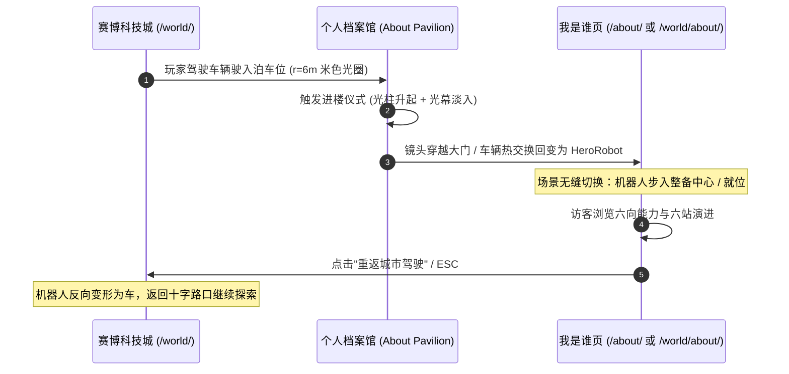

# 化身与 3D 视觉概念：不用真人脸怎么表现"我"（P4-AVATAR）

> **目标**：从 3D 视觉与资产管线角度回答——在默认不用真人照片的前提下，个人网站第一栋楼「我是谁」（About Pavilion / 个人档案馆）如何让访客 10 秒感受"这是一个具体、立体且极酷的人"，30–60 秒能复述其差异化定位与能力护城河。
> **核心依托**：现成 CC0 机甲资产 `HeroRobot.glb`、科技城 WebGPU/TSL 渲染引擎、全站设计系统与六向能力交叉模型。

---

## §1 "表现一个人"的 6 种非真人脸手法

在 3D Web/WebGL 创意个人站点与数字艺术中，不使用真人照片建立"鲜明人格化认知"主要有以下 6 种手法。下表对比其表现力、参考案例、辨识度、与赛博城市一致性及资产成本：

| 手法 | 核心定义（一句话） | 视觉参考（URL） | 人格辨识度 | 城市一致性 | 资产成本 | 适用场景与评价 |
| :--- | :--- | :--- | :---: | :---: | :---: | :--- |
| **1. 化身机甲<br>(Mech Persona)** | 将个人具象化为赛博世界中的"领航机甲"或"AI 工程师智体"，外化工业精密与系统交付力。 | [Quaternius Animated Mech](https://quaternius.com/packs/animatedmech.html)<br>[Cyber City Orion](https://orion.adrianred.com) ([Awwwards](https://www.awwwards.com/sites/cyber-city-orion)) | **极高**<br>(具象人形/姿态/手势/呼吸感) | **S 级**<br>(直接继承城内 HeroRobot 资产) | **低**<br>(复用现成 338KB GLB，微调剪辑) | **推荐核心主载体**。天生具有主角光环与叙事性，访客一眼即可建立"这就是站长在虚拟世界的化身"认知。 |
| **2. 粒子肖像/点云<br>(Point Cloud Silhouette)** | 用动态激光雷达（LiDAR）点阵、流体光子或体素扫描重构半透明数字孪生人体。 | [Three.js Point Cloud](https://threejs.org/examples/#webgl_points_billboards)<br>[Arkade London](https://www.awwwards.com/sites/arkade-london)<br>[Yuri Artiukh Particles](https://github.com/akella/threejs-particles) | **高**<br>(体态剪影清晰，科技神秘感) | **A 级**<br>(与 TransformParticles 粒子同族) | **极低**<br>(单 InstancedMesh 零贴图 <50KB) | 极具未来感与通透感，适合作为机甲展开或切换时的能量瞬态/全息投影。 |
| **3. 数据雕塑<br>(Data Sculpture)** | 将六向能力交叉（汽车×座舱×多语种×大模型×AI工作流×交付）抽象为多面动力学核心/反应堆。 | [Refik Anadol Data Sculptures](https://refikanadol.com)<br>[Aether 1 Experience](https://www.itsoffbrand.com)<br>[50 Years of Charts](https://www.awwwards.com/sites/50-years-of-charts) | **中至高**<br>(强概念性，解构展开信息) | **A+ 级**<br>(与 TSL 霓虹/几何体块完美契合) | **极低**<br>(程序化/低模几何体 <80KB) | 极度高级的技术刊物美学，像"钢铁侠的反应堆"，将复杂的抽象职业架构转化为可见的动力内核。 |
| **4. 物件静物/工作台<br>(Diegetic Workbench)** | 不直接出人，而是呈现"专属工程师指挥座舱工位"（车规级测试屏、HUD 投影模组、代码手板等）。 | [Jesse's Ramen (Jesse Zhou)](https://jesse-zhou.com) ([Case Study](https://jesse-zhou.medium.com/jesses-ramen-case-study-77bae77ab5f0))<br>[Henry Heffernan OS](https://henryheffernan.com)<br>[Bruno Simon 3D Room](https://bruno-simon.com) | **高**<br>(物以类聚，道具讲述真实故事) | **B+ 级**<br>(从宏观街道转入室内工位微观) | **中**<br>(需成套低模道具簇 300–500KB) | 极具真实感与生活温度。通过真实座舱测试仪、手写便签等细节证明"这是一个在产业一线交付过的专家"。 |
| **5. 声音波形共鸣体<br>(Acoustic Resonance)** | 将多语种语音、播客演讲与多模态交互转化为 3D 悬浮声纹环、流体频谱柱与光子共鸣舱。 | [Matt DesLauriers Audio Vis](https://github.com/mattdesl/three-audio-visualizer)<br>[Listening Together](https://www.awwwards.com/sites/listening-together)<br>[Voice Pod 波形冠](https://github.com/rayw-lab/mywebsite/tree/main/public/models/voice-pod) | **中**<br>(强化声音/多语种/演讲者标签) | **A- 级**<br>(与 Voice Pod 呼应，需防抢戏) | **极低**<br>(TSL 顶点扰动 + WebAudio <30KB) | 专精于展示"语音座舱 / 多语种本地化 / 播客讲者"特质，适合作为化身的感知器官或交互反馈部件。 |
| **6. 抽象符号/动态印记<br>(Abstract Monogram)** | 由姓名缩写 "WL"、拓扑网络与车道引力线构成的极简发光能量符印。 | [Utopia Tokyo](https://www.awwwards.com/sites/utopia-tokyo)<br>[Lusion v3](https://lusion.co) | **中**<br>(偏向品牌 Logo，叙事稍薄) | **B+ 级**<br>(可作为地表投影或徽章) | **极低**<br>(矢量挤出或程序化面片 <10KB) | 适合作为贯穿全场的背景徽章、地表锚点或加载动画，不宜单独作为唯一主角。 |

---

## §2 三个 3D 视觉概念设计（Visual Concepts）

结合科技城既有技术栈（three.js r185 WebGPU/TSL、Rapier 物理、`HeroRobot.glb`）以及 Master Plan §1.3 六向能力交叉模型，提出 3 套高辨识度视觉概念：

```mermaid
graph TD
    subgraph Concept1["概念一：机甲整备坞（The Hangar Dock）"]
        C1_A["HeroRobot 英雄站姿"] --> C1_B["胸口/掌心释放六向全息网"]
        C1_B --> C1_C["地面六站演进导轨流动"]
    end
    subgraph Concept2["概念二：六向解构核心（The Hexahedral Core）"]
        C2_A["超精密二十面体机械核心"] --> C2_B["六大主瓣机械解构开合"]
        C2_B --> C2_C["内置全息微缩领航员"]
    end
    subgraph Concept3["概念三：座舱架构指挥台（The Command Bridge）"]
        C3_A["第一人称/等轴座舱工位"] --> C3_B["多块全息弯曲屏+AR-HUD"]
        C3_B --> C3_C["HeroRobot 协同副驾 Agent"]
    end
```



---

### 概念一：【机甲整备坞：工程师的数字停泊港（The Hangar Dock）】——（推荐方案）

#### 1. 一句话定位
**HeroRobot 卸下巡航武装步入赛博档案馆中央的悬浮整备台，胸口传感器投射出六向能力全息能量网，访客化身座舱工程师检阅六站职业演进。**

#### 2. 首屏 10 秒画面描述（Shot List）
*   **0.0s – 2.0s【Shot 1: 穿云入港，地轨苏醒】**
    *   **机位**：从黑暗顶棚以 35° 俯角向前滑移下探（Dolly In）。
    *   **光效与材质**：中央圆形整备台的环形地轨由暗转亮，青色光流（`#49c5b6`）沿轨道刻度飞速扫掠，地面深碳灰（`#14171d`）反射出清晰的环形光倒影。
*   **2.0s – 4.5s【Shot 2: 主角定帧，呼吸共鸣】**
    *   **机位**：平滑推至中景特写（斜距 6.5m，仰角 10°，对准机器人胸腔）。
    *   **主体动效**：HeroRobot 屹立在整备中心，头部传感器环顾观察，胸口青色传感器（`Eye` 材质）深呼吸式脉动；后上方品红轮廓光（`#ff2d6f` SpotLight）锐利勾勒出钛灰装甲的边缘剪影。
*   **4.5s – 7.5s【Shot 3: 六向全息能量网展开】**
    *   **动效**：机器人胸口与掌心向上微抬，向空中释放 6 道加色半透明激光锥，在半空中拼装成一个悬浮旋转的六边形全息晶体阵列（汽车、座舱、多语种、大模型、AI工作流、交付）。
    *   **光尘**：空间中激发出 60 颗细微体积光尘（TSL Sprite 光尘）环绕机器人上升内旋。
*   **7.5s – 10.0s【Shot 4: 交互锁定，三支柱呈现】**
    *   **机位**：回落到舒适交互机位（FOV 40°，居中偏左 1/3 构图），右侧 DOM HUD 浮现三支柱卡片。光标 Hover 全息节点时，节点外缘激发出六边形防护罩微波，HeroRobot 头部微转朝向该节点。

#### 3. HeroRobot 在其中的角色与动作/材质
*   **角色定位**：第一人称/化身主体（"这就是我的数字载体"）。
*   **动作剪辑需求（配额 ≤3）**：
    1.  `Idle`（现成，呼吸待命）；
    2.  `Dock_Inspect`（新增：双臂微展、胸腔微开的整备自检姿态）；
    3.  `Point_Interact`（新增：单手向前指向全息屏引导视线）。
*   **材质配置**：沿用 6 槽具名材质，在胸口增加 TSL `HoloProjectorNode`（向外投射光锥的光源锚点）。

#### 4. 六向能力交叉与六站演进的 3D 化
*   **六向能力交叉**：半空中由 6 块悬浮六边形全息晶片构成的动力网络，节点间有动态能量线流淌，鼠标悬停时激活对应支柱的透镜高亮。
*   **六站职业演进**：整备台外围地面环形导轨上的 6 个发光年份基站（2017 物联网 → 2018 整车前瞻 → 2020 AR-HUD → 2022 多语种座舱 → 2024 端云大模型 → 2026 AI 工作流）。点击年份，机器人脚下对应基站升起光柱，投射出该时期的代表项目线框。

#### 5. 配色与 TSL 材质思路
*   **Palette**：钛灰 `#5c6472`、工业橙 `#ff6b35`、青色 `#49c5b6`、品红 `#ff2d6f`、深碳黑 `#14171d`。
*   **TSL 材质**：
    ```ts
    // 全息六边形晶体材质（TSL）
    const holoShieldMaterial = new THREE.MeshBasicNodeMaterial({
      transparent: true,
      blending: THREE.AdditiveBlending,
      side: THREE.DoubleSide,
      depthWrite: false,
    });
    holoShieldMaterial.colorNode = Fn(() => {
      const hexGrid = fract(uv().mul(6)); // 六边形几何纹理
      const edge = smoothstep(0.02, 0.08, abs(hexGrid.x.sub(0.5)));
      const fresnel = normalWorld.dot(cameraPosition.sub(positionWorld).normalize()).oneMinus().pow(2);
      return vec3(0.29, 0.78, 0.72).mul(edge.add(fresnel).mul(1.6));
    })();
    ```

#### 6. 循环动画配额（严格 ≤5 处）
1.  HeroRobot 骨骼呼吸待命（AnimationMixer `Dock_Inspect`）；
2.  胸口与面罩传感器呼吸灯（TSL emissive 脉冲，周期 1.6s）；
3.  六向全息晶体公转自转（TSL 旋转节点）；
4.  地面环形导轨能量流扫掠（TSL 刻度滚动）；
5.  整备坞悬浮光尘（TransformParticles 同族 InstancedMesh 60 实例）。

#### 7. 资产清单与体积预算
*   `models/about/HeroRobot_Dock.glb`（含 3 剪辑，Draco）：**≈ 380 KB**。
*   `models/about/Dock_Pedestal.glb`（整备台底座低模，Draco）：**≈ 65 KB**。
*   TSL 程序化全息件与粒子：**0 KB 外部资产**。
*   **总 3D 资产**：**≈ 445 KB**（远低于 Lab 单页 ≤900KB 预算）。
*   **复杂度**：**M 档**（ROI 最高，复用度最强，体验最流畅）。

---

### 概念二：【多维解构：六向核心数据雕塑（The Hexahedral Core）】

#### 1. 一句话定位
**摒弃传统人体，将站长的知识体系与工程交付力抽象为一颗悬浮在深空的机械多面体动力核心，六个主面随交互机械解构、咬合与重组。**

#### 2. 首屏 10 秒画面描述（Shot List）
*   **0.0s – 3.0s【Shot 1: 引力聚形】** 极暗空间中，数百枚钛合金多面体碎片受引力场吸引从四周向中心旋转飞聚，迸发出细碎的青色引力光弧。
*   **3.0s – 6.0s【Shot 2: 核心咬合锁死】** 碎片拼装咬合为一颗精密的二十面体动力核心，接缝处透出高亮青色呼吸光芒（bloom 锚点）。
*   **6.0s – 8.5s【Shot 3: 机械分层解构】** 核心外层 6 大主瓣向外弹开 0.3m（展示内部的端云算力层与多语种神经回路），内部微缩的全息 HeroRobot 领航员在线框中静静旋转。
*   **8.5s – 10.0s【Shot 4: 视线跟随交互】** 核心根据鼠标移动产生微妙的物理阻尼视差倾角，表面蚀刻的工业铭文清晰可读。

#### 3. HeroRobot 的角色与动作
*   **角色**：化身为核心内部的"微缩全息领航员（Holo Pilot）"——约 600 tris 的半透明青色线框机甲，在核心中央提供稳定的视觉锚点。

#### 4. 六向能力与六站演进的 3D 化
*   **六向能力**：核心的 6 个主受力瓣面，每个瓣面搭载一个独立的微型 TSL 动态仪表（如座舱 HMI 波形、端云拓扑流）。
*   **六站演进**：核心内部同轴嵌套的 6 层陀螺仪机械环（Gimbal Rings），每层代表一个时期，依序差速旋转。

#### 5. 配色与材质
*   **Palette**：深空黑 `#08090d`、深钛金 `#323742`（金属度 0.85，粗糙度 0.28）、高亮青 `#49c5b6`、警告橙 `#ff6b35`。
*   **TSL 材质**：各向异性拉丝金属反射 + 内部菲涅尔折射微晶玻璃。

#### 6. 循环动画配额（≤5 处）
1.  核心主瓣微呼吸浮动；
2.  内部 6 层陀螺仪环差速自转；
3.  接缝能量脉动；
4.  微缩领航员旋转；
5.  核心周围 3 条引力流光轨。

#### 7. 资产与复杂度
*   `Hexahedral_Core.glb`（无骨骼硬表面模型，Draco）：**≈ 120 KB**。
*   **复杂度**：**S 档**（开发周期短，性能极高，极具前卫艺术感）。

---

### 概念三：【座舱架构指挥台：第一人称数字工位（The Command Bridge）】

#### 1. 一句话定位
**构建一个等轴透视的"未来智能座舱架构师指挥工位"——中央为 1:1 悬浮全息座舱切片与 AR-HUD，HeroRobot 在侧作为协同副驾 Agent 辅助操作。**

#### 2. 首屏 10 秒画面描述（Shot List）
*   **0.0s – 3.0s【Shot 1: 通电自检】** 黑暗工位由左至右被扫描激光激活，三块环抱式全息曲面屏逐一通电，显示出座舱诊断、大模型调度日志与多语种音频图谱。
*   **3.0s – 6.5s【Shot 2: 副驾 Agent 就位】** 位于工位右侧调试台的 HeroRobot 转向观者点头致意（`Greet_Nod`），单手在悬浮光盘上输入指令，工位中央投射出一段 3D 虚拟 AR-HUD 车道引导线。
*   **6.5s – 10.0s【Shot 3: 交互台激活】** 工位前方的 6 枚物理质感全息按键亮起，对应六大能力支柱，点击按键触发工位屏幕深度数据展示。

#### 3. HeroRobot 的角色与动作
*   **角色**：副驾协同 AI / 现场总工程师助理。
*   **动作剪辑**：`Typing_Console`（控制台操作）、`Greet_Nod`（致意交互）。

#### 4. 六向能力与六站演进的 3D 化
*   **六向能力**：工位中控台上的 6 组模块化仪表（音频分析仪、端云分流器等）。
*   **六站演进**：工位后方陈列架上的 6 个"版本标本舱"（从早期物联网芯片盒到最新 AI 算力模组）。

#### 5. 配色与材质
*   **Palette**：控制台碳灰 `#1c1f26`、座舱青 `#49c5b6`、琥珀橙 `#ff9800`、警示品红 `#ff2d6f`。

#### 6. 循环动画配额（≤5 处）
1.  HeroRobot 打字待命骨骼动画；
2.  全息曲面屏示波器与数据流滚动；
3.  AR-HUD 虚拟引导车道推移；
4.  机架服务器指示灯点阵呼吸；
5.  工位环境微光尘埃。

#### 7. 资产与复杂度
*   `Cockpit_Bridge.glb`（工位台面 + 设备，Draco + KTX2）：**≈ 460 KB**。
*   `HeroRobot_Work.glb`（含动作，Draco）：**≈ 360 KB**。
*   **总 3D 资产**：**≈ 820 KB**。
*   **复杂度**：**L 档**（场景建模量大，沉浸感与故事细节最强）。

---

## §3 与城市的联动：空间与叙事的连续性



### 1. 进楼连续性（从 `about-pavilion` 泊车进楼 → 本页首屏）
*   **空间坐标与建筑对应**：
    *   科技城中 `about-pavilion` 为米色大厦（`#fef3c7` 光圈），建筑前场设有专属泊车位 `parkingBay`。
    *   当玩家在城中驾车驶入泊车圈时，触发进楼过场：地面充能环展开，升起全屏光幕（复用 `TransformSystem` 0.6s 峰值遮蔽与 `TransformParticles` 光尘）。
*   **形态与状态继承**：
    *   光幕峰值时，车辆热交换变回 HeroRobot（`world-transform: robot`）。
    *   镜头从第三人称街景顺滑穿越展馆主入口光门，无缝过渡到本页的"机甲整备坞"。
    *   若携带 URL 参数 `?from=city`，跳过入场光柱动画，直接以"机器人已在整备台就位"姿态开场；若直接访问 `/about/` 独立路由，则播放 1.1s 完整的降落弹出序列（`HeroRobot.reveal()` 同款 `easeOutBack`）。

### 2. 出楼回城呼应（返回赛博科技城）
*   页面顶部与底部常驻"重返科技城（Drive in Cyber City）"CTA。
*   点击后，整备台环形导轨再次激活，HeroRobot 站在光圈中央触发变车仪式（`transform: car`），相机平滑推拉后切回城内主干道十字路口（`world.spawn`），保持已解锁成就与探索进度不变。

---

## §4 资产管线与工程落地规范

### 1. Blender 建模与导出规范
*   **Blender 版本**：统一锁定 **Blender 4.0 LTS**（与本仓 `tools/blender/generate-*.py` 保持一致）。
*   **单位尺度**：严格米制（Metric, Unit Scale 1.0），机甲高度严格标定在 9.0 米级，各部件在导出前执行 `Ctrl+A` -> `Apply All Transforms`。
*   **材质命名合同**：严格遵循全站具名材质槽位（`Main` / `Accent` / `Grey` / `LightGrey` / `Black` / `Eye`），确保与运行时 `NeonMaterials.ts` 及 `HeroRobot.ts` 热调代码无缝对接。

### 2. glTF-Transform 自动化处理管线
复用 `HeroRobot.glb` 与三大 Hero 楼的无损压缩脚本，构建一次性构建脚本 `build-avatar.mjs`：
```bash
# 依赖库安装
npm i -D @gltf-transform/core@4 @gltf-transform/functions@4 @gltf-transform/extensions@4 draco3dgltf
```

```javascript
// 资产处理流水线（核心步骤）
import { ColorUtils, NodeIO } from '@gltf-transform/core';
import { KHRDracoMeshCompression } from '@gltf-transform/extensions';
import { dedup, draco, prune, resample } from '@gltf-transform/functions';
import draco3d from 'draco3dgltf';

const io = new NodeIO().registerExtensions([KHRDracoMeshCompression]).registerDependencies({
  'draco3d.encoder': await draco3d.createEncoderModule(),
  'draco3d.decoder': await draco3d.createDecoderModule(),
});

const doc = await io.read('Stan_Raw.gltf');
// 1. 剪辑裁剪：仅保留目标 2-3 个 Action
const KEEP = new Set(['Idle', 'Dock_Inspect', 'Point_Interact']);
for (const anim of doc.getRoot().listAnimations()) {
  if (!KEEP.has(anim.getName())) anim.dispose();
}
// 2. 无损优化与去重
await doc.transform(
  resample(),
  dedup(),
  prune({ keepAttributes: false, keepLeaves: false })
);
// 3. Draco 压缩（edgebreaker 算法）
await doc.transform(draco({ method: 'edgebreaker' }));
await io.write('HeroRobot_Dock.glb', doc);
```

### 3. KTX2 / ETC1S 贴图规格
*   全站默认倡导 **TSL 程序化着色（零贴图）**。
*   若包含 UI 图集或法线贴图：
    *   分辨率封顶 `1024×1024`（大多数 UI 元素仅需 `512×512`）；
    *   执行 `gltf-transform etc1s input.glb output.glb --quality 255`；
    *   单张 KTX2 压缩后体积控制在 30–50KB 以内。

### 4. Mixamo 动作重定向与许可合规
*   **骨骼结构适配**：Quaternius 的 Stan 骨骼为标准 Humanoid 拓扑（Hips, Spine, Chest, Neck, Head, Limbs, Hands），与 Mixamo 骨骼完全同源。
*   **重定向步骤**：
    1. 在 Blender 4.0 中将 Stan 摆成标准 T-Pose；
    2. 使用 Blender 官方插件或 `Rokoko Studio Live` 插件将 Mixamo 的 `.fbx` 动作曲线一键重定向至 Stan 骨架；
    3. 调整手指抓握与脚底 `IK` 约束，确保脚底与 `y=0` 地面无穿模；
    4. 烘焙并重命名 Action 为 `Dock_Inspect` / `Point_Interact`。
*   **许可合规**：Adobe Mixamo 动画在免费条款下允许免版税商用于 WebGL 应用中（仅限制二次单独转售原始 FBX 文件），与 CC0 1.0 的 Stan 模型组合完全合法合规。

### 5. 体积与性能硬指标预算
*   **模型体积**：单角色 GLB ≤ **380 KB**（Draco 压缩后）；
*   **全页 3D 资产总包**：≤ **500 KB**（符合 Lab / World 预算）；
*   **几何面数**：角色 ≤ 6,000 tris，场景总和 ≤ 15,000 tris；
*   **Draw Calls**：全场景严格控制在 **≤ 6 个**（利用 InstancedMesh 与合并材质）。

---

## §5 风险评估与防范对策

| 风险项 | 潜在问题 | 防范对策与实施红线 |
| :--- | :--- | :--- |
| **1. 与周边 Hero 楼抢戏** | 与 Voice Pod（语音）、Garage（展车）、AutoDrive（试车台）功能混淆。 | **明确主旨分工**：About Pavilion 聚焦"**人（智体）、能力网络与职业生涯**"；严禁在馆内陈列整车（归 Garage）或大型消声劈尖（归 Voice Pod）。色彩采用专属米色 `#fef3c7` 与主装甲钛灰，与周围形成区隔。 |
| **2. 变形金刚 / IP 侵权** | 机器人外观与变形机制被质疑侵权 Transformers 等商业 IP。 | **严格遵守 D2 反 IP 论证**：<br>① 零红蓝/黄黑涂装，锁死全站钛灰+工业橙+青色；<br>② 零汽车前脸胸甲、零车标、零派系徽章、零火焰纹；<br>③ 命名严格使用 `HeroRobot` / `Architect Persona`；<br>④ 变形为遮蔽式光幕热交换，无任何汽车零件折叠拼接动作。 |
| **3. 低端设备与性能卡顿** | 复杂动画和材质在移动端/弱显卡（SwiftShader）上掉帧。 | **分级降级与门禁机制**：<br>① `Quality 2` 档位自动关闭光尘粒子与假室内映射；<br>② `prefers-reduced-motion` 启用时：不建时间轴，直接展示稳定静态定格帧，运镜通道恒 0；<br>③ 纯静态 HTML/CSS 兜底保障（无 WebGPU/WebGL 时展示清晰的文字与 Mermaid 图）。 |

---

## §6 总结与推荐落地路径

1.  **推荐采用「概念一：机甲整备坞（The Hangar Dock）」**：
    *   **最大化复用**现成 CC0 `HeroRobot.glb` 与既有 TSL 着色器；
    *   在不露真人脸的前提下，利用"机甲+六向全息网+六站地轨"构建出极具冲击力的"座舱 AI 架构师"形象；
    *   资产增量极小（<150KB 新增），性能安全，与科技城主场景具备完美的时空连续性。
2.  **下一阶段实施清单**：
    *   在 Blender 中为 Stan 添加 `Dock_Inspect` 与 `Point_Interact` 动作并导出 Draco GLB；
    *   编写 `AboutPavilionStage.ts` 封装整备台三维舞台与 TSL 全息能量网；
    *   打通 `/world/` 泊车进楼与独立 `/about/` 页面的双向转场路由。
