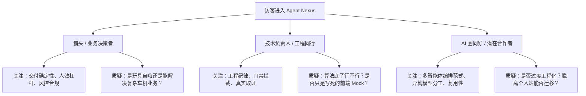
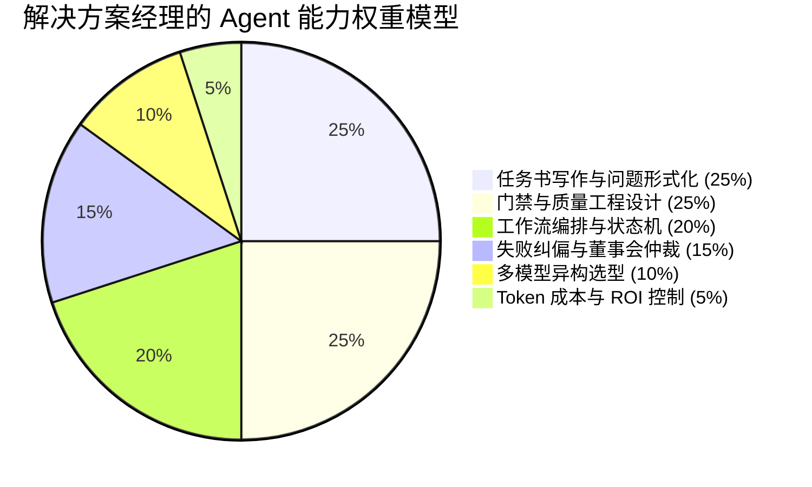
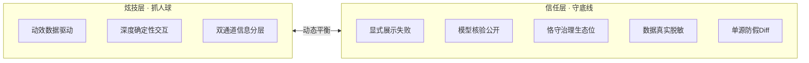

# 「解决方案经理」如何炫技地展示 Agent 能力：叙事策略与信息架构方案

> **文档定位**：王磊个人站 · 赛博城市「Agent Nexus 智能体中枢」专页叙事纲领与信息架构设计书（N4-NARRATIVE）  
> **核心命题**：一个**非算法工程师**的解决方案经理，如何通过个人网站在 GitHub Pages 纯静态托管与零后端约束下，既在 10 秒内震撼访客（炫技），又在 30 秒内建立无可辩驳的专业信任（治理与可信度），实现从“AI 玩具”到“企业级工程交付系统”的认知跃迁。

---

## 目录
1. [三类受众的心理博弈：打动点、质疑点与破局解法](#一三类受众的心理博弈打动点质疑点与破局解法)
2. [「Agent 能力」对解决方案经理的重构：能力排序与治理价值](#二agent-能力对解决方案经理的重构能力排序与治理价值)
3. [三大页面概念方向的完整信息架构（IA）](#三大页面概念方向的完整信息架构ia)
   - [方向 A：网页端 IDE / 智能体指挥台（Web IDE / Commander's Console）](#方向-a网页端-ide--智能体指挥台web-ide--commanders-console)
   - [方向 B：指挥中心回放 / 编排任务纪录片（Command Center Playback / Time-lapse）](#方向-b指挥中心回放--编排任务纪录片command-center-playback--time-lapse)
   - [方向 C：交互式解决方案推演白板（Interactive Solution Case Playbook）](#方向-c交互式解决方案推演白板interactive-solution-case-playbook)
4. [炫技与可信的平衡律：8 条“炫技不失信”设计与写作军规](#四炫技与可信的平衡律8-条炫技不失信设计与写作军规)
5. [一句话定位候选（Tagline Candidates × 5）](#五一句话定位候选tagline-candidates--5)
6. [需要主人拍板的关键问题（Decision Points ≤ 6）](#六需要主人拍板的关键问题decision-points--6)

---

## 一、三类受众的心理博弈：打动点、质疑点与破局解法

一个优秀的解决方案经理（Solution Manager / Solution Architect）不是算法的发明者，而是**将前沿技术与业务痛点咬合、将混沌需求转化为确定性交付的系统构建者**。在个人站展示 Agent 能力时，必须精准识别三类核心受众的心理模型与审视视角。



### 1. 猎头 / 主机厂与 Tier 1 的业务决策者（看结果与治理）

| 维度 | 深度洞察与心理画像 |
| :--- | :--- |
| **受众画像** | 主机厂智能座舱部门 VP、AI 创新实验室负责人、Tier 1 解决方案总监、猎头 Partner。痛点是“大模型概念很火，但引入团队后只会写 PPT 或产生大量无法合入的垃圾代码，业务交付依然延期”。 |
| **被什么打动** | 1. **超常的人效杠杆**：一个人相当于一个数字化特种作战指挥部（1 人编排 5 类模型完成传统 3 人月的工作量）。<br>2. **确定性与闭环能力**：不是展示“AI 能聊天”，而是展示“AI 被严格约束在质量门禁内，产出 100% 可构建、通过 e2e 测试的工业级产物”。<br>3. **风控与止损机制**：拥有“独立审计”、“董事会强制熔断”、“NO_GO 止损”等成熟的企业级治理意识，证明其绝不会让 AI 在生产环境中失控。 |
| **会质疑什么** | 1. “这套东西是不是只能用来搭你的个人博客？遇到车企严苛的 ASPICE 或车载操作系统限制，还能跑通吗？”<br>2. “你本人在其中到底扮演什么角色？是不是只在 Cursor 里敲了几次回车？”<br>3. “落地成本是多少？Token 消耗和算力成本会不会击穿预算？” |
| **破局说服抓手** | - **算账（ROI & Ledger）**：用直观的量化对比表展示“传统人工开发 vs 盲目单 Agent vs 本套治理流”的周期、缺陷率与成本。<br>- **场景迁移映射**：将个人站编排范式明确映射到“座舱多语种本地化流水线”和“端云协同故障诊断”两大车企实战场景。<br>- **凸显指挥官生态位**：页面通篇强调“任务书定义、质量标准设定、异常终裁”，证明决策者的核心价值在于认知和架构，而非手动打字。 |

---

### 2. 技术负责人 / 工程同行（看真实性与工程纪律）

| 维度 | 深度洞察与心理画像 |
| :--- | :--- |
| **受众画像** | 资深架构师、前端/全栈工程 Tech Lead、开源项目 Maintainer。他们自带“防忽悠雷达”，极其厌恶空洞的 AI 营销话术和虚假宣传。 |
| **被什么打动** | 1. **不可妥协的工程硬门**：Playwright 52/52 e2e 零跳过、LHCI 四项 ≥95、内存泄漏与静态资源零容忍。<br>2. **四权分立的架构解耦**：父代理只编排不写业务代码、子代理正交实现、独立审计代理零业务代码仅出报告、董事会触发式终裁。<br>3. **真实的事故与纠偏日志**：直面 Node 22 ESM 断言坑、SwiftShader 渲染崩溃、视觉自评偏乐观等真实工程血泪史。 |
| **会质疑什么** | 1. “你又不是算法工程师，聊 Agent 是不是只会搬运流行概念？”<br>2. “界面上的流水线动效是不是一段写死（Hard-coded）的 CSS/JS 动画，根本没有真实数据支撑？”<br>3. “Agent 生成的代码质量如何？会不会为了凑绿灯把断言写成 `expect(true).toBe(true)`？” |
| **破局说服抓手** | - **取证透明化（Receipt & SHA）**：提供真实的 Git Commit SHA 链接、完整 `e2e-results.json`、Worker 身份核验单（`identity_ok`），支持下载原始 JSON。<br>- **坦诚边界（Lane Discipline）**：主动声明“我不是算法发明者，我是让多模型在工业流水线中可靠咬合的解决方案架构师”。<br>- **展示坏味道与红线**：公开展示历史中被审计代理打回的“NO_GO”代码片段和董事会纠偏决策单。 |

---

### 3. AI 圈同好 / 潜在合作者（看方法论可复用性）

| 维度 | 深度洞察与心理画像 |
| :--- | :--- |
| **受众画像** | 独立开发者、AI Agent 创业者、大模型应用架构师、前沿技术探索者。追求前沿范式、提示工程深度与工具链创新。 |
| **被什么打动** | 1. **创新的方法论抽象**：跳出单 Agent ReAct 框架，建立多模型 Worker 席位制（Gemini 视觉看图 / Grok 读仓分析 / Fable 逻辑推理 / GLM 批量处理）。<br>2. **结构化任务书体系**：清晰的上下文契约、单源状态机（SSOT）、防 diff 假象机制。<br>3. **极具审美张力的极客体验**：将复杂的异步多智能体交互转化为优雅、高密度的信息控制台。 |
| **会质疑什么** | 1. “这套范式是不是过度工程化（Over-engineering）？小团队或普通项目用得起吗？”<br>2. “多模型通信的标准协议是什么？是不是强依赖某种特定的专有平台？” |
| **破局说服抓手** | - **开源协议化思维**：提供可直接复制的《标准任务书模板》、《门禁设计清单》、《审计评分公式》。<br>- **模块化解耦**：清晰说明“轻量任务走单 PR 直行，高危复合任务才升格至四权分立门控链”，展示方法论的弹性。 |

---

## 二、「Agent 能力」对解决方案经理的重构：能力排序与治理价值

对于算法工程师而言，核心竞争力在于模型结构创新、Loss 函数设计与训练加速；而对于**解决方案经理**，Agent 能力是**业务理解力、系统架构力与质量治理力的极致放大**。

### 1. 核心能力排序与权重分配



| 排序 | 能力维度 | 核心内涵 | 为什么属于解决方案经理而非算法工程师 |
| :---: | :--- | :--- | :--- |
| **1** | **任务书写作（Problem Formulation & Spec）** [25%] | 将模糊混沌的业务目标降噪，提炼为具有清晰上下文契约、文件域边界、输入输出格式和验收标准（DoD）的结构化 Prompt / 任务书。 | **垃圾进，垃圾出**。LLM 不懂业务痛点，只有解决方案经理能把“提升座舱多语种准确率”转化为可执行的语料清洗与对齐规则。 |
| **2** | **门禁设计（Gatekeeping & QA Architecture）** [25%] | 设定不可被任何 Agent 妥协的硬指标体系（如 e2e 全绿、LHCI ≥95、视觉双评 \|Δ\|≤5、无死锁）。设立“独立审计”角色，确保实现与质检隔离。 | 算法追求平均指标（如 BLEU / Accuracy），解决方案经理追求**工业级确定性（0 缺陷容忍、不发生致命回归）**。 |
| **3** | **编排与状态机（Orchestration & State Machine）** [20%] | 设计任务拓扑流（串行、正交并行、门控栈）、保证看板单源（SSOT）、管理合并顺序与基线分支。 | 属于经典的**系统架构与项目管理升维**，决定了多个智能体是协同作战还是相互踩踏。 |
| **4** | **失败纠偏与仲裁（Failure Recovery & Board）** [15%] | 当 Agent 陷入死锁、幻觉死循环或审计持续亮红灯时，以“董事会”身份紧急介入，打破死锁，调整路线或止损。 | 这是人类专家的**终极责任边界**。自动化系统必须有负责任的人类在环（Human-in-the-loop）裁决。 |
| **5** | **多模型异构选型（Multi-Model Strategy）** [10%] | 不迷信单一模型，根据任务特性（长上下文、视觉识别、代码生成、批量处理、单价）精准派发对应 Worker 席位并做身份核验。 | 属于**技术选型与供应链管理能力**，在性能、效果与成本间取得最佳平衡。 |
| **6** | **成本与预算控制（Token Budget & Cost Governance）** [5%] | 设定单任务 Token 熔断上限、上下文剪枝、缓存命中策略，折算人日 ROI。 | 属于**商业化与运营管控能力**，确保技术方案在经济学上可行。 |

---

### 2. 核心论证：为什么“展示治理”比“展示代码”昂贵十倍？

> **核心观点**：在 LLM 时代，**生成代码是廉价的边际劳动，而建立让代码稳定、可信、安全运转的治理体系，才是稀缺的商业资产。**

```
┌──────────────────────────────────────────────────────────────┐
│                    代码视角 vs 治理视角                       │
├──────────────────────────────┬───────────────────────────────┤
│         展示写代码 (廉价)     │        展示治理系统 (昂贵)     │
├──────────────────────────────┼───────────────────────────────┤
│ • "看我用 AI 跑出了 500 行代码" │ • "看我如何用门禁拦截 12 次 AI 劣化"│
│ • 关注点：单点功能实现       │ • 关注点：系统韧性、防回归、质量底线 │
│ • 假设：模型永远正确 (不可靠) │ • 假设：模型必然犯错，但系统会自愈   │
│ • 角色：初级程序员的替代品   │ • 角色：数字化研发指挥部的总架构师   │
│ • 商业价值：单次人力节省     │ • 商业价值：企业级研发流水线的范式重构│
└──────────────────────────────┴───────────────────────────────┘
```

1. **代码具有极高的折旧率，而治理架构沉淀为组织资产**：代码会随着框架更迭、需求演进快速过时，但“父编排-子执行-独立审计-董事会仲裁”的四权分立治理范式，可以无缝复用到汽车座舱、智能制造、企业数字化的任何复杂业务中。
2. **解决“可信度危机（Trust Crisis）”**：企业引入 AI Agent 最大的阻力不是“AI 不会写代码”，而是“不敢用、怕出事、出了事没人负责”。展示严密的门禁、SHA 证据链和回滚机制，直接击碎了客户与决策者的信任壁垒。
3. **凸显解决方案经理的不可替代性**：算法工程师提供引擎，普通开发者负责加油，而解决方案经理**规划道路、设立交规、建立应急救援与保险制度**——这才是真正能够撬动商业决策的昂贵能力。

---

## 三、三大页面概念方向的完整信息架构（IA）

针对 GitHub Pages 纯静态（零后端、无密钥）的运行环境，我们设计了三个各具侧重、均具备极强视觉冲击力与叙事深度的信息架构方案。

---

### 方向 A：网页端 IDE / 智能体指挥台（Web IDE / Commander's Console）

```
┌─────────────────────────────────────────────────────────────────────────┐
│ [● SYSTEM: ONLINE] [GH Pages Static Engine] [Tokens: 1.42M] [ROI: 3.8x] │
├──────────────┬────────────────────────────────────────────┬─────────────┤
│ WORKERS (5)  │ ORCHESTRATION TOPOLOGY & TRACE             │ GATES (5-D) │
│              │                                            │             │
│ [●] Gemini   │  (Parent Orchestrator)                     │ e2e: 52/52  │
│   Visual     │        │                                   │  [PASS]     │
│ [●] Grok     │   ┌────┴────┐                              │ LHCI: 98/98 │
│   Repo Read  │   ▼         ▼                              │  [PASS]     │
│ [●] Claude   │ [Worker]  [Worker]                         │ Visual: 90  │
│   Logic/Dev  │   │         │                              │  [PASS]     │
│ [●] GLM      │   └────┬────┘                              │ Weight: 1.0 │
│   Batch Text │        ▼                                   │  [PASS]     │
│ [!] Kimi     │ [Independent Auditor] ──► [Board Arbiter]  │ Overall: 88 │
│   Identity   │                                            │  [PASS]     │
│              │ ── LIVE LOG STREAM & DIFF INSPECTOR ────── │             │
│              │ [19:24:02] Auditor: Visual delta |Δ|=2 OK. │ [NO_GO LOG] │
│              │ [19:24:05] Board: Release approved to main │ 01: CSS leak│
├──────────────┴────────────────────────────────────────────┴─────────────┤
│ [Trace Playback] [Inject Regression Test] [Export Spec JSON] [Book Call]│
└─────────────────────────────────────────────────────────────────────────┘
```

- **核心概念**：将页面打造成一个正在高速运转的现代化 AI 数字化特种指挥台（类比 Linear + Vercel + Datadog 的极客混合体），全景展现多模型异构调度与五维硬门拦截。
- **首屏 10 秒体验**：深邃赛博黑紫底色（#0d0b14），顶部系统呼吸灯闪烁；左侧 5 个异构 Worker 席位展示实时算力状态；中央拓扑 DAG 节点伴随光效流动，右侧五维雷达门禁逐项跳动绿灯，瞬间给访客“进入了高科技作战司令部”的沉浸感。
- **30 秒结论一句（≤40字）**：
  > **“多模型异构调度、五维硬门拦截：这里展示一套可工业化落地的 Agent 编排中枢。”**
- **页面分区与每区目的**：
  1. **顶栏（System Telemetry Header）**：展示纯静态运行状态、当前编排轮次、累计调度 Token 消耗与人效 ROI 折算，声明“Zero-Backend / 100% Client-Side Deterministic”。
  2. **左栏（Worker Matrix & Identity Deck）**：展示 5 个模型席位（Gemini 3.1 Pro / Grok 4.6 / Claude Fable 5 / GLM 5.3 / DeepSeek），点击展示各席位的专属职责与 `identity_ok` 身份核验签。
  3. **中央主区（Topology DAG & Live Trace Viewer）**：动态交互式 DAG 图。展示“父编排 ➔ 正交 Worker 并行 ➔ 独立审计 ➔ 董事会裁决”链路。下方为多色高亮 Log 流，支持点击任何节点展开 Prompt 任务书、产出 Diff 与审计报告。
  4. **右栏（Governance Radar & Gate Matrix）**：五维硬门实时仪表（e2e 52/52、LHCI 98、视觉双评 \|Δ\|≤5、权重归一化 1.0、综合分 88）；下方常驻历史“NO_GO 拦截归档”，点击查看曾被门禁拦截的事故。
  5. **底部控制坞（Command Dock）**：提供交互动作按钮与证据链检索。
- **访客可做的 3 个动作**：
  1. **切换模型 Worker 视角**：点击左侧任意模型（如 Gemini 视觉席位），中央区域联动高亮其负责的机位截图对齐与视觉打分任务。
  2. **注入异常与门禁拦截（Interactive Chaos Drill）**：点击“注入回归 Bug”按钮，触发一段预置的异常流——展示代码导致 e2e 报错，独立审计代理亮红灯打出 NO_GO，董事会立即介入切断合并。
  3. **一键导出标准任务书模板**：点击“Export Spec JSON”，直接下载经过脱敏验证的《工业级 Agent 任务书与门禁模板》。
- **结尾 CTA**：
  > **「将这套 Agent 治理流引入您的业务场景」**  
  > [预约 30 分钟架构推演] ｜ [查阅提分 Loop 完整工程文档]
- **哪类受众最买账**：**技术负责人 / 工程同行**（极客感拉满、工程纪律严密、透明度极高）。
- **露怯风险与对策**：
  - *风险*：被误认为是纯前端写死的假动画（Mock），缺乏真实感。
  - *对策*：所有日志和节点均绑定真实的 Git Commit SHA、真实的 Playwright 测试用例名（如 `e2e/cyber-city-audio.spec.ts`），并提供 raw JSON / log 下载，假一赔十。
- **与三支柱的关系**：直接体现第三支柱「AI 原生工作流」；将第一支柱（多语种）与第二支柱（端云协同）作为指挥台内的标准 Task 案例呈现。

---

### 方向 B：指挥中心回放 / 编排任务纪录片（Command Center Playback / Time-lapse）

```
┌─────────────────────────────────────────────────────────────────────────┐
│ TIMELINE: [Day 1: Setup] ──► [Day 6: Crisis] ──► [Day 10: Gate] ──► [Day 14: 90+]│
├──────────────────────────────┬──────────────────────────────────────────┤
│ INCIDENT & DECISION LOG      │ SPLIT-SCREEN REPLAY STAGE                │
│                              │                                          │
│ ● Day 06 14:22 [CRISIS]      │ ┌──────────────────┬───────────────────┐ │
│   Issue: SwiftShader Crash   │ │ Before (Score 62)│ After (Score 88)  │ │
│   LHCI Score dropped to 0    │ │ Visual artifact  │ Clean frame 60fps │ │
│   Board Decision: R1-D2      │ └──────────────────┴───────────────────┘ │
│   Halt merge & fall back to  │                                          │
│   Green CI Artifact backfill │ ── AUDIT & ARBITRATION REPORT ────────── │
│                              │ Score delta: +26 pts | e2e: 52/52 pass   │
│ ● Day 10 09:15 [NO_GO]       │ PR #142 Merged after 2 fix loops         │
├──────────────────────────────┴──────────────────────────────────────────┤
│ [Metric Evolution Curves: Comprehensive / Visual / Functional / LHCI]   │
└─────────────────────────────────────────────────────────────────────────┘
```

- **核心概念**：像查阅一部史诗级工程纪录片或飞行事故调查报告，将一段历时两周、经历 200+ PR、五维提分的真实多智能体编排史做成可拖拽时间轴的深度回放系统。
- **首屏 10 秒体验**：电影级宽画幅时间轴从左向右徐徐铺开，综合评分从 62 分一路波动爬坡至 88 分；关键“危机点（红警）”与“突破点（紫光）”闪烁，左侧战报打出惊心动魄的真实事件摘要。
- **30 秒结论一句（≤40字）**：
  > **“两周 200+ PR、12 次死锁与逆转：用真实工程回放解构一套 Agent 质量跃迁史。”**
- **页面分区与每区目的**：
  1. **顶部时间轴导航条（Macro Timeline Scrubber）**：标记 14 天内关键波次（L0 基础设施搭建 ➔ L1 功能基线 ➔ L2 视觉专项门攻坚 ➔ 董事会终审清账），支持随意拖拽跳转。
  2. **左侧决策事件录（Decision & Incident Chronicle）**：按时间流展示关键事件（如“Day 6 SwiftShader 崩溃危机”、“Day 8 视觉自评虚高被审计打回”、“Day 11 董事会紧急定谳”）。
  3. **右侧分屏回放台（Visual & Code Dual-Playback）**：当前时间节点的成果对照——左侧为改造前截帧/代码，右侧为通过门禁后的交付物；下方附带当次独立审计报告与董事会裁决书全文。
  4. **底部指标跃迁曲线（Multi-Metric Climb Chart）**：五维分数随 PR 推进的平滑曲线图，点击曲线任意拐点即可同步联动回放舞台。
- **访客可做的 3 个动作**：
  1. **拖拽时间滑块体验“攻坚时刻”**：定位到 Day 6 危机节点，观察王磊如何作为董事会发布《R1 裁决》，切断死锁并调整回填策略。
  2. **切换“事故过滤器（Incidents Only）”**：过滤掉一帆风顺的提交，专门审阅 12 次被门禁拦截的翻车现场及纠偏全过程。
  3. **前后帧视觉机位像素级比对**：拖动分屏滑块，查看在固定机位下，多模型视觉调参如何消除渲染瑕疵。
- **结尾 CTA**：
  > **「探讨复杂 AI 工程的确定性推进与质量爬坡」**  
  > [获取项目编排复盘全文] ｜ [预约技术交流]
- **哪类受众最买账**：**猎头 / 主机厂与 Tier 1 业务决策者**（极度看重解决复杂突发问题的组织推进力与最终交付结果）。
- **露怯风险与对策**：
  - *风险*：文字过多导致信息过载，沦为枯燥的 Git Log 流水账。
  - *对策*：提炼“戏剧性冲突”（危机 ➔ 裁决 ➔ 破局 ➔ 跃迁），图文与动态图表占比 ≥60%，文字以结构化卡片呈现。
- **与三支柱的关系**：完整呈现第三支柱在时间维度上的沉淀，实证了如何通过该工作流赋能座舱 3D 渲染与多语种语料工程。

---

### 方向 C：交互式解决方案推演白板（Interactive Solution Case Playbook）

```
┌─────────────────────────────────────────────────────────────────────────┐
│ SELECT A COMPLEX SCENARIO:                                              │
│ [① 16-Language Cockpit Pipeline] [② Edge-Cloud Intent Router]           │
│ [③ 3D Configurator Auto-Tuning ] [④ Multi-Model Codebase Refactoring]  │
├─────────────────────────────────────────────────────────────────────────┤
│ ARCHITECTURAL DECONSTRUCTION & DISRUPTION CANVAS                        │
│                                                                         │
│ 1. Business Pain: 16 global markets, high translation latency, drift    │
│ 2. Unconventional Insight: Text similarity ≠ Audio phoneme naturalness  │
│ 3. Spec Definition: Context contract + Strict terminology lexicon       │
├──────────────────────────────┬──────────────────────────────────────────┤
│ MULTI-AGENT EXECUTION GRAPH  │ GOVERNANCE, GATES & ROI                  │
│                              │                                          │
│ [Spec Writer: Wang Lei]      │ Hard Gate: Phoneme BLEU ≥ 0.92           │
│       │                      │ Regression: Zero latency overhead (<50ms)│
│ ┌─────┴─────┐                │ Safety: Cloud fallback on ambiguity      │
│ ▼           ▼                ├──────────────────────────────────────────┤
│ [Claude]   [GLM Batch]       │ ROI COMPARISON MATRIX:                   │
│ Terminology Synthesis        │ Manual: 60 Days | Cost: ¥180,000         │
│       │                      │ Agent Nexus: 4 Days | Cost: ¥1,200       │
│       ▼                      │ Efficiency Gain: 15x / Accuracy: +24%    │
│ [Auditor: Gemini Evaluator]  │                                          │
├──────────────────────────────┴──────────────────────────────────────────┤
│ [Adjust Strictness Slider] [View Gotchas Note] [Request Custom Solution]│
└─────────────────────────────────────────────────────────────────────────┘
```

- **核心概念**：访客在页面选择一个具体的行业级痛点（汽车座舱、端云协同、性能治理等），页面动态推演王磊作为解决方案经理“如何拆解问题、派发任务、设立门禁、实现闭环”，展示教科书级的架构设计思维。
- **首屏 10 秒体验**：极具现代感的极简白板架构图，顶部 4 个高光案例标签醒目呈现。点击任意案例，整个白板如思维导图般向外生长，拆解出“业务痛点 ➔ 反常识洞察 ➔ 任务书规范 ➔ 多 Agent 拓扑 ➔ 门禁风控 ➔ ROI 算账”全链路。
- **30 秒结论一句（≤40字）**：
  > **“从业务痛点到 Agent 交付闭环：3 分钟看懂解决方案经理的拆解与风控艺术。”**
- **页面分区与每区目的**：
  1. **场景切换舱（Scenario Switcher）**：预置 4 大真实脱敏案例（① 16 语种座舱语音交互语料流水线、② 端云协同大模型意图路由与离线降级、③ 3D 渲染性能自动化提分、④ 多模型异构协同工程重构）。
  2. **业务解构与反常识洞察区（Deconstruction & Insight Canvas）**：展示对业务本质的洞察（如指出“普通多语种翻译只看字面相似度，而座舱语音必须看音素自然度与发音时延”）。
  3. **任务书与契约展示卡（Specification Contract）**：展示王磊输出给 Agent 的结构化任务书片段，包含边界约束、防幻觉注入规则与输入输出 Schema。
  4. **执行拓扑与门禁矩阵（Execution Graph & Gate Matrix）**：展示该场景下的多模型分工、独立审计评判标准及硬性拦截红线。
  5. **商业价值与 ROI 计算盘（Value & ROI Matrix）**：量化对比传统人工方案、普通单 Agent 裸奔方案与本方案的周期、成本与质量差异。
- **访客可做的 3 个动作**：
  1. **自由切换 4 种业务场景**：实时查看不同场景下解决方案经理如何灵活调整编排拓扑与门禁策略。
  2. **拖动“门禁严格度”滑块**：体验调整“宽松（快速原型）”、“平衡（敏捷交付）”、“军工级（车规严苛）”门禁时，流水线拦截率、Token 预算与交付周期的动态推演。
  3. **展开“避坑手记（Gotchas & Rationale）”**：查看王磊在该场景下的独家实战避坑心得。
- **结尾 CTA**：
  > **「面临复杂的 AI 落地困境？与王磊探讨定制化解决方案」**  
  > [一键获取推演方案框架] ｜ [发送业务交流意向]
- **哪类受众最买账**：**AI 圈同好 / 潜在合作者与车企客户**（最直观感受到这套方法论如何直接解决他们自己面临的业务痛点）。
- **露怯风险与对策**：
  - *风险*：被认为是脱离实战的“纯理论推演”或假大空咨询方案。
  - *对策*：案例中所有数据均直接链接到站内已发表的真实技术文章（如《16 语种语料流水线》、《双代理并行 Spike》）和已上线的 WebGPU 真实 Demo。
- **与三支柱的关系**：**三支柱大一统**——案例 1 对应智能座舱多语种，案例 2 对应端云大模型，案例 3/4 对应 AI 原生工作流，完美展示三者如何相辅相成。

---

## 四、炫技与可信的平衡律：8 条“炫技不失信”设计与写作军规

在前端体验上做到“炫技（视觉冲击、高交互度、极客美学）”，在专业内涵上做到“不失信（真实、严谨、经得起敲打）”，必须严格遵循以下 8 条铁律：



### 规则 1：所有动效必须 100% 依附于真实数据结构（No Fake Animations）
- **规范**：页面上的所有 DAG 节点连线、数据流流动、进度条跳动、雷达图扫描，其底层必须映射真实的 JSON 数据对象（如 `trace.json`、`e2e-results.json`），严禁使用与业务逻辑无关的无意义随机 CSS 动画（如纯粹为了闪烁而闪烁的假装饰）。
- **失信惩罚**：技术同行一眼就能识别出无状态的假动画，直接定性为“外行包装”。

### 规则 2：显式展示失败与事故，将其作为工程严谨性的终极证据（Failures as Proof of Rigor）
- **规范**：不遮掩历史上的翻车现场（如“SwiftShader 渲染使 CI 崩溃”、“模型幻觉误删样式代码导致 e2e 亮红”）。将“门禁如何拦截事故”、“董事会如何紧急止损”作为核心高光呈现。
- **失信惩罚**：一路全绿、没有任何失败的 PPT 案例在资深工程师眼中 100% 等同于虚假造假。敢于公开失败并展示纠偏逻辑，才能建立顶级信任。

### 规则 3：模型名称与身份核验全透明公开（Model Provenance & Receipts）
- **规范**：明确标注每一个任务实际执行的模型代号（如 `claude-fable-5-thinking-xhigh`、`gemini-3.1-pro`、`grok-4.6`），公开展示各 Worker 席位的 `identity_ok`、sha256 校验码与运行回执（Run Receipt），绝不搞模糊化代称（如泛泛而谈的“接入先进大模型”）。
- **失信惩罚**：含糊其辞的模型描述会直接暴露对主流 AI 工具链的不熟悉。

### 规则 4：恪守解决方案与治理生态位，坚决不假扮算法科学家（Stay in Solution/Governance Lane）
- **规范**：通篇不谈从零预训练、不堆砌晦涩的数学推导，而是用“业务解构、拓扑调度、质量门禁、单源状态、ROI 算账”等成熟的系统与产品语言叙事。主动声明“我的价值在于把大模型能力工程化装进业务胶囊”。
- **失信惩罚**：非算法背景一旦试图大谈底层模型微调与 Loss 设计，极易在行家面前露怯破功。

### 规则 5：场景深度脱敏，但保留真实的架构约束与量化单位（Real Metrics, Desensitized Context）
- **规范**：隐藏真实主机厂/客户的商业机密名称（代以“某国际豪华品牌车机项目”、“全球化座舱语料系统”），但保留真实的工程物理约束（如“16 国语言”、“端侧时延 ≤50ms”、“显存占用 ≤300MB”、“200+ PR 治理”）。
- **失信惩罚**：使用虚构或夸大其词的非真实指标（如“将开发效率提升 10000%”）会瞬间沦为笑柄。

### 规则 6：纯静态零后端下的“确定性深度交互”（Deep Static Determinism）
- **规范**：利用客户端 JavaScript 在浏览器内完成全量状态演进与数据检索，所有交互路径（如点击注入 Bug、拖拽时间轴、场景切换）均有完整的数据闭环与可预测的物理响应，且完全支持断网离线游玩。
- **失信惩罚**：页面点击无反应、或者抛出未捕获的 HTTP 500 错误，破坏专业形象。

### 规则 7：恪守单源状态（SSOT）与防 diff 假象原则（Single Source of Truth & Clean Diffs）
- **规范**：展示的所有 PR diff 和代码演进，必须基于真实的基线分支对比，杜绝在不同分支间切换造成的“虚假巨量 diff”。看板数据与各分项数据严格由同一份数据源驱动。
- **失信惩罚**：数据前后矛盾（如总览写 52 个测试，展开只有 40 个）会彻底瓦解可信度。

### 规则 8：设立“极客取证通道”与“管理者决策视图”双轨分层（Dual-Track Information Density）
- **规范**：界面默认呈现高清晰度、直观易懂的宏观决策视图（大字号结论、清晰图表、ROI 对比），同时为专业极客保留深度取证通道（支持点击展开原始 Git Diff、Raw JSON、Playwright Trace 与终端日志）。
- **失信惩罚**：仅有宏观图表会被技术同行视为“假大空”，仅有底层日志会让高管猎头失去阅读耐心。

---

## 五、一句话定位候选（Tagline Candidates × 5）

本专页（Agent Nexus 智能体中枢）的核心 Tagline 候选，覆盖不同叙事侧重：

| 编号 | Tagline 候选文案 | 叙事侧重 | 适用场景与受众主击点 |
| :---: | :--- | :--- | :--- |
| **候选 1** | **“不写算法，只定交规：打造工业级确定性的多智能体编排中枢。”** | **架构治理向** | 完美厘清角色边界，直击企业对 AI “失控/不可靠”的终极痛点，技术高管秒懂。 |
| **候选 2** | **“把混沌的业务难题，转化为多智能体协同的精准交付流水线。”** | **解决方案向** | 强调业务解构力与端到端闭环能力，最适合吸引车企决策者与猎头。 |
| **候选 3** | **“五维硬门、多模型调度、独立审计：一人即是一座数字化特种指挥部。”** | **极客硬核向** | 充满科技张力，极客美学与硬核工程纪律并存，对技术同行与 AI 圈同好杀伤力极强。 |
| **候选 4** | **“从任务书到终审门禁——大模型时代解决方案经理的编排艺术。”** | **专业方法论向** | 拔高个人专业品牌，凸显方法论体系的独创性与行业领导力。 |
| **候选 5** | **“重构交付生产力：让 AI 走出对话框，跑进车规级确定性工程。”** | **商业落地向** | 紧密贴合汽车智能座舱背景，展示技术从“玩具”到“工业化”的跨越。 |

> **推荐定选建议**：推荐**候选 1** 作为主楼大标题（Hero Tagline），以**候选 3** 作为技术仪表盘的副标题（Sub-headline）。

---

## 六、需要主人拍板的关键问题（Decision Points ≤ 6）

在进入下一阶段的代码落地与页面排版之前，需要王磊主人对以下 6 个关键架构与叙事决策进行拍板：

1. **主形态与架构路线定选**：
   - *选项*：
     - ① 采用**方向 A（网页端 IDE/指挥台）**作为主视觉，侧重工程极客感与高密度交互；
     - ② 采用**方向 B（时间轴纪录片）**作为主叙事，侧重真实项目的跌宕起伏与爬坡证据；
     - ③ 采用**方向 C（交互式推演白板）**，侧重业务方法论可复用性；
     - ④ **【推荐】A+C 融合模式**：首屏上方为方向 A（动态指挥台），中下方展开方向 C（4 大业务场景推演），兼顾震撼力与业务深度。
   - *请主人裁决形态偏好*。

2. **脱敏案例库的使用范围**：
   - 目前规划的 4 大预置案例包含：① 16 语种座舱交互语料流水线、② 端云协同大模型意图路由、③ 3D 渲染自动化提分、④ 多模型代码重构。
   - *请主人确认*：是否允许在文案中提及“某跨国车企”、“百万级量产车型”等泛化代称，还是进一步抽象为通用纯技术名词？

3. **BYO Key（自带 API Key）功能的取舍**：
   - *决策点*：是否需要在指挥台中提供一个“输入访客 OpenAI/Anthropic/Gemini Key 实时跑真实 Prompt”的可选开关？
   - *【推荐建议】*：默认**坚决不放 Live 接口**，完全采用 100% 确定性、零时延的本地预置真实数据集回放（保证 0 报错、0 等待、0 泄露风险、符合 GitHub Pages 纯静态安全规范）。

4. **历史翻车与事故（NO_GO）的曝光尺度**：
   - *决策点*：真实编排历史中记录的 12 次门禁拦截（如 SwiftShader 崩溃导致分数归零、视觉自评偏乐观 5 分等），是否全部原汁原味展出？
   - *【推荐建议】*：全量展出并做高光包装！“敢展示被门禁拦截的事故”是建立最高等级工程可信度的核心法门。

5. **视觉调色盘与 UI 风格定调**：
   - *选项*：
     - ① 保持 3D 赛博城市一致的**深紫霓虹科技风**（主色 `#a855f7` 紫 + `#06b6d4` 青 + `#0d0b14` 深黑）；
     - ② 采用偏向 Linear / Datadog 的**冷灰企业级控制台风**（深灰黑底 + 哑光紫点缀）。
   - *请主人定调视觉气质*。

6. **终极 CTA（行动号召）的第一流向**：
   - *决策点*：页面底部的核心转化按钮，主推哪一个动作？
     - ① 偏向职业机会：`[向王磊发起面试/顾问邀约]`
     - ② 偏向技术影响力：`[下载《Agent 编排与门禁治理白皮书 (PDF)》]`
     - ③ 偏向综合联络：`[预约 30 分钟技术架构交流]`
   - *请主人明确首选导流目标*。

---
*文档编制完成 · 待主人评审拍板*
