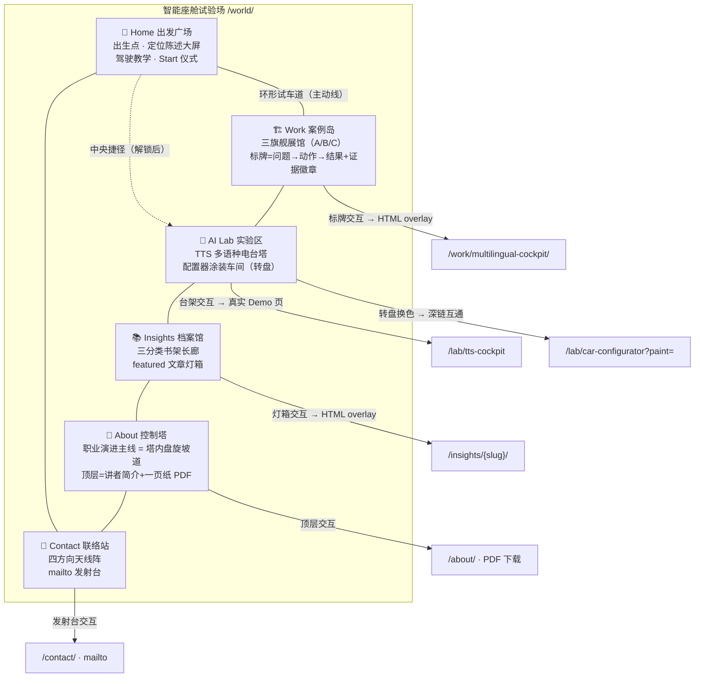
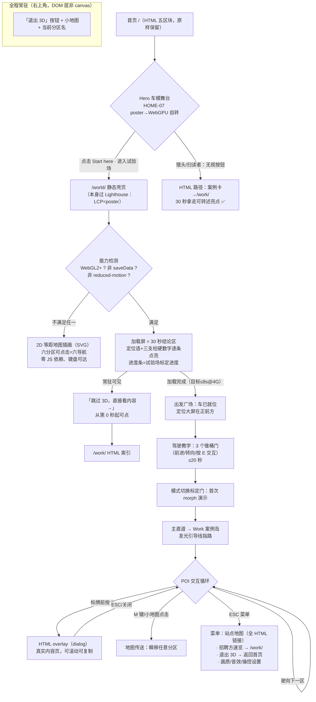

# Bruno Simon 模式拆解与本土化适配方案

**「智能座舱试验场」：3D 可驾驶世界 × 个人专业信用系统的整合设计**

| 项 | 内容 |
|----|------|
| 文档性质 | 概念设计 + 与现有 PRD/SRD 的整合建议（决策输入，非施工图） |
| 版本 | v1.0.1（2026-08-24：按 `docs/spec/audit-report-v1.1.md` §9 P0-2/P0-5 更正 §5 Spike 资产门禁口径、扩容 §10.3 M1 修订范围） |
| 日期 | 2026-08-24 |
| 上游输入 | `docs/spec/PRD.md` v1.0、`docs/spec/SRD.md` v1.0、`docs/website-plan/master-plan.md` v1.0 |
| 外部调研 | bruno-simon.com（folio-2025）、Awwwards 案例研究、HN 讨论串（2025-12 上线后）、Codrops 3D 作品集实践文 |
| 决策状态 | 待评审——本文第 9 章给出推荐路线；采纳前须先按第 10 章完成 PRD/SRD 修订 |

---

## 0. 摘要（先读这 8 行）

1. 用户愿景：首页打开是一辆 3D 炫技车、能变成机器人；点「Start here」后机器人/车在地图上漫游浏览作品集——即 Bruno Simon 模式。
2. 现实约束：PRD 附录 B 明确把 bruno-simon.com 列为**反面教材**（「加载与信息可达性」），且全站有 Lighthouse 4×≥95、首屏 <200KB、无开屏动画、10 秒定位测试等硬门禁。
3. 本文结论：**不做 Full Bruno Clone，做 Hybrid**——HTML 首页与内页原样保留（信用系统的可达性底座），3D 世界作为独立路由 `/world/` 的「旗舰 Lab 展项」，由首页 Hero 车模上的「Start here」显式进入。
4. 主题本土化：世界不是 Bruno 的游乐场，而是**「智能座舱试验场（Proving Ground）」**——汽车行业的试验场本来就是「用可验证的测试证明能力」的地方，与「个人专业信用系统」定位同构。
5. 车 ↔ 机器人 morph 不是炫技噱头，而是产品叙事：**车 = 交付载体（量产能力），机器人 = 座舱 AI 人格化（AI 能力）**，变形发生在「巡航 ↔ 驻点交互」的模式切换点上，本身隐喻端云分层。
6. 内容永远不进 3D：世界里只有「橱窗」（标牌 + 证据等级徽章），深度内容一律 HTML overlay / 真实 URL，两键直达；招聘方 30 秒路径完全不经过 3D。
7. 三阶段推进：Phase A Spike（隐藏路由验证操控与预算）→ Phase B 最小可玩世界（Start here + 3 POI + 两个现有 Demo 接入）→ Phase C 完整版（morph、音效、全内容映射）。每阶段有独立止损点。
8. 采纳本方案需修订 PRD 5 处、SRD 6 处、master-plan 1 处，清单见第 10 章——按 SRD 效力约定「先修文档再动工」。

---

## 1. 愿景对齐：Bruno 模式 vs 「个人专业信用系统」的张力与调和

### 1.1 先承认张力：现有 spec 与 Bruno 模式是三处正面冲突

| # | 现有 spec 条款 | Bruno 模式的做法 | 冲突烈度 |
|---|--------------|----------------|---------|
| T1 | PRD 附录 B：bruno-simon.com 被评为「❌ 10 秒定位（被 3D 绑架）」「反面教材：加载与信息可达性」；PRD §11 Out of Scope 禁止「开屏动画」「与岗位无关的通用炫技」 | 首页即 3D 世界，全部信息藏在需要驾驶探索的场景里；HN 实测批评「首载近 1 分钟」「terrible as a homepage」 | **高** |
| T2 | SRD C-2/C-3：Lighthouse 四项 ≥95（移动端）+ 首页首屏 <200KB gzip；NFR-P3 LCP 元素禁止是 canvas | Bruno 世界的 JS + 资产量级在数 MB 到数十 MB；canvas 即页面主体 | **高** |
| T3 | master-plan 第 3 章「无轮播、无大图 banner；首屏文字 3 秒内可读完」+ 第 6 章「动效仅 hover 与渐入」；10 秒定位测试 ≥80% 是首页验收门禁 | 世界里没有「首屏文案」概念；猎头 Persona（30–90 秒停留、手机端）在 Bruno 模式下几乎必然流失 | **高** |

同时也要承认三处**深度同构**——这是「调和」而非「否决」的依据：

| # | 同构点 | 说明 |
|---|--------|------|
| S1 | **技术栈同源** | Bruno folio-2025 用的正是 three.js TSL（WebGPU 优先、WebGL 2 回退）——与本站配置器已验证的 `three/webgpu` 管线**完全同一条技术路线**。SRD 第 6 章的 3D 选型决策不需要任何变更即可承载世界。 |
| S2 | **「炫的正是卖的」在本站成立** | 社区对 Bruno 的辩护是「他卖 three.js 课程，网站即产品」。王磊卖的是「汽车智能座舱 × AI 解决方案」——**一辆能变成 AI 机器人的车、一个座舱主题的可驾驶世界，恰好就是卖的东西本身**。这通过了 PRD §2.4 的三连问放行条件，不属于「与岗位无关的通用炫技」。 |
| S3 | **HN 社区共识指向本方案** | 讨论串里最有价值的一条批评是：「希望 3D 用来增强信息架构与导航，而不是把简历包在小游戏里」。这正是本文第 2/4 章的设计原则：3D 世界是信息架构的**空间化表达**（六导航 = 六分区），不是内容的替代品。 |

### 1.2 调和方案：三层承诺（写进产品原则）

把冲突拆解后会发现：spec 反对的不是「3D 世界」，而是「3D 世界**作为唯一入口**绑架信息可达性」。调和方案是把 Bruno 模式从「网站形态」降维成「站内最大的 Lab 展项」：

**承诺一：HTML 是宪法，3D 是公民。**
首页五区块、Work/Insights/About/Contact 的 HTML 形态原样保留，继续承担 10 秒定位、猎头 30 秒路径、SEO、无障碍的全部职责。3D 世界不承载任何「只在世界里才能获取」的信息——世界里能看到的每一条内容，HTML 路径两跳内必达。删除整个世界，信用系统零损失（对应 SRD AP-3 解耦原则）。

**承诺二：进入世界永远是显式选择（opt-in）。**
没有自动进入、没有开屏接管。入口是首页 Hero 车模旁的「Start here · 进入试验场」按钮（以及 Lab 索引的世界卡片）。点击前，首页不为世界加载任何一个字节；点击后跳转到独立路由 `/world/`，加载屏本身就是 30 秒结论区（见第 3 章）。这使 C-2/C-3 门禁与 Bruno 级体验在物理上互不干扰。

**承诺三：世界必须自证信用，而不只是好玩。**
Bruno 的世界证明「我会 WebGL」；本站的世界必须多证明一层——**每个 POI 都挂在证据链上**（PRD §7.3 的主张—证据配对规则延伸到空间维度）：案例岛的标牌带证据等级徽章、Lab 实验区是两个真 Demo 的空间化入口、控制塔里是可复制的讲者简介。世界的工程复盘本身成为一篇旗舰级 ai-lab 文章 +（潜在的）对外传播资产——Bruno 2019 版靠作品集本身病毒式传播启动了职业生涯，这个「网站即案例」的杠杆效应是本方案对北极星指标（月度高质量 inbound）的直接贡献假设。

### 1.3 对「用户愿景」的一处诚实修正

用户愿景是「**首页打开 = 3D 炫技的车**」。本方案保留了这句话的体验实质、修正了它的技术字面义：

- 首页打开确实看到 3D 炫技的车——这就是 PRD 已有的 HOME-07 Hero 实车舞台（P1，poster → WebGPU 车模慢速自转），本方案让这辆车**同时成为世界入口的「同一辆车」**（资产与车漆状态互通，见第 6 章）；
- 但「打开即全屏 3D 世界接管」不做——那是 T1/T2/T3 三处冲突的根源，也是 Bruno 自己被批评最狠的点。**车在首页是名片，进了试验场才是玩具。**

---

## 2. 世界地图概念设计：「智能座舱试验场」

### 2.1 主题定调

Bruno 的世界是「游乐场」（playground），本土化后的世界是「**试验场**」（Proving Ground）——汽车行业里，试验场是新车用一圈圈可测量的测试**证明自己能力**的地方。这个隐喻与「个人专业信用系统」严丝合缝：访客驾车绕场一周 = 完成一次对王磊专业能力的「场地试驾」。

视觉基调延续 master-plan 第 6 章「技术编辑部 × 工业设计」：低多边形 + 单一强调色（工业橙）点缀、路面标线与测试场地涂装（网格、锥桶、标定板）、夜间模式 = 试验场夜测（与全站日/夜主题联动）。**不做** Bruno 式的卡通奇幻风——风格必须像「一座真的座舱研发试验场」。

### 2.2 分区总览（mermaid）



### 2.3 俯视布局（ASCII）

```text
                              N（夜测灯塔 / 远景山脉低模天际线）
        ┌────────────────────────────────────────────────────────────┐
        │            📚 Insights 档案馆          🗼 About 控制塔        │
        │            （书架长廊+灯箱）           （盘旋坡道，可驾车上塔）  │
        │                 ║                          ║                │
        │   ╔═════════════╩══════════════════════════╩════════════╗   │
        │   ║                 环 形 试 车 道（外圈）                 ║   │
        │   ║   🔬 AI Lab 实验区                                   ║   │
        │   ║   ┌─────────────┐      ┌──────────────┐             ║   │
        │   ║   │ TTS 电台塔   │      │  🏁 Home     │   📡 Contact ║   │
        │   ║   │ 16语种波形环 │      │  出发广场     │   联络站     ║   │
        │   ║   └─────────────┘      │  (出生点)     │  (天线阵)    ║   │
        │   ║   ┌─────────────┐      │  定位大屏 ▣   │      ║       ║   │
        │   ║   │ 涂装车间     │      │  教学锥桶区   │══════╝       ║   │
        │   ║   │ (换色转盘)   │      └──────┬───────┘             ║   │
        │   ║   └─────────────┘             │ 主直道               ║   │
        │   ║                               ▼                     ║   │
        │   ║        🏗️ Work 案例岛（减速带=强制慢速看标牌）          ║   │
        │   ║   ┌─────────┐   ┌─────────┐   ┌─────────┐           ║   │
        │   ║   │ 旗舰 A   │   │ 旗舰 B  │   │ 旗舰 C   │           ║   │
        │   ║   │ 多语种   │   │ 端云    │   │ AI流程   │           ║   │
        │   ║   │ 座舱馆   │   │ 分层馆  │   │ 工作坊   │           ║   │
        │   ║   └─────────┘   └─────────┘   └─────────┘           ║   │
        │   ╚══════════════════════════════════════════════════════╝   │
        │     （场外：碰撞可推的锥桶/轮胎墙 = Bruno 式 bump 乐趣配额区）    │
        └────────────────────────────────────────────────────────────┘
   设计规则：出生点→旗舰A馆 ≤ 15 秒车程；任意两区 ≤ 30 秒；全图一屏小地图可达
```

布局意图：

- **Home 出发广场居中**：出生即看到定位大屏（H1 + 三支柱硬数字的 3D 化），保证「进世界的第一屏」依然完成定位陈述——10 秒定位原则在 3D 里的等价实现；
- **Work 案例岛在主直道尽头**：教学结束后的自然去向就是证据主阵地，与 HTML 首页「Hero → 案例卡」的信任递进同构；
- **环形试车道**是唯一主动线：不会迷路（Bruno 被批评「导航低效」的对策），逆时针一圈 = 六导航全部路过一遍；
- **碰撞玩具集中在场外缓冲区**：Bruno 式物理乐趣保留但圈养，不干扰主动线的信息获取。

### 2.4 载具形态：车 ↔ 机器人 morph 的产品叙事

这是本方案最重要的本土化设计。morph 不是「因为酷」，每次变形都有明确的**模式语义**：

| 维度 | 🚗 车形态 | 🤖 机器人形态 |
|------|----------|--------------|
| 使用场景 | 区与区之间的巡航移动（环形道、主直道） | 进入 POI 后的驻点交互（展馆内、标牌前） |
| 操控 | WASD/方向键/触摸摇杆，带漂移手感与物理碰撞 | 慢速步行 + 朝向展项自动吸附，E/点击触发交互 |
| 产品隐喻 | **交付载体**：量产、工程、把东西真正做出来的能力（支柱一的「量产落地」气质） | **座舱 AI 人格化**：讲解、检索、对话式呈现内容的能力（支柱二/三的「AI 原生」气质） |
| 叙事台词（HUD 字幕） | 「巡航模式：目的地 → 案例岛」 | 「助理模式：为你讲解本展项」 |

**何时变**（触发规则，全自动、不给用户加操作负担）：

1. 驶入任一 POI 的「停车坪」并停稳（速度 < 阈值持续 0.5s）→ 自动变形为机器人，走向最近展项；
2. 机器人离开 POI 边界（或用户按住前进超过 2s）→ 变形回车，恢复巡航；
3. 首次变形安排在教学区结尾（出发广场边缘的「模式切换标定门」），让用户在受控场景第一次看到 morph——这是整个世界的「wow 时刻」，也是分享传播的截图点。

**为何变**（对外讲得出口的一句话）：
> 「车是能力的载体，AI 是能力的灵魂——同一套底盘，两种形态，就像同一套能力在车端与云端之间的分层调度。」

morph 因此成为**旗舰案例 B（端云大模型分层）的空间化隐喻**，满足 PRD §7.3「炫的正是卖的」+「主张—证据配对」两条规则。

**动画语义**（实现分级，诚实评估工作量）：

| 级别 | 做法 | 成本 | 阶段 |
|------|------|------|------|
| V1「遮蔽式变形」 | 0.9–1.2s：车急停 → 强调色光效/粒子爆发遮蔽 → 模型热交换 → 机器人落地摆姿势；相机同步推近 15% | 低（两套独立模型 + 特效遮蔽，无需拓扑对应） | Phase C 首发 |
| V2「预烘焙变形」 | Blender 里做真正的部件级变形动画（车门→手臂、引擎盖→胸甲），烘焙为 glTF 动画轨道播放 | 高（需要自建拓扑严格对应的车+机器人套装，见第 8 章） | Phase C 后续迭代，按数据决定是否投入 |

不做实时程序化变形（骨骼 IK 求解）——工作量与收益完全不成比例，Bruno 也从不做这种事：他的口诀是「预烘焙一切能预烘焙的」。

---

## 3. Start here 流程设计

### 3.1 完整 User Flow



### 3.2 关键流程决策

| 决策点 | 方案 | 理由 |
|--------|------|------|
| 入口位置 | 首页 Hero 车模右下角第三 CTA「Start here · 进入试验场」，与双 CTA（看案例/联系）并列但视觉降一级 | 不挤占 PRD HOME-01 的双 CTA 主任务；车模自转本身就是按钮的「活广告」 |
| 加载屏内容 | **把强制等待变成强制阅读**：加载期间逐条点亮「王磊｜汽车智能座舱与 AI 解决方案经理」+ 三支柱量化锚点 + 「本世界的一切标牌都挂着证据等级」 | Bruno 的加载屏是纯进度条（被 HN 批评「近 1 分钟白等」）；本站把 10 秒定位测试塞进加载屏，等待时间反而成为定位陈述的保底曝光 |
| 教学时长 | ≤20 秒、3 个动作（前进/转向/交互），可跳过 | Bruno 无教学被批「不找菜单不知道怎么操作」；但教学也不能变成关卡 |
| 迷路对策 | 发光引导线（可关）+ M 键全图传送 + 右上角常驻小地图 | 直击 HN「导航低效」批评；传送=承认「探索是乐趣，不是义务」 |
| 移动端 | 不自动进入世界。`/world/` 在触屏窄屏设备默认呈现 2D 等距地图（SVG），底部提供「仍要进入 3D（实验性）」按钮 → 虚拟摇杆 + 画质降档 | 与 SRD facade 契约 `pointerFine` 规则一致；Bruno 移动端实测「stutter 明显、iOS 冻结 30s」，不重蹈覆辙 |

### 3.3 跳过出口清单（accessibility + 招聘方 30 秒路径）

**原则：任何一个出口失效都算 P0 bug。**

| # | 出口 | 位置 | 服务对象 |
|---|------|------|---------|
| 1 | 首页完全不依赖世界 | `/`（HTML 五区块不变） | 猎头 30 秒路径：Hero 文案 → 三支柱卡 → 案例卡 → PDF 下载，全程零 3D 等待 |
| 2 | 加载屏「跳过 3D，直接看内容 →」 | `/world/` 加载屏第 0 秒起常驻 | 误入者、低速网络 |
| 3 | 右上角「退出 3D」+ ESC 菜单站点地图 | 世界内全程 DOM 层常驻（非 canvas 内渲染，保证屏幕阅读器与键盘可达） | 所有人 |
| 4 | ESC 菜单「招聘方速览」 | 一键 → `/work/` HTML 索引 | 被链接直接甩进世界的猎头 |
| 5 | 每个 POI 的 overlay 就是真实 URL | overlay 内容 = canonical HTML 页面，右上角「在独立页打开」 | 想收藏/分享具体内容的人 |
| 6 | `prefers-reduced-motion` / 无 WebGL2 / saveData | 永不进入 3D，直接呈现 2D 等距地图（本身是精心设计的插画，不是残缺态——SRD AP-5「降级态必须完整成立」） | 无障碍用户、低端设备 |
| 7 | `<noscript>` | 六分区文字列表 + 六导航链接 | 零 JS 环境 |
| 8 | 世界内深链 | `/world/?poi=work-a` 直接出生在指定 POI 停车坪 | 从案例页「在试验场看这个展馆」反向进入的访客 |

---

## 4. 内容在 3D 世界中的呈现方式

### 4.1 两层呈现模型：3D 只做橱窗，HTML 承载内容

| 层 | 形态 | 信息密度 | 实现 |
|----|------|---------|------|
| L1 橱窗层（世界内） | 3D 标牌/建筑立面：标题 + 一句话（问题或论点）+ 证据等级徽章 + 「按 E 查看」提示 | 每个标牌 ≤ 20 字有效信息 | 烘焙纹理（Blender 出图）为主；动态内容（Now 时间戳、featured 文章标题）用 canvas 纹理构建期生成，**不做运行时 DOM→纹理** |
| L2 内容层（overlay） | 全屏/侧滑 HTML 面板：真实的案例页/文章页/Demo 页 | 完整内容 | `<dialog>` 元素 + `<iframe>` 加载 canonical URL（详见 4.2） |

**为什么内容坚决不进 3D**：文字在 3D 里渲染 = 放弃选中复制、放弃屏幕阅读器、放弃 SEO、放弃排版质量，四输零赢。Bruno 把社交链接做成「可撞倒的神龛」但链接本身仍是可点击 DOM——连天花板级炫技站都不敢把真实内容 canvas 化。

### 4.2 overlay 机制选型

| 方案 | 做法 | 评估 |
|------|------|------|
| A. iframe overlay（**Phase B 推荐**） | `<dialog>` 内嵌 iframe，src=canonical URL；打开时世界 `pause()`（RAF 停、音频停），关闭时 `resume()` | ✅ 零内容重复、URL 权威性天然保持、现有页面零改造；⚠️ iframe 内导航需拦截（`target=_top` 或 sandbox 策略）；样式上给 iframe 页传 `?embed=1` 参数隐藏页头页脚（BaseLayout 加一个 embed 模式 prop，改造量一个下午） |
| B. fetch + 注入 | fetch 静态 HTML，抽 `<main>` 注入 dialog | 内容零冗余但要处理样式隔离、相对路径、脚本执行，复杂度高于收益 |
| C. 真实跳转 + View Transitions | 直接导航到内容页，跨文档 VT 做 morph；返回时从 sessionStorage 恢复车辆位置与世界状态 | 最符合 MPA 架构，但**世界重载成本**（重新 init WebGPU + 资产虽有 HTTP 缓存仍需重解码，实测预计 2–4s）使「浏览多篇内容」体验碎裂 |

**结论**：轻内容（案例、文章、About/Contact）用 **A**；重 Demo（TTS、配置器）用 **C**——因为 Demo 页本身要独占 GPU（两个 WebGPU 上下文并存必炸预算），跳转前世界 `dispose()` 释放 GPU 资源，正好用 View Transitions 把「展馆立面 → Demo 页头图」做成 morph 转场。

### 4.3 View Transitions 衔接设计（对接 SRD §9.3 注册表）

| 转场 | 起点 | 终点 | 语义 |
|------|------|------|------|
| `world-entry` | 首页 Hero 车模舞台容器 | `/world/` 加载屏 poster | 「同一辆车开进试验场」——车的视觉连续性是整个叙事的锚 |
| `demo-cockpit`（已注册） | 世界内 TTS 电台塔立面截图 | `/lab/tts-cockpit` HMI 主视区 | 复用现有注册名，起点从「首页卡片」扩展为「世界建筑立面」 |
| `demo-car`（已注册） | 世界内涂装车间转盘 | `/lab/car-configurator` 舞台 | 同上；`?paint=` 状态随转场携带 |
| `case-cover-{slug}`（已注册） | overlay 模式不触发（dialog 内无导航）；「在独立页打开」时触发 | 案例详情页头图 | 与 HTML 路径共用同一注册名，保证两条路径转场一致 |

Firefox 与不支持跨文档 VT 的环境自动整页跳转，零报错（SRD 既有约定，无新增风险）。

---

## 5. 三阶段实施路线图

> 时间承诺一律不做（Bruno 全职一年才交付 folio-2025——这是最重要的工期校准锚点）；用「验收门禁 + 止损点」控制推进。三阶段全部排在 SRD Phase 2（Lab 子系统化）完成之后，因为世界复用 Lab 的 facade/manifest/mount() 全套基建。

### Phase A：Spike——单场景车 + 简单移动（验证可行性，可丢弃）

| 项 | 内容 |
|----|------|
| 交付物 | 隐藏路由 `/world-spike/`（noindex、不进导航）：一块平地 + 环形道贴图 + CarConcept 车模 + 键盘/触摸驾驶 + 3 个碰撞锥桶 |
| 技术验证点 | ① 操控手感（阻尼、漂移、相机跟随）；② 物理选型：先用手写运动学控制器（raycast 贴地 + 简单碰撞），**评估是否真需要 Rapier**（Bruno 用它是因为全场景物理玩具；本站主动线其实只需车辆运动学，wasm ~1.5MB 是大开销）；③ WebGPU/WebGL2 双后端帧率基线（桌面 60fps / 中端安卓 30fps）；④ 移动端虚拟摇杆可用性 |
| 预算门禁 | 懒加载 JS ≤ 400KB gzip（three 已有 256KB 基线 + 控制逻辑）；**Spike 新增资产（`public/world/`）≤ 1MB**；CarConcept 3.5MB 直接复用并显式豁免（记录在案，不计入门禁）——Draco 重压缩/减面 LOD（目标 ≤ 2MB）推迟至 Phase B（v1.0.1 审计 P0-2 裁决，与鸟瞰图 §7.2 Step 6 自洽） |
| 止损点 | 中端安卓（4x throttle 基准机）持续帧率 < 24fps 且无优化空间 → 世界方案降级为「保守方案」（第 9 章），Spike 代码归档为 ai-lab 实验记录（失败入档也是信用资产，PRD §7.3 规则 5） |

### Phase B：最小可玩世界（Start here + 3 POI + 现有 Demo 接入）

| 项 | 内容 |
|----|------|
| 交付物 | ① `/world/` 正式路由：出发广场 + 主直道 + Work 案例岛（仅旗舰 A 展馆 + B/C 标牌）+ AI Lab 实验区（TTS 电台塔 + 涂装车间）；② Start here 全流程（3.1 节 flow 的 A→M 段）；③ 跳过出口 1–8 全套；④ 2D 等距地图降级版；⑤ iframe overlay 机制 + BaseLayout embed 模式；⑥ 埋点：`world-enter`、`world-skip`、`world-poi:{slug}`、`world-exit-to:{path}` |
| 明确不做 | morph（车形态跑全程）、音效、Insights/About/Contact 分区（标牌指路 + 出口链接代替）、昼夜循环 |
| 验收门禁 | `/world/` 静态壳页 Lighthouse 四项 ≥95（canvas 点击后才挂载，LCP=poster）；加载→可驾驶 ≤8s（Fast 4G）；跳过出口逐条人工走查；首页四项 ≥95 回归（入口按钮零字节增量验证）；30 秒定位保底：加载屏文案完整播完一轮 |
| 数据阀门 | 上线 30 天看三个数：Start here 点击率（预期 8–15%）、世界→内容页转化率（目标 ≥25%）、进入后 30 秒内退出率（警戒 >50%）。转化率不达标 → Phase C 冻结，先修世界的信息动线 |

### Phase C：完整 Bruno 级（morph、音效、全内容映射）

| 项 | 内容 |
|----|------|
| 交付物 | ① 车 ↔ 机器人 morph（V1 遮蔽式，2.4 节）+ 机器人驻点交互动画（招手/指引/讲解姿势）；② 音效体系：引擎音随速度、morph 音、POI 环境音（TTS 电台塔播真实语种问候——复用现有 mp3 资产，单次 ≤60KB）、全局静音开关默认记忆；③ Insights 档案馆 + About 控制塔 + Contact 联络站建成，全内容映射完成；④ 昼夜模式与全站主题联动（夜间=试验场夜测，灯光烘焙两套）；⑤ 彩蛋配额 ≤3 处（如场外「保密测试区」围栏——脱敏红线的自嘲式彩蛋：撞门弹回并显示「此区域内容未通过发布检查表」）；⑥ 世界工程复盘长文（ai-lab 旗舰级，含全部失败记录） |
| 技术升级项（按数据择优） | V2 预烘焙变形动画；TSL 自定义车漆 shader（与 SRD Phase 4 既有构想合并）；世界内实时换色与配置器深链双向同步 |
| 验收门禁 | Phase B 全指标回归；音效全部可关且 reduced-motion 下默认关；morph 在 WebGL2 回退路径下同样可播（TSL 双后端）；循环动画配额重新核算（世界内动画不计入首页 ≤2 处配额，但需在 SRD 登记世界内配额 ≤5 处同屏） |

---

## 6. 与现有 Demo 的整合：从「内页」升格为「地图上的建筑」

### 6.1 TTS 座舱 Demo → 「多语种电台塔」

| 整合层 | 设计 |
|--------|------|
| 建筑形态 | 试验场通信塔：塔身缠绕 16 语种环形铭牌（含 RTL 两种的镜像排版彩蛋），塔顶波形全息投影（复用 Demo 的频谱视觉语言，烘焙为循环动画纹理） |
| 走近触发 | 进入电台塔半径 → HUD 字幕逐词点亮一句随机语种问候（**直接复用现有 `timeline.json` 词级时间戳 + mp3**，单文件 ≤60KB 流式拉取，与 Demo 同一资产管线零新增） |
| 深度交互 | 机器人形态按 E → View Transitions 跳转 `/lab/tts-cockpit`（4.2 节 C 方案）；塔下停车坪立牌写明「本展项证明旗舰案例 A 的多语种交付主张」（证据链声明，PRD §7.3 规则 1） |
| 反向入口 | `/lab/tts-cockpit` 页脚增加「在试验场看这座电台塔 → `/world/?poi=lab-tts`」 |

### 6.2 3D 配置器 → 「涂装车间」（整合度最高的一环）

关键洞察：**玩家开的车就是配置器里的车（同一个 CarConcept 资产）**。这使整合不是「摆一个入口」，而是玩法级融合：

| 整合层 | 设计 |
|--------|------|
| 建筑形态 | 喷漆房 + 展示转盘：车驶上转盘 → 相机环绕 → 侧墙色板亮起（8 车漆 × 2 轮毂 × 3 涂装，数据源直接 import 现有 `presets.ts`——SRD AP-8 单一事实源的空间化延伸） |
| 世界内换色 | 在转盘上直接点色板换玩家车漆（材质参数热更，复用配置器已有换色逻辑）；换完开走，**整个世界里你都开着这个配色** |
| 深链互通 | 世界车漆状态 ↔ `?paint=` 参数双向同步：从世界带着「crimson」离开 → 首页 Hero 车模也是 crimson（HOME-07 已有 `?paint=` 深链设计，本方案让三处共享同一状态）；「在完整配置器中打开 →」携带当前配色跳转 |
| 架构落点 | 扩展 SRD §12.5 的模式枚举：`mode: 'full' | 'viewer' | 'world'`——world 模式 = viewer 的能力 + 材质热更接口暴露给世界控制器；仍是「同一套渲染资产的第三种展示模式，无第二套代码」 |

### 6.3 未来 Lab 的空间化预留

Lab 路线图的 8 项构想（PRD §7.2）在实验区预留「在建工地」地块：围挡 + 塔吊 + 工程铭牌写构想名与状态徽章（Concept 态在世界里的合规呈现——不生成空页，围挡本身就是「roadmap 的空间化」，比 HTML 列表更有叙事感）。每上线一个新 Lab，工地变建筑——**世界的生长性直接可视化「活的网站」信号**（对应 Now 模块的产品意图）。

---

## 7. 性能与 Lighthouse 策略：全 3D 野心 vs ≥95 门禁的平衡

### 7.1 总原则：门禁按路由分层，世界不豁免、但按自己的靶子考核

| 路由层 | 门禁 | 说明 |
|--------|------|------|
| 首页 + 全部内容页 | C-2/C-3 原样（四项 ≥95、首屏 <200KB） | Start here 按钮 = 一个 `<a>` + 一段 CSS，零 JS 增量；世界的任何资产不得出现在这些页面的关键路径（CI 审计脚本加断言） |
| `/world/` 静态壳 | 四项 ≥95 **同样适用** | 壳页 = poster + 加载屏文案 + 「进入」按钮 + noscript 出口；canvas、three chunk、世界资产全部在用户点击后才开始加载——LCP 永远是 poster（NFR-P3 延伸） |
| 世界运行态 | 不适用 Lighthouse，改用**运行时预算**：首包可玩 ≤8s@Fast 4G；桌面 60fps / 中端移动 30fps；JS ≤900KB gzip；资产首包 ≤5MB、分区流式追加合计 ≤12MB | Lighthouse 本来就不度量交互式应用的运行质量；用错靶子会导致两头都做不好 |

### 7.2 渐进加载设计（对齐 Bruno 的实践 + 修正他的缺陷）

1. **分区流式**：世界按 6 分区拆 GLB（出发广场+主直道为首包，其余分区按小地图方位预取——玩家朝哪开、预取哪个区），首包只含「出生 15 秒内会看到的东西」；
2. **资产纪律**：全部 Draco + KTX2（管线已有）；建筑走低多边形 + 烘焙光照贴图（Bruno 同款策略：他 2019 版全场景模型 gzip 后 <2MB，证明低模美术方向下这个量级完全可达）；HDRI 复用现有 `studio_small_08_1k.hdr` 或换更小的天空渐变程序化生成（TSL 写，零资产）；
3. **shader 预热**：进世界后利用加载屏最后一拍把全部材质离屏预编译（Codrops 案例verified 的实践：懒编译是「进新区卡一下」的元凶；低端设备跳过预热防止上下文丢失）；
4. **帧预算自适应**：连续 2s 帧率低于阈值 → 自动降档（DPR 降、阴影关、装饰实例减半）并 toast 告知，手动画质档常驻 ESC 菜单（Bruno 有 Quality 开关但藏得深，被 HN 点名）；
5. **离屏即停**：`visibilitychange` 与 overlay 打开时 `pause()`（RAF 停、音频停）——直击 HN「CPU 常年 100%」的批评，也是 SRD LabInstance 契约的既有要求。

### 7.3 传统 HTML 降级路径（三层，全部是「完整成立的页面」）

```text
WebGPU 世界（完整体验）
  ↓ 无 WebGPU（three 自动回退，特效降档）
WebGL 2 世界（同一世界，粒子/阴影降档）
  ↓ 无 WebGL2 / reduced-motion / saveData / 触屏窄屏默认
2D 等距地图（SVG 插画：六分区可点、键盘可达、有 hover 微动效）
  ↓ 无 JS
六分区文字列表 + 六导航链接（noscript）
```

2D 等距地图值得强调：它不是安慰奖，而是**独立设计的资产**（Blender 渲一张等距视图 → 描线成 SVG → 分区热区）。低端设备用户得到的是一张精心绘制的「试验场导览图」，信息获取效率甚至高于 3D——这是对 SRD AP-5「降级态必须完整成立」的最好践行，也顺手成为 og-image 与对外分享图的素材。

---

## 8. 资产需求清单

### 8.1 需要 Blender 建的（按阶段）

| # | 资产 | 阶段 | 规格建议 | 工作量评估 |
|---|------|------|---------|-----------|
| 1 | 地形 + 环形试车道 + 主直道 | A/B | 单网格低模 + 路面标线烘焙纹理；碰撞用简化 primitive（Bruno 命名约定模式：`colBox_*` 自动转物理体） | 低 |
| 2 | 出发广场：定位大屏、教学锥桶、标定门 | B | 大屏文字烘焙纹理（构建期由脚本重新生成，文案改动不进 Blender） | 低 |
| 3 | Work 三展馆 + 标牌系统 | B | 每馆 ≤3k 三角面；标牌纹理构建期从 frontmatter 生成（`problem/action/result` + 证据徽章——**内容单源不漂移**，对应 PRD HOME-04 同款规则） | 中 |
| 4 | TTS 电台塔 + 涂装车间（转盘、色板墙） | B | 塔身语种铭牌纹理由 `tts-manifest.json` 构建期生成 | 中 |
| 5 | Insights 档案馆、About 控制塔、Contact 联络站 | C | 控制塔盘旋坡道需可驾驶（碰撞网格认真做） | 中-高 |
| 6 | 机器人模型（若自建） | C | 见 8.3；与车拓扑对应仅 V2 变形需要 | 高（V2 才做） |
| 7 | 装饰件：锥桶/轮胎墙/围挡/塔吊/夜测灯组 | B/C | 全部 instancing（单资产多实例） | 低 |
| 8 | 2D 等距地图 SVG | B | 从 Blender 等距渲染描线 | 低 |

### 8.2 Khronos CarConcept 复用评估：**能复用，且应该复用**

| 维度 | 评估 |
|------|------|
| 授权 | CC BY 4.0（Khronos + Darmstadt Graphics Group），页脚署名即可，已在配置器合规使用中 |
| 技术 | 已有 Draco+KTX2 管线产物（3.5MB）；世界内建议出一版减面副本（目标 ≤1.5MB：烘掉内饰细节、Occlusion 贴图降分辨率）——同一源文件两档 LOD |
| 叙事 | 「配置器的车 = 世界里你开的车 = 首页 Hero 的车」三位一体（6.2 节），CarConcept 是这条叙事线的物理载体 |
| 风格冲突（诚实标注） | CarConcept 是写实 PBR，世界建筑是低模风格化——存在美术风格张力。对策：Phase A/B 接受张力（车是「hero asset」，允许精度高一档，赛车游戏惯例）；Phase C 若启动 V2 变形，则 Blender 自建「风格化概念车 + 机器人」套装一并解决风格统一与变形拓扑（对应 3d-car-configurator.md §3.2 既定的「A 起步，C 收尾」策略——世界成为触发 C 路线的理由） |

### 8.3 机器人模型来源建议

| 优先级 | 来源 | 授权 | 评估 |
|--------|------|------|------|
| Phase C V1 首选 | **three.js 官方 RobotExpressive**（Tomás Laulhé 制作、Don McCurdy 改制） | CC0 | 自带 Idle/Walking/Running/Wave/ThumbsUp 等十余段骨骼动画，开箱即用覆盖「驻点交互」全部需求；低模风格与世界统一；体积约 1MB 量级 |
| 备选 | Quaternius 动画机器人系列 / Poly Pizza CC0 筛选 | CC0 | 风格选择面更大，动画完备度需逐个验证 |
| 谨慎 | Sketchfab（Downloadable + CC0/CC-BY 筛选） | 逐项确认 | 注意 CC-BY 署名义务与「可再分发」条款（网页可直接下载 GLB，等同再分发） |
| Phase C V2 | Blender 自建「与车同源设计语言」的机器人 | 原创 | 仅当 V2 预烘焙变形立项时投入；设计原则：机器人部件可辨认地来自车（轮毂=肩关节、大灯=眼睛），变形叙事才成立 |
| 明确不用 | 任何真实车企机器人形象（如量产人形机器人外观） | — | 与「无品牌关联」合规红线冲突（NFR-S5），也触发「组合定位」风险 |

### 8.4 其他资产

| 资产 | 方案 |
|------|------|
| 音效 | 引擎/morph/UI 音优先 CC0 库（freesound CC0 筛选、Kenney Audio）；语种问候直接复用 `public/demo/tts/`（零新增）；音频库选型 Howler.js（Bruno 同款，~7KB gzip）或原生 WebAudio 手写（SRD AP-6 平台原生优先——世界场景音需求简单，**建议先手写**，超 150 行再引库） |
| 字体（世界内 HUD） | 复用现有 Inter/JetBrains Mono 子集，禁止新增字体（R2 风险既有结论） |
| 天空/环境 | TSL 程序化渐变天空 + 昼夜插值（零资产成本，且是 TSL 技能展示点） |

---

## 9. 决策表：三条路线对比与推荐

| 维度 | A. Full Bruno Clone（首页即世界） | **B. Hybrid（推荐）**（HTML 首页/内页 + `/world/` 独立世界） | C. 保守方案（HOME-07 Hero 车 + 2D 等距地图页，无可驾驶世界） |
|------|----------------------------------|--------------------------------------------------|--------------------------------------------------|
| 与 PRD/SRD 兼容性 | ❌ 与 T1/T2/T3 三处硬约束正面冲突，需推翻 C-2/C-3 与 10 秒定位门禁——等于重写产品 | ✅ 零冲突落地（首页门禁不动），仅需第 10 章的**增量**修订 | ✅ 完全在现有 spec 内（HOME-07/08 已覆盖） |
| Persona 覆盖 | 猎头（P2）与手机端决策方（P1）大概率流失——Bruno 被批「terrible as a homepage」的直接复现；同行（P3）惊艳 | 四 Persona 各取所需：P2 走 HTML 30 秒路径零损失；P1 手机端不受影响；P3 获得「验货级」深度展项；P4 获得传播素材 | 无人流失但也无人惊艳；「效仿 Bruno」的愿景基本落空 |
| 「炫的正是卖的」成立度 | 成立但**过量**：炫技绑架了信用系统的其他三个作用（定位/影响力/转化） | 成立且**受控**：世界是证据链上最大的 L2 展项，每个 POI 挂着主张 | 部分成立：Hero 车是名片级炫技，无叙事纵深 |
| 性能风险 | 高：首页 LCP/TTI 必然击穿门禁，全站 SEO 与转化连坐 | 低：门禁分层（7.1 节），世界失败只影响 `/world/` 一条路由 | 极低 |
| 工作量与工期风险 | 极高：Bruno 全职一年 + 十余年 three.js 积累；单人兼职复刻是**未定义行为** | 高但分段可控：三阶段各有止损点，Phase A 失败可全身而退归档为实验记录 | 低 |
| 维护成本 | 极高（内容每次更新都要动 3D 世界） | 中（标牌纹理构建期自动生成，内容更新零手工 3D 操作——8.1 节 #3 的单源设计就是为此） | 低 |
| 对北极星指标的假设贡献 | 传播爆点大，但 inbound 质量存疑（来的是围观者不是决策方） | 传播爆点 + HTML 承接转化：世界引流、内容转化、Demo 背书三层漏斗完整 | 无增量传播假设 |
| 判定 | **否决**——用 PRD 自己的语言：这是「过度炫技」风险表（PRD §13 风险 2）的满分命中 | **推荐**——是唯一同时满足「用户愿景的体验实质」与「spec 全部硬约束」的路线 | **保底**——作为 Phase A 止损后的着陆点保留 |

**推荐理由收束成一句话**：Bruno 模式在本站的正确打开方式，不是把网站改造成他的样子，而是把他的世界收编为本站证据链上最大的一件展项——**Bruno 卖 WebGL 所以网站即课程广告；王磊卖「把复杂技术变成可决策方案」的判断力，所以这个世界必须既炫技又展示克制的判断力，而「Hybrid + 全套跳过出口 + 门禁分层」本身就是这种判断力的最佳展品。**（这段话建议原样写进世界的工程复盘文章开头。）

---

## 10. 对 PRD / SRD / master-plan 的修订建议清单

> 按 SRD 效力约定「先修文档再动工」，以下修订须在 Phase A 动工前完成合并。标注 ★ 的是阻塞项，其余可与 Phase A 并行。

### 10.1 PRD 修订（5 处）

| # | 章节 | 建议修订 | 阻塞 |
|---|------|---------|------|
| P1 | §6.4 功能需求 LAB 表 | 新增 **LAB-16「智能座舱试验场（World）」**：P2 / V2+，状态 Concept；验收标准引用本文第 5 章三阶段门禁；明确「首页与内容页零字节增量」为不变量 | ★ |
| P2 | §7.2 Lab 路线图 | 追加第 9 项构想「试验场 World」，按四条遴选原则逐条论证（挂钩三支柱交叉/纯静态可托管/数据零敏感/对 P3、P4 有独立价值）；排期注明「Phase 2 完成后启动 Spike，数据阀门见适配方案 §5」 | ★ |
| P3 | §11 Out of Scope | 「与岗位无关的通用炫技」条目保持，但补充一行注记：「座舱主题 3D 世界（LAB-16）属领域强相关白名单，以独立路由 + 全套跳过出口为放行前提」；同时新增不做项：「世界内多人在线/全局状态（Bruno 的 server 侧玩法）——静态托管无后端，且与信用系统定位无关」 | ★ |
| P4 | 附录 B 竞品对比表 | 更新 bruno-simon.com 行：补充 folio-2025 技术事实（TSL/WebGPU 与本站同栈、Rapier、源码 MIT、全职一年工期），评语从单纯反面教材改为「形态参考 + 反面教训并存：抄空间化信息架构与预烘焙纪律，不抄『3D 绑架首页』」 | — |
| P5 | §10 KPI | 世界上线后在指标 4（Demo 参与度）下增设子指标：Start here 点击率 / 世界→内容转化率 ≥25% / 30 秒退出率 <50%，并写明「转化不达标冻结 Phase C」的阀门规则 | — |

### 10.2 SRD 修订（6 处）

| # | 章节 | 建议修订 | 阻塞 |
|---|------|---------|------|
| S1 | §2.5 硬约束 C-2/C-3 | 增补适用范围说明：「C-2/C-3 按路由考核；`/world/` 静态壳页同样受 C-2 约束，世界运行态适用独立运行时预算（见新增 §12.7）」 | ★ |
| S2 | §8.2 budgetClass | L 级从「默认拒绝」改为「默认拒绝，唯一在册例外：world 模块（JS ≤900KB gzip / 资产首包 ≤5MB / 流式合计 ≤12MB），任何超出需重新评审」；kind 枚举增加 `'world'` | ★ |
| S3 | §12.5 模式枚举 | `mode: 'full' | 'viewer'` 扩展为 `'full' | 'viewer' | 'world'`；world 模式契约 = viewer 能力 + 材质热更接口（供涂装车间换色）+ 位置/状态序列化接口（供深链与返回恢复） | ★ |
| S4 | §9.3 View Transitions 注册表 | 新增 `world-entry`（首页 Hero 舞台 → `/world/` poster）；`demo-car`/`demo-cockpit` 的起点定义扩展为「首页卡片 或 世界建筑立面」 | — |
| S5 | §12.6 配额总账 | `public/` 总量上限 25MB → 40MB（世界资产预留 12MB + 余量）；新增「世界内同屏循环动画 ≤5 处」配额行（与首页 ≤2 处配额分账） | — |
| S6 | §13 演进路线图 + §14.1 风险表 | Phase 4 增强池加入 World Phase A Spike（前置条件：Phase 2 Lab 子系统化完成）；风险表新增 R8「世界工期黑洞」：单人兼职 vs Bruno 全职一年的量级差，缓解 = 三阶段止损点 + Spike 可丢弃 + 每阶段独立可上线 | ★ |

### 10.3 master-plan 修订（v1.0.1 扩容为一揽子，审计 P0-5）

| # | 章节 | 建议修订 |
|---|------|---------|
| M1（v1.0.1 扩容） | 第 6 章动效行 + §2.3 + §4.1 + §8.1 + §2.2 + 第 12 章 | 原建议仅覆盖第 6 章豁免；按 `docs/spec/audit-report-v1.1.md` §8/§9 P0-5 扩容为 **master-plan 一揽子修订**（即鸟瞰图 B0）：① 第 6 章动效豁免两条（首页 Hero 实时渲染层 + 循环动画 ≤2 处配额；`/world/` 沉浸展项改按 SRD §12.7.2 运行时预算考核）；② §2.3 URL 结构补 `/lab/{slug}` `/world/` `/en/` 三页与 `/404`；③ §4.1 确立 12 模块 canonical 并吸收 PRD 增量（审计 P0-1）；④ §8.1 英文范围对齐 PRD ABT-06/WORK-10；⑤ §2.2 Work 更新频率改「每季度」；⑥ 第 12 章增加与 PRD §10 的指标映射。**已于 master-plan v1.1 落笔，待王磊终审批准即视为 B0 合并** |

### 10.4 修订之外的一条流程建议

世界的每个 Phase 合并前，除既有 CI 门禁外增加一项人工走查：**用 Persona 2（猎头）的剧本从首页走一遍 30 秒路径**——只要这条路径的体验相对无世界版本有任何劣化（多一次点击、慢 100ms、多一个视觉干扰），即视为门禁失败。这是「HTML 是宪法」承诺的执行机制。

---

## 附：调研来源

- bruno-simon.com（folio-2025 本体，Credits 页披露技术栈：three.js TSL、Rapier、Howler.js、源码 github.com/brunosimon/folio-2025 MIT 含 Blender 源文件）
- Awwwards「Bruno's Portfolio Case Study」（2025 版：全职一年工期、Blender 命名约定自动物理体、TSL 双后端、不做多人共享世界的三条理由）
- Awwwards Site of the Month 访谈（2019 版：低模 + primitive 物理分离、Draco 压缩后全场景模型 <2MB、Cannon.js 睡眠陷阱）
- Hacker News 讨论串（2025-12，folio-2025 上线后）：首载慢/CPU 100%/iOS 冻结 30s 等批评；「希望 3D 增强信息架构而非包装简历」共识；「卖 three.js 课程所以网站即产品」辩护
- Codrops「Sketching the Impossible」（2026-06）：shader 懒编译卡顿与预热方案、低端设备跳过预热、「已经流畅就别过度优化」教训
- 仓库内：`docs/research/3d-car-configurator.md`（CarConcept CC BY 4.0 选型结论、Blender 自建升级路径）、`public/models/car-concept/`（3.5MB 实测）、`src/data/tts-manifest.json` 资产管线

*本文为决策输入文档。若第 9 章推荐路线被采纳，先按第 10 章完成 PRD/SRD/master-plan 修订，再启动 Phase A Spike；若被否决，本文归档为 research 记录，HOME-07/08 路线不受影响。*
