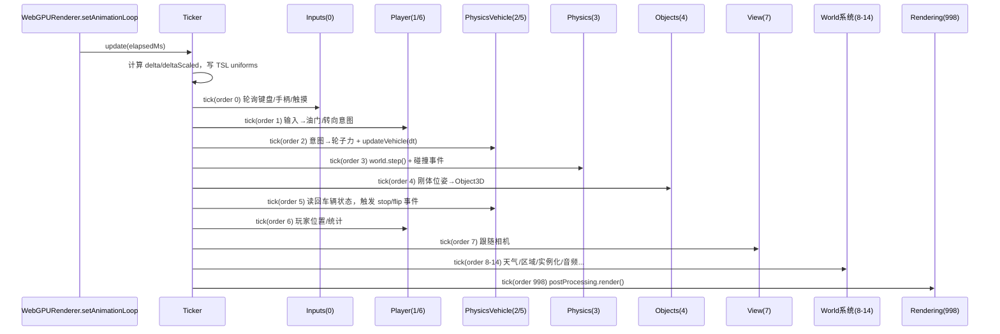
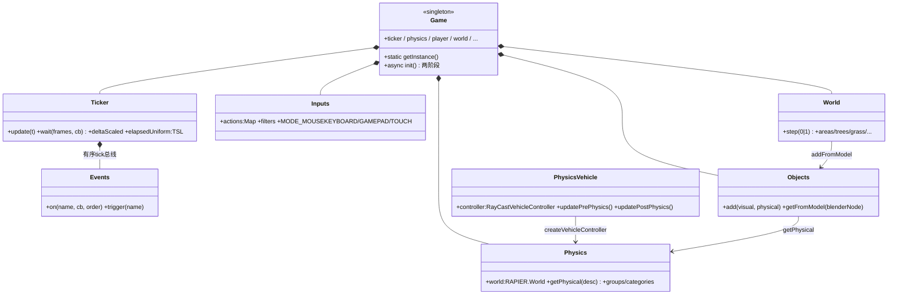

# bruno-simon.com 技术架构全维度 Teardown

> 调研对象：
> - [brunosimon/folio-2025](https://github.com/brunosimon/folio-2025)（2025 版，WebGPU + TSL + Rapier，MIT 许可，含 Blender 源文件）
> - [brunosimon/folio-2019](https://github.com/brunosimon/folio-2019)（2019 经典版，Three.js WebGL + Cannon.js）
>
> 调研方法：`git clone --depth 1` 到 `/tmp/folio-2025`（commit `41046b5`，2026-04）与 `/tmp/folio-2019`（commit `540f135`），逐文件阅读源码；结合官方 README、bruno-simon.com 站内说明与社区重建教程交叉验证。
> 文中所有 `sources/...`、`src/...` 路径均为对应仓库内真实路径，可直接打开对照。
>
> 本文目标：工程师可直接按此文做 spike，无需再读一遍原仓库。

---

## 1. 技术栈总表

| 维度 | folio-2025 | folio-2019 | 备注 |
|---|---|---|---|
| 构建工具 | Vite 7.2.4（`vite.config.js`，root 指向 `sources/`） | Vite 5.2（原为 webpack，后迁移） | 2025 版额外用 `vite-plugin-wasm` + `vite-plugin-top-level-await`（Rapier wasm）、`vite-plugin-node-polyfills`、`vite-plugin-restart`（static 变更重启） |
| Three.js | **0.183.2**，全程 `import * as THREE from 'three/webgpu'` + `three/tsl` | 0.164.1，经典 WebGL + `vite-plugin-glsl` 加载 `.glsl` 文件 | 2025 版没有一行手写 GLSL/WGSL，全部 TSL 节点 |
| 渲染器 | `THREE.WebGPURenderer`（`forceWebGL: false`，自动回退 WebGL2 后端） | `THREE.WebGLRenderer` | 见第 4 节 |
| 物理引擎 | `@dimforge/rapier3d` 0.17.3（Rust→wasm，动态 import） | `cannon` 0.6.2（纯 JS，已停更） | 2025 版用 Rapier 内置 `DynamicRayCastVehicleController` |
| 后处理 | `THREE.RenderPipeline` + TSL 节点（BloomNode、自研 cheapDOF） | `EffectComposer` + 自写 Blur/Glows ShaderPass | |
| 动画/补间 | GSAP 3.12 | GSAP 3.12 | 两代一致 |
| 音频 | Howler 2.2.4（自研 `Audio.js` 封装：分组、位置衰减、antiSpam） | Howler 2.2.4 | |
| 压缩管线 | `@gltf-transform/cli`（Draco + ETC1S 嵌入纹理）+ `toktx`（KTX-Software，ETC1S/UASTC）+ `sharp`（UI→WebP），入口 `scripts/compress.js`（`npm run compress`） | 仅 Draco（模型预压缩，无脚本化管线） | 见第 7 节 |
| 调试面板 | Tweakpane 4 + `stats-gl` + three.js Inspector（`#inspector` hash 开启） | dat.GUI（`#debug` hash） | |
| 相机 | `camera-controls` 3.1.2（debug 自由视角）+ 自研跟随相机 `View.js` | 自研 `Camera.js` | |
| 服务端 | 可选 WebSocket（`msgpack-lite` 编码 + `uuid` 会话），**服务端代码未开源**，前端在 `VITE_SERVER_URL` 为空时完全降级 | 无 | 见第 12 节 |
| 部署 | `vite build` → 纯静态 `dist/`，`base: './'` 相对路径 | 同为纯静态 | 官方站点自托管；静态部分完全可放任意静态托管 |
| 许可 | MIT（`license.md`，连 `resources/models/bruno-sudo.blend` Blender 源文件都开源） | MIT | 服务端代码除外（作者明确说明出于安全原因不开源，"the portfolio works without it"） |

本仓库（`/workspace`）现状：Astro 7 + TypeScript + three 0.185（`three/webgpu`），部署 GitHub Pages，详见第 10 节。

---

## 2. folio-2025 仓库目录树解读

```
folio-2025/
├── vite.config.js          # root=sources/, publicDir=../static/, base='./'
├── scripts/compress.js     # 资源压缩管线（第 7 节）
├── resources/              # 【不参与构建】创作源文件，约 150MB
│   ├── models/bruno-sudo.blend   # 整个世界的 Blender 源文件（MIT！）
│   ├── renders/ 、textures/      # 设计过程稿
│   └── sounds/*.band             # GarageBand 音乐工程
├── static/                 # 运行时资产，约 197MB（其中 sounds/ 152MB）
│   ├── draco/gltf/         # Draco 解码器（WASM）
│   ├── basis/              # KTX2/Basis transcoder（WASM）
│   ├── palette.png|ktx     # 全场景共享调色板纹理（第 4 节核心）
│   ├── <每类物体一个目录>/  # xxx.glb + xxx-compressed.glb 成对出现
│   └── sounds/             # 音效 + 音乐（音乐为 43-45MB 的 .wav）
└── sources/                # 全部代码
    ├── index.html / index.js     # 入口：new Game()；VITE_GAME_PUBLIC 控制是否挂 window.game
    ├── style/ (Stylus)           # HTML overlay UI 样式
    ├── data/                     # 静态数据（console 彩蛋等）
    └── Game/                     # ★ 引擎本体，~60 个系统类
        ├── Game.js               # 单例根对象，两阶段异步 init（第 3 节）
        ├── Ticker.js / Time.js / Events.js   # 游戏循环 + 有序事件总线
        ├── Rendering.js / PreRenderer.js / Passes/   # 渲染与后处理
        ├── Materials.js / Materials/         # TSL 材质工厂（MeshDefaultMaterial 等）
        ├── Physics/              # Physics.js（Rapier 封装）、PhysicsVehicle.js（raycast vehicle）、PhysicsWireframe.js（调试线框）
        ├── Inputs/               # Inputs.js + Keyboard/Gamepad/Pointer/Wheel/Nipple/InteractiveButtons
        ├── Player.js             # 玩家意图层：输入→油门/转向/悬挂 + 声音 + 复活
        ├── View.js / Viewport.js # 跟随相机（default/free 双模式）+ 视口
        ├── Objects.js            # 视觉+物理对象工厂（Blender 命名约定解析，第 5 节）
        ├── InstancedGroup.js     # InstancedMesh 封装（第 8 节）
        ├── ResourcesLoader.js    # GLTF/DRACO/KTX2 加载器 + 缓存 + 进度
        ├── Terrain.js / Zones.js / Respawns.js / Map.js   # 地形数据、触发区、重生点、小地图
        ├── Ligthing.js / Fog.js / Water.js / Wind.js / Weather.js / Cycles/   # 光照/雾/水/风/天气/昼夜与四季循环
        ├── Audio.js / Tracks.js / Trails.js / Explosions.js / Tornado.js      # 音频与各种 gameplay 特效
        ├── Server.js / Whispers.js / Achievements.js / Notifications.js       # 在线功能（可选）+ 成就 + 通知
        ├── Quality.js / Debug.js / Monitoring.js          # 画质分级 / Tweakpane / 性能监控
        ├── Menu.js / Modals.js / Overlay.js / Reveal.js / Title.js / Options.js  # HTML UI 与开场
        └── World/                # 场景内容层
            ├── World.js          # 两步构建（step 0: Grid+Intro；step 1: 全部内容）
            ├── VisualVehicle.js  # 车辆视觉（轮子、转向灯、天线、氮气尾迹）
            ├── Floor/Grass/Trees/Foliage/Snow/RainLines/WaterSurface/... # 环境元素（大量 TSL + 实例化）
            ├── Benches/Bricks/Fences/Lanterns/ExplosiveCrates.js  # 可交互物理道具（InstancedGroup + 物理）
            └── Areas/            # 16 个内容区：Landing/Projects/Career/Bowling/Circuit/Lab/TimeMachine/...
```

关键设计：**代码（`sources/Game`）与内容（`static/` + Blender）严格分离**；每个系统一个类文件，职责单一；所有跨系统访问都通过 `Game.getInstance()` 中心枢纽，没有 import 环。

---

## 3. Game Loop 架构

### 3.1 单例 Game class

`sources/Game/Game.js`：

```js
export class Game {
    static getInstance() { return Game.instance }
    constructor() {
        if(Game.instance) return Game.instance   // 构造函数即单例守卫
        Game.instance = this
        this.init()
    }
    async init() { /* 两阶段异步初始化 */ }
}
```

每个系统的构造函数第一行都是 `this.game = Game.getInstance()`，之后通过 `this.game.physics`、`this.game.ticker` 等访问兄弟系统。**依赖顺序 = `init()` 中的实例化顺序**，共两个阶段：

- **阶段一（intro 前）**：`Debug → ResourcesLoader → Quality → Server → Ticker → Time → DayCycles/YearCycles → Inputs → Audio → Notifications → RayCursor → Viewport → Modals → Menu → Rendering（await renderer.init()）`，然后加载首批 4 个资源（含 `palette` 调色板纹理），再 `Options → Respawns → View → 后处理 → rendering.start() → Reveal → ... → World（step 0，只有 Grid + Intro）`。
- **阶段二（并行）**：`import('@dimforge/rapier3d')`（wasm 动态加载）与其余 ~30 个 GLB/KTX 资源**并行 Promise.all**，加载进度驱动 intro 进度条；完成后 `Terrain → Physics → PhysicsWireframe → PhysicsVehicle → Zones → Player → ... → world.step(1)`（构建全部世界内容），最后条件执行 `PreRenderer.render()` 预热管线。

### 3.2 有序事件总线（system 注册模式）

`sources/Game/Events.js` 是一个**带 order 参数的事件发射器**——这是整个架构的灵魂：

```js
events.on('tick', callback, order = 1)   // callbacks[name][order].push(callback)
events.trigger('tick')                   // 按 order 升序遍历（for...in 数字键有序）
```

每个系统在构造时向 `game.ticker.events` 注册 `tick` 回调并声明自己的 order。**没有中心化的 update 列表，顺序完全由各系统自我声明**，README 中人肉维护了一份顺序文档。

### 3.3 Ticker 与帧驱动

`sources/Game/Ticker.js` + `sources/Game/Rendering.js`：

- 帧驱动源：`renderer.setAnimationLoop(t => game.ticker.update(t))`（`Rendering.js` 第 68 行）——由渲染器驱动 ticker，而非独立 rAF，保证 WebGPU 下时序正确。
- `delta` 用 `maxDelta = 1/30` 截断（防切后台回来的物理爆炸）；`scale = 2` 得到 `deltaScaled`（**整个游戏世界以 2 倍速运行**，物理 timestep、车辆力、音频缓动全用 deltaScaled——这是"小车开起来很爽"的隐藏参数）。
- 维护 `lastDeltas` 最近 30 帧滑动平均 `deltaAverage`（供车辆控制器平滑 dt 用）。
- 把 `elapsed/delta/elapsedScaled/deltaScaled` 同步进 **TSL uniform**（`elapsedUniform` 等），所有 shader 节点共享同一份时间，每帧只写 4 个 uniform。
- `wait(frames, cb)`：按帧数延迟回调（如第 3 帧才开始 reveal 动画，等 shader 编译完）。

### 3.4 实测的完整 tick 顺序表

从源码逐文件提取（order → 系统 → 依赖）：

| order | 系统（文件） | 职责 |
|---|---|---|
| 0 | `Time.js`、`Inputs/Inputs.js` | 时间与输入设备轮询（gamepad 必须每帧 poll） |
| 1 | `Player.js` pre-physics、`World/Scenery.js` | 输入 → 油门/转向/悬挂意图 |
| 2 | `Physics/PhysicsVehicle.js` pre-physics | 意图 → 轮子力/刹车/转向 + `controller.updateVehicle(dt)` |
| 3 | `Physics/Physics.js` | `world.step(eventQueue)` + 碰撞力事件分发 |
| 4 | `PhysicsWireframe.js`、`Objects.js` | 调试线框；物理体 → 视觉体位姿同步 |
| 5 | `PhysicsVehicle.js` post-physics | 读回底盘位姿、速度、轮子接触状态，触发 stop/stuck/upsideDown/flip 事件 |
| 6 | `Player.js` post-physics | 玩家位置更新、里程/空翻统计 |
| 7 | `View.js` | 跟随相机（依赖最新玩家位置） |
| 8 | `Intro`、`Cycles`（昼夜/四季）、`Weather`、`Zones.js`（触发区检测）、`World/VisualVehicle.js`（视觉车跟随物理车） | |
| 9 | `Wind`、`Ligthing`、`Tornado`、`InteractivePoints`、`Tracks` | 依赖天气/相机/车辆的二级系统 |
| 10 | `Fog`、`Reveal`、`Terrain`、`Trails` 及 `World/` 下几乎全部环境元素（Grass/Leaves/Snow/RainLines/WaterSurface/Foliage/Floor/Benches/Bricks/Fences/Lanterns/ExplosiveCrates/Whispers/Areas/...） | 内容层统一 order |
| 13 | `InstancedGroup.js` | 收集所有脏矩阵，统一写 instanceMatrix |
| 14 | `Audio`、`Notifications`、`Map`、`Title` | 表现层收尾 |
| 998 | `Rendering.js` | `postProcessing.render()` |
| 999 | `Monitoring.js` | 性能统计（当前被注释停用） |

### 3.5 Mermaid 图

一帧的序列：



核心类关系：



**可复用的模式总结**：单例 Game + 构造顺序即依赖顺序 + 带 order 的事件总线。代价是所有系统强耦合到 Game god-object（可测试性差），收益是零依赖注入样板代码、时序问题可以用一张表推理。对个人项目规模非常合理。

---

## 4. 渲染管线

### 4.1 WebGPURenderer 与 WebGL 回退

`sources/Game/Rendering.js`：

- `new THREE.WebGPURenderer({ forceWebGL: false, antialias: pixelRatio < 2 })` → `await renderer.init()`。**回退是 three.js 内建行为**：浏览器无 WebGPU 时同一 renderer 自动使用 WebGL2 backend，业务代码零分支（唯一一处判断是 `renderer.backend.isWebGPUBackend` 决定是否跑 PreRenderer 预热）。
- `sortObjects = false` + `setOpaqueSort/setTransparentSort` 均改为纯 `renderOrder` 比较——**放弃每帧按深度排序**，绘制顺序在建模/代码期定死，省 CPU 且避免排序抖动。
- 后处理用新的 `THREE.RenderPipeline`（TSL 时代的 postprocessing）：`scenePass → bloom(BloomNode) + cheapDOF（自研 Passes/cheapDOF.js）`；画质等级 1（移动端）时去掉 DOF、bloom mips 从 5 降到 2，通过替换 `postProcessing.outputNode` 热切换。
- `#inspector` hash 挂 three.js 官方 Inspector；`#stats` 挂 drawCalls/triangles 统计。

### 4.2 TSL 材质：`MeshDefaultMaterial`

`sources/Game/Materials/MeshDefaultMaterial.js`，全场景 90% 网格共用的风格化材质，继承 `MeshLambertNodeMaterial`：

- **阴影捕捉技巧**：`receivedShadowNode = Fn(([shadow]) => { catchedShadow.mulAssign(shadow.r); return float(1) })`——把 three.js 默认阴影从光照管线里"偷"出来存变量，然后在自定义 `outputNode` 里作为风格化的色块阴影（`mix(color, baseColor*shadowColor, max(coreShadow, dropShadow))`）重新合成。卡通渲染下控制阴影颜色的标准解法。
- **coreShadow（明暗交界）**：`normal · lightDir` 过 `smoothstep` 得到硬边缘双色调。
- **light bounce**：读取 `game.terrain.terrainNode(positionWorld.xz)` 的地表颜色，对朝下的面做距离衰减混色——伪 GI，让物体底部染上地面色。
- **水面变白 / 雾 / reveal 圆环揭示**：均为可开关的节点段（`hasWater/hasFog/hasReveal` 构造参数），reveal 用 `distanceToCenter.greaterThan(distance).discard()` 做开场的圆形擦除。
- 所有全局参数（光方向/颜色、雾、水面高度、reveal 半径）都是 **TSL uniform，各系统每帧直接写 value**，材质零重编译。

### 4.3 Palette texture + 合并网格优化

这是 folio 系资产管线的招牌手法：

1. Blender 里所有"纯色"物体共用**一张调色板纹理**（`static/palette.png`，小尺寸色块图），给面分配 UV 到对应色块；导出时**mute 掉材质里的纹理节点**（README「Blender > Export」），GLB 里只留 UV。
2. 运行时 `Materials.js#createPalette()` 创建唯一的 palette 材质（`colorNode: texture(paletteTexture).rgb`，`NearestFilter` 防串色），`Materials.updateObject()` 遍历模型按**材质名**去重替换（`getFromName`）。
3. 因为同一 palette 材质覆盖成百上千个物体，Blender 中可以放心把静态场景**join 成极少数大 mesh**（`static/scenery/scenery.glb` 一个文件装下整个装饰层）——单材质 + 合并几何 = 个位数 draw call 渲染整个岛。

非纯色物体（地形渐变、发光体、网格地板）各自有专用 TSL 材质（`createEmissiveGradient`、`MeshGridMaterial` 等），同样按名字注册进 `Materials.list` 复用。

---

## 5. 物理系统（Rapier）

### 5.1 集成方式

`sources/Game/Physics/Physics.js`：

- `import('@dimforge/rapier3d')` **动态加载**（wasm ~1.5MB 不阻塞首屏），与资源加载并行（`Game.js` 第 129-181 行）。需要 `vite-plugin-wasm` + `vite-plugin-top-level-await`。
- `RAPIER.World({ y: -9.81 })`，`world.timestep = ticker.deltaScaled` **每帧可变步长**（非定步长+插值；配合 maxDelta 截断，简单但够用）。
- **碰撞分组**：3 个 bit 组 `all / object / bumper`，组合成 `floor / object / bumper` 三种 category（`membership << 16 | filter` 的 Rapier 惯用编码）。bumper 是车头的一个只推物体、不参与地面接触的"推土铲"碰撞体——小车能撞飞道具但不被绊住的关键。
- **描述式刚体工厂 `getPhysical(desc)`**：JSON 风格描述 → RigidBody + 多 Collider（支持 cuboid/ball/cylinder/trimesh/hull/heightfield），统一默认值（density 0.1、friction 0.2、restitution 0.15）。
- **碰撞音效事件**：`setActiveEvents(CONTACT_FORCE_EVENTS)` + `contactThreshold`（默认 15），`eventQueue.drainContactForceEvents` 里按 `maxForceMagnitude/(m1+m2)` 归一化力度回调 `onCollision(force, position)` → 播撞击声。
- `PhysicsWireframe.js`：用 `world.debugRender()` 顶点缓冲画调试线框（order 4）。

### 5.2 Raycast vehicle 实现要点

`sources/Game/Physics/PhysicsVehicle.js`——直接使用 Rapier 内置 `world.createVehicleController(chassisBody)`（`DynamicRayCastVehicleController`，与 2019 年 Cannon.js 的 `RaycastVehicle` 同族算法：轮子是射线，不是刚体）：

- **底盘 = 3 个 cuboid collider**（第 96-98 行）：主体（mass 2.5，`centerOfMass: {y: -0.5}` **手动压低质心**——防翻车的第一要素）、车顶（mass 0，纯碰撞）、bumper（category bumper 的推铲）。`canSleep: false`。
- **4 轮参数**（第 140-152 行，全部对应 Rapier controller 的 setter）：radius 0.4、`frictionSlip 0.9`、`sideFrictionStiffness 3`（横向抓地，漂移手感的核心旋钮）、`suspensionCompression 10 / suspensionRelaxation 2.7`、悬挂行程上限 2。
- **可玩悬挂**：三档 rest length（0.88/1.23/1.63）+ 三档 stiffness（20/30/40），玩家可用小键盘单独控制每个轮子（跳跃、翘头、侧倾都靠它），每帧写 `setWheelSuspensionRestLength/Stiffness`。
- **驱动模型**（`updatePrePhysics`，order 2）：
  - `engineForce = accelerating * (1 + boosting*2) * 300 / (1 + overflowSpeed) * deltaScaled`——超过 topSpeed（5，boost 时 40）后力自然衰减，不做硬限速；
  - 松油门给 `idleBrake 0.06`，反向输入先给 `reverseBrake 0.4` 刹停再倒车（还原真车手感的经典分支）；
  - 前两轮 `setWheelSteering(±0.5)`；
  - `controller.updateVehicle(dt)`，dt 取 `min(1/60, deltaAverage)`（移动端固定 1/60）——**车辆控制器用平滑 dt，与世界 step 分离**，避免帧尖峰打乱悬挂。
- **状态检测器**（`updatePostPhysics`，order 5，全部事件化）：`stop/start`（速度阈值滞回）、`upsideDown`（up 向量点积）、`stuck`（3 秒窗口位移 < 0.5m）、`flip`（腾空期间累计 Z 轴转角 > 5rad 判定空翻，接地时触发成就）。
- **翻车自救 `flip.jump()`**：向上冲量 + 按当前姿态（侧翻/四脚朝天）计算的扭矩冲量，把车"弹正"。
- 冰面动态摩擦：轮子接触体是冰面刚体时按 `iceRatio` 插值 `frictionSlip → 0.04`。

### 5.3 碰撞体与关卡设计：Blender 命名约定

`sources/Game/Objects.js#getFromModel`（第 114-219 行）——**关卡即数据**的关键：

- 空物体/网格命名含 `physical` → 生成刚体；再含 `dynamic` / `kinematicPositionBased` 决定类型（默认 fixed）。
- 其子节点按名字前缀生成 collider：`trimesh*`（顶点+索引）、`hull*`（凸包）、`cuboid*`（scale 即半尺寸）、`tube*`（圆柱）、`ball*`（球）——**用 Blender 空盒子的 scale 直接当碰撞体参数**，美术摆完即关卡完成。
- Blender Custom Properties 透传：`restitution / friction / category` 从 glTF `userData` 读取。
- 视觉与物理分文件：如 `playgroundVisual.glb` + `playgroundPhysical.glb` 成对加载。
- 玩法触发区不走物理：`Zones.js` 维护球/圆柱形区域，order 8 对玩家位置做距离检测，进出触发 `enter/leave` 事件（性能远优于物理 sensor，语义也更简单）。

---

## 6. 输入系统

`sources/Game/Inputs/`——**设备层 → 动作层**两级抽象，三种模式（`MODE_MOUSEKEYBOARD / MODE_GAMEPAD / MODE_TOUCH`）自动切换：

- **设备层**：`Keyboard.js`（down/up + key/code 双通道）、`Gamepad.js`（每帧 poll，按钮模拟量 + 摇杆 `joystickChange`）、`Pointer.js`（鼠标/触摸统一成 pointer，带 MODE_MOUSE/MODE_TOUCH）、`Wheel.js`（normalize-wheel）、`Nipple.js`（触摸虚拟摇杆，从 pointer 派生）、`InteractiveButtons.js`（触屏上的 HTML 按钮，touch 模式才激活）。
- **动作层**：`inputs.addActions([{ name: 'forward', categories: ['wandering','racing','cinematic'], keys: ['Keyboard.ArrowUp','Keyboard.KeyW','Gamepad.up','Gamepad.r2'] }, ...])`（实际定义在 `Player.js` 第 220-239 行）。一个动作绑多个物理键，`activeKeys: Set` 保证多键按住时不误触发 end；手柄扳机给出 0-1 模拟量走 `change` 事件。
- **上下文过滤（filters）**：`inputs.filters` 是 ObservableSet，装当前允许的 categories（`intro/wandering/racing/cinematic`）。过场动画时把 filter 切到 `cinematic`，驾驶类动作自动失效——**用集合交集实现输入上下文栈**，同时把 filter/mode 同步成 `<html>` 的 CSS class（`is-mode-touch` 等），UI 提示（键盘图标 vs 手柄图标 vs 虚拟按钮）纯 CSS 切换。
- 任意设备一有输入就 `updateMode()` 抢占当前模式——不用设置页,"你用什么我显示什么"。

---

## 7. 资源管线：Blender → GLB → 压缩 → 运行时

### 7.1 创作与导出

- 全场景一个 Blender 文件 `resources/models/bruno-sudo.blend`（开源！可直接研究其分层、命名、palette UV 排布）。
- 导出规范（README「Blender」节）：mute 调色板纹理节点（纹理运行时挂）、使用导出预设、**导出时不做任何压缩**（交给管线）。

### 7.2 `npm run compress`（`scripts/compress.js`）

对 `static/` 全目录扫描，三条流水线，**始终保留原文件、生成新文件**（开发环境可用未压缩版调试）：

| 输入 | 工具与命令 | 输出 |
|---|---|---|
| `**/*.glb`（排除已压缩） | ① `gltf-transform etc1s --quality 255`（嵌入纹理→KTX2/ETC1S）② `gltf-transform draco --method edgebreaker --quantize-position 12 --quantize-normal 6 --quantize-texcoord 6`（几何压缩） | `xxx-compressed.glb` |
| `**/*.{png,jpg}`（排除 ui/favicons/social） | `toktx`（KTX-Software）；默认 `--encode etc1s --qlevel 255 srgb RGB`；**按路径正则匹配预设表**：palette/terrain 用 `uastc`（质量优先）+ genmipmap，单通道遮罩（foliageSDF、glyphs 等）用 `--target_type R --swizzle r001` | `xxx.ktx`（KTX2 容器） |
| `static/ui/**` | `sharp` → WebP q80 | `xxx.webp` |

ETC1S vs UASTC 的取舍在预设表里体现得很清楚：**大面积色块/遮罩用 ETC1S（体积小），调色板与地形数据这类容不得色带的用 UASTC（质量高、体积大 4 倍）**。

### 7.3 运行时加载

`sources/Game/Game.js` + `ResourcesLoader.js`：

- `VITE_COMPRESSED` 环境变量决定加载 `xxx.glb + .png` 还是 `xxx-compressed.glb + .ktx`——**同一套代码，开发原始版 / 生产压缩版**。
- `GLTFLoader` + `DRACOLoader`（decoder 在 `static/draco/`）+ `KTX2Loader`（transcoder 在 `static/basis/`，`detectSupport(renderer)` 按 GPU 选目标格式：桌面 BC7、安卓 ASTC/ETC2）。
- 资源声明是四元组 `[name, path, loaderType, 配置回调]`，配置回调里设 colorSpace/filter/wrap（KTX2 无法在文件里带采样器配置，必须运行时设）。
- 两批加载 + `Map` 缓存 + 进度回调驱动 intro 进度条；URL 带 `?cb=1` 做缓存版本号。

---

## 8. 性能优化清单（可直接抄的 checklist）

1. **单材质 + 合并网格**：palette 纹理让整个装饰层合并成个位数 mesh（第 4.3 节）。
2. **InstancedMesh 统一封装**（`InstancedGroup.js`）：Blender 里摆"引用空物体"（`xxxReferences.glb`），运行时对每个 visual 原型生成 InstancedMesh；**脏标记增量更新**——只有 `reference.needsUpdate` 的实例才重算矩阵，order 13 统一提交 `instanceMatrix.needsUpdate`。树/长椅/砖块/围栏/灯笼全走这条路。
3. **不排序渲染**：`sortObjects = false`，全部靠手工 `renderOrder`（第 4.1 节）。
4. **两级画质**（`Quality.js`）：UA 判断移动端 → level 1：去 DOF、bloom mips 5→2、车辆 dt 固定 1/60；`antialias` 仅在 pixelRatio < 2 时开（高 DPI 屏靠像素密度抗锯齿）。
5. **shader 预热**（`PreRenderer.js`）：初始化末尾用 32px CubeCamera 把全场景（含隐藏物体）强制渲染一遍，逼所有管线在 intro 期间编译完，避免游戏中卡顿——仅 WebGPU 后端 + 高画质执行。
6. **wasm/资源并行 + 两批加载**：Rapier 动态 import 与 30 个 GLB 并行；首批只加载 intro 所需 4 个文件。
7. **KTX2 GPU 纹理**：显存占用约为 PNG 解压后的 1/4-1/8，且无主线程解码；Draco 几何量化 12/6/6。
8. **帧预算防御**：`maxDelta 1/30` 截断 + 车辆控制器用 30 帧滑动平均 dt（第 3.3/5.2 节）。
9. **TSL uniform 共享时间**：全场景 shader 动画共用 4 个时间 uniform，每帧 CPU→GPU 上传量恒定。
10. **触发区不走物理**：`Zones.js` 纯距离检测替代 sensor collider。
11. **音频细节**：Howler 单实例复用 + `antiSpam` 冷却 + 按距离衰减（`Audio.js`），音量/rate 都用 deltaScaled 缓动而非瞬切。
12. **移动端策略**：触摸 → Nipple 虚拟摇杆 + HTML InteractiveButtons；画质 level 1；`viewport.pixelRatio` 上限控制（`Viewport.js`）。

---

## 9. 2019 vs 2025 技术对比

| 维度 | folio-2019 | folio-2025 | 演进要点 |
|---|---|---|---|
| 渲染 API | WebGLRenderer，`renderer.setPixelRatio(2)` 硬编码 | WebGPURenderer + WebGL2 自动回退 | 同一套 TSL 代码双后端 |
| Shader | 15+ 个手写 GLSL 目录（`src/shaders/matcap`、`floorShadow`…），matcap 材质为主 | 零 GLSL，全 TSL 节点材质 | shader 从"文件"变成"可组合的 JS 对象" |
| 阴影 | 全假：烘焙 blob shadow（`src/shaders/shadow`）+ 地板阴影贴图 | 真实 shadow map + TSL 阴影捕捉重新着色 | GPU 预算变宽后换真阴影但保持风格化 |
| 物理 | Cannon.js 0.6.2（JS）；`CANNON.RaycastVehicle`；**Z-up 世界**（`gravity.set(0,0,-13)`，贴合 Blender 坐标） | Rapier 0.17（wasm）；内置 raycast VehicleController；Y-up | wasm 物理约 5-10 倍吞吐；坐标系回归 three.js 惯例 |
| 架构 | `Application.js` 根类 + **构造参数注入**（`new Physics({time, sizes, controls…})`）；`Utils/EventEmitter.js` 无序事件 | `Game` 单例 + `getInstance()` 全局访问；**带 order 的事件总线** | 从"手动传依赖"到"中心枢纽 + 声明式时序"；系统数量从 ~20 涨到 ~60 后前者不可维护 |
| 更新循环 | `Time.js` 自己 rAF，各系统 `time.on('tick')` 无序 | 渲染器驱动 Ticker，50+ 个监听器按 order 0-999 分层 | 时序从"祈祷注册顺序"变成显式契约 |
| 后处理 | EffectComposer + 自写 Blur/Glows pass | RenderPipeline + BloomNode + cheapDOF（TSL） | |
| 资源 | Draco 预压缩模型，纹理原图 | Draco + KTX2（ETC1S/UASTC）+ WebP 全自动管线 | 从手工到 `npm run compress` |
| 内容组织 | `World/Sections`（intro/projects/crossroads…线性板块） | `World/Areas`（16 个独立区域类）+ Zones + Respawns + 小地图 | 世界从"一条路"变成"开放岛" |
| 在线 | 无 | 可选 WebSocket（Whispers 留言火苗、排行榜），msgpack 二进制协议 | 服务端闭源但可完全降级 |
| 系统性玩法 | 无 | 昼夜循环、四季、天气、成就、Konami 彩蛋、龙卷风事件 | 从 demo 到"活的世界" |
| 调试 | dat.GUI | Tweakpane + stats-gl + Inspector + PhysicsWireframe | |

---

## 10. 与本仓库（/workspace）的差距矩阵

本仓库现状：Astro 7 静态站 + `src/scripts/car-configurator/app.ts`（vanilla TS，three 0.185 `three/webgpu`，WebGPURenderer 自动回退、OrbitControls、GLTF+Draco+KTX2 加载、HDRI 环境、Canvas 程序化接触阴影、材质变体切换）。它是一个**静态展示型 configurator**，与 folio-2025 的**游戏世界**之间的差距：

| 能力 | /workspace 现状 | folio-2025 | 差距等级 | 补齐路径 |
|---|---|---|---|---|
| 渲染器与回退 | ✅ 同款 WebGPURenderer + 回退 | ✅ | 无 | — |
| 资源加载（Draco/KTX2） | ✅ 已有三件套 loader | ✅ + 缓存/进度/两批加载 | 小 | 抄 `ResourcesLoader.js` 模式 |
| 压缩管线 | ⚠️ 用 Khronos 官方预压缩资产，无自有管线 | ✅ `npm run compress` | 中 | 移植 `scripts/compress.js`（需装 KTX-Software 的 `toktx`） |
| 游戏循环/系统架构 | ❌ 单文件 rAF，无系统分层 | ✅ Ticker + order 总线 | **大** | 新建 Game/Ticker/Events 三件套（~200 行） |
| 物理 | ❌ 无 | ✅ Rapier + vehicle controller | **大** | `@dimforge/rapier3d` + wasm 插件；Astro 下 Vite 配置同款 |
| 输入抽象 | ❌ 仅 OrbitControls | ✅ 三模式动作层 | 大 | 抄 `Inputs/` 目录，可先只做键盘+触摸 |
| TSL 风格化材质 | ❌ 标准 PBR + HDRI | ✅ MeshDefaultMaterial 全家桶 | 中 | 非必需；风格化才需要 |
| 世界内容/关卡 | ❌ 单车模型 | ✅ Blender 命名约定关卡管线 | **大（美术为主）** | 建立自己的 blend 文件 + `Objects.getFromModel` 解析器 |
| 实例化/性能体系 | ⚠️ 场景太小用不上 | ✅ InstancedGroup + palette | 中 | 世界变大后引入 |
| 音频 | ❌ | ✅ Howler 封装 | 中 | 后置 |
| HTML overlay UI | ⚠️ Astro 组件（静态 UI） | ✅ Modals/Menu/Notifications 运行时 UI | 中 | Astro island 内做即可 |
| 部署 | ✅ GitHub Pages | 自托管静态 + 可选 WS | 无 | 见第 12 节 |

**结论**：渲染与资产加载层已对齐（同版本 three，甚至更新）；缺的是"引擎层"（loop/物理/输入）与"内容层"（Blender 世界）。引擎层可以按第 3/5/6 节直接移植，内容层是真正的工作量所在。

---

## 11. 「车变机器人 + 地图漫游」技术模块清单

若在本仓库实现"车可变形为机器人、在地图上自由漫游"的玩法，所需 subsystem（均给出 folio-2025 中可参考的实现）：

| # | 模块 | 职责 | folio-2025 参考 | 规模 |
|---|---|---|---|---|
| 1 | **Game/Ticker/Events 核心** | 单例 + 有序 tick 总线 | `Game.js`/`Ticker.js`/`Events.js` | S（~250 行，可近乎原样移植） |
| 2 | **Physics 封装** | Rapier world、描述式刚体工厂、碰撞分组 | `Physics/Physics.js` | M |
| 3 | **VehicleController（车形态）** | raycast vehicle、驱动/刹车/转向、翻车自救 | `Physics/PhysicsVehicle.js` | M（参数调优占一半时间） |
| 4 | **CharacterController（机器人形态）** | Rapier `KinematicCharacterController`：胶囊体、贴地、爬坡、台阶；跳跃 | folio 无此模块，用 Rapier 官方 API；状态读回可仿 `PhysicsVehicle.updatePostPhysics` | M |
| 5 | **TransformSystem（变形）** | 形态状态机（car ⇄ transforming ⇄ robot）：切换刚体（禁用车底盘/启用胶囊）、切换视觉、切换输入 filter、切换相机参数 | 状态机模式仿 `Player.js` 的 STATE_*；刚体启停仿 `PhysicsVehicle.activate/deactivate`；输入上下文仿 `Inputs.filters` | **M-L**（是本玩法的核心新代码） |
| 6 | **Animation/StateMachine** | 机器人走/跑/待机混合树 + 变形过渡动画（Blender 里做 action，运行时 `AnimationMixer` crossFade；变形若做"零件飞行重组"则需骨骼或分块约束动画） | folio 几乎不用骨骼动画，无现成参考；用 three.js `AnimationMixer` 标准能力 | **L**（美术+程序各半） |
| 7 | **地图/关卡管线** | Blender 命名约定 → 视觉+碰撞双 GLB；地形；重生点 | `Objects.getFromModel`、`Terrain.js`、`Respawns.js` | L（首张图）之后每张 M |
| 8 | **Trigger zones** | 进出区域触发剧情/UI/传送 | `Zones.js`（80 行，直接抄） | S |
| 9 | **NavMesh（可选）** | 仅当有 NPC 巡逻/追逐时需要；玩家漫游不需要。可用 recast-navigation-js（three.js 生态成熟） | folio 无 | M（有 NPC 才做） |
| 10 | **UI billboards / 交互点** | 世界内浮动标签、"按 E 交互"提示，随距离显隐 | `InteractivePoints.js` + `TextCanvas.js`（canvas 生成文字纹理 + billboarding TSL） | S-M |
| 11 | **View/相机 rig** | 车形态低追尾 / 机器人形态肩后视角，模式插值切换 | `View.js`（MODE_DEFAULT/FREE 的模式切换框架） | M |
| 12 | **Inputs 动作层** | 双形态动作集：`drive/*` 与 `walk/*` 两组 categories，变形时切 filter | `Inputs/` 全目录 | M |
| 13 | **Audio** | 引擎声/脚步声/变形音效 | `Audio.js` + `Player.js#setSounds` | S-M |
| 14 | **压缩与加载** | compress 脚本 + 两批加载 + 进度条 | `scripts/compress.js`、`ResourcesLoader.js` | S |

**Spike 建议顺序**：1 → 2 → 3（灰盒地面开起来）→ 4（胶囊走起来）→ 5（一个按键硬切形态，无动画）→ 11/12（手感）→ 7（第一张真地图）→ 6（变形动画，最后做，风险最高）。

---

## 12. GitHub Pages 静态托管可行性评估

**结论：folio-2025 的前端 100% 可静态托管，作者本人也确认"the portfolio works without it (server)"。**

逐项核对：

| 项 | 是否有 server 依赖 | 说明 |
|---|---|---|
| 构建产物 | ❌ 无 | `vite build` → 纯静态 `dist/`；`base: './'` 相对路径，天然兼容 GitHub Pages 项目子路径 |
| Rapier wasm | ❌ 无 | 静态 `.wasm` 文件，GitHub Pages 正确返回 `application/wasm`；`@dimforge/rapier3d` 不用 SharedArrayBuffer，**无需 COOP/COEP header**（GitHub Pages 无法自定义 header，此点关键） |
| Draco/Basis 解码器 | ❌ 无 | `static/draco/`、`static/basis/` 静态文件 |
| WebSocket 服务（`Server.js`） | ✅ 唯一依赖，**可选** | `VITE_SERVER_URL` 为空则完全不连接；降级影响：Whispers 留言火苗变本地假数据、排行榜/在线人数不可用、`is-server-offline` CSS 状态。服务端代码未开源 |
| 分析统计 | 可选 | `VITE_ANALYTICS_TAG` 为空即无 |
| 音乐/资产体积 | ⚠️ 注意 | `static/` 共 ~197MB，其中音乐 3 个 40+MB 的 `.wav`（单文件 < 100MB，不触发 Git 硬限制，但建议转 mp3/ogg 并考虑 Git LFS 或外置 CDN；GitHub Pages 站点软限制 1GB、带宽 100GB/月，个人流量可承受） |
| 路由 | ❌ 无 | 单页 + hash（`#debug`/`#stats`），无 history 路由，无需 404 fallback |

**对本仓库的启示**：在 Astro + GitHub Pages 上复刻此玩法没有平台障碍；唯二注意点是 ① wasm 与解码器文件放 `public/` 原样拷贝，② 大音频转有损格式并控制总体积。

---

## 13. 工作量估算与技能要求

以"在本仓库做出 folio-2025 式『车变机器人 + 小型地图漫游』MVP"为目标（估算单位为工程复杂度，非日历时间）：

| 工作包 | 规模 | 主要技能 | 风险 |
|---|---|---|---|
| 引擎骨架（Game/Ticker/Events/Viewport） | **S** | Three.js 中级 | 低——可直接移植 |
| Rapier 集成 + 车辆物理 + 手感调参 | **M** | 物理引擎、调参耐心 | 中——手感是玄学，folio 参数表（第 5.2 节）是很好的起点 |
| 机器人角色控制器 | **M** | Rapier KCC、相机 | 中 |
| 变形状态机（无动画的硬切版） | **S** | 架构 | 低 |
| 变形动画（骨骼/分块重组） | **L** | **Blender rigging + AnimationMixer** | **高——全链路最大风险项**；建议先接受"粒子烟雾遮挡 + 模型瞬切"的廉价方案降级为 S |
| 首张地图（建模 + palette + 命名约定碰撞体 + 导出管线） | **L** | **Blender 建模/UV/命名规范** | 高——纯美术工作量；可先用 Kenney/Quaternius CC0 资产拼灰盒降为 M |
| 输入三模式（键盘/触摸/手柄） | **M** | Web API | 低——手柄可后置，先做键盘+触摸则 S |
| TSL 风格化渲染（可选） | **M** | TSL/图形学 | 中——MVP 可用标准材质跳过 |
| 音效 | **S-M** | 音频素材筛选 | 低——freesound/自录 |
| 压缩管线 + 加载进度 | **S** | Node 脚本 | 低 |
| **合计（MVP：灰盒地图 + 硬切变形）** | **L** | Three.js + Rapier 为主，Blender 为辅 | |
| **合计（完整版：真地图 + 变形动画 + 风格化）** | **XL** | 四项全需：Blender / Three.js+TSL / 物理 / 音效 | |

技能画像：folio-2025 的护城河不在代码（架构清晰、总量适中、MIT 可抄），而在 **Bruno 一人身兼美术总监 + Blender 重度用户 + 图形工程师**。对照到本仓库：工程侧（Three.js/物理/工程化）差距可按本文档系统性补齐；**Blender 内容生产能力是决定成品质感的第一变量**，建议 spike 阶段就打开 `resources/models/bruno-sudo.blend` 研究其命名、分层与 palette UV 工作流。

---

## 附：Spike 快速起步命令

```bash
# 克隆参考仓库
git clone --depth 1 https://github.com/brunosimon/folio-2025 /tmp/folio-2025
git clone --depth 1 https://github.com/brunosimon/folio-2019 /tmp/folio-2019

# 本地跑 folio-2025（需 Node 20+）
cd /tmp/folio-2025 && cp .env.example .env && npm install --force && npm run dev
# 调试入口：URL 加 #debug（Tweakpane 全量面板）、#stats、#inspector

# 压缩管线依赖（如需复刻）：
#   gltf-transform → npm 包已含；toktx → 需安装 KTX-Software 二进制

# 首个 spike 的最小依赖（本仓库内）：
pnpm add @dimforge/rapier3d
pnpm add -D vite-plugin-wasm vite-plugin-top-level-await   # 挂进 astro.config.mjs 的 vite.plugins
```
