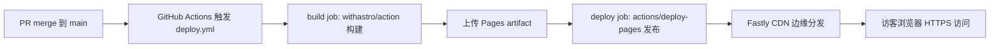
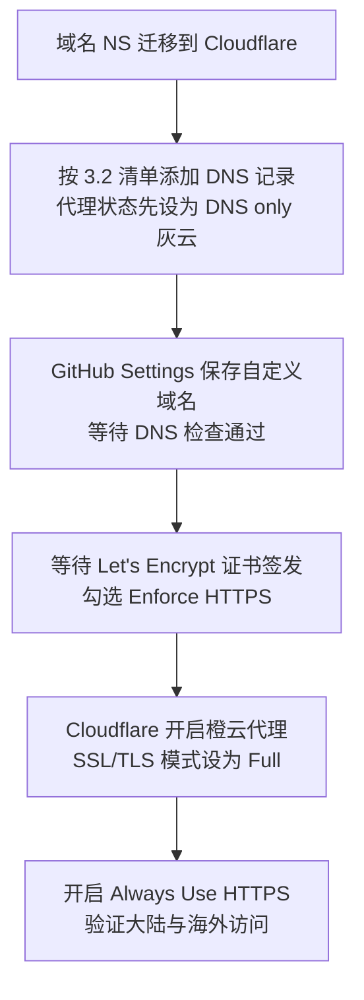
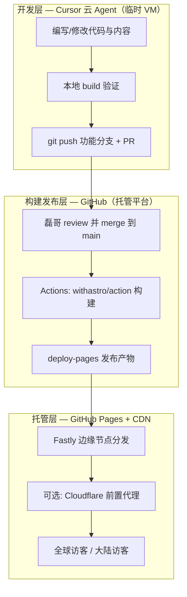

# 调研报告：GitHub Pages + 自定义域名——mywebsite 公网托管完整路径

> **文档性质**：生产部署路径调研（只调研，不改动现有配置与代码）
> **适用站点**：王磊｜汽车智能座舱与 AI 解决方案经理 · 个人专业信用系统（mywebsite）
> **技术底座**：Astro + TypeScript + MDX，纯静态构建产物（master-plan 第 7 章）
> **现状基线**：`astro.config.mjs` 已配置 `site: 'https://rayw-lab.github.io'` + `base: '/mywebsite'`；`.github/workflows/deploy.yml` 已就绪（`withastro/action@v6` + `actions/deploy-pages@v5`）
> **版本**：v0.1（待磊哥确认开放问题后执行）

---

## ⚠️ 结论先行（TL;DR）

1. **GitHub Pages 是本站首选生产路径**：纯静态产物、零托管成本、与内容仓库同源、Actions 原生集成、免费 HTTPS。
2. **仓库当前是私有仓库（`rayw-lab/mywebsite`，PRIVATE）**——这是上线前的第一个决策点：GitHub Free 计划下**私有仓库无法开启 Pages**。需要三选一：转公开仓库（推荐）/ 升级 GitHub Pro / 双仓分离（私有源码 + 公开产物仓）。详见[第 7 章](#7-成本与限制)。
3. **MVP 路径已就绪**：现有配置 merge 到 main 即可发布到 `https://rayw-lab.github.io/mywebsite/`，无需任何代码改动（前提：解决仓库可见性 + 在 Settings 里把 Pages Source 切到 GitHub Actions）。
4. **正式域名路径成本极低**：一次 DNS 配置 + 一次 `astro.config.mjs` 修改（`site` 换成正式域名、删除 `base`），旧 `github.io` 地址自动 301。
5. **中国大陆访问**：`github.io` 直连不可靠（间歇性阻断）；绑定自定义域名后前置 **Cloudflare 免费代理**即可达到"稳定可访问"，极致速度需国内 CDN + ICP 备案（不建议 MVP 阶段做）。

---

## 目录

- [1. 方案定义：静态托管 vs 云 VM 常驻](#1-方案定义静态托管-vs-云-vm-常驻)
- [2. 部署流程：merge → Actions 构建 → Pages 发布](#2-部署流程merge--actions-构建--pages-发布)
- [3. 自定义域名：DNS 记录与 HTTPS](#3-自定义域名dns-记录与-https)
- [4. Astro 配置变更：site 与 base](#4-astro-配置变更site-与-base)
- [5. 中国大陆访问](#5-中国大陆访问)
- [6. 与 Cursor 云环境的分工](#6-与-cursor-云环境的分工)
- [7. 成本与限制](#7-成本与限制)
- [8. 操作清单（磊哥执行）](#8-操作清单磊哥执行)
- [9. MVP 路径 vs 正式域名路径](#9-mvp-路径-vs-正式域名路径)
- [10. 开放问题（需磊哥确认）](#10-开放问题需磊哥确认)
- [附录：参考资料](#附录参考资料)

---

## 1. 方案定义：静态托管 vs 云 VM 常驻

### 1.1 两类托管模式的本质区别

| 维度 | 静态托管（GitHub Pages） | 云 VM 常驻（阿里云 ECS / AWS EC2 + Nginx） |
|------|------------------------|------------------------------------------|
| 服务形态 | 构建产物（HTML/CSS/JS）交给平台 CDN 分发，**没有属于你的服务器** | 一台 7×24 运行的虚拟机，自己装 Web 服务器、自己管进程 |
| 成本 | **0 元/月**（公开仓库） | 约 ¥30–100+/月（最低配 ECS），且长期持续 |
| 运维负担 | 无：系统补丁、扩容、证书续期全部平台负责 | 全部自理：安全补丁、防火墙、Nginx 配置、证书续期、磁盘监控 |
| HTTPS | 自动签发 Let's Encrypt，勾选 Enforce HTTPS 即可 | 自己配 certbot / acme.sh 定时续期 |
| 全球分发 | 内置 CDN（Fastly 边缘网络） | 单点机房，需另购 CDN |
| 安全面 | 极小（无服务端代码、无端口暴露） | SSH、系统服务、Web 服务器均是攻击面 |
| 扩展能力 | 仅静态内容（本站够用） | 可跑后端 API、数据库、SSR |
| 部署方式 | git push → 自动发布 | 需要自建发布脚本 / CI 推送产物到服务器 |

### 1.2 为什么 GitHub Pages 是本站的首选生产路径

master-plan 7.1 已锁定选型逻辑，这里补全托管侧论证：

1. **产物性质匹配**：Astro 默认输出纯静态文件、零服务端运行时。本站没有任何需要常驻进程的功能（表单可用第三方服务，搜索可用构建期索引）。为纯静态站买一台 VM 是为不存在的需求付费和担责。
2. **与内容仓库同源**：源码、内容（MDX）、部署流水线、托管全部收敛在同一个 GitHub 仓库，改一篇文章 = 一次 PR = 一次自动发布，没有"部署漂移"。
3. **零凭证运维**：`deploy.yml` 用 OIDC（`id-token: write`）直接向 Pages 发布，**不需要在任何地方保存服务器密码 / SSH 私钥 / 云厂商 AK**。这对"Cursor 云 Agent 代写代码"的协作模式尤其重要——Agent 永远接触不到生产凭证。
4. **失败模式可控**：静态站不存在"进程挂了""磁盘满了""被挖矿"这类 VM 常见故障；最坏情况是构建失败，此时线上仍是上一个成功版本。
5. **免费额度远超需求**：100GB/月软性带宽 ÷ 首页 <200KB（master-plan 7.5 性能预算）≈ 每月 50 万次页面传输量级，个人专业站远用不满。

**结论**：云 VM 只在"未来要加服务端能力（如自建 API、SSR、评论后端）"时才需要重新评估；届时更优解也通常是 Serverless / Cloudflare Workers，而非常驻 VM。

---

## 2. 部署流程：merge → Actions 构建 → Pages 发布

### 2.1 端到端流程



### 2.2 现有 `deploy.yml` 逐段解读

仓库中的 workflow 已经是官方推荐形态，无需修改即可用：

| 配置段 | 现有值 | 作用与要点 |
|--------|--------|-----------|
| `on.push.branches` | `[main]` | 只有 merge 到 main 才触发生产发布；`workflow_dispatch` 保留手动兜底 |
| `permissions` | `contents: read`, `pages: write`, `id-token: write` | 最小权限；`id-token` 用于 OIDC 免密发布，**无需配置任何 secret** |
| `concurrency.group` | `pages` | 同一时间只跑一个发布，`cancel-in-progress: false` 保证进行中的发布不被打断 |
| build job | `actions/checkout@v7` → `withastro/action@v6` | 构建并自动打包上传 Pages artifact |
| deploy job | `actions/deploy-pages@v5` + `environment: github-pages` | 从 artifact 发布；`environment.url` 会在 Actions 页面直接显示线上地址 |

### 2.3 `withastro/action@v6` 配置要点

该 action 是复合 action：检测包管理器 → 安装依赖 → `astro build` → 内部调用 `actions/upload-pages-artifact` 上传 `dist/`。可用输入：

| 输入 | 默认值 | 本站取值 | 说明 |
|------|--------|---------|------|
| `package-manager` | 自动检测（按 lockfile） | `pnpm@latest`（已显式指定） | 建议后续在 `package.json` 里加 `packageManager` 字段锁版本，构建更可复现 |
| `node-version` | `24` | 默认即可 | 与 Astro 官方支持版本对齐 |
| `path` | `.` | 默认即可 | Astro 项目在仓库根目录 |
| `build-cmd` | 自动（`astro build`） | 默认即可 | 如需自定义构建命令再改 |
| `cache` | `true` | 默认即可 | 缓存 `node_modules/.astro`（含优化后的图片），加速后续构建 |
| `out-dir` | `dist` | 默认即可 | 与 Astro 默认输出目录一致 |

**两个关键注意点**：

1. **`site` / `base` 不由 action 注入**——必须在 `astro.config.mjs` 里手工配置（现已配置正确）。这与 Next.js 生态的 `actions/configure-pages` 自动注入行为不同，容易被误解。
2. **首次启用必须手动切源**：仓库 Settings → Pages → Build and deployment → Source 选择 **GitHub Actions**（不是 "Deploy from a branch"）。不切换的话 workflow 会在 deploy job 报错 `Not Found` 或提示 Pages 未启用。

---

## 3. 自定义域名：DNS 记录与 HTTPS

### 3.1 域名策略：www 子域 vs apex 裸域

| 策略 | DNS 记录类型 | 优点 | 缺点 |
|------|-------------|------|------|
| **绑定 `www.example.com`（推荐）** | CNAME → `rayw-lab.github.io` | CNAME 跟随 GitHub 基础设施变更，无需维护 IP；故障切换与 CDN 前置更灵活 | URL 多 4 个字符 |
| 绑定 apex `example.com` | A/AAAA 固定 IP ×4 | URL 短 | apex 不能用 CNAME（DNS 规范限制）；GitHub 换 IP 时需手动更新（历史上发生过） |

**GitHub 的互跳行为**：只要 www 与 apex 的 DNS 都配置好，在 Pages 设置里绑定其中一个，GitHub 会自动把另一个 301 到绑定的那个。所以推荐：**绑定 www 为主域，apex 同时配 A 记录，两个地址都能访问且规范化到 www**。

### 3.2 DNS 记录清单（以 `example.com` 为占位）

| 记录类型 | 主机记录 | 记录值 | 用途 |
|---------|---------|--------|------|
| A | `@` | `185.199.108.153` | apex → GitHub Pages（4 条全配） |
| A | `@` | `185.199.109.153` | 同上 |
| A | `@` | `185.199.110.153` | 同上 |
| A | `@` | `185.199.111.153` | 同上 |
| AAAA | `@` | `2606:50c0:8000::153` | IPv6（可选但推荐，4 条全配） |
| AAAA | `@` | `2606:50c0:8001::153` | 同上 |
| AAAA | `@` | `2606:50c0:8002::153` | 同上 |
| AAAA | `@` | `2606:50c0:8003::153` | 同上 |
| CNAME | `www` | `rayw-lab.github.io` | www 子域（**注意：不带 `/mywebsite` 路径**） |
| TXT | `_github-pages-challenge-rayw-lab` | GitHub 生成的验证串 | 域名归属验证（防接管，见 3.4） |

### 3.3 Enforce HTTPS

- 在 Settings → Pages → Custom domain 保存域名、DNS 检查通过后，GitHub 自动向 Let's Encrypt 申请证书，通常几分钟到 1 小时（最长 24 小时）。
- 证书就绪前 **Enforce HTTPS 复选框是灰色的**，属正常现象；就绪后勾选，所有 HTTP 请求 301 到 HTTPS。
- 若域名配置了 CAA 记录，必须允许 `letsencrypt.org`，否则签发失败。
- **Actions 部署模式下不需要在仓库里提交 `CNAME` 文件**——自定义域名保存在 Pages 设置中，跨部署持久；`CNAME` 文件只对"从分支部署"的旧模式有意义（在 `public/` 里放一份也无害，属于双保险）。

### 3.4 域名归属验证（强烈建议先做）

在 **个人账号** Settings → Pages → Verified domains 添加域名，按提示在 DNS 加一条 TXT 记录（主机名形如 `_github-pages-challenge-rayw-lab`）。作用：即使未来 Pages 站点被删除或 DNS 误配，其他 GitHub 用户也无法把你的域名绑到他们的 Pages 上（防止子域接管攻击）。**建议在把 DNS 指向 GitHub 之前完成验证**。

---

## 4. Astro 配置变更：site 与 base

### 4.1 现状（MVP / 项目页模式）

```js
// astro.config.mjs 现状
export default defineConfig({
  site: 'https://rayw-lab.github.io',
  base: '/mywebsite',
  integrations: [mdx(), sitemap()],
});
```

此配置对应访问地址 `https://rayw-lab.github.io/mywebsite/`，`base` 让所有内部链接、资源路径带上 `/mywebsite` 前缀。

### 4.2 绑定自定义域名后的目标态

```js
// astro.config.mjs 目标态（以 www 主域为例）
export default defineConfig({
  site: 'https://www.example.com',
  // base 整行删除 —— 自定义域名从根路径服务
  integrations: [mdx(), sitemap()],
});
```

### 4.3 切换步骤（一次 PR 完成）

| # | 步骤 | 说明 |
|---|------|------|
| 1 | `site` 改为正式域名（含协议、不含末尾斜杠） | canonical、sitemap、RSS、OG 绝对 URL 全部依赖它 |
| 2 | **删除 `base: '/mywebsite'`** | 自定义域名下站点在根路径 `/`，保留 base 会导致所有链接 404 |
| 3 | 全仓搜索硬编码的 `/mywebsite/` | 规范写法是 `import.meta.env.BASE_URL` 或相对路径（会自动适配）；硬编码前缀的链接/图片路径必须改掉 |
| 4 | （可选）`public/CNAME` 写入 `www.example.com` | Actions 模式非必需，作为配置留档 |
| 5 | 本地 `pnpm build && pnpm preview` 验证 | 重点抽查：导航链接、文章内图片、`sitemap-index.xml`、`rss.xml` 中的 URL |
| 6 | merge 到 main，自动重新发布 | — |

### 4.4 切换时序（关键）

**Astro 配置切换必须与 GitHub Settings 里保存自定义域名在同一时间窗完成**，顺序建议：先配 DNS（生效需时）→ Settings 保存域名并等 DNS 检查通过 → 立即 merge 配置切换 PR。若只改配置不绑域名（或反之），会出现 canonical/资源路径与实际访问地址不一致的中间态。好消息是：**绑定域名后，旧的 `rayw-lab.github.io/mywebsite/` 地址会被 GitHub 自动 301 到新域名**，已被搜索引擎收录或分享出去的旧链接不会失效。

---

## 5. 中国大陆访问

### 5.1 现状评估

| 事实 | 说明 |
|------|------|
| `*.github.io` 直连不可靠 | 大陆各运营商对 github.io 存在**间歇性 DNS 污染与连接重置**，时好时坏、地区差异大，不能作为对大陆访客的可靠入口 |
| Pages 边缘网络无大陆节点 | Pages 由 Fastly CDN 分发，大陆用户即使连通也需绕行海外节点，RTT 通常 200–400ms |
| 自定义域名本身不解决问题 | 域名只是换了入口名字，流量仍指向 GitHub 基础设施；**必须配合前置代理/CDN 才有改善** |

### 5.2 分层方案对比

| 方案 | 成本 | 大陆可用性 | 大陆速度 | 前置条件 | 建议 |
|------|------|-----------|---------|---------|------|
| 0. github.io 直连 | 0 | ❌ 间歇性不可用 | 差 | 无 | 仅限 MVP 内部预览 |
| 1. **自定义域名 + Cloudflare 免费代理** | 0（域名费另计） | ✅ 稳定可达 | 中等（海外边缘节点） | 域名 NS 迁到 Cloudflare | **推荐，正式上线即做** |
| 2. 国内 CDN（腾讯/阿里）回源 GitHub | CDN 流量费 | ✅ 优 | 优 | **域名需 ICP 备案**（需国内主体 + 国内服务器实名） | 后置；备案成本高，个人站性价比低 |
| 3. 大陆镜像双部署 | 视平台 | 取决于平台 | 优 | Gitee Pages 已长期停服，国内替代品不稳定 | 不推荐 |

**Cloudflare 免费版的诚实预期**：免费/Pro 计划的大陆访客由 Cloudflare **海外节点**（美西/亚太）服务，真正的中国大陆节点（China Network，京东云合作）仅企业版可用。因此方案 1 解决的是"**从打不开变成稳定打开**"，延迟约 200–500ms，对内容型个人站完全可接受；它不是"国内秒开"，那是方案 2 + 备案的领域。

### 5.3 Cloudflare 前置的正确配置顺序



要点：**先灰云（DNS only）让 GitHub 完成域名验证和证书签发，再开橙云（Proxied）**。顺序反了常见症状是 DNS 检查失败或 404。SSL/TLS 模式用 Full（GitHub 为自定义域名签发证书后，Full (strict) 也可用，但 Full 兼容性最稳）。

---

## 6. 与 Cursor 云环境的分工

### 6.1 分工原则

**Cursor 云 Agent 负责"生产代码"，GitHub Actions 负责"生产构建"，GitHub Pages 负责"承载流量"。** 云 Agent 的 VM 是临时开发环境，随任务创建销毁，**不承载任何线上流量、不持有任何生产凭证**。



### 6.2 职责矩阵

| 职责 | Cursor 云 Agent | 磊哥 | GitHub Actions | GitHub Pages / DNS 商 |
|------|:---:|:---:|:---:|:---:|
| 写代码、写内容、建分支、push | ✅ | 可选 | — | — |
| PR review 与 merge 到 main | — | ✅（唯一守门人） | — | — |
| 构建（install → astro build） | 仅本地验证 | — | ✅ | — |
| 发布产物到线上 | ❌ 永不 | — | ✅（OIDC 免密） | — |
| 托管、HTTPS 证书、CDN 分发 | — | — | — | ✅ |
| 购买域名、配 DNS、GitHub Settings | — | ✅（一次性） | — | — |

这个分工的安全收益：merge 权限是唯一的生产闸门，Agent 的所有产出都经过人工 review 才可能触达线上；发布链路用 OIDC，不存在可泄漏的长期凭证。

---

## 7. 成本与限制

### 7.1 GitHub Pages 用量限制（官方）

| 限制项 | 数值 | 对本站的影响 |
|--------|------|-------------|
| 发布站点大小 | ≤ 1 GB | 无压力；注意 3D demo 的 glTF 模型资产要持续压缩 |
| 源仓库建议大小 | ≤ 1 GB | 大体积媒体建议走外部对象存储或 Git LFS 之外的方案 |
| 单次部署超时 | 10 分钟 | Astro 构建通常 1–3 分钟，安全 |
| 带宽 | **软限制 100 GB/月** | 首页 <200KB 预算下 ≈ 50 万次页面传输/月；超限 GitHub 会先联系而非直接关停 |
| 构建频率 | 软限制 10 次/小时 | **使用自定义 Actions workflow（本站正是）不受此限** |
| 用途限制 | 禁止商业交易、密码收集类站点 | 个人专业站完全合规 |

### 7.2 私有仓库 Pages 规则（当前最关键的限制）

**实测确认：`rayw-lab/mywebsite` 当前为 PRIVATE。** 各计划下的规则：

| GitHub 计划 | 私有仓库能否开 Pages | 站点本身可见性 |
|------------|:---:|------|
| Free（个人，当前推测） | ❌ 不能（仅公开仓库） | — |
| Pro（个人，$4/月） | ✅ 能 | **站点仍是公开的**（仓库私有 ≠ 站点私有） |
| Team（组织） | ✅ 能 | 同上，站点公开 |
| Enterprise Cloud（组织） | ✅ 能 | 唯一支持"私有发布"（访问控制）的计划 |

三条出路对比：

| 选项 | 成本 | 优点 | 缺点 |
|------|------|------|------|
| **A. 仓库转公开（推荐）** | 0 | 立即可用；公开仓库 Actions 分钟数免费不限量；源码本身就是"个人专业信用"的展品 | 源码与内容历史全公开——需先跑一遍脱敏检查（对照 `material-security-grading.md`） |
| B. 升级 GitHub Pro | $4/月 | 仓库保持私有 | 持续付费；私有仓库 Actions 分钟有配额（Pro 3000 分钟/月，本站每次构建 1–3 分钟，够用）；站点照样公开 |
| C. 双仓：私有源码 + Actions 推产物到公开仓 | 0 | 源码私有 + 托管免费 | 流水线复杂化（需 PAT/deploy key 跨仓推送，违背零凭证原则）；不推荐 |

### 7.3 总成本估算（推荐路径：选项 A + Cloudflare）

| 项目 | 一次性 | 年度 |
|------|--------|------|
| GitHub Pages 托管 | 0 | 0 |
| GitHub Actions 构建 | 0（公开仓库免费） | 0 |
| 域名注册（.com / .dev） | — | ≈ ¥70–120/年 |
| Cloudflare Free（DNS + 代理 + 证书） | 0 | 0 |
| **合计** | **0** | **≈ 一顿饭钱/年（仅域名）** |

---

## 8. 操作清单（磊哥执行）

### 阶段 0：前置决策（阻塞项）

- [ ] 决定仓库可见性方案（推荐 A：转公开；转公开前对照 `material-security-grading.md` 复查历史提交无敏感信息）
- [ ] 若选 A：仓库 Settings → General → Danger Zone → Change visibility → Public
- [ ] 决定正式域名（建议 `.com`/`.dev`，主域用 `www` 子域）

### 阶段 1：MVP 上线（`rayw-lab.github.io/mywebsite`）

- [ ] 仓库 Settings → Pages → Build and deployment → Source 选 **GitHub Actions**
- [ ] 将站点分支 merge 到 `main`（触发 `deploy.yml`）
- [ ] 在 Actions 页确认 build + deploy 两个 job 绿色通过
- [ ] 浏览器验证 `https://rayw-lab.github.io/mywebsite/`：首页、导航、文章页、图片、`sitemap-index.xml`、`rss.xml`

### 阶段 2：域名购买与 DNS（正式路径）

- [ ] 在注册商购买域名（如需 Cloudflare 前置，可直接用 Cloudflare Registrar 或购买后把 NS 迁到 Cloudflare）
- [ ] GitHub 个人 Settings → Pages → Verified domains：添加域名，按提示在 DNS 加 TXT 验证记录（`_github-pages-challenge-rayw-lab`），等待验证通过
- [ ] 按 [3.2 清单](#32-dns-记录清单以-examplecom-为占位)添加记录：4×A（apex）+ 4×AAAA（可选）+ CNAME `www` → `rayw-lab.github.io`
- [ ] 若走 Cloudflare：所有记录先保持 **DNS only（灰云）**

### 阶段 3：GitHub Settings 绑定域名

- [ ] 仓库 Settings → Pages → Custom domain 填 `www.<你的域名>`，Save
- [ ] 等待 "DNS check successful"
- [ ] 等待证书签发完成后勾选 **Enforce HTTPS**

### 阶段 4：Astro 配置切换（可由 Cursor Agent 出 PR，磊哥 merge）

- [ ] `astro.config.mjs`：`site` 改为 `https://www.<你的域名>`，**删除 `base: '/mywebsite'`**
- [ ] 全仓搜索并修复硬编码 `/mywebsite/` 路径
- [ ] merge 后验证：新域名可访问、旧 `github.io/mywebsite` 地址 301 跳转、canonical/sitemap/RSS 内 URL 为新域名

### 阶段 5：Cloudflare 前置（可选，建议正式上线即做）

- [ ] 确认阶段 3 全部完成（域名验证 + 证书 + Enforce HTTPS）
- [ ] Cloudflare DNS 记录切为 **Proxied（橙云）**
- [ ] SSL/TLS 模式设为 **Full**；开启 Always Use HTTPS
- [ ] 用大陆网络（或在线拨测工具，如 17ce/boce）验证可访问性

---

## 9. MVP 路径 vs 正式域名路径

### 9.1 两阶段路线图


### 9.2 对比与迁移成本

| 维度 | MVP：`rayw-lab.github.io/mywebsite` | 正式：`www.example.com` |
|------|-------------------------------------|------------------------|
| 前置条件 | 仓库可见性解决 + Settings 切源 | MVP 全部 + 域名 + DNS |
| 代码改动 | **零**（当前 `site`/`base` 即为此准备） | 一次 PR：改 `site`、删 `base` |
| 适用场景 | 内部预览、内容打磨、性能调优、给朋友看 | 简历页眉、LinkedIn、公众号、对外一切入口 |
| SEO | 不建议此阶段推广收录（URL 即将变更） | 正式收录起点；旧地址自动 301 兜底 |
| 大陆访问 | 差（github.io 直连） | Cloudflare 前置后稳定可达 |
| 品牌信号 | 一般 | 专业（个人域名本身是信用资产） |

**核心判断**：当前仓库配置就是为"先 MVP、后切换"设计的，两阶段之间没有返工——MVP 阶段的所有内容、组件、流水线全部原样复用，切换动作只有 DNS + Settings + 一次配置 PR。因此**建议立即走阶段一**，把内容打磨与托管验证并行推进，域名决策不阻塞任何开发工作。

---

## 10. 开放问题（需磊哥确认）

| # | 问题 | 影响 | 默认建议 |
|---|------|------|---------|
| 1 | 仓库转公开还是升级 Pro？ | 阻塞一切上线动作 | 转公开（先脱敏复查） |
| 2 | 正式域名叫什么、在哪儿买？ | 阶段 2 起点 | `.com`/`.dev`，注册后 NS 迁 Cloudflare |
| 3 | 主域用 `www` 还是 apex？ | DNS 与 Astro `site` 取值 | `www`（CNAME 更稳，apex 自动 301） |
| 4 | 大陆优化做到哪一层？ | 是否引入 Cloudflare / 备案 | 只做 Cloudflare 免费代理，不做备案 |
| 5 | 是否需要 PR 预览环境？ | master-plan 7.4 提到可选接 Cloudflare Pages 免费层 | 后置，MVP 阶段用本地 preview 即可 |

---

## 附录：参考资料

- GitHub Docs — [GitHub Pages limits](https://docs.github.com/en/pages/getting-started-with-github-pages/github-pages-limits)（1GB / 100GB / 10min / 10 builds 各项限制）
- GitHub Docs — [About custom domains and GitHub Pages](https://docs.github.com/en/pages/configuring-a-custom-domain-for-your-github-pages-site/about-custom-domains-and-github-pages)（A/AAAA/CNAME 记录值、域名验证）
- GitHub Docs — [Securing your GitHub Pages site with HTTPS](https://docs.github.com/en/pages/getting-started-with-github-pages/securing-your-github-pages-site-with-https)（Enforce HTTPS、Let's Encrypt、CAA）
- GitHub Docs — [GitHub's plans](https://docs.github.com/en/get-started/learning-about-github/githubs-plans)（私有仓库 Pages 需 Pro/Team；私有发布需 Enterprise Cloud）
- Astro Docs — [Deploy your Astro Site to GitHub Pages](https://docs.astro.build/en/guides/deploy/github/)（`site`/`base` 配置规则）
- [withastro/action](https://github.com/withastro/action)（v6 输入参数：`node-version`/`package-manager`/`path`/`build-cmd`/`cache`/`out-dir`）
- Cloudflare 社区实践 — GitHub Pages + Cloudflare 代理配置（灰云验证 → 橙云代理、SSL Full、Always Use HTTPS）
- 仓库内：`docs/website-plan/master-plan.md` 第 7 章（选型理由、部署流水线、性能门槛）
