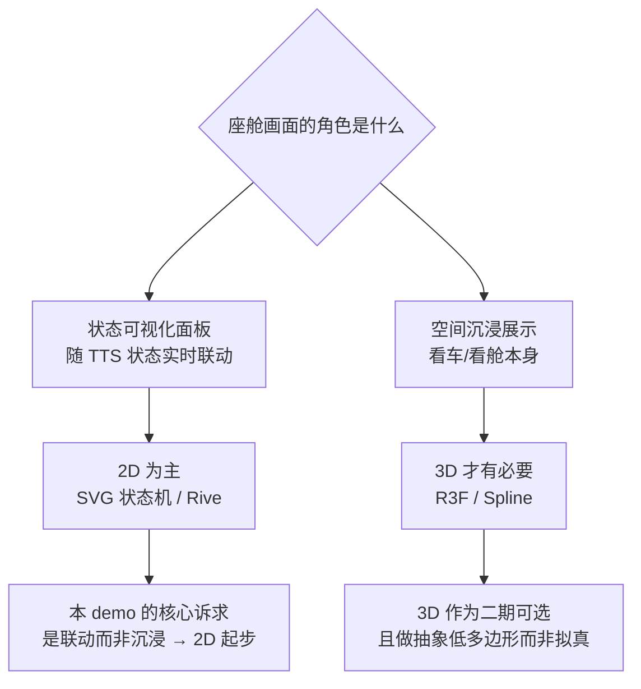
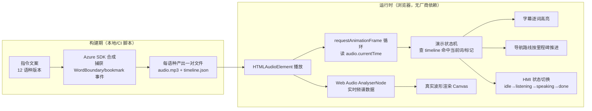
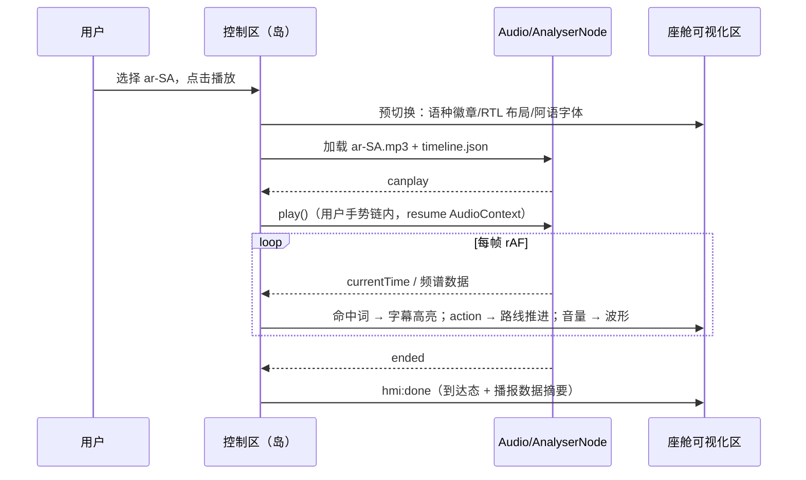

# 路线A调研：多语言 TTS × 智能座舱 2D/3D 可视化（前端/UI/UE 技术选型）

> **文档性质**：初步技术调研，只读不改业务代码
> **服务对象**：王磊个人网站（Astro + TypeScript + MDX + GitHub Pages，见 `docs/website-plan/master-plan.md`）
> **对应内容资产**：旗舰案例 A「海外多语种智能座舱能力地图」的互动演示载体
> **视觉基调约束**：技术编辑部 × 工业设计，克制专业；不做黑底粒子/发光大脑式同质化科技风
> **版本**：v0.1（调研稿，含开放问题，待磊哥确认后进入设计稿阶段）

---

## 目录

- [1. 场景定义与用户旅程](#1-场景定义与用户旅程)
- [2. TTS 方案对比](#2-tts-方案对比)
- [3. 2D vs 3D 座舱可视化选型](#3-2d-vs-3d-座舱可视化选型)
- [4. 音画同步方案](#4-音画同步方案)
- [5. 酷炫但克制的 UI/UE 参考](#5-酷炫但克制的-uiue-参考)
- [6. 推荐技术栈（MVP vs 完整版）](#6-推荐技术栈mvp-vs-完整版)
- [7. 隐私与合规](#7-隐私与合规)
- [8. 30 天可落地的 MVP 切片](#8-30-天可落地的-mvp-切片)
- [9. 开放问题（需磊哥确认）](#9-开放问题需磊哥确认)

---

## 1. 场景定义与用户旅程

### 1.1 这个演示 30 秒内证明什么

**一句话**：把案例 A 里那张「语种 × 能力维度」的静态能力地图，变成**可听、可看、可操作**的证据——访客点一种语言，就能听到该语种的座舱导航播报，同时看到座舱 HMI 界面随语音实时联动（字幕逐词点亮、语音波形跳动、导航路线推进、语种/字体/书写方向切换）。

它向三类访客各证明一件事：

| 访客 | 30 秒内建立的认知 | 对应站点目标（master-plan 四大作用） |
|------|------------------|--------------------------------|
| 招聘方 / 猎头 | 「多语种座舱」不是简历上的一个词，是他真做过、且能讲清楚工程细节的领域 | 能力证明 |
| 潜在合作方（主机厂/供应商） | 此人理解多语种 TTS 的语种覆盖、时间戳同步、HMI 联动这些量产级问题 | 关系转化 |
| 同行 / 行业读者 | 演示本身的工程与设计品质 = 作者的专业水位 | 职业定位、知识影响力 |

**演示与案例 A 的叙事关系**：案例 A 讲「语种清单 → 六维能力地图」的判断框架；这个演示是其中「语言成熟度」维度的具象化切片——同一句导航指令在 10+ 种语言下的真实合成效果与 HMI 适配差异（字宽、字体、RTL、播报时长），恰好说明「多语种不是翻译一遍」。演示不需要造假数据，本身就是 L2 级证据（有形产出、Demo 可验证）。

### 1.2 页面布局（初步）

左右双栏（移动端上下堆叠）：

```text
┌──────────────────────────┬────────────────────────────────────┐
│  控制区（约 1/3 宽）        │  座舱可视化区（约 2/3 宽）             │
│                          │                                    │
│  · 语言选择（10+ 语种，     │  · 抽象化座舱 HMI：仪表/中控双区构图    │
│    含语种名 + 本地文字样本） │  · 导航卡片：路线示意 + 转向提示        │
│  · 指令场景选择（导航/       │  · 语音助手区：实时波形 + 逐词字幕      │
│    空调/媒体，v1 只做导航）  │  · 状态栏：当前 locale/音色/播报时长    │
│  · 播放/停止 + 播放进度     │  · 播放时整体进入「语音会话」状态        │
└──────────────────────────┴────────────────────────────────────┘
```

### 1.3 用户旅程


关键体验细节（决定「真实播放感」而非「假动画」）：

- 波形来自真实音频的频谱分析（Web Audio `AnalyserNode`），不是循环播放的装饰动画；
- 字幕逐词高亮的时间点来自 TTS 引擎返回的词级时间戳，切换语言后节奏明显不同（德语长复合词 vs 泰语连写），这个差异本身就是「多语种能力」的可感知证据；
- 阿拉伯语等 RTL 语种切换时，字幕与导航卡片布局镜像，体现真实的多语种 HMI 工程问题；
- 播报结束展示一行冷静的工程数据（字符数、合成时长、语速），符合「技术编辑部」的克制气质。

---

## 2. TTS 方案对比

### 2.1 先明确约束：静态站没有后端

站点部署在 GitHub Pages（纯静态），**没有可以藏 API Key 的服务端**。这直接决定了云端 TTS 的三种接入姿势：

| 接入姿势 | 说明 | 适用性 |
|---------|------|-------|
| **A. 构建期预生成**（推荐） | 本地/CI 脚本调用云 TTS，把 10+ 语种 × N 句指令合成为静态音频文件 + 时间戳 JSON，随站点发布 | 固定脚本演示的最优解：零运行时成本、零密钥暴露、零首响延迟、离线可用 |
| B. 无服务器代理实时合成 | Cloudflare Workers（免费层）持有密钥，浏览器请求 Worker，Worker 转发 TTS 流 | 仅当需要「用户自定义文本」或展示「实时合成」能力时才值得引入 |
| C. 浏览器本地合成 | Web Speech API，无密钥无请求 | 免费但语音质量与语种覆盖不可控，只适合做对照/降级 |

演示语料规模极小：假设 12 语种 × 3 句指令 × 平均 80 字符 ≈ **2,880 字符/次全量重新生成**，远低于任何主流引擎的免费额度（Azure 每月 50 万字符免费、Google 每月 100 万 WaveNet 字符免费）。**成本在预生成模式下趋近于零**，选型的真正差异在语种覆盖、时间戳能力和音质。

### 2.2 引擎横向对比

以演示目标语种集（暂定：中/英/德/法/西/葡(巴)/意/俄/阿拉伯/泰/越/印尼/日/韩/印地，从中取 10+）衡量：

| 方案 | 语种覆盖 | 词级时间戳（音画同步关键） | 首响延迟 | 成本（demo 量级） | 主要限制 | 10+ 语种 demo 适配度 |
|------|---------|--------------------------|---------|-----------------|---------|--------------------|
| **Azure Speech（微软）** | **150+ locale、600+ 神经音色**，目标语种全覆盖；另有一人多语的 Multilingual/HD 音色 | ✅ SDK `WordBoundary` 事件 + SSML `<bookmark>` 自定义标记；viseme 口型仅限 en-US | 流式约 100–300ms；预生成无感 | 免费 50 万字符/月，超出约 $16/百万字符 | 免费层需绑卡开 Azure 订阅 | ★★★★★ 首选：覆盖、时间戳、单一 API 三者兼得 |
| **Google Cloud TTS** | 50+ 语言、300+ 音色，目标语种基本覆盖 | ✅ v1beta1 支持 SSML `<mark>` timepoint（标记级，非逐词自动） | 同上 | 免费 100 万 WaveNet 字符/月，超出 $4–16/百万 | 逐词时间戳要靠手工插 mark，多语种下工作量大 | ★★★★ 备选：覆盖够，同步数据加工成本略高 |
| **Amazon Polly** | 30+ 语言，泰/越等小语种有缺口 | ✅ Speech Marks（word/sentence/viseme，JSON 流） | 同上 | 新账号 12 个月免费 500 万字符/月 | 语种数明显少于 Azure；免费期后无永久免费层 | ★★★ 时间戳数据最好用，但语种覆盖不够本 demo 用 |
| **ElevenLabs** | 70+ 语言（v3），音质/情感表现第一梯队 | ✅ 支持字符级 timestamps 接口 | 流式低延迟 | 免费仅 1 万字符/月；付费 $5/月起，规模化最贵 | 贵；SSML 支持有限 | ★★★ 「音质旗舰对照组」可选 1–2 个语种点缀 |
| **OpenAI TTS（tts-1 / gpt-4o-mini-tts）** | 约 57 语言，但仅 ~10 个音色且英语腔明显 | ❌ 无时间戳事件 | 低 | $15/百万字符，无免费层 | 小语种发音的「外国口音」问题；无同步数据 | ★★ 不适合：音色少 + 无时间戳 |
| **讯飞开放平台** | 中文系最强（含粤/川豫方言、维/藏）；小语种含韩日法俄西印地德越葡(巴)意泰乌尔都，需控制台逐个开通发音人 | ⚠️ 在线 TTS 标准接口无词级时间戳（部分产品线有音素能力，需商务确认） | WebSocket 流式，国内低 | 按发音人授权计费，小语种单价高于通用 | 面向国内开发者体系（签名鉴权较繁琐）；海外访客访问其音频服务域名不稳定 | ★★★ 中文/方言叙事强，但同步数据与国际访问是硬伤 |
| **火山引擎（豆包语音）** | 大模型音色 325 个但语种集中在中英日西等；传统音色覆盖中英日葡西泰越印尼 + 11 种方言 | ✅ 大模型双向流式支持**字级时间戳**；传统接口支持音素级 | 流式低 | 有免费额度，按量计费 | 欧洲/中东/南亚语种覆盖不足以撑起「10+ 语种全球化」叙事 | ★★★ 座舱行业相关性强（多家主机厂在用），可作为「国内座舱生态」对照组 |
| **Web Speech API（浏览器原生）** | 取决于访客操作系统：macOS 语音库较全，Windows 需安装语言包，**Linux Chrome 语音列表为空**，移动端小语种普遍缺失 | ⚠️ `onboundary` 事件仅部分浏览器/音色可靠 | 本地即时 | 免费 | 必须用户手势触发；Chrome 对长文本有 ~15 秒截断；音质=系统 TTS，不可控 | ★★ 不能当主方案：无法保证访客设备有泰语/阿拉伯语音色。适合做「端侧 TTS」对照开关 |
| **开源自托管（Piper / XTTS 等）** | Piper 30+ 语言可离线 | 部分支持音素对齐 | 本地推理 | 免费但要自己跑推理 | 预生成模式下与云端引擎工作量相当、音质更低 | ★★ 仅在「完全去厂商依赖」诉求下考虑 |

### 2.3 结论与推荐

1. **主引擎选 Azure Speech + 构建期预生成**。理由：目标 10+ 语种一站覆盖、`WordBoundary`/`<bookmark>` 事件直接产出音画同步所需的时间戳 JSON、免费额度对 demo 量级近乎无限、单一 API 降低维护成本。
2. **预生成时同一脚本额外产出 `timeline.json`**（详见第 4 节），音频与时间戳一次生成、版本一致，避免运行时依赖任何厂商 SDK。
3. **可选叙事增强**：加一个「云端高保真 / 端侧即时」切换开关——云端播 Azure 预生成音频，端侧调 Web Speech API 现场合成。两者的音质与语种可用性差异，正好呼应磊哥「端云大模型分层」支柱的取舍叙事。降级逻辑：访客设备无对应语种端侧音色时置灰并说明原因（这个「说明原因」本身就很专业）。
4. **明确不做（v1）**：实时云端合成、用户自定义文本。两者都要引入 Worker 代理 + 内容安全审核，成本收益不成比例（见第 9 节开放问题 Q3）。
5. **一人多语（multilingual voice）值得单独展示**：Azure 的 Multilingual 音色可用同一音色人格说全部语种，与「逐语种本地音色」对比播放，直观呈现两代 TTS 技术路线差异——这是行业内行才会设置的对比，专业感强。

---

## 3. 2D vs 3D 座舱可视化选型

### 3.1 决策框架



本演示的本质是**HMI 状态可视化**（语音状态 → 界面反馈），不是「展示一辆车」。真实量产座舱的仪表/中控本身也以 2D 合成层为主、3D 仅用于车模等局部。**2D 起步不是妥协，而是更贴近真实座舱架构的选择**——这一点可以写进演示的说明文案里，反而加分。

### 3.2 2D 方案对比

| 方案 | 适合本 demo 的理由 | 不适合的理由 | 体积/性能 | 结论 |
|------|------------------|------------|----------|------|
| **手写 SVG + CSS/WAAPI + TS 状态机** | 与站点「线框图形语言」完全同源；矢量无限清晰；路线高亮=`stroke-dashoffset` 一行属性；暗色模式用 CSS 变量白得；零运行时依赖 | 复杂骨骼动画（如助手形象）写起来繁琐 | ≈0 额外 KB，性能最好 | **MVP 首选** |
| **Rive（状态机 + 数据绑定）** | 为「可交互状态图形」而生：编辑器里定义 idle/listening/speaking 状态机，运行时用 data binding 喂音量/进度值；文件仅几十 KB；**车载 HMI 行业背书强（2025 年 BMW i Ventures 投资，明确面向 infotainment/HUD 场景）**——用它本身就是行业信号 | 需学习 Rive 编辑器；Web 运行时含 WASM（gzip 后约 100–200KB 量级）；设计资产被工具锁定 | .riv 几十 KB + 运行时 | **完整版首选**，用于语音助手动效与仪表指针等「有生命感」的部分 |
| **Lottie** | AE 动画导出成熟、生态大 | 本质是单向播放的动画片段，做「状态驱动 + 数值绑定」很别扭；交互逻辑要在代码里硬切 segment | lottie-web gzip 约 40–65KB | 不推荐：与「状态联动」的核心需求错位 |
| **Canvas 2D** | 波形/频谱这类每帧重绘的图形唯一正解 | 不适合承载整个 HMI 布局（无 DOM 可访问性、文本渲染弱） | 好 | **局部使用**：波形区专用 |
| **Figma-to-code（Anima 等）** | 快速出静态布局 | 产出的是死界面，状态联动仍要手写；生成代码质量难维护 | — | 仅用于设计稿阶段，不进生产代码 |
| **React/Vue 组件库（如 shadcn 等）** | 控制区（语言选择器、播放器）可直接受益 | 座舱画面区没有现成组件可用，HMI 必须原创 | 中 | 控制区可用，座舱区不适用 |

### 3.3 3D 方案对比（二期评估）

| 方案 | 适合的理由 | 不适合的理由 | 首载体积（gzip 估算） | 结论 |
|------|-----------|------------|---------------------|------|
| **Three.js / React Three Fiber (R3F) + drei** | 生态最成熟；R3F 声明式写法与状态联动天然契合（TTS 状态改 props 即可）；可做「抽象低多边形座舱剖面 + 相机随播报运镜」这类克制的 3D | 需要 3D 资产：建模一个原创抽象座舱是主要成本；React 岛体积上升 | three 约 170KB + react + 场景资产，合计 300–500KB | **二期首选**，前提是接受「抽象几何风」而非拟真内饰 |
| **deck.gl（TripsLayer）+ MapLibre GL** | 严格说是「3D 化的数据可视化」：真实地图上做路线流动动画（`currentTime` 属性逐帧推进，与 TTS 进度直接映射），效果专业且是数据可视化行业标准工具链 | 地图瓦片需要来源（自托管 PMTiles 或第三方服务）；体积不小 | maplibre 约 220KB + deck.gl 相关约 150KB+ | **完整版「真实地图路线」的标准答案**；MVP 用 SVG 示意路线替代 |
| **Babylon.js** | 引擎级功能全（物理/XR） | 对本场景全面过剩；包更大；社区内容偏游戏 | >400KB | 不推荐 |
| **Spline** | 无代码建 3D、导出 Web 快 | 运行时重（MB 级）；风格偏「圆润玩具感」，与工业克制定调冲突；场景逻辑受平台锁定 | ≈1MB+ | 不推荐 |
| **车载 HMI 专业工具（Kanzi / Qt Design Studio / Unreal HMI）** | 行业正统 | 均无面向 Web 的轻量导出路径；只能导视频——视频=假播放，违背「真实联动」的核心诉求 | — | 不适用于 Web demo；可在案例正文提及以体现行业认知 |

### 3.4 与 Astro 的集成方式

站点是 Astro islands 架构，本演示应收敛为**单一交互岛**，其余页面内容保持零 JS：

| 集成点 | 做法 | 原因 |
|--------|------|------|
| 水合指令 | 演示岛用 `client:visible`（滚动到视口才加载）；若在独立页且是页面主体，用 `client:load` | 不拖累站点 Lighthouse ≥95 的硬指标 |
| WebGL 类组件（二期 R3F/deck.gl） | `client:only="react"` + 动态 `import()` 分包 | Three/deck.gl 无法 SSR；避免打进首屏 bundle |
| 岛内框架 | MVP 用 **Svelte**（编译型、运行时约 2KB，做一个交互岛最轻）；**若确认二期上 R3F，则从一开始就选 React**，避免站内双框架 | Astro 支持多框架但混用增加维护成本，二选一即可 |
| 跨岛状态 | 单岛方案下不需要；若控制区与座舱区拆成两个岛，用 `nanostores` 共享播放状态 | Astro 官方推荐模式 |
| 体积预算 | 演示页整页 gzip 预算：MVP ≤150KB（不含音频）；完整版 ≤500KB；音频每条 mp3 48kbps 单声道约 30–80KB，按语种懒加载 | master-plan 性能门槛的延伸 |
| 动效可访问性 | 全部动画响应 `prefers-reduced-motion`：降级为状态切换无过渡 | 专业感的一部分 |
| 多语种字体 | 按语种懒加载 Noto Sans 子集（Arabic/Thai/Devanagari/JP/KR），选中该语种才请求 | 10+ 语种全量字体会爆体积预算 |

---

## 4. 音画同步方案

### 4.1 核心思路：时间戳驱动的单向数据流

「真实播放感」= 界面状态由**真实音频的播放时钟**驱动，而不是与音频各播各的两条动画。整条链路：



### 4.2 时间戳数据结构（预生成产物）

```jsonc
// /audio/nav-louvre/fr-FR.timeline.json（示意）
{
  "locale": "fr-FR",
  "voice": "fr-FR-DeniseNeural",
  "durationMs": 3480,
  "text": "Navigue jusqu'au musée du Louvre",
  "words": [
    { "t": [0, 410],    "w": "Navigue",  "action": "hmi:speaking" },
    { "t": [410, 890],  "w": "jusqu'au", "action": null },
    { "t": [1020, 1600],"w": "musée",    "action": "route:highlight-start" },
    { "t": [1600, 2400],"w": "du Louvre","action": "route:reach-destination" }
  ],
  "marks": [ { "t": 3480, "name": "utterance-end", "action": "hmi:done" } ]
}
```

要点：

- **词级时间戳**来自 Azure `WordBoundary` 事件（`AudioOffset` + 词文本）；**语义标记**（如「到达目的地」时机）用 SSML `<bookmark mark="dest"/>` 插在译文关键位置，比按词猜语义可靠——不同语言的语序不同（德语动词后置），bookmark 让「路线到达」动画在每种语言里都卡在语义正确的时刻。
- 各引擎的替代能力：Amazon Polly Speech Marks（JSON 逐词）、火山大模型双向流式（字级时间戳）、Google `<mark>` timepoints（标记级）。**选定引擎前先验证目标小语种的时间戳质量**（部分引擎在泰语/阿拉伯语上分词偏移较大），这是选型验证清单的第一项。

### 4.3 运行时同步细节

| 问题 | 方案 |
|------|------|
| 播放时钟精度 | 不用 `timeupdate` 事件（约 250ms 一次，会掉词），用 `requestAnimationFrame` 每帧读 `audio.currentTime` 二分查找 timeline |
| 波形「真实感」 | `MediaElementAudioSourceNode → AnalyserNode → getByteFrequencyData()` 每帧渲染到 Canvas；音频与站点同源托管，无 CORS 问题 |
| iOS 自动播放限制 | `AudioContext` 必须在用户手势中 `resume()`——播放按钮的 click 事件天然满足；页面不做任何自动播放 |
| 波形降级方案 | 构建期预计算每 50ms 的峰值数组存入 timeline.json；`AnalyserNode` 不可用时用预计算峰值渲染（视觉一致，仍与播放时钟同步） |
| 状态机 | 状态少（idle/loading/speaking/done/error），手写 TS 判别联合状态机即可，不必引入 XState；若二期状态爆炸再升级 |
| 与 Rive 联动（完整版） | 播放循环把「归一化进度 + 当前音量」写入 Rive data binding 的 view model 属性，Rive 状态机内部消化过渡动画——代码只喂数据，动效细节归设计工具 |
| 与 deck.gl 联动（完整版） | `TripsLayer.currentTime = f(audio.currentTime)`，TTS 播完恰好路线走完，一个映射函数解决 |
| Web Speech 对照模式 | `SpeechSynthesisUtterance.onboundary` 提供词边界（浏览器支持参差），拿不到就退化为仅波形（麦克风路由不可行，用估算节奏）——对照模式允许低保真 |

### 4.4 播放时序



---

## 5. 酷炫但克制的 UI/UE 参考

不罗列工具 Logo，每个参考都对应本 demo 的一个具体设计问题：

| # | 参考 | 链接 | 解决本 demo 的什么问题 |
|---|------|------|----------------------|
| 1 | **Polestar 官网（配置器与产品页）** | [polestar.com](https://www.polestar.com) | 「汽车语境下的克制」范本：大留白、少色彩、3D 只在需要时出现且服务于信息而非炫技。座舱可视化区的整体气质对标它，而不是对标游戏引擎 demo |
| 2 | **Teenage Engineering 官网** | [teenage.engineering](https://teenage.engineering) | 「工业设计 × 编辑部」的极致：等宽字体做参数标注、产品图当图纸用。演示的「播报数据摘要行」（字符数/时长/语速）直接借鉴这种仪器面板式的数据陈列 |
| 3 | **Apple CarPlay 产品页** | [apple.com/ios/carplay](https://www.apple.com/ios/carplay/) | 官方级「多屏座舱联动」叙事：仪表与中控如何同时呈现一次导航事件。本 demo 的仪表/中控双区构图与状态联动的「戏剧编排」参考它 |
| 4 | **Rive 官方案例与 BMW i Ventures 投资说明** | [rive.app](https://rive.app) / [BMW 新闻稿](https://www.press.bmwgroup.com/usa/article/detail/T0452226EN_US/) | 车载 HMI 动效的行业方向标：状态机驱动、矢量轻量、嵌入式可用。语音助手的 idle/listening/speaking 动效品质对标 Rive 官方示例的水准 |
| 5 | **deck.gl 官方 Showcase（Trips 示例）** | [deck.gl/showcase](https://deck.gl/showcase) | 「数据可视化级」的地图路线动画长什么样：流动光带克制而专业，区别于营销页的浮夸地球。完整版真实地图路线的视觉基准 |
| 6 | **Linear 官网（补充）** | [linear.app](https://linear.app) | 非汽车领域，但是「少量动效 × 极高完成度」的工程标杆：动效只出现在状态变化处、全部可被 reduced-motion 关闭。本 demo 的动效纪律对标它 |

**反面清单**（明确不学）：黑底 + 蓝紫渐变粒子、旋转线框地球、发光 HUD 贴图堆叠——这些是「廉价科技风」的三件套，与站点视觉红线冲突。

---

## 6. 推荐技术栈（MVP vs 完整版）

### 6.1 两版定义

| 层 | 第一版 MVP（30 天内可上线） | 酷炫完整版（二期） |
|----|---------------------------|-------------------|
| TTS | Azure 预生成（12 语种 × 1 场景 × 1 句），mp3 + timeline.json | + Multilingual 单音色对照组；+ Web Speech「端侧对照」开关；（可选）Worker 代理实时合成 |
| 座舱画面 | 手写 SVG 座舱（仪表+中控双区）+ CSS/WAAPI 状态过渡 | + Rive 状态机承接语音助手动效/仪表指针；SVG 保留为布局骨架 |
| 路线 | SVG 抽象路线图（虚构城市），`stroke-dashoffset` 推进 | MapLibre GL + deck.gl TripsLayer，自托管 PMTiles 瓦片，定制低饱和地图样式 |
| 波形 | Canvas + AnalyserNode 实时频谱 | 同左，加 Rive 绑定的音量呼吸动效 |
| 3D | 无 | 可选：R3F 抽象低多边形座舱剖面，相机随播报运镜 |
| 集成 | Astro 单岛 `client:visible`，Svelte（或 React，取决于是否确定上 R3F） | 多岛 + nanostores；WebGL 岛 `client:only` + 动态分包 |
| 字体 | 按语种懒加载 Noto Sans 子集 | 同左 |

### 6.2 方案评分表

酷炫度/开发成本/性能/维护性均为 1–5 星（★ 越多分别代表越酷炫/成本越高/性能越好/越易维护）：

| 方案 | 酷炫度 | 开发成本 | 性能 | 维护性 | 一句话定位 |
|------|--------|---------|------|--------|-----------|
| A. SVG + CSS 状态机 + AnalyserNode 波形 + Azure 预生成（**MVP**） | ★★★☆☆ | ★★☆☆☆ | ★★★★★ | ★★★★★ | 零依赖、最贴站点气质，酷炫靠设计功力而非库 |
| B. 方案 A + Rive 状态机动效（**完整版核心**） | ★★★★☆ | ★★★☆☆ | ★★★★☆ | ★★★★☆ | 「有生命感」的 HMI 动效 + 车载行业背书 |
| C. 方案 B + MapLibre/deck.gl 真实地图路线（**完整版增强**） | ★★★★★ | ★★★★☆ | ★★★☆☆ | ★★★☆☆ | 数据可视化级路线动画，专业观众杀手锏 |
| D. R3F 3D 抽象座舱场景（**二期可选**） | ★★★★★ | ★★★★★ | ★★★☆☆ | ★★★☆☆ | 沉浸感上限最高，但 3D 资产是成本大头 |
| E. Spline 3D 场景（对照，不推荐） | ★★★★☆ | ★★★☆☆ | ★★☆☆☆ | ★★☆☆☆ | 快但风格失控、运行时重、平台锁定 |
| F. Lottie 动画拼接（对照，不推荐） | ★★★☆☆ | ★★★☆☆ | ★★★★☆ | ★★☆☆☆ | 播片思路，状态联动别扭，「假播放」风险高 |
| G. 纯 Web Speech API（对照，不推荐为主方案） | ★★☆☆☆ | ★☆☆☆☆ | ★★★★★ | ★★★☆☆ | 语种/音质不可控，仅作端侧对照开关 |

**推荐路径：A → B → C（D 视反馈决定）**。每一步都在前一步之上叠加，无返工。

### 6.3 目录落点（实施时）

```text
src/
├── components/demo/            # 演示岛（单框架）
│   ├── TtsCockpitDemo.svelte   # 或 .tsx，岛入口
│   ├── cockpit/                # SVG 座舱子组件（仪表/中控/波形/字幕）
│   └── sync/                   # 播放时钟、状态机、timeline 查找
├── pages/lab/tts-cockpit.astro # 演示页（或挂在案例 A 内）
scripts/
└── generate-tts.ts             # 构建期预生成脚本（Azure SDK，本地跑）
public/demo/tts/
├── nav-louvre/{locale}.mp3
└── nav-louvre/{locale}.timeline.json
```

预生成脚本**本地手动执行**、产物提交进仓库（音频总量约 12 × 60KB ≈ 720KB，可接受），CI 不持有任何密钥，GitHub Pages 流水线零改动。

---

## 7. 隐私与合规

对齐 `docs/website-plan/material-security-grading.md` 的 P0/P1/P2 分级：

| 风险面 | 风险 | 对策 |
|--------|------|------|
| TTS 文本内容 | 指令文案若含真实项目 POI/城市组合，可能反推目标市场（P1） | 只用全球知名公共地标（卢浮宫、东京塔级别）或虚构地名；文案为通用导航话术，与任何真实项目话术库无关 |
| TTS 引擎选择的暗示 | 「demo 用了引擎 X」可能被解读为「真实项目用的也是 X」（供应商分工属 P0 第 7 条） | 页面加一行免责声明：演示所用合成引擎为公开云服务，与作者参与的任何量产项目的供应商选择无关 |
| 语种清单 | 若与真实项目的首发语种批次一致，组合可定位客户（P0 第 1/10 条组合特征） | 演示语种取「全球化通用组合」，与案例 A 中脱敏后的批次表**刻意不一致**；语种列表在发布前走脱敏检查表 |
| 座舱 UI 设计 | 复刻雇主/客户 HMI 视觉 = 未公开设计泄露（P0 第 6/9 条） | 座舱画面 100% 原创抽象设计（线框风格反而是护城河）；不参考任何内部截图，公开对标物仅限第 5 节所列公开产品 |
| 地图数据 | 真实地图若圈出特定城市路线，叠加语种可反推市场 | MVP 用虚构城市 SVG；完整版用 OpenStreetMap 数据时选与真实项目无关的城市，并按 ODbL 要求署名（attribution） |
| 访客隐私 | 第三方请求泄露访客信息 | 预生成模式下页面**零第三方运行时请求**（音频同源托管），与站点「无 Cookie 弹窗、自托管统计」的隐私基调一致；若二期上实时合成，Worker 代理需做速率限制 + 不落盘用户文本 + 隐私声明更新 |
| API 密钥 | 静态站无法藏密钥 | 密钥仅存在于本地预生成脚本环境变量；仓库与 CI 均不出现；实时合成版密钥只进 Worker secret |
| 用户生成内容（若开放自定义文本） | 滥用云 TTS 合成不当内容、成本失控 | v1 不开放；若开放：Worker 侧长度限制 + 词表过滤 + 每 IP 限流，并接受这是一个持续运营成本（见 Q3） |

---

## 8. 30 天可落地的 MVP 切片

**前置说明**：站点本体的 30 天上线计划（master-plan 第 11 章）已明确排除「数据可视化交互组件」。本演示是**站点 MVP 之后的独立 30 天切片**，不与建站冲刺抢工期；也可由并行的另一条线独立推进，因为它只新增一个页面和一个目录，不动站点骨架。

### 8.1 做什么 / 不做什么

| 做（MVP 范围） | 不做（明确推迟） |
|---------------|----------------|
| 10–12 语种 × 1 个导航场景 × 1 句指令，Azure 预生成 | 多场景（空调/媒体）、多句轮播 |
| SVG 抽象座舱：仪表+中控双区、语种徽章、逐词字幕、SVG 示意路线推进 | Rive 动效、真实地图、任何 3D |
| Canvas 实时波形（AnalyserNode + 预计算峰值降级） | 口型/viseme、3D 声场 |
| RTL 布局镜像（阿拉伯语）+ 按语种字体懒加载 | 全站多语言 i18n |
| 播放数据摘要行（字符数/时长/语速） | 端云对照开关（挪到完整版） |
| `prefers-reduced-motion` 降级、移动端上下堆叠布局 | 用户自定义文本、实时合成 |
| 脱敏自查（第 7 节清单）+ 免责声明文案 | 评论/分享等社交功能 |

### 8.2 四周节奏

| 周 | 主题 | 交付物 | 验收标准 |
|----|------|--------|---------|
| **W1** | 语料与管线 | 指令文案 12 语种翻译定稿（母语者或至少双引擎交叉校对）；`generate-tts.ts` 跑通，产出全部 mp3 + timeline.json；**小语种时间戳质量验证报告**（泰/阿/印地重点抽查） | 任选 3 语种人工听审通过；timeline 词边界误差 <100ms |
| **W2** | 座舱设计与静态实现 | SVG 座舱设计稿（Figma）→ 组件化实现；控制区（语言选择/播放器）可交互 | 暗色/亮色双模式下视觉过审；无任何动画时页面已「像一个座舱」 |
| **W3** | 同步引擎 | 播放时钟 + 状态机 + 三条联动（字幕/路线/波形）；RTL 与字体懒加载 | 逐词高亮与人耳感知无可察觉偏差；阿语布局镜像正确 |
| **W4** | 打磨与上线 | reduced-motion/移动端/弱网（音频加载态）打磨；性能预算核验（页面 gzip ≤150KB + 音频懒加载）；脱敏自查；挂到 `/lab/tts-cockpit` 并从案例 A 交叉链接 | Lighthouse ≥95；脱敏检查表全过；两台真机（iOS/Android）实测通过 |

### 8.3 风险与预案

| 风险 | 概率 | 预案 |
|------|------|------|
| 个别小语种 Azure 时间戳分词质量差 | 中 | 该语种退化为「句级高亮 + bookmark 关键节点」，其余语种保持词级；或该语种换 Polly |
| 翻译质量把关（磊哥不一定懂 12 种语言） | 高 | 双引擎交叉翻译 + 回译校验；文案刻意选最简句式；页面标注「演示文案，非量产话术」 |
| iOS Safari 音频/AudioContext 兼容坑 | 中 | W3 就上真机测试，不留到 W4；峰值降级路径保底 |
| SVG 座舱设计达不到「酷炫」预期 | 中 | 设计先行：W2 设计稿评审不过就迭代设计而非堆动效；克制风格下「精密感」主要来自排版与细节密度 |

---

## 9. 开放问题（需磊哥确认）

| # | 问题 | 选项与建议 |
|---|------|-----------|
| Q1 | **语种清单定哪 10+ 种？** | 建议「全球化通用组合」：en/de/fr/es/pt-BR/it/ru/ar/th/vi/id/ja/ko/hi/zh 中取 12。需确认：是否必须包含某些对叙事重要的语种（如中东/东南亚组合）？注意与真实项目批次表刻意错开（合规） |
| Q2 | **演示挂在哪里？** | A. 独立页 `/lab/tts-cockpit`，案例 A 内嵌截图+链接（建议，性能与叙事都干净）；B. 直接内嵌案例 A 页面（案例页变重）。倾向 A |
| Q3 | **要不要「实时合成/用户自定义文本」？** | 建议 v1 不要：需引入 Worker 代理、内容审核、限流，且对核心叙事（多语种能力）增益有限。若磊哥想展示「实时」能力本身，放完整版并接受运营成本 |
| Q4 | **岛框架选 Svelte 还是 React？** | 取决于 Q5：确定二期上 R3F 3D → 选 React（复用 R3F 生态）；确定不上 3D → 选 Svelte（更轻）。此决策影响 W2 开工，需优先确认 |
| Q5 | **3D 要不要进路线图？** | 建议：完整版先做 deck.gl 真实地图（专业感/成本比最高），R3F 3D 座舱作为「有余力再做」。若磊哥对 3D 座舱有强诉求，需接受原创 3D 资产的制作成本 |
| Q6 | **端云对照开关（Web Speech vs 云端）要不要做？** | 建议完整版做：它把 demo 从「TTS 展示」升级为「端云取舍叙事」，与三支柱之二直接挂钩。成本一天以内 |
| Q7 | **是否加入「一人多语 vs 逐语种本地音色」对比？** | 建议做（预生成两套音频即可）：这是行业内行视角的对比，强化专业信用。需确认磊哥认可这个叙事优先级 |
| Q8 | **指令场景只做导航，还是导航+空调+媒体三选一？** | 建议 v1 只做导航（路线联动最有画面感）；三场景使状态机与文案翻译成本 ×3 |
| Q9 | **移动端体验的优先级？** | 招聘方/合作方多在桌面端看作品，但公众号导流是移动端。建议：MVP 保证移动端「可用且不破版」，交互打磨以桌面为先 |
| Q10 | **翻译校对资源** | 12 语种文案是否有可托付的母语校对渠道（前同事/供应商朋友）？没有则按 8.3 的双引擎交叉方案执行，并在页面注明 |

---

## 附：本次调研主要信源

- Azure Speech：语种/音色规模、定价与免费层、WordBoundary/viseme/bookmark 能力 —— [语言支持](https://learn.microsoft.com/en-us/azure/ai-services/speech-service/language-support)、[定价](https://azure.microsoft.com/en-us/pricing/details/speech/)、[HD 音色与词边界事件](https://learn.microsoft.com/en-us/azure/ai-services/speech-service/high-definition-voices)
- Web Speech API 现状与限制 —— [MDN Web Speech API](https://developer.mozilla.org/en-US/docs/Web/API/Web_Speech_API) 及浏览器兼容性梳理
- Google Cloud TTS / Amazon Polly / OpenAI / ElevenLabs 语种与定价 —— 各官方定价页与 2026 年多家横评
- 讯飞在线合成（小语种清单与 WebSocket 接口）—— [讯飞开放平台 API 文档](https://www.xfyun.cn/doc/tts/online_tts/API.html)
- 火山引擎豆包语音（语种范围、双向流式字级时间戳）—— [大模型语音合成能力对比](https://www.volcengine.com/docs/6561/1257543)、[双向流式 API](https://www.volcengine.com/docs/6561/1329505)
- Rive（状态机、数据绑定、车载方向）—— [Rive Web Runtime 文档](https://rive.app/docs/runtimes/web/web-js)、[BMW i Ventures 投资新闻稿](https://www.press.bmwgroup.com/usa/article/detail/T0452226EN_US/)（2025-09）
- deck.gl TripsLayer 路线动画与 MapLibre 集成 —— [TripsLayer 文档](https://deck.gl/docs/api-reference/geo-layers/trips-layer)、[动画指南](https://deck.gl/docs/developer-guide/animations-and-transitions)

*数据截至 2026-08，价格与免费额度以厂商官网实时页面为准。*
