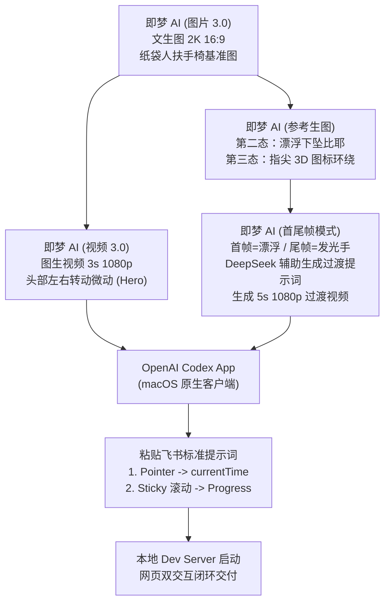
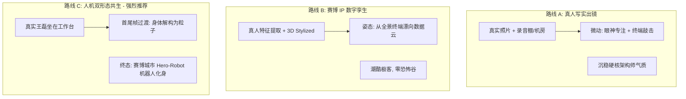
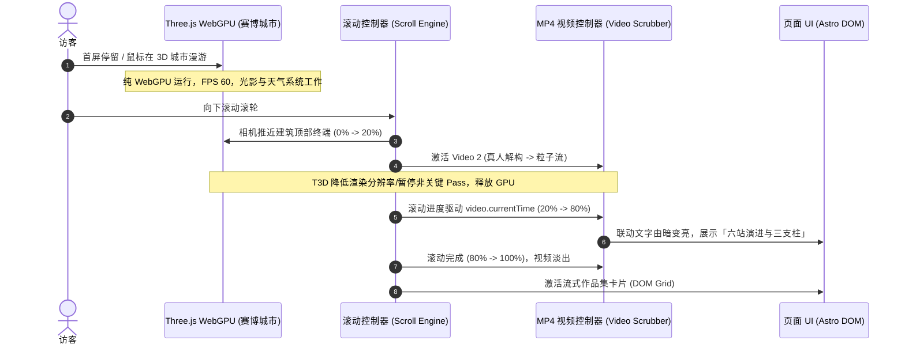

# 任务书 X1-DISSECT｜深度拆解 Paidax「IP 角色 + 首尾帧 + Codex 交互」网页 demo，并改写成王磊版方案

> **文件标识**：`out/dissect/dissect.md`  
> **研究对象**：Paidax（@xin_pai88825）X 帖子 `2095003945563566433`、`2092190359300542824` 及飞书知识库全套资产  
> **核心产出**：27s 成品逐镜表 + 113s 教程管线还原 + 交互与格式技术解构 + 资产管线解密 + 王磊版（真人照片驱动）三大落地改写方案与赛博城市融合架构 + 风险红线备忘录

---

## 目录
1. [27s Demo 成品逐镜拆解（时间轴详表）](#1-27s-demo-成品逐镜拆解时间轴详表)
2. [113s 教程视频流程与工具链还原](#2-113s-教程视频流程与工具链还原)
3. [核心技术机制与性能陷阱拆解](#3-核心技术机制与性能陷阱拆解)
   - 3.1 首屏 Pointer → `video.currentTime` Scrub 机制与避坑
   - 3.2 第二屏 Sticky 长滚动区间 → Progress → currentTime 联动
   - 3.3 动效载体大横评：MP4 vs PAG vs APNG/WebP vs 帧序列 vs Rive
4. [AI 资产生成管线拆解](#4-ai-资产生成管线拆解)
   - 4.1 IP 角色生图提示词结构学
   - 4.2 第二态衍生与局部重绘（修手）
   - 4.3 首尾帧插值生成机制与模型选型
   - 4.4 导出与混合模式交付
   - 4.5 「首尾帧」在 Web 叙事过渡中的核心价值
5. [王磊版改写方案（真人照片可用）](#5-王磊版改写方案真人照片可用)
   - 5.1 三大视觉路线设计（真脸写实 / 风格化 IP / 双形态数字孪生）
   - 5.2 视频分段与个人站叙事架构绑定（六站演进 / 三支柱 / 定位语）
   - 5.3 与「机器人的老家」（Three.js WebGPU 赛博城市）融合架构
   - 5.4 纯静态站性能与资源预算（GitHub Pages 约束）
6. [风险防线与品牌红线](#6-风险防线与品牌红线)

---

## 1. 27s Demo 成品逐镜拆解（时间轴详表）

基于 `media/frames-quoted/f_001.jpg` 至 `f_027.jpg`（1 帧/秒采样）与 `contact-quoted.jpg` 进行逐帧视觉核对与交互逆向分析：

| 时间（秒） | 采样帧 | 画面内容与视觉状态 | 交互类型 | 核心文案与 UI 元素 | 视频分段推断 | 判定依据与视觉线索 |
|:---|:---|:---|:---|:---|:---|:---|
| **00:00 - 00:02** | `f_001`, `f_002` | 蓝黑背景摄影棚，右侧 45% 处有一位穿米白西装、头戴方形牛皮纸袋（两圆孔）的人物坐在深色复古扶手椅上，大腿放着发光笔记本，双手停在键盘上。左侧大面积深蓝留白。鼠标光标在屏幕中央。 | **首屏横向 Pointer Scrub** | **主标题**：`Designing With AI`<br>**副标**：`ZPAIDAXIN · DESIGNER / AIGC CREATOR`<br>**简介**：`Eight years across B2B products and the AI industry...`<br>**导航**：`MENU / PROFILE / PRACTICE / CONTACT / START A PROJECT` | **视频段 1**（Hero 待机微动段） | 光标微动，人物处于微动循环起点，头部轻微正视前方，笔记本荧光照亮胸口。 |
| **00:03 - 00:05** | `f_003` - `f_005` | 鼠标向左快速滑动，光标周围出现金橙色弧形光晕轨迹（Custom Cursor Trail）。人物头部与躯干向左微微侧转，光影产生真实反射变化。 | **首屏横向 Pointer Scrub** | 页面文字保持静止，右下角展示 `EXPLORE SELECTED WORK ->` 按钮。 | **视频段 1**（同一段） | 随光标 X 轴左移，视频帧从当前时间点倒退/前推至偏左朝向帧，西装左肩琥珀色高光随转头角度变化。 |
| **00:06 - 00:08** | `f_006` - `f_008` | 鼠标向右平移划过屏幕中心，人物头部顺滑向右转动，直视并略微右偏，身体重心微调。 | **首屏横向 Pointer Scrub** | 维持 Hero 布局不变。 | **视频段 1**（同一段） | 随光标 X 轴右移，视频平滑 seek 到右转帧（约 2.0s~2.8s 处），左侧冷蓝补光与右侧暗部过渡自然。 |
| **00:09 - 00:10** | `f_009`, `f_010` | 用户向下滚动页面，Hero 开始淡出，画面进入长滚动区间。人物离开扶手椅，身体向后仰倒进入失重漂浮状态，笔记本脱离大腿向上飞起。 | **滚动 Scrub（Sticky Section 过渡启动）** | **文字淡入**：`From Tools To Workflows`<br>**右侧文案**：`B2B design, AI tools, and creative workflows...` | **视频段 2**（首尾帧过渡视频 A） | 扶手椅淡出，背景转为全黑，单束暖光从头顶照下，人物进入下坠/漂浮态。滚动条滑块（Pink Thumb）在右侧开始下移。 |
| **00:11 - 00:12** | `f_011`, `f_012` | 随着继续下滚，人物身体完全横卧悬浮在空中，右手向上抬起比出剪刀手（✌️ 手势），镜头开始向前缓推（Push In）。 | **滚动 Scrub（连续进度映射）** | 文案保持 `From Tools To Workflows`，字体重心上浮。 | **视频段 2**（同一段） | 滚动 progress 达到约 0.35~0.50，镜头景别从中景推向特写，悬空的 MacBook 苹果标志发光明显。 |
| **00:13 - 00:14** | `f_013`, `f_014` | 镜头推进至头部与手部大特写，剪刀手停留在镜头正前方，左上角飞起的电脑呈现侧面透视。 | **滚动 Scrub + 标题切换** | **标题切换**：`Test Tools / Share Methods`<br>**副标**：`03 - TEST / LEARN / SHARE` | **视频段 2**（尾帧逼近） | 视频时间逼近段 2 尾帧（约 4.8s~5.0s），纸袋眼孔与手部骨节细节充满画幅。 |
| **00:15 - 00:18** | `f_015` - `f_018` | 画面瞬间无缝过渡到一只写实真人的手垂直伸向天空，食指微抬，指尖上方有一圈闪烁着蓝色霓虹光晕的 3D 金属/玻璃质感 App 图标像行星环一样围绕手指顺时针旋转。 | **滚动 Scrub（过渡到段 3 特写环绕）** | **主标题切换**：`Useful By Design`<br>**副标**：`04 - MAKE / SHIP / REPEAT`<br>**右侧文案**：`Anyone can chase a shiny demo. I keep only what holds up in real work.` | **视频段 3**（首尾帧过渡视频 B / 特写循环） | 人物身体隐入全黑，仅保留发光手部与环形 3D 悬浮图标，滚动驱动图标环绕旋转 360 度，指尖高光闪烁。 |
| **00:19 - 00:20** | `f_019`, `f_020` | 滚动进度完成 Sticky 区间（progress=1.0），发光手部与视频整体向上滚出视口。全黑背景下淡入三栏个人画像元数据。 | **Sticky 释放，进入常规 DOM 滚动** | **三栏内容**：<br>`PROFILE: A visual and interaction designer...`<br>`FOCUS: B2B Product Design...`<br>`PUBLISHING: AI Tool Testing...` | **无视频**（纯 DOM 文字层） | 离开 Sticky 容器，页面恢复标准流式滚动，排版采用大字号极简排版。 |
| **00:21 - 00:23** | `f_021` - `f_023` | 滚入作品精选模块，左侧为横版卡片配图（WISA 足球赛事 App / 车载界面），右侧为大号粗体标题。 | **常规滚动 + 卡片视差/进入动效** | **章节**：`02 - SELECTED WORK`<br>**标题**：`Tested In Practice. Explained For Others.`<br>**卡片 1**：`Design Practice / Eight Years Of Decisions...` | **无视频**（静态/图片展示） | 卡片跟随滚动进入视口，带有轻微 CSS translateY 渐显。 |
| **00:24 - 00:25** | `f_024`, `f_025` | 滚入第二张与第三张作品卡片。第二张为品红色圆形毛笔书法纹样背景，中央为戴墨镜与骷髅 T 恤的 3D 兔子 IP；第三张为数据战报。 | **常规滚动** | **卡片 2**：`AI Workflows / Turning New Models Into Everyday Creative Tools`（INNER CIRCLE）<br>**卡片 3**：`Content & Tutorials / 174K Likes. 24K Followers. Zero Fluff.` | **无视频**（静态图片卡片） | 经典的 Editorial Portfolio 大图 + 大标题卡片流。 |
| **00:26** | `f_026` | 页面背景平滑过渡为浅米白色（Cream / Oatmeal），排版切换为四列式创作工作流网格。 | **背景色转场 + 网格卡片** | **四列方法论**：<br>`01 Find The Friction`<br>`02 Test It Properly`<br>`03 Make A Method`<br>`04 Share It Clearly`<br>**底部**：`PUBLISHING NEW DESIGN AND AI EXPERIMENTS -> FOLLOW ON XIAOHONGSHU` | **无视频**（纯 DOM） | 色彩反转（Dark Mode → Light Mode），建立强烈的视觉段落感。 |
| **00:27** | `f_027` | 页面底部 Footer 反转回纯黑背景，展示大号联系文案与外链。 | **常规滚动触底** | **Footer 标题**：`Let's Talk Design, AI, & The Next Step.`<br>**顶标**：`HAVE SOMETHING INTERESTING TO BUILD?` | **无视频**（纯 DOM） | 滚动条到底，完成整页 27 秒闭环展示。 |

---

## 2. 113s 教程视频流程与工具链还原

基于 `media/frames-main/f_001.jpg` 至 `f_038.jpg`（约 3 秒/帧采样）及 `contact-main.jpg`，逐一核验作者操作界面、工具链与操作动作：



### 逐步骤操作详表（含帧位核对）

| 阶段 | 帧范围 | 工具界面与模型标识 | 实际操作步骤与作者意图 | 画面中关键线索与字幕证据 |
|:---|:---|:---|:---|:---|
| **0. 痛点引言** | `f_001` - `f_006` | Demo 录屏播放 | 展示成品效果，抛出问题："为什么你的个人站看起来像 PDF？因为页面只是在展示，没有给用户带来任何交互反馈。" 引出 3 步制作法。 | 字幕："本期用三步，教你复刻这种动态 Hero" |
| **1. 基础角色生成** | `f_007` - `f_011` | **即梦 AI（Jimeng AI）**<br>模型：`图片 3.0`（强化一致性，自由多参考图） | 1. 在飞书文档中复制 16:9 纸袋人提示词。<br>2. 打开即梦 AI Web 端「图片生成」标签页。<br>3. 粘贴提示词，设置分辨率为 `2K 高清`，画幅比例 `16:9`，单次生成 2/4 张。<br>4. 消耗 2 积分生成，挑选构图与光影最完美的一张下载保存为基准图。 | `f_008` 左上角即梦 Logo，左侧菜单含「创意圈/资产/Omni/生成/灵动画布/全部工具/MCP/API」，积分显示 430；字幕："输入这段提示词，分辨率改为 2k，尺寸为 16:9" |
| **2. Hero 视频生成** | `f_012` - `f_015` | **即梦 AI**<br>模型：`视频 3.0`（音画同步升级，主体一致性增强） | 1. 切换至即梦「视频生成」标签页。<br>2. 将第一步生成的基准图拖入图生视频输入框。<br>3. 输入动态提示词：`"保持镜头固定不变，人物头部左右绕半圈，人物的光影也跟随转动变化"`。<br>4. 设置时长 `3s` / `1080p`，消耗积分生成，得到首屏微动视频 `hero.mp4`。 | `f_014`、`f_018` 右侧历史面板可见生成的 3 秒视频；字幕："拖入我们刚刚生成的图片...保持镜头固定不变" |
| **3. 第二态与过渡帧生成** | `f_016` - `f_021` | **即梦 AI**<br>`图片 3.0`（参考生图 / 垫图） | 1. 制作第二屏角色漂浮图：在图片生成中上传基准图作为参考图（保持西装、纸袋质感一致性）。<br>2. 输入第二态提示词：`"生成人物漂浮的状态，坠落感，电脑飞起来，一只手往上伸，手势比着耶，身体放松，纯黑色背景，有一束光照进来"`。<br>3. 挑选手势最自然的一张（若手部畸变则局部修手）。<br>4. 同理生成第三屏发光手部与 3D 图标环绕图。 | `f_018` 显示参考生图面板（1/10 槽位已放基准图）；`f_022` 历史创作弹窗中展示十余张漂浮姿态生成候选；字幕："拖入刚刚生成的图片，是为了保持人物和风格的一致性" |
| **4. 首尾帧插值生视频** | `f_022` - `f_030` | **即梦 AI**<br>`视频 3.0`（首尾帧功能）+ **DeepSeek 提示词辅助** | 1. 切换回「视频生成」，开启首尾帧模式。<br>2. 在起始帧（First Frame）槽位上传「人物坐姿/漂浮图」，在结束帧（End Frame）槽位上传「发光手部图」。<br>3. 借助内置 DeepSeek 分析首尾帧生成精准过渡运镜提示词（`f_024`/`f_030` 提示词面板可见 DeepSeek 思考标签）。<br>4. 设置镜头运动为推镜头（Push In），生成 5 秒 1080p 过渡视频 `transition.mp4`。 | `f_022` 弹窗标明 `选择图片 (0/2)`；`f_024` 出现首尾帧双缩略图与互换箭头；`f_028` 单次消耗 60 积分；字幕："添加我们刚刚生成的首尾帧...他会分析你的首尾帧来生成提示词" |
| **5. Codex 交互串联** | `f_031` - `f_036` | **OpenAI Codex Desktop App**（macOS 客户端） | 1. 打开 Codex 桌面应用，载入个人作品集代码工程。<br>2. 将生成的两个视频文件直接拖入 Codex 聊天窗口。<br>3. 粘贴飞书文档预备好的两段标准提示词（首屏 Pointer X 轴 scrub + 第二屏 Sticky scroll progress scrub）。<br>4. Codex 自动生成组件代码并修改工程。<br>5. 打开本地浏览器预览，调试鼠标滑动与滚轮控制。 | `f_032` 界面展示居中 Hexagon 图标与四项引导；底部模型为 Sonnet/Codex 系列；`f_033` 贴入完整提示词；`f_035`、`f_036` 浏览器中实时呈现鼠标联动 |
| **6. 知识库沉淀与引流** | `f_037` - `f_038` | 飞书 Wiki + 社交主页 | 1. 展示飞书知识库全套提示词与代码文档。<br>2. 尾帧展示创作者个人 IP 视觉「Z派大鑫」与小红书等社媒矩阵。 | `f_037` 飞书文档全屏展示；`f_038` 个人九宫格视频封面与头像 |

---

## 3. 核心技术机制与性能陷阱拆解

### 3.1 首屏 Pointer → `video.currentTime` Scrub 机制与避坑

#### 实现数学模型
首屏交互的本质是将输入设备的 X 轴物理坐标归一化，再线性映射为 HTML5 `<video>` 的播放时间戳：

$$\text{progress} = \text{clamp}\left(\frac{e.\text{clientX} - \text{rect.left}}{\text{rect.width}}, 0, 1\right)$$

$$\text{targetTime} = \text{progress} \times \text{video.duration}$$

#### 四大核心性能坑与生产级解决方案

```typescript
// 生产级 Pointer Scrub 实现（兼容 Touch/Mouse，带 RAF 节流与 Seeking 防抖）
export class VideoScrubber {
  private video: HTMLVideoElement;
  private container: HTMLElement;
  private rafId: number | null = null;
  private targetTime: number = 0;
  private lastSeekTime: number = 0;
  private isDestroyed: boolean = false;
  private readonly FPS_INTERVAL = 1 / 30; // 限制最大 seek 频率为 30fps

  constructor(container: HTMLElement, video: HTMLVideoElement) {
    this.container = container;
    this.video = video;
    this.init();
  }

  private init() {
    // 坑 1：iOS/Safari 自动播放与内联播放策略
    this.video.muted = true;
    this.video.playsInline = true;
    this.video.setAttribute('playsinline', '');
    this.video.setAttribute('webkit-playsinline', '');
    this.video.preload = 'auto';

    // 坑 2：首帧黑屏。必须在 loadedmetadata 后 seek 到极小正时间戳（0.02s）唤醒解码器
    const handleLoadedMetadata = () => {
      if (Number.isFinite(this.video.duration) && this.video.duration > 0) {
        this.video.currentTime = Math.min(0.02, this.video.duration * 0.01);
      }
    };

    if (this.video.readyState >= 1) {
      handleLoadedMetadata();
    } else {
      this.video.addEventListener('loadedmetadata', handleLoadedMetadata, { once: true });
    }

    // 绑定 Pointer 事件（统一 mouse、pen、touch）
    this.container.addEventListener('pointermove', this.onPointerMove, { passive: true });
    this.container.addEventListener('pointerleave', this.onPointerReset, { passive: true });
    this.container.addEventListener('pointercancel', this.onPointerReset, { passive: true });
  }

  private onPointerMove = (e: PointerEvent) => {
    const rect = this.container.getBoundingClientRect();
    if (rect.width <= 0 || !Number.isFinite(this.video.duration)) return;

    const rawProgress = (e.clientX - rect.left) / rect.width;
    const progress = Math.min(Math.max(rawProgress, 0), 1);
    this.targetTime = progress * this.video.duration;

    this.scheduleUpdate();
  };

  private onPointerReset = () => {
    // 移出后平滑回弹至中点或首帧
    if (Number.isFinite(this.video.duration)) {
      this.targetTime = this.video.duration * 0.5;
      this.scheduleUpdate();
    }
  };

  private scheduleUpdate() {
    if (this.rafId !== null) return;

    this.rafId = requestAnimationFrame(() => {
      this.rafId = null;
      if (this.isDestroyed || !this.video) return;

      // 坑 3：高频 seek 导致解码管线阻塞（Seek Choke）。
      // 检查 video.seeking 状态与时间差阈值，避免在解码未完成时连续派发 seek
      const delta = Math.abs(this.targetTime - this.video.currentTime);
      if (!this.video.seeking && delta > this.FPS_INTERVAL) {
        this.video.currentTime = this.targetTime;
        this.lastSeekTime = performance.now();
      } else if (delta > 0.005) {
        // 如果仍有差距且正在 seeking，下一帧继续尝试
        this.scheduleUpdate();
      }
    });
  }

  public destroy() {
    this.isDestroyed = true;
    if (this.rafId !== null) {
      cancelAnimationFrame(this.rafId);
      this.rafId = null;
    }
    this.container.removeEventListener('pointermove', this.onPointerMove);
    this.container.removeEventListener('pointerleave', this.onPointerReset);
    this.container.removeEventListener('pointercancel', this.onPointerReset);
  }
}
```

---

### 3.2 第二屏 Sticky 长滚动区间 → Progress → currentTime 联动

#### 原理架构：CSS Sticky 虚拟高度 vs Wheel 劫持
- **为什么禁止 Wheel 劫持（`wheel` + `preventDefault`）**：
  1. 破坏 Mac 触控板惯性滚动、iOS 弹性回弹（Rubber-band）与平滑手感；
  2. 极易引发浏览器卡顿、无障碍（Screen Reader）失效及多指手势失效；
  3. 页面刷新后无法根据真实滚动位置（`window.scrollY`）复原视频帧。
- **正规现代实现**：外层定义一个虚拟高度容器（如 `height: 350vh`），内层放置一个 `position: sticky; top: 0; height: 100vh;` 的视口承载容器。

```
┌────────────────────────────────────────────────────────┐
│ Outer Section (height: 350vh, 虚拟滚动轨道)           │
│                                                        │
│  ┌──────────────────────────────────────────────────┐  │
│  │ Inner Sticky Viewport (position: sticky; top: 0; │  │
│  │                        height: 100vh; w: 100vw)  │  │
│  │                                                  │  │
│  │   [ <video class="object-cover w-full h-full"> ] │  │
│  │   [ DOM Text Overlay (opacity/translate LERP)  ] │  │
│  └──────────────────────────────────────────────────┘  │
│                                                        │
└────────────────────────────────────────────────────────┘
```

#### 滚动进度计算公式与多轨动画时间线编排

```typescript
// 滚动进度计算
function getScrollProgress(section: HTMLElement): number {
  const rect = section.getBoundingClientRect();
  const maxScroll = section.scrollHeight - window.innerHeight;
  if (maxScroll <= 0) return 0;
  
  // 当 section 顶部到达视口顶部时，rect.top = 0，progress = 0
  // 当 section 底部到达视口底部时，rect.top = -maxScroll，progress = 1
  const rawProgress = -rect.top / maxScroll;
  return Math.min(Math.max(rawProgress, 0), 1);
}

// 多轨关键帧时间线映射器（支持文字与视频的解耦编排）
interface TimelineKeyframe {
  range: [number, number]; // [startProgress, endProgress]
  onUpdate: (subProgress: number) => void;
}

export function createTimeline(keyframes: TimelineKeyframe[]) {
  return (progress: number) => {
    for (const kf of keyframes) {
      const [start, end] = kf.range;
      if (progress < start) {
        kf.onUpdate(0);
      } else if (progress > end) {
        kf.onUpdate(1);
      } else {
        const subProgress = (progress - start) / (end - start);
        kf.onUpdate(subProgress);
      }
    }
  };
}
```

---

### 3.3 动效载体大横评：MP4 vs PAG vs APNG/WebP vs 帧序列 vs Rive

Paidax 在评论区明确指出："Pag 适合复杂一点的交互"（因为 MP4 无法原生带 Alpha 通道，且倒放或多层图层叠加困难）。以下为 5 种方案在 Web 生产环境（尤其是 GitHub Pages 纯静态站）下的全方位硬核对比：

| 维度 / 格式 | 方案 1：MP4 + `video.currentTime` | 方案 2：腾讯 PAG（PAG-Web + BMP/矢量） | 方案 3：APNG / 动图 WebP | 方案 4：Canvas 图片序列帧（WebP/JPG） | 方案 5：Rive（.riv 运行时） |
|:---|:---|:---|:---|:---|:---|
| **文件体积 (3~5s 1080p)** | **极小**：300KB ~ 1.2MB（H.264 / AV1 硬件压缩率极高） | **中等~偏大**：含 BMP 预合成约 3MB ~ 8MB；纯矢量约 200KB | **极大**：8MB ~ 25MB（帧间无预测压缩，体积爆炸） | **偏大**：60 帧 1080p WebP 约 2.5MB ~ 6MB | **极小**：50KB ~ 300KB（全矢量骨骼网格） |
| **透明通道 (Alpha)** | ❌ **无原生透明**（需纯黑背景 + `mix-blend-mode: screen`，或双倍画幅 RGB+Alpha 并排 Canvas 渲染） | ✅ **原生完整透明**（完美支持 AE 全部图层透明度与混合模式） | ✅ **原生透明**（带 8-bit Alpha 通道） | ✅ **原生透明**（支持透明 PNG/WebP 序列） | ✅ **原生透明**（Canvas 实时渲染） |
| **交互控制精度 (Scrub)** | **毫秒级/帧级**（受限于 GOP 关键帧间距与硬件解码器 seek 延迟，倒放易掉帧） | **高精度**（支持任意帧直接 seek 与正反向任意倍速播放） | ❌ **极差**（浏览器原生无法精确控制播放进度与倒放） | **像素级绝对可控**（当前索引 $i = \lfloor p \times N \rfloor$，绝对零延迟、倒放丝滑） | **无限精细**（状态机 State Machine + 实时插值，响应最快） |
| **移动端性能与发热** | ✅ **硬件解码加速**（GPU VPU 专用芯片，省电、发热极低） | ⚠️ **Wasm + WebGL 软解/GPU 渲染**（低端机有一定 Wasm 初始化与内存开销） | ⚠️ **主线程 GIF 解码**（高分辨率下内存暴涨、主线程卡顿） | ⚠️ **内存占用极高**（需预加载数十张全尺寸位图，移动端易 OOM 闪退） | ✅ **纯 WebGL 骨骼渲染**（运算量轻，低发热） |
| **GitHub Pages 纯静态可行性** | ✅ **100% 原生支持**（仅需静态托管 `.mp4` 文件，CDN 友好） | ⚠️ **需引入 pag.wasm 与 libpag.js**（需配置 MIME 与静态脚本，约 1.5MB 运行时） | ✅ **100% 原生支持**（直接 `` 标签） | ✅ **100% 原生支持**（静态打包图片文件夹） | ⚠️ **需引入 `@rive-app/canvas`**（npm 依赖或 CDN 脚本约 180KB） |
| **AI 视频资产兼容性** | ✅ **原生输出格式**（所有生视频大模型直接产出 MP4，零中间转换成本） | ⚠️ **需经过 AE 抠像与插件二次导出**（资产管线较长） | ⚠️ **需 AE 导出 + iSparta 转换**（流程繁琐） | ⚠️ **需 ffmpeg 抽帧导出图片序列**（构建体积庞大） | ❌ **无法直接转换 AI 视频**（仅适合 2D/3D 骨骼矢量资产） |
| **综合推荐场景** | **全屏写实人像、电影质感 Hero 背景、大画幅首屏** | **复杂 UI 挂件、带透明通道的浮动 IP 角色、多层粒子** | 仅推荐小型图标 / 动效 Badge（< 200px） | **极端追求高帧率/零延迟倒放的超豪华滚动站（如 Apple 官网）** | **纯矢量交互 UI、UI 状态机、交互微动效** |

> **结论与定谳**：  
> 王磊个人网站的 Hero 演示定位为**大画幅电影感人像与赛博空间**，AI 生成工具原生交付格式即为 MP4。在 GitHub Pages 纯静态环境下，**首选「全屏 MP4 + CSS 混合模式/遮罩 + RAF 节流 Scrub」**；只有在需要将人物透明抠出并悬浮在 Three.js 赛博城市上方时，才采用**透明 WebM/Canvas 双通道**或 **PAG BMP 方案**。

---

## 4. AI 资产生成管线拆解

### 4.1 IP 角色生图提示词结构学
分析 Paidax 飞书文档中的核心 Prompt，其工业级提示词由 **7 大核心模块** 严密构成：

```
[主体身份与姿态] + [标志性匿名道具] + [服饰细节与面料] + [环境道具与材质] + [蓝橙电影布光] + [负空间构图法则] + [光学与胶片参数]
```

1. **主体匿名化与 IP 化**：
   - 采用「方形牛皮纸袋 + 纯黑圆角眼孔」取代真实面部，彻底规避 AI 生图面部崩坏、恐怖谷效应与肖像授权问题。
2. **45% 画面占比与左侧负空间法则**：
   - `"人物与扶手椅位于画面中间偏右，约占画面宽度的45%，左侧保留大面积干净的深蓝色负空间"`。
   - **设计目的**：为前端 UI 的主标题（`Designing With AI`）、副标题、正文与 CTA 预留绝对纯净的排版区域，避免图文穿插导致可读性崩塌。
3. **蓝橙互补色（Teal & Orange）电影布光**：
   - 主光：左上方集中照射的琥珀色（Amber/Caramel）暖光，勾勒肩部与纸袋轮廓金边。
   - 辅光/环境光：右侧与背景深钴蓝（Midnight Blue）冷光，填充西装褶皱与暗部阴影。
   - 笔记本电脑屏幕发出的克制柔白冷光，形成第三层微弱局部光源。
4. **光学与质感参数约束**：
   - `"50mm至65mm电影镜头，f/2.8至f/4，中等浅景深，主体清晰、背景柔化，细密模拟胶片颗粒，无文字、无标题、无水印"`。

---

### 4.2 第二态衍生与局部重绘（修手）
- **第二态（Floating State）的延续性**：
  - 必须采用**图生图（参考生图 / 垫图）**，将第一态图像作为参考图输入，锁定象牙白西装材质、牛皮纸袋折痕与蓝橙色调。
  - 提示词聚焦姿态变化：`"生成人物漂浮的状态，坠落感，电脑飞起来，一只手往上伸，手势比着耶，身体放松，纯黑色背景，有一束光照进来"`。
- **修手（Inpainting）控制**：
  - AI 视频对输入图像的手部结构极其敏感。若首帧手指畸变，视频生成时将放大为恐怖蠕动。因此在生视频前，必须使用即梦「局部重绘」或 PS Generative Fill 将手势修至完美 5 指解剖结构。

---

### 4.3 首尾帧插值生成机制与模型选型

#### 首尾帧插值（First-to-Last Frame Interpolation）工作原理
传统图生视频（Image-to-Video）仅能以单张图为起点自由扩散，随着时间推移，画面极易产生不可控的漂移（如人物长出三只手、衣服变色、背景突变）。  
**首尾帧插值技术**要求模型在潜在空间（Latent Space）中寻找从「起始潜变量 $Z_0$」平滑过渡到「终止潜变量 $Z_T$」的连续物理运动轨迹，强制收敛到指定终点，从而实现跨姿态、跨景别的精准过渡。

```
[起始帧: 坐姿扶手椅] ───( 模型潜在空间连续插值: 镜头推近 + 身体后仰 + 粒子消散 )───> [终止帧: 漂浮发光手]
```

#### 主流首尾帧视频模型评测与选型

| 模型名称 | 首尾帧支持能力 | 一致性与物理规律表现 | 运镜控制度 | 适用场景与限制 |
|:---|:---|:---|:---|:---|
| **即梦 AI (Jimeng 视频 3.0)** *(视频已核实)* | ✅ **原生首尾帧**（单次 5s，1080p，支持音画同步） | **极高**（字节跳动自研，主体与光影一致性极强，国内直接访问） | 支持推拉摇移预设 + 智能分镜提示词分析（DeepSeek-R1 驱动） | **最快落地首选**（Paidax 教程原版使用，上手门槛最低） |
| **可灵 AI (Kling 1.5/2.0)** | ✅ **原生首尾帧 + 动作控制** | **高**（大动作幅度优秀，肢体动力学稳定） | 镜头控制参数丰富（横移、垂直、变焦、主观视角） | **备选方案**（飞书文档 02 提及可灵动作控制） |
| **Runway Gen-3 Alpha** | ✅ **Keyframe to Keyframe** | **极高**（电影级质感与光影，体积雾与微粒逼真） | 文本运镜与 Motion Brush 强大 | 需海外环境与较高订阅成本 |
| **Google Veo 2 / Sora** | ⚠️ 首尾帧 API 逐步开放 | **最高**（真实世界物理模拟、时间连续性强） | 提示词理解极深 | 当前普通开发者可用性受限 |

---

### 4.4 导出与混合模式交付

为了避免高昂的透明视频带宽成本，作者采用了经典的**暗色背景混合模式方案（Screen Blending）**：
1. **背景纯黑控制**：在生图与生视频提示词中强制约定 `"纯黑色背景"`（`#000000`）。
2. **前端 CSS 混合**：
   ```css
   .hero-video {
     mix-blend-mode: screen; /* 滤色模式：自动过滤黑色，保留发光高光 */
     /* 或使用 plus-lighter，在深色背景下实现极致霓虹发光效果 */
   }
   ```
3. **优势**：仅需标准 H.264 MP4 编码，兼具小体积、高压缩率与无缝融入深色网页背景的双重优势。

---

### 4.5 「首尾帧」在 Web 叙事过渡中的核心价值

在传统网页动效中，长滚动常因视频切段而产生割裂感。「首尾帧」技术彻底解决了三大叙事痛点：
1. **像素级无缝拼接**：第 1 屏的尾帧 = 第 2 屏的首帧，页面无论正向滚还是反向回滚，绝无抽搐与跳帧；
2. **叙事空间折叠**：允许人物从「宏观坐姿写实」平滑过渡到「微观手部 3D 特写」，完成从**身份展示 → 理念下坠 → 技能矩阵**的沉浸式电影运镜；
3. **静态 Poster 完美贴合**：视频未加载完成前展示的静态首帧图与视频第一帧 100% 吻合，消除一切加载闪烁。

---

## 5. 王磊版改写方案（真人照片可用）

针对王磊个人网站（定位：**独立全栈工程师 / AI 智能体编排者 / 技术叙事者**）的需求，提供三套基于真人照片的升级改写方案，彻底跳脱 Paidax 的"纸袋人"套路。

---

### 5.1 三大视觉路线设计（含完整提示词草稿）



#### 路线 A：真人写实出镜（Authentic Tech Lead）
- **视觉风格**：极简北欧工业风与深灰冷调工作台，暖色台灯（3200K）提供轮廓光，屏幕映射冷白代码光。
- **生图提示词（即梦 3.0 / Midjourney v6）**：
  > `一张 16:9 横版超高清电影感人像摄影：一位 30 余岁的亚裔男性全栈工程师兼技术作家（参考垫图面部特征），短发干净利落，佩戴轻便黑框眼镜，神情专注而沉稳。他穿着深灰色羊毛高领毛衣与黑色极简工装长裤，端坐在人体工学椅上，面前是一张胡桃木极简工作台，上面摆放着无标志的超薄机械键盘与极简显示器，屏幕上映射出细腻流动的代码光芒。人物与工作台位于画面中间偏右约 45% 区域，左侧保留大片干净深邃的午夜深灰蓝摄影棚背景，预留充足负空间。布光采用大师级伦勃朗光：右上方一束柔和暖白主光勾勒发丝与面部轮廓，左侧深蓝环境光柔化阴影，低调曝光，50mm 电影定焦镜头，f/2.8 浅景深，皮肤纹理自然真实，细微胶片颗粒，无任何夸张漂浮物，极简科技杂志封面质感，8k 分辨率。`
- **生视频提示词（首尾帧 / 图生视频）**：
  > `保持镜头平稳微推（Slow Push In），人物眼神从左侧屏幕自然转移至直视镜头，面部表情微带从容自信的微笑，双手在键盘上进行极其自然的轻微敲击，光影随眼神转动产生细微折射，环境保持极简静止，动作细腻真实，避免任何面部扭曲，3秒电影级写实视频。`

#### 路线 B：真人特征 → 风格化 3D IP（Stylized Cyber Craftsman）
- **视觉风格**：类似《爱，死亡和机器人》风格的精致 3D 角色，保留王磊的标志性发型与眼镜特征，但采用高品质亚光粘土与赛博金属材质。
- **生图提示词**：
  > `16:9 横版，3D 电影级高精度角色渲染：一位以亚裔青年工程师为原型的赛博极客 IP 形象（保留黑框眼镜与发型特征），身穿黑色防撕裂机能连帽衫与发光几何手环，悬浮在深空代码矩阵之中。人物身体略微倾斜，一手托着发光的全息数据立方体，另一手自然张开。背景为纯黑与深青色渐变，无数微小的发光节点形成星座般的网络，左侧 50% 区域留白。皮克斯与新黑色电影结合的渲染风格，辛烷值渲染（Octane Render），全局光照，次表面散射（SSS 材质），蓝紫与琥珀色边缘光，微距镜头感，极其精致的材质细节。`

#### 路线 C：真人 + 机器人化身双形态（Human-to-Robot Symbiosis）—— **最推荐**
- **核心创意**：首屏是**真实的王磊**在安静编码；滚动触发首尾帧过渡，真人逐渐解构为光子数据流，最终汇聚并转换为我们工程中已有的 `hero-robot`（赛博城市化身），实现物理世界与赛博老家的完美合体！
- **过渡视频提示词（首尾帧插值）**：
  > **起始帧**：真实工程师坐在终端前；  
  > **结束帧**：赛博朋克机器人化身（Hero-Robot）悬浮在赛博城市上空，胸口核心发光；  
  > **插值视频提示词**：`从写实人物向前推进，人物周身泛起细密的发光数据网格，工作台与物理环境化作蓝色光子向上飘散，人物躯体平滑机械化重构成一台精致小巧的赛博机器人化身，机器人抬起机械手臂向镜头打招呼，背后赛博城市全息霓虹亮起，镜头顺滑推入，5秒流畅科幻转场视频。`

---

### 5.2 视频分段与个人站叙事架构绑定（六站演进 / 三支柱 / 定位语）

| 页面阶段 | 视口形态 | 视频/资产分段 | 视频规格预估 | 绑定个人站核心叙事与文案 | 交互行为 |
|:---|:---|:---|:---|:---|:---|
| **Phase 1: Hero 首屏** | 全屏 100vh | **Video 1: 专注沉思微动**（真人写实或 IP） | 时长：3s<br>分辨率：1920×1080<br>体积：~600KB | **主定位语**：`Building Systems, Engineering Intelligence.`<br>**身份标签**：`Full-Stack Architect · AI Agent Orchestrator`<br>**微文案**：`从单机工程到多智能体协奏，探索真实可落地的 AI 生产力边界。` | 鼠标横向滑动（Pointer Scrub）实时控制人物转头/光影微动；移出平滑复位。 |
| **Phase 2: 演进下坠** | Sticky 容器（`height: 300vh`）前半段（progress: 0.0 ~ 0.5） | **Video 2A: 现实解构至六站演进**（首尾帧插值） | 时长：4s<br>分辨率：1920×1080<br>体积：~900KB | **大标题**：`Six Milestones Evolution`<br>**演进时间线**：`2016 传统全栈 → 2020 微服务架构 → 2023 LLM 探索 → 2026 Agentic System`（文字随滚动由暗变亮） | 滚轮向下滚动驱动人物向后仰倒、数据解构，文字逐行高亮推进。 |
| **Phase 3: 三支柱矩阵** | Sticky 容器后半段（progress: 0.5 ~ 1.0） | **Video 2B: 机器人化身 / 核心技能环绕**（首尾帧插值） | 时长：4s<br>分辨率：1920×1080<br>体积：~900KB | **核心标题**：`Three Pillars of Craft`<br>**支柱 1**：`Agentic Orchestration（多代理编排）`<br>**支柱 2**：`High-Performance Systems（高性能架构）`<br>**支柱 3**：`Technical Editorial（深度技术叙事）` | 滚动驱动 3 个发光支柱徽标沿 3D 轨道环绕机器人化身旋转至正前方。 |
| **Phase 4: 落地作品集** | 常规流式 DOM 容器 | **静态卡片 + CSS 动效**（无视频） | 纯 WebP 图片<br>总计 < 500KB | **精选工程**：<br>1. `Cyber City WebGPU（赛博老家）`<br>2. `Agent Orchestration Suite（提分循环编排器）`<br>3. `LLM Knowledge Engine（知识蒸馏系统）` | 悬停发光、点击展开架构设计图与复盘文档。 |
| **Phase 5: 极简 Footer** | 浅米白 → 纯黑收口 | **纯 DOM 交互**（无视频） | 0KB 额外媒体 | **联系与召唤**：`Let's Build Something Resilient.`<br>提供 GitHub、X、Email 快捷方式与 RSS 订阅。 | 优雅触底。 |

---

### 5.3 与「机器人的老家」（Three.js WebGPU 赛博城市）融合架构

上一轮调研中王磊网站已确立了首屏的 **Three.js WebGPU 赛博朋克城市与 `hero-robot` 机器人**。面对 MP4 视频 Scrub 机制，是**完全替代**还是**分层叠加**？

#### 架构论证与最佳工程选择

```
【方案对比】
方案 A (纯视频替代 3D): 纯静态 MP4 播放，彻底抛弃 Three.js。
   └─ 优点: 手机端极省电，绝对零 3D 渲染卡顿。
   └─ 缺点: 失去 WebGPU 前沿炫技属性，无法与用户发生动态 3D 相机互动。

方案 B (双引擎实时叠加): 上层 <video mix-blend-mode: screen> 人像 + 下层 Three.js WebGPU 赛博城市。
   └─ 优点: 视觉冲击力拉满，真人与赛博空间同时存在。
   └─ 缺点: GPU 负载翻倍！视频解码器占用显存带宽，Three.js 着色器抢占渲染管线，低端机/核显极易掉帧到 20fps 以下。

方案 C (分阶段时序接力架构 - 强烈推荐 🌟):
   ├─ Stage 1 (首屏 Hero): 纯 Three.js WebGPU 赛博城市 + 实时可交互 Hero-Robot (3D 交互)。
   ├─ Stage 2 (滚动触发进入「我是谁」特写叙事): Three.js 相机拉近至终端机房，平滑淡入全屏 MP4 Scrub 视频 (真人写实 -> 粒子解构)。
   └─ Stage 3 (技能与项目): 视频释放，回归高性能 DOM 卡片。
```



---

### 5.4 静态站性能与资源预算（GitHub Pages 约束）

GitHub Pages 具有纯静态托管、无 Edge 动态转码、依赖客户端并发带宽的特点。必须制定严苛的资源预算表：

#### 媒体码率与体积预算表（目标：首屏传输 < 200KB，视频总载荷 < 2.5MB）

| 媒体资源 | 分辨率 / 规格 | 编码格式与参数 | 时长 | 码率控制 | 单文件体积上限 | 预加载策略 |
|:---|:---|:---|:---|:---|:---|:---|
| **首屏 Poster** | 1920×1080 | WebP, Q=80 | 静态 | - | **≤ 60 KB** | `<link rel="preload" as="image">` |
| **Hero 微动视频** | 1920×1080, 30fps | H.264 (Main Profile), CRF 26, `faststart` | 3.0s | ~1.6 Mbps | **≤ 600 KB** | `preload="auto"`，首屏直接并发拉取 |
| **过渡视频 (下坠/解构)** | 1920×1080, 30fps | H.264, CRF 28, 无音频轨（删除 audio track） | 4.5s | ~1.8 Mbps | **≤ 1.0 MB** | `preload="metadata"`，进入视口前 200px 触发全量缓冲 |
| **移动端专有视频** | 1080×1920 (9:16), 30fps | H.264, CRF 28 | 3.0s / 4.5s | ~1.2 Mbps | **≤ 500 KB / 段** | 媒体查询按需加载，绝不加载桌面端 16:9 视频 |

#### 降级与无障碍（`prefers-reduced-motion`）生产代码规范

```astro
---
// Astro 组件示例: HeroVideoScrub.astro
---

<div class="relative w-full h-screen overflow-hidden bg-black" id="hero-scrub-container">
  <!-- 骨架屏与 Poster 占位（防白屏） -->
  

  <!-- 响应式视频加载 (Picture/Media 策略) -->
  <video
    id="hero-video"
    class="absolute inset-0 w-full h-full object-cover z-10 opacity-0 transition-opacity duration-500 pointer-events-none"
    muted
    playsinline
    webkit-playsinline
    preload="auto"
    poster="/media/hero-poster.webp"
  >
    <!-- 桌面端 16:9 -->
    <source src="/media/hero-desktop-1080p.mp4" type="video/mp4" media="(min-width: 768px)" />
    <!-- 移动端 9:16 -->
    <source src="/media/hero-mobile-1080p.mp4" type="video/mp4" media="(max-width: 767px)" />
  </video>

  <!-- 上层文案与 UI -->
  <div class="relative z-20 pointer-events-none flex flex-col justify-center h-full pl-12 max-w-2xl">
    <h1 class="text-6xl font-extrabold tracking-tight text-white font-mono">
      Building Systems.<br />
      <span class="text-cyan-400">Engineering Intelligence.</span>
    </h1>
  </div>
</div>

<script>
  // 生产级无障碍与生命周期管理
  const prefersReduced = window.matchMedia('(prefers-reduced-motion: reduce)').matches;
  const video = document.getElementById('hero-video') as HTMLVideoElement;
  const poster = document.getElementById('hero-poster') as HTMLImageElement;

  if (prefersReduced) {
    // 用户偏好减少动效：直接停留在高品质 Poster，完全不拉取视频与初始化事件，极致节省性能
    console.info('[Accessibility] prefers-reduced-motion active. Skipping video scrub.');
  } else if (video) {
    video.addEventListener('canplaythrough', () => {
      video.classList.remove('opacity-0');
      poster.classList.add('opacity-0');
    }, { once: true });
    
    // 初始化 Scrubber (代码见第 3.1 节)
  }
</script>
```

---

## 6. 风险防线与品牌红线

在将此设计转化为王磊个人网站的正式生产方案时，必须严格遵守以下 **4 条红线纪律**：

### 1. 真人面部 AI 生成的失真与「恐怖谷」防线
- **风险**：AI 图生视频对真人面部（尤其是眼神、牙齿、手指骨节）在视频 Scrub 倒放或暂停时极易暴露不自然的伪影（如眼睛瞳孔抖动、手指融合、微表情僵死）。
- **防御对策**：
  1. **首尾帧必须人工高精修图**：在 Photoshop 中完成皮肤微瑕修复与五官边缘锐化后再输入视频模型；
  2. **避免大笑与复杂张嘴动作**：选择深邃、专注、嘴角微抿的工匠级神态；
  3. **景别控制**：写实真人尽量采用**中景（Mid-Shot，胸部以上）**，避免全屏眼部极端特写；若需极端特写，立即切换到「机械臂/手部/代码终端」等高容错工业资产。

### 2. 肖像合规与大模型商用 ToS 授权
- **风险**：使用本人照片生图合规无肖像权争议，但大模型服务协议（ToS）对商业生成物有明确限制（如某些海外平台禁止商用，或国内平台对生成人脸标识有强制合规要求）。
- **防御对策**：
  1. 统一采用具备明确商业授权许可的生产级模型（如字节即梦 3.0 企业/商用版、可灵商用版或本地私有化 ComfyUI + SDXL/Flux 训练 LoRA）；
  2. 严禁使用任何第三方公众人物或未经授权的摄影片段作为垫图。

### 3. 规避「廉价 AI 营销号味」，守护「硬核技术编辑部」气质
- **风险**：大量社交媒体上的 AIGC 网站充斥着发光光球、无意义的赛博面具、漂浮的 3D 假图标，容易给人留下"华而不实、套模板、做秀"的浮躁印象。
- **防御对策**：
  1. **每一个动效都有真实的系统语义**：漂浮的图标不是装饰品，必须是王磊实际掌握的工程技术栈（如 Astro、TypeScript、Rust、Three.js、Docker）；
  2. **交互克制**：视频 Scrub 幅度不超过 $\pm 15^\circ$ 视角旋转，保持沉稳有力的工程师底色；
  3. **文字为主、动效为辅**：核心依然是扎实严谨的深度技术文章、工程复盘与可运行的 Demo，视觉仅充当吸引第一眼专注的「门面门童」。

### 4. 坚决摒弃抄袭感：与 Paidax 视觉范式的全面区隔
- **对比区隔表**：

| 设计维度 | Paidax Demo 范式（避免重复） | 王磊个人站专属重塑范式（独创超越） |
|:---|:---|:---|
| **核心符号** | 牛皮纸袋头（匿名/避脸） | **真人本色出镜** 或 **赛博城市定制版 Hero-Robot** |
| **服饰穿搭** | 象牙白复古大西装 + 领带 | **黑色极简机能工装 / 深灰羊毛衫**（严谨极客感） |
| **环境道具** | 焦糖色复古大沙发 + 悬空 MacBook | **深色人体工学座舱 + 4K 竖屏代码终端 / 真实工作台** |
| **色调布光** | 高饱和蓝橙（Teal & Orange）电影光 | **午夜钴蓝 + 冷白钛金高光 + 极窄琥珀轮廓光**（硬核冷静） |
| **动态落点** | 手势比耶（✌️）+ 悬浮社交 App 图标 | **手部轻敲键盘终端 + 赛博城市 WebGPU 光网解构升维** |

---

## 7. 总结与下阶段实施建议

Paidax 的 Demo 为我们验证了**「AI 首尾帧插值视频 + 前端 RAF Scrubbing」**在个人品牌叙事上的惊艳表现力。通过本文档的改写方案，王磊个人网站不仅能够 100% 吸收其**低成本生成高保真交互视频**的精髓，更能通过**「真人写实 → 赛博解构 → 赛博城市 WebGPU 老家」**的时序接力架构，在技术深度、工程严谨性与品牌原创度上实现彻底超越。
