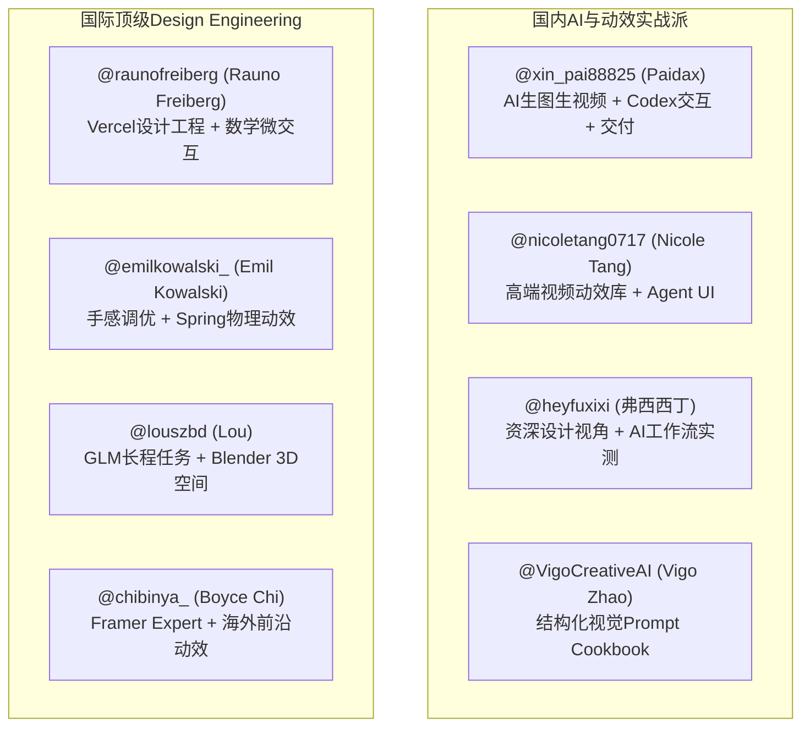
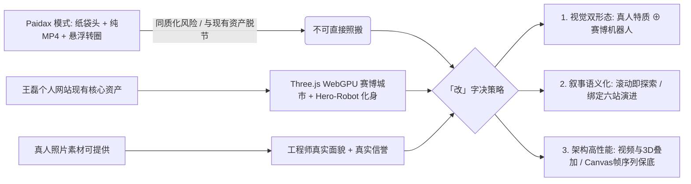

# 调研报告 X2-DISCOVER｜高级网页交互分享帖子与关键词发现

> **任务标识**：X2-DISCOVER  
> **报告日期**：2026-09-02  
> **研究对象**：以 @xin_pai88825 (Paidax)「IP 角色 + 首尾帧 + Codex 交互」帖子为起点，推导关键词矩阵，系统化检索 2025–2026 年全网同类高水准网页交互分享、沉淀可持续追踪作者与资产池，并研判趋势。

---

## 1. 关键词推导与中英双语矩阵（共 48 组）

从 Paidax 主帖、引帖、飞书知识库（01/02/03）、组件库推荐帖及业界最新实践中，系统化抽离出 4 组共 48 个核心关键词，覆盖交互控制、资产生成、工程工具链与视觉风格，并标注各词的最佳检索平台。

### 1.1 交互机制（Interaction Mechanics，共 14 个）

| 序号 | 中文概念 | 英文标准词 / 术语 | 核心定义与场景 | 推荐搜索平台 |
| :--- | :--- | :--- | :--- | :--- |
| 1 | **鼠标控制视频进度** | Pointer-driven video scrub / Cursor video scrubbing | 通过鼠标或触控指针横向/纵向位移映射驱动 `video.currentTime` 逐帧播放 | X / Google / GitHub |
| 2 | **滚动驱动视频播放** | Scroll-driven video playback / Scroll video scrub | 视口滚动进度（Scroll Progress）精准解算为视频播放时间 | Google / GitHub / Codrops |
| 3 | **粘性吸附滚动叙事** | Sticky scrollytelling / Pinned scroll section | 利用 `position: sticky` 锁住全屏视口，在长滚动区间内完成多阶段分镜切换 | Google / Codrops / X |
| 4 | **首尾帧过渡衔接** | First-to-last frame transition / Seamless keyframing | 利用图生视频首尾关键帧对齐，实现页面在不同状态或视口交界处的平滑转场 | X / 小红书 / Google |
| 5 | **鼠标光标跟随交互** | Cursor follow interaction / Magnetic pointer effect | 元素、光影、微交互或 3D 头部跟随指针位置做弹性差值注视运动 | Google / GitHub / 21st.dev |
| 6 | **逐帧序列图播放** | Image sequence canvas scrub / Frame-by-frame canvas | 将视频拆解为连续 WebP/JPEG 序列并在 `<canvas>` 上通过 RAF 高性能重绘 | GitHub / Google / Codrops |
| 7 | **视频图层变亮混合** | Video blend-mode lighten / Screen blend video | 纯黑底视频无需透明通道，通过 CSS `mix-blend-mode: screen/lighten` 融入背景 | 小红书 / Google / X |
| 8 | **视差滚动与镜头推进** | Parallax scroll / Camera dolly-in zoom | 滚动时前景主体与背景产生不同速度的位移与景深放缩 | Google / Awwwards / X |
| 9 | **指针事件平滑插值** | Pointer events RAF interpolation / Lerp smoothing | 结合 `requestAnimationFrame` 与线性插值（lerp），防高频 seek 引起的卡顿与掉帧 | GitHub / Google |
| 10 | **状态机驱动交互** | State machine interaction / Blend state animation | 结合 Rive 或 PAG 将指针位置作为状态机输入参数，混合多种动画姿势 | GitHub / Google / Rive |
| 11 | **陀螺仪重力感应倾斜** | Device orientation tilt / 3D Gyro tilt | 移动端利用加速度计/陀螺仪驱动视差和视频进度的小幅晃动 | GitHub / Google / X |
| 12 | **磁吸悬停与弹性回弹** | Magnetic button / Fluid spring hover | 按钮或卡片在光标接近时产生磁力吸附并在移出时物理弹簧回弹 | 21st.dev / React Bits / X |
| 13 | **平滑滚动虚拟进度** | Smooth virtual scroll / Lenis scroll progress | 使用 Lenis / Locomotive Scroll 获得归一化的平滑滚动进度值（0~1） | GitHub / Google |
| 14 | **离屏渲染与帧预加载** | Offscreen canvas rendering / Video pre-buffering | 提前在内存或离屏 Canvas 缓冲下一分镜帧，消除首屏黑屏或网络等待 | GitHub / Google |

### 1.2 资产生产（Asset Generation & Workflow，共 12 个）

| 序号 | 中文概念 | 英文标准词 / 术语 | 核心定义与场景 | 推荐搜索平台 |
| :--- | :--- | :--- | :--- | :--- |
| 15 | **IP 角色一致性生成** | Consistent character IP generation / Character reference | 通过多视角图生图、LoRA 或固定种子维持同一角色在不同姿态下的一致性 | 小红书 / X / Google |
| 16 | **首尾帧图生视频** | Keyframe-to-keyframe image-to-video / Start-end frame I2V | 指定起始帧（姿态 A）与结束帧（姿态 B），由 AI 模型补全中间运镜与形变 | X / 小红书 / Google |
| 17 | **蓝橙互补电影布光** | Teal and Orange cinematic lighting / Dual-tone studio light | 暖琥珀/焦糖色主光配合深钴蓝/午夜蓝环境光，营造强烈电影感与立体感 | X / 小红书 / Midjourney |
| 18 | **匿名符号化人像** | Anonymous stylized portrait / Paper bag hero avatar | 用纸袋、头盔或半遮挡符号隐藏真实面部，营造复古极客或神秘感 | X / 小红书 / Pinterest |
| 19 | **AI 局部重绘修手** | AI inpainting & hand fix / Reference image hand swap | 针对 AI 容易崩坏的手部和微小结构进行局部重绘与替换融合 | 小红书 / Google / X |
| 20 | **留白负空间构图** | Negative space composition / Hero visual breathing room | 主体占据画面 40%~50%（如中右侧），左侧留出大面积暗色空间放置 Slogan | Google / Pinterest / X |
| 21 | **可灵动作控制** | Kling AI Motion Control / Kling I2V motion brush | 使用可灵 AI 的骨骼或动作参考视频精确控制生成人物的肢体动作 | 小红书 / X / Google |
| 22 | **Seedance 形体生成** | Seedance character choreography / AI dance motion | 针对人物肢体动作、连贯步伐和姿态过渡的 AI 视频生成工具链 | X / 小红书 / Google |
| 23 | **Google Veo 电影运镜** | Google Veo cinematic camera / Veo video generation | 支持高级提示词指令的电影级视频生成模型，擅长景深与平滑推拉运镜 | Google / X / YouTube |
| 24 | **透明通道与绿幕抠像** | Green screen chroma key / Alpha video matte / WebM Alpha | 生成绿幕背景视频后通过 AE / ffmpeg 提取透明 Alpha 通道 | 小红书 / Bilibili / Google |
| 25 | **AE 骨骼绑定与 BMP 预合成** | AE rigging / PAG BMP pre-composition | 在 AE 中完成精细动效，将复杂粒子/插件图层打包为 BMP 预合成导出 PAG | 小红书 / Bilibili / 语雀 |
| 26 | **3D 高斯泼溅与点云化身** | 3D Gaussian Splatting (3DGS) web hero | 将真人多角度拍摄转化为轻量级 3D 高斯泼溅点云，在网页端实时旋转查看 | X / Google / GitHub |

### 1.3 工具链与交付（Toolchains, Component Libraries & Formats，共 12 个）

| 序号 | 中文概念 | 英文标准词 / 术语 | 核心定义与场景 | 推荐搜索平台 |
| :--- | :--- | :--- | :--- | :--- |
| 27 | **Codex 交互生成** | Codex web interaction prototyping / Cursor Agent | 通过结构化提示词让 Codex / Cursor 直接生成完整的 RAF 交互逻辑 | X / GitHub / Google |
| 28 | **Claude Code 终端编排** | Claude Code agentic coding / Agent skills | 终端级 Agent 编程工具，配合 Skill 执行自动化设计提取与代码重构 | X / GitHub / Google |
| 29 | **Cursor 作品集构建** | Cursor Vibe Coding portfolio / AI web scaffold | 纯自然语言描述、依托现有 UI 库与规范快速迭代出高质感作品集 | X / 小红书 / YouTube |
| 30 | **网页转 design.md** | `web-to-design-md` skill / Design system extraction | 提取线上网页 DOM/CSS 变量生成 design.md 规范供 AI 编码调用 | GitHub / X / Google |
| 31 | **21st.dev 组件库** | 21st.dev React component registry | 面向 Design Engineer 与 AI 编码的开源精选 React/shadcn 组件集合 | Google / GitHub / X |
| 32 | **React Bits 动效组件库** | React Bits animated components (reactbits.dev) | 专为 Vibe Coding 打造的高质感背景、文本与卡片微动效开源库 | GitHub / Google / X |
| 33 | **motion.dev 动效库** | motion.dev (Framer Motion) declarative animations | 现代 Web 声明式动画标准库，支持布局动画、手势与弹簧物理 | GitHub / Google |
| 34 | **腾讯 libpag 跨平台动效** | Tencent libpag AE-to-web / WebAssembly canvas | 腾讯开源的 AE 动效导出标准，基于 Wasm+WebGL 在 Canvas 高性能还原 | GitHub / 小红书 / 语雀 |
| 35 | **Rive 实时交互状态机** | Rive interactive runtime / State machine blend | 轻量级矢量交互运行时，支持基于鼠标变量的多向骨骼动画实时融合 | Google / X / YouTube |
| 36 | **GSAP 滚轮解算插件** | GSAP ScrollTrigger timeline / scrub: 1 | 前端最稳健的滚动触发与时间轴编排库，完美处理虚拟阻尼与 scrub | Google / Codrops / GitHub |
| 37 | **Remotion 编程式视频** | Remotion React-driven video / Video-shotcraft | 用 React 代码编排镜头、文字与动画，支持分镜模板与自动化渲染 | GitHub / X / Google |
| 38 | **高颜值 UI 组件库集** | beUI / BoardUI / ThreeUI / Watermelon UI / HeroUI | 专为 Vibe Coding 打造的开箱即用 3D、数据看板与现代动效库 | X / Google |

### 1.4 视觉语汇与设计系统（Visual Semantics & Design Systems，共 10 个）

| 序号 | 中文概念 | 英文标准词 / 术语 | 核心定义与场景 | 推荐搜索平台 |
| :--- | :--- | :--- | :--- | :--- |
| 39 | **纸袋头极客美学** | Paper bag anonymous geek aesthetic | 匿名纸袋、双眼孔、利落正装与复古座椅构成的极具辨识度的视觉符号 | Pinterest / X / 小红书 |
| 40 | **电影感人像 Hero 首屏** | Cinematic portrait hero section / Editorial photography | 50-65mm 电影镜头感、浅景深、低调曝光的高级感人物主视觉首屏 | Awwwards / Land-book / X |
| 41 | **新黑色电影科幻美学** | Neo-noir cyberpunk editorial photography | 浓郁午夜蓝、琥珀色轮廓光、体积雾与硬朗阴影构成的赛博黑色风格 | Midjourney / Pinterest / X |
| 42 | **深色极简作品集** | Dark mode minimalist developer portfolio | 纯黑/深钴蓝背景、高对比白字、克制色彩与大留白的工程师作品集 | Land-book / Awwwards / X |
| 43 | **线性设计高级工艺** | Linear-style high-craft UI / Blueprint grid | 细微 1px 边框、暗色发光、微磨砂玻璃与精密网格对齐的设计工程学质感 | Google / X / Awwwards |
| 44 | **流体发光与拟态毛玻璃** | Glow gradients & fluid glassmorphism | 鼠标跟随的环境泛光、动态径向渐变与磨砂质感卡片 | 21st.dev / X / Dribbble |
| 45 | **胶片颗粒与体积光晕** | Film grain & volumetric haze render | 模拟 35mm 胶片噪点与光学光晕散射，消除 AI 生图的塑料感与“AI味” | Google / Midjourney / X |
| 46 | **视差卡片堆叠与 Bento** | Parallax Bento grid / Card stack transition | 滚动时呈现多层错落微动效的模块化 Bento 栅格结构 | React Bits / Awwwards / X |
| 47 | **触觉级微交互** | Tactile micro-interactions / Haptic feedback UI | 细致入微的点击形变、声效、回弹与焦点过渡手感 | X / animations.dev |
| 48 | **减弱动态偏好适配** | `prefers-reduced-motion` accessible fallback | 为易晕动人群及低功耗设备提供静态精美降级方案的无障碍标准 | Google / MDN / GitHub |

---

## 2. 同类高水准帖子与项目清单（24 条）

经过系统检索 X、Codrops、Awwwards、GitHub、小红书与专业设计博客，精选出 2025–2026 年 24 条具有极高参考价值的同类分享。

| 序号 | 平台 | 作者 / 账号 | URL | 日期 | 一句话内容 | 形态 | 是否有视频/源码 | 相关度 (1-5) | x-account-archive 建议 |
| :---: | :---: | :---: | :---: | :---: | :--- | :---: | :---: | :---: | :---: |
| 1 | **X** | Paidax (@xin_pai88825) | [x.com/xin_pai88825/status/2095003945563566433](https://x.com/xin_pai88825/status/2095003945563566433) | 2026-09-02 | IP角色生成+首尾帧优化页面过渡+Codex交互串联完整工作流 | 教程视频+知识库 | 视频(113s)+飞书文档 | **5.0** | 极高（核心主帖） |
| 2 | **X** | Paidax (@xin_pai88825) | [x.com/xin_pai88825/status/2092190359300542824](https://x.com/xin_pai88825/status/2092190359300542824) | 2026-08-25 | "尝试用鼠标控制你的网页"，首屏鼠标水平位移与滚动控制视频播放成品录屏 | 成品 Demo 录屏 | 视频(27s) | **5.0** | 极高（被引帖） |
| 3 | **X** | Paidax (@xin_pai88825) | [x.com/xin_pai88825/status/2093227487354298480](https://x.com/xin_pai88825/status/2093227487354298480) | 2026-08-28 | 盘点 Vibe Coding 动效组件库（beUI / BoardUI / ThreeUI / Fluid Functionalism） | 资源清单/推荐 | 多张高清图+飞书链接 | **4.0** | 高 |
| 4 | **X** | Paidax (@xin_pai88825) | [x.com/xin_pai88825/status/2064199368941748323](https://x.com/xin_pai88825/status/2064199368941748323) | 2026-06-15 | 从零搭建高颜值前端组件系统与设计规范，约束 AI 避免样式跑偏 | 深度教程视频 | 视频教程 | **4.0** | 高 |
| 5 | **X** | Nicole Tang (@nicoletang0717) | [x.com/nicoletang0717/status/2094089751817232710](https://x.com/nicoletang0717/status/2094089751817232710) | 2026-08-30 | 吐槽市面粗糙动效，展示正在研发的高品质视频动效库与 Agent UI 组件 | 预告+成品 Demo | 演示视频(24s) | **4.5** | 极高 |
| 6 | **X** | Lou (@louszbd) | [x.com/louszbd/status/2093047548550525165](https://x.com/louszbd/status/2093047548550525165) | 2026-08-27 | GLM-5.3-Flash 跑 12 小时自建 Blender 3D 梦幻厨房与 Skyline 酒吧，16 固定机位运镜 | 成品 Demo + Prompt | 视频+HTML文档+Prompt | **4.0** | 高 |
| 7 | **X** | 弗西西丁 (@heyfuxixi) | [x.com/heyfuxixi](https://x.com/heyfuxixi) | 2026-08-15 | 资深设计师视角实测 AI 网页开发、设计工作流重塑与 Vibe Coding 落地价值 | 评测与经验分享 | 图文+案例拆解 | **4.0** | 高 |
| 8 | **X** | Boyce Chi (@chibinya_) | [x.com/chibinya_/status/2092469148563710106](https://x.com/chibinya_/status/2092469148563710106) | 2026-08-26 | 点评 Framer 视频滚轮交互灵感与独立产品动效设计实践 | 案例讨论/分析 | 配图+作品集链接 | **3.5** | 中 |
| 9 | **X** | Vigo Zhao (@VigoCreativeAI) | [x.com/VigoCreativeAI](https://x.com/VigoCreativeAI) | 2026-08-20 | AI 原生视觉系统与 Prompt Cookbook，系统化沉淀 3D/人像/光影风格化提示词 | 提示词库/开源设计 | GitHub Prompt 库 | **4.0** | 高 |
| 10 | **X** | Rauno Freiberg (@raunofreiberg) | [x.com/raunofreiberg](https://x.com/raunofreiberg) / [rauno.me/craft](https://rauno.me/craft) | 2026-07-10 | Vercel 首席设计工程师分享顶级微交互、光标物理跟随与流体动效的数学解法 | 交互原理解析+Live Demo | 交互网站+源码片段 | **4.5** | 极高 |
| 11 | **X** | Emil Kowalski (@emilkowalski_) | [x.com/emilkowalski_](https://x.com/emilkowalski_) / [animations.dev](https://animations.dev) | 2026-06-25 | 网页动效与手感调优（Animations on the Web），手把手教学 spring 弹簧物理与姿态过渡 | 教程与微交互库 | 交互式教程+开源组件 | **4.5** | 极高 |
| 12 | **X** | Julien Thibeaut (@ibelick) | [x.com/ibelick](https://x.com/ibelick) / [ui.ibelick.com](https://ui.ibelick.com) | 2026-07-28 | 发布高质感 React/Tailwind 渐变发光、卡片视差与光标跟随动效组件 | 开源组件库 | 源码+在线预览 | **4.0** | 高 |
| 13 | **Codrops** | Manoela Ilic / OPTIKKA | [tympanus.net/codrops/2025/10/16/...](https://tympanus.net/codrops/2025/10/16/creating-smooth-scroll-synchronized-animation-for-optikka-from-html5-video-to-frame-sequences/) | 2025-10-16 | OPTIKKA 案例实战：从 HTML5 视频转向 Canvas 序列帧的高性能平滑滚动同步动画 | 深度技术教程 | 完整代码+Live Demo | **5.0** | 极高 |
| 14 | **Codrops** | KAI Design Dept. | [tympanus.net/codrops/2025/11/20/...](https://tympanus.net/codrops/2025/11/20/behind-the-kai-design-dept-experience-webgl-line-blur-video-scrubbing-and-3d-animation/) | 2025-11-20 | 揭秘 WebGL 动态模糊、视频拖拽/滚动 Scrubbing 与 3D 动画融合落地架构 | 幕后案例与架构解析 | Demo 链接+架构图 | **4.5** | 极高 |
| 15 | **Codrops** | Yurkevich / Codrops | [tympanus.net/codrops/2025/11/19/...](https://tympanus.net/codrops/2025/11/19/how-to-build-cinematic-3d-scroll-experiences-with-gsap/) | 2025-11-19 | 用 GSAP ScrollTrigger 与 Three.js 构建电影级 3D 视差与镜头推进长滚动体验 | 教程与工程样板 | GitHub 源码+CodePen | **4.5** | 极高 |
| 16 | **Codrops** | Codrops Team | [tympanus.net/codrops/2025/08/28/...](https://tympanus.net/codrops/2025/08/28/interactive-video-projection-mapping-with-three-js/) | 2025-08-28 | Three.js 交互式视频投影映射：将视频纹理实时投射到 3D 网格表面并响应指针 | 实验性教程 | GitHub 源码+在线预览 | **4.0** | 高 |
| 17 | **GitHub** | Paidax01 | [github.com/Paidax01/web-to-design-md](https://github.com/Paidax01/web-to-design-md) | 2026-04-18 | 网页一键提取 design.md 与视觉设计规范的 AI Agent Skill 开源工具 | 开源工具 | 完整 Python/Node 源码 | **4.5** | 极高 |
| 18 | **GitHub** | Paidax01 | [github.com/Paidax01/math-curve-loaders](https://github.com/Paidax01/math-curve-loaders) | 2026-05-12 | 数学曲线驱动的高级 CSS/Canvas 加载动效与交互组件库 | 开源组件库 | HTML/CSS 源码 | **3.5** | 中 |
| 19 | **GitHub** | Tencent / libpag | [github.com/Tencent/libpag](https://github.com/Tencent/libpag) / [pag.io](https://pag.io) | 2026-03-20 | 腾讯开源跨平台动效库：AE 插件直接导出 PAG 文件，Wasm+WebGL Canvas 渲染 | 开源基础设施 | SDK + 示例代码 | **4.5** | 极高 |
| 20 | **GitHub** | bigxixi | [github.com/bigxixi/webp_apng_exporter_for_AE](https://github.com/bigxixi/webp_apng_exporter_for_AE) | 2026-02-10 | After Effects 导出带透明通道 WebP 与 APNG 动效的生产级插件 | 开源设计工具 | 插件安装包与教程 | **3.5** | 中 |
| 21 | **Web** | Jackie Hu | [jackiehu.design](https://jackiehu.design) | 2026-05-01 | 极简高级感产品设计师作品集，全屏视差滚动、卡片交互与流畅微动效标杆 | 线上真实作品集 | 线上可直接交互体验 | **4.0** | 高 |
| 22 | **Web** | React Bits | [reactbits.dev](https://reactbits.dev) | 2026-06-10 | 专为现代 Vibe Coding 设计的 60+ 高级 React 动效与光影交互组件库 | 开源组件库 | React/Tailwind 源码 | **4.0** | 高 |
| 23 | **Web** | School of Motion / Rive | [schoolofmotion.com/blog/rive-pixel-art-tutorial](https://www.schoolofmotion.com/blog/rive-pixel-art-tutorial) | 2025-11-05 | 教程：使用 Rive 状态机与 Blend State 构建响应鼠标光标全向注视的 Hero 角色 | 教程与资产包 | Rive 源文件+React 代码 | **4.0** | 高 |
| 24 | **小红书** | Paidax (派大星) | 笔记 ID `690817a5…` & `683dc08b…` | 2026-03-20 | 高效且实用 IP 延展动效交付全流程 / AI 动效交付落地（变亮混合+PAG BMP） | 视频教程与图文笔记 | 视频演示+飞书图文 | **4.5** | 极高 |

---

## 3. 值得整账号归档的作者推荐（精选 8 位）

为后续利用 `x-account-archive` 工具执行自动化推文采集与知识沉淀，精选以下 8 位核心创作者：

### 3.1 详细评估与预计沉淀价值

1. **@xin_pai88825 (Paidax / 派大星)**
   - **定位**：AI 视觉生成与 Vibe Coding 交互落地的全能型践行者
   - **核心理由**：本次调研的直接发起源头。其账号具备完整的“Midjourney 提示词规范 → 首尾帧可灵图生视频 → AE 导出（变亮/PAG）→ Codex RAF 交互编码”闭环实践，且持续开源了 `web-to-design-md`、`math-curve-loaders` 等工具。
   - **预计价值**：极高。归档其全部推文、评论区答疑及引用的飞书/GitHub 链接，可直接获取最新提示词模版和前端坑点解法。

2. **@nicoletang0717 (Nicole Tang)**
   - **定位**：前 TikTok 产品设计师、高质感 Agent UI 与视频动效库主理人
   - **核心理由**：直击“市面 AI 视频动效太粗糙、充满廉价 AI 味”的行业痛点，正在自研一套专供高端 Web 产品的视频动效库。
   - **预计价值**：极高。持续追踪其动效库的发布动态、视频编排规范以及组件封装思路，能为王磊个人网站提供最前沿的视觉审美标杆。

3. **@heyfuxixi (弗西西丁)**
   - **定位**：老牌资深设计师转型 AI 工具评测人
   - **核心理由**：经历过传统设计向 AI 设计的剧烈转型，擅长从“实用性、ROI、是否值得投入时间”等冷静视角评测 Cursor、Claude、各类生图生视频工具。
   - **预计价值**：高。帮助我们过滤掉各类“看似炫酷但工程不可用”的花哨概念，把精力集中在真正能稳定交付的技术栈上。

4. **@raunofreiberg (Rauno Freiberg)**
   - **定位**：Vercel 首席设计工程师（Staff Design Engineer）、`rauno.me/craft`
   - **核心理由**：全球 Design Engineering 领域的宗师级人物。其对光标跟随的阻尼感、网格吸附、物理弹簧、流体文字展开等微交互有着纯原生代码层面的极致雕琢。
   - **预计价值**：极高。提供顶级交互背后的数学建模、无依赖原生 JS/CSS 源码实现，是王磊个人网站从“能动”迈向“触觉级顺滑”的必备教材。

5. **@emilkowalski_ (Emil Kowalski)**
   - **定位**：animations.dev 创作者、Vaul / Sonner 作者
   - **核心理由**：将前端动效与手感调优（Craft）规则化，创建了广泛被 AI Coding Agent 引用的 `design-engineer` 规则库。
   - **预计价值**：极高。归档其关于 Framer Motion / Motion.dev 的最佳实践，直接赋能我们的 Astro 静态站动效开发。

6. **@louszbd (Lou)**
   - **定位**：GLM-5.3-Flash + 3D Blender 自动化建模探索者
   - **核心理由**：主导了“大模型长程运行 12 小时自建 Blender 3D 梦幻厨房与酒吧”的实验，探索了多机位渲染、固定视角分镜脚本（16 camera views）的提示词编排。
   - **预计价值**：高。为我们现有赛博朋克 3D 城市（three.js WebGPU）的运镜设计、多机位切换提供了前沿的自动化与分镜思路。

7. **@VigoCreativeAI (Vigo Zhao)**
   - **定位**：AI 原生视觉系统架构师、Prompt Cookbook 作者
   - **核心理由**：在 GitHub 开源维护了结构化 JSON Prompt Cookbook，系统化拆解了电影级光影（蓝橙布光、体积雾）、构图焦段与材质。
   - **预计价值**：高。王磊真人照片转赛博朋克风格化 IP 时的提示词工程单源参考。

8. **@chibinya_ (Boyce Chi)**
   - **定位**：Framer Expert / Partner、独立产品设计师
   - **核心理由**：密切关注 Framer / Webflow 国际前沿交互案例，常年搬运并拆解视频滚动、3D 视差等优秀独立站案例。
   - **预计价值**：中高。作为前沿灵感雷达，提供持续的案例输入。

---

## 4. Paidax 知识库其余相关页梳理与阅读优先级

从 Paidax 飞书知识库主目录（`https://gwrdluzl9j9.feishu.cn/wiki/GVHywtdn6iDaHjk1so9c77CCnxh`）及帖文链出的资源中，梳理出与“个人官网 / 人物 Hero / 视频交互 / 分镜运镜”相关的全部页面，并给出优先级评级：

| 优先级 | 页面 / 资源名称 | 来源 URL / 平台 | 核心内容概述 | 对王磊个人网站的指导意义 |
| :---: | :--- | :--- | :--- | :--- |
| **P0 (已读)** | 《作品集官网-生成鼠标可交互Hero》 | [Feishu FSGIwtVDwimeNSkTacPcmW5Rnpg](https://gwrdluzl9j9.feishu.cn/wiki/FSGIwtVDwimeNSkTacPcmW5Rnpg) | 纸袋头人像提示词、第二态、修手提示词、两段 Codex 交互代码（首屏横向位移控制与第二屏 sticky 滚动控制） | 交互与提示词核心骨架 |
| **P0 (已读)** | 《角色首尾帧交互效果》 | [Feishu IHP0wvVCgih0THk2MZzcGigAnrc](https://gwrdluzl9j9.feishu.cn/wiki/IHP0wvVCgih0THk2MZzcGigAnrc) | 角色图生视频提示词、Figma 设计稿、三种交付方案（变亮混合 / PAG BMP 预合成 / APNG）对比 | 视频转场与格式选型单源 |
| **P0 (已读)** | 《作品集官网提示词内容》 | [Feishu DdgVwtLhLiQZ9rkcJhycGRAynlc](https://gwrdluzl9j9.feishu.cn/wiki/DdgVwtLhLiQZ9rkcJhycGRAynlc) | `web-to-design-md` 安装与使用、官网设计专家三阶段提示词、组件库与 15+ 优秀设计师官网清单 | 网站架构与 IA 提示词体系 |
| **P1** | 《AI 视频精准控制：镜头语言、人物站位、视频运镜》 | 飞书主目录内（GVHywtdn6iDaHjk1so9c77CCnxh） | 详细拆解 AI 视频提示词中的机位（平视/低机位）、景别（中远景/特写）、运镜（推拉摇移）与人物站位控制 | 直接指导真人照片生成视频时的分镜精准度，避免画面随机崩坏 |
| **P1** | 《分镜提示词》 | 飞书主目录内（GVHywtdn6iDaHjk1so9c77CCnxh） | 针对多阶段叙事（如从坐姿工作到起身探索）的系统化分镜脚本编写模板 | 用于王磊“我是谁”长滚动区间的 3 段分镜脚本设计 |
| **P1** | 《AI快速引用组件库推荐》 | [Feishu HxxCwUBy0i3jwbkqxuxcdv6Jntb](https://gwrdluzl9j9.feishu.cn/wiki/HxxCwUBy0i3jwbkqxuxcdv6Jntb) | beUI、BoardUI、ThreeUI、Fluid Functionalism、Watermelon UI 等库的实际调用配置与 AI Prompt | 快速引入 3D 和看板组件，减少从零手搓时间 |
| **P1** | 《必看！如何流畅的完成动效交付》 | [语雀 aesgn0a9wsg8n8pe](https://www.yuque.com/paidaxin/dkopg8/aesgn0a9wsg8n8pe) | 动效落地全流程规范、AE 导出性能指标、避免内存泄漏与掉帧的实战总结 | 指导 GitHub Pages 静态网站的体积与渲染性能控制 |
| **P2** | 《小鳄鱼IP延展&视频动效交付》 | 飞书主目录内（GVHywtdn6iDaHjk1so9c77CCnxh） | 完整 IP 形象在多种 UI 状态（成功、加载、空状态）下的动效延展及落地实现 | 启发后续机器人化身（Hero-Robot）在不同页面的状态延展 |
| **P2** | 《设计师最爱 Vibe Coding 工具合辑》 | 飞书主目录内（GVHywtdn6iDaHjk1so9c77CCnxh） | 整理设计师常用的 AI 编程工具、MCP 插件与工作流加速技巧 | 提升后续前端模块开发效率 |
| **P2** | 《IP 交互动画设计》Figma 文件 | [Figma 社区 1618966258845768716](https://www.figma.com/community/file/1618966258845768716) | 角色交互动画的原型设计稿、图层切片与帧序列规划 | 查看其在设计稿阶段是如何规划首尾帧切分的 |
| **P3** | 《Gemini3网站快速部署上线》 | 飞书主目录内（GVHywtdn6iDaHjk1so9c77CCnxh） | 静态网站部署与域名解析教程 | 作为部署参考（我们已有 GitHub Pages Actions 流程） |
| **P3** | 《国内B端网站》参考清单 | [语雀 okwuls](https://www.yuque.com/paidaxin/dkopg8/okwuls) | 国内优秀 B 端与企业官网案例汇编 | 背景设计灵感参考 |

---

## 5. 趋势研判与应对策略（2026 态势）

### 5.1 2026 年态势：新潮流还是已泛滥？

#### 1. 时间分布与演进轨迹
- **2024 年（静态探索期）**：Midjourney / Stable Diffusion 生成精致 2D/3D 人像，网页端主要采用 CSS 视差或卡片倾斜等浅层交互。
- **2025 年（首尾帧破局期）**：可灵（Kling）、Runway Gen-3、Luma Dream Machine、Sora 及 Google Veo 陆续支持精准的**首尾帧（Start & End Frame）控制**，解决了 AI 视频动作不可控与循环缝合的难题。
- **2026 年（Vibe Coding 爆发期）**：随着 Cursor、Codex、Claude Code 等 Agent 工具的普及，设计师与前端工程师之间的代码壁垒被彻底打破。利用 RAF 编写 `video.currentTime` 映射的门槛降至数分钟，导致 X、小红书上此类视频交互 Demo 呈**井喷式爆发**。

#### 2. 国际顶级设计奖项（Awwwards / FWA / Codrops）现状
- **主流获奖作品**（如 Codrops 2025-10 的 *OPTIKKA*、2025-11 的 *KAI Design Dept.*）：普遍使用 **真实 4K 实拍电影素材** 或 **Three.js / WebGL 实时着色器**。行业最高标准对于“掉帧、卡顿、视频解码延迟”有极度严苛的容忍度，因此成熟项目正从简单的 HTML5 Video 转向 **Canvas 预解压 WebP 序列帧**。
- **AI 人物视频 Scrub 的生态位置**：在 Awwwards 依然属于**新鲜的前沿实验（Experimental / Cutting-edge）范畴**，尚未成为泛滥的工业标配；但在独立开发者与设计师社媒圈子中，由于模版化的传播，已经开始出现**严重的视觉同质化苗头**。

#### 3. 当前出现的同质化与体验缺陷
1. **视觉模板化**：“纸袋头 / 宇航员头盔 / 3D 拟物假人 + 蓝橙互补灯光 + 纯黑暗调 + 漂浮/转圈”正迅速沦为快餐式套路，缺乏真实的个人辨识度。
2. **形式大于内容（无语义动效）**：多数 Demo 仅仅是“为了展示能用鼠标控制视频而控制”，人物的动作（转头、比耶）与页面要表达的内容（技术能力、个人经历、项目成果）毫无内在逻辑关联。
3. **低配设备灾难**：未经优化的 H.264 长 GOP 视频在移动端 Safari 或核显电脑上拖拽时会出现严重的画面撕裂、掉帧与发热，破坏基础浏览体验。

---

### 5.2 对王磊个人网站的战略建议：**「改」（借骨换胎，深度融合）**

面对这一趋势，我们的策略既不是盲目跟风，也不是因噎废食地绕开，而是**借用其底层的技术精髓，彻底改写其视觉表象与交互叙事**：

#### 具体落地建议：

1. **视觉突破：摒弃“纸袋头”，采用“真人肖像 ⊕ 赛博机器人”双重化身**
   - **理由**：主人已确认可提供真人照片。个人网站的核心是建立**真实信任与专业技术形象**，纸袋头适合匿名设计师，但不适合技术领军者。
   - **做法**：以真人照片为基底，生成带有赛博朋克光影（蓝橙布光、体积雾、科技工作台）的真实人像 Hero；首屏人物在工作台前沉思/注视光标，滚动时无缝过渡为数字机器人化身（与现有 `hero-robot` 模型呼应），完成从“现实世界架构师”到“赛博城市探索者”的身份转换。

2. **叙事升维：让视频 Scrub 成为“六站演进”的导航仪，而非纯背景动效**
   - **理由**：拒绝无意义的“转圈/比耶”。
   - **做法**：将长滚动区间的视频进度与“我是谁”的核心内容（六站演进、三支柱）严格对齐。向下滚动时，画面中的镜头随着人物推入多屏工作站，每一个滚动停靠点（Snap Point）对应一段文字卡片的展开，实现真正有信息密度的 **Scrollytelling**。

3. **技术保底：采用“视频/Canvas 混合 + 优雅降级”的健壮架构**
   - **理由**：GitHub Pages 为纯静态托管，必须保证全球各端秒开与 60 FPS 流畅度。
   - **做法**：
     - **视频压制**：严格采用 H.264 All-Intra（全关键帧，GOP=1）或极短 GOP 压制，控制总时长在 3~5 秒内，体积压在 2~3MB 以内；
     - **Canvas 序列帧方案作为备选**：对关键过渡段采用 WebP 序列帧 + Canvas RAF 渲染（参考 Codrops OPTIKKA 方案），彻底根除移动端 seek 延迟；
     - **降级支持**：严格遵循 `prefers-reduced-motion`，在低端设备或减弱动态模式下直接展示高质量海报帧（Poster）与静态排版，确保 Lighthouse 评分不降。

---

## 6. 结论与下一步行动建议

1. **关键词体系已就绪**：48 组中英双语关键词已覆盖交互、生图生视频、工具链及视觉语汇，可直接用于后续定向检索与 Prompt 构建。
2. **已建立 24 条高价值标杆资产库**：覆盖了从 Paidax 核心链路到 Codrops 工业级落地的完整谱系。
3. **整账号归档执行**：建议下一步使用 `x-account-archive` 优先对 `@xin_pai88825`、`@nicoletang0717`、`@raunofreiberg` 和 `@emilkowalski_` 进行完整推文与多媒体素材抓取。
4. **王磊方案改写（对接 X1-DISSECT）**：将本报告推导的“真人 ⊕ 赛博机器人双形态”与“语义化长滚动分镜”直接注入到 `dissect.md` 的改写方案中。
