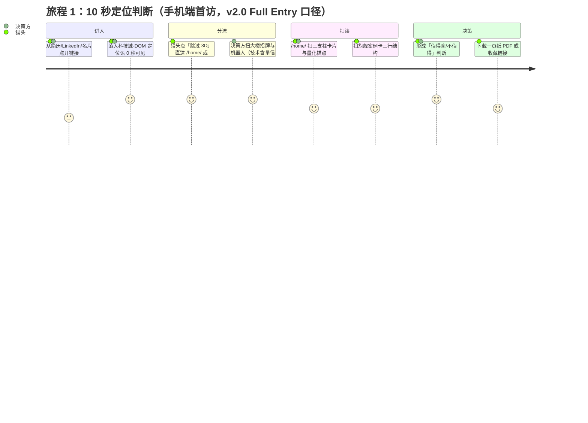
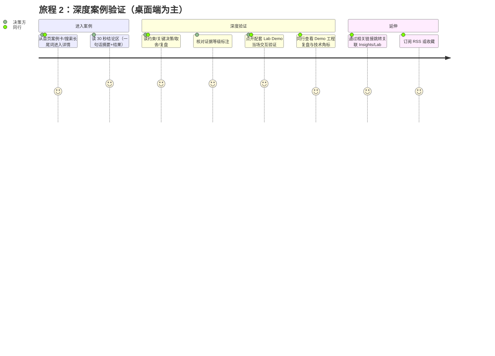
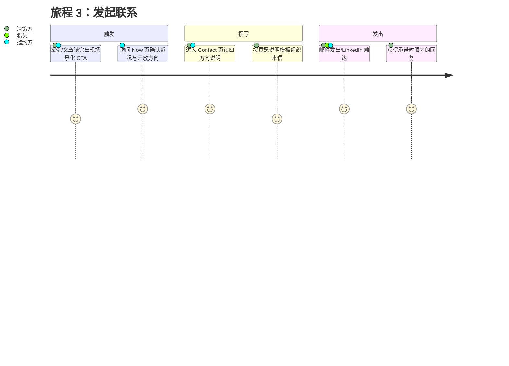

# 产品需求文档（PRD）｜王磊个人网站——个人专业信用系统

---

## 1. 文档信息

| 项 | 内容 |
|----|------|
| 文档名称 | 王磊个人网站产品需求文档（Product Requirements Document） |
| 版本 | v2.0 |
| 状态 | 终裁落稿（王磊 2026-08-25 拍板 D1–D6，Full Entry 科技城正式立项） |
| 起草日期 | 2026-08-24 |
| 产品负责人 | 王磊 |
| 目标读者 | 站点所有者（王磊）、开发执行代理（Cloud Agent）、内容生产协作者、后续迭代的任何贡献者 |
| 关联文档 | **`docs/spec/SRD.md`**（系统需求文档；**v2.0 已同步升级为 Full Entry 科技城口径**） |
| 上游输入 | `docs/website-plan/master-plan.md`（建站总纲）、`docs/website-plan/mvp-checklist.md`、`docs/website-plan/positioning-onepager.md`、`docs/website-plan/case-outlines.md`、`docs/website-plan/material-security-grading.md`、`docs/research/homepage-redesign-spec.md`、`docs/research/portfolio-inspiration-community.md`、`docs/research/portfolio-inspiration-index.md`；v1.1 起新增：`docs/research/bruno-simon-teardown-adaptation.md`（Hybrid 路线决策来源）、`docs/research/bruno-simon-teardown-index.md`；**v2.0 起新增：`docs/research/cyber-city-hero-design-proposal.md`（Full Entry 科技城设计提案 + 王磊 D1–D6 终裁，本版核心决策来源）、`docs/research/cyber-city-implementation-plan.md`（科技城实施计划，CC-IMPL1 已合入）、`docs/research/cyber-city-competitive-research.md`、`docs/research/cyber-city-hero-fable5-tasks.md`** |
| 冲突裁决 | 定位与红线以 `master-plan.md` 为准；本 PRD 负责产品范围、功能清单与路线图。范围冲突时先修订本 PRD 再动工。**v2.0 起：凡涉及 3D 世界/首页形态/炫技边界的条款，与本文旧表述或任何上游文档冲突时，一律以 §2.6「Full Entry 决策与新三层承诺」为准（王磊终裁 D1–D6）；v1.1「Hybrid 三层承诺」中与 Full Entry 冲突的字面条款（否决 Full Bruno Clone、进入永远 opt-in 独立路由）自本版起废止，其精神内核（信息可达、猎头路径、内容永不只在 3D）由新三层承诺继承** |

**版本修订记录**

| 版本 | 日期 | 修订内容 | 修订人 |
|------|------|---------|--------|
| v1.0 | 2026-08-24 | 初版：完整产品愿景、65 条功能需求、Lab 路线图、MVP/V1/V2 切分 | 云端子代理 |
| v1.1 | 2026-08-24 | **正式采纳 Hybrid 路线**（决策依据：`bruno-simon-teardown-adaptation.md` 第 9 章决策表，用户已确认）。新增 §2.6 三层承诺；§5.2 URL 结构加入 `/world/`；功能表新增 HOME-10（Start here 入口）、LAB-16（`/world/` 智能座舱试验场，Hybrid 旗舰 Lab）、LAB-17（车↔机器人 morph）、LAB-18（跳过/降级路径），合计 65→69 条；§7.2 Lab 路线图追加第 9 项构想并新增 §7.4 三阶段路线（A/B/C）；§9.3 V2 范围更新；§10 KPI 增设世界子指标与冻结阀门；§11 Out of Scope 增补 Full Clone 禁令与 opt-in 例外注记；附录 B bruno-simon 行由「反面教材」改评为「模式参考 + Hybrid 边界说明」。落实 adaptation 文档 §10.1 修订项 P1–P5 | 云端子代理 |
| v1.1.1 | 2026-08-24 | **P0 审计修订**（依据 `docs/spec/audit-report-v1.1.md` §9）：**P0-1** 案例 12 模块改以 master-plan §4.1 为唯一事实源——WORK-02 改为引用编号、不再复制清单；WORK-07 精简集更正为 1/2/6/9/10；GOV-05「信息边界」由模块改为发布件；§2.3/§4 旅程 2 模块措辞与编号对齐 canonical。**P0-2** §7.4 Phase A Spike 资产门禁统一为「`public/world/` 新增 ≤ 1MB + CarConcept 3.5MB 复用显式豁免」。**P0-4** GLB-03 RSS 范围改按 SRD 口径（work 不进 RSS；`<description>` 用 frontmatter description，全文不入 feed） | 云端子代理 |
| v2.0 | 2026-08-25 | **Full Entry 智能座舱科技城**（王磊终裁 D1–D6，决策来源 `cyber-city-hero-design-proposal.md` §6）：**D1** `/` 即全屏赛博风格「智能座舱科技城」世界（推翻 v1.1「否决 Full Bruno Clone」与「进入永远 opt-in 独立路由」字面禁令，改为「`/` 即世界 + DOM 跳过出口保猎头路径」）；**D2** 首屏中央擎天柱气质机器人（公共素材 CC0/MIT，零 Transformers 商标），点击变形为汽车；**D4** 变形后落在科技城十字路口，有操作提示、可 WASD 驾驶；主题大楼扩展为 **10–20 栋可扩展地图**（多语种/TTS/Master Agent/智驾等产品线），驶入停车场后进展示页；**D5** §11 原「赛博朋克主题」禁令改为领域强相关「座舱科技城」白名单；**D6** 接受 `/` Lighthouse Performance 分层考核。§2.6 重写为「Full Entry 科技城 + HTML 宪法备份」新三层承诺；新增 §6.1 CITY-01~11 功能组（吸收 LAB-16/17/18，HOME-10 废止）；原首页五区块 HTML 信用系统内容**迁移至 `/home/`（迁移不删除）**；§7.4 三阶段路线改为科技城 Phase 0/1/2/3；§10 KPI 与 10 秒定位改为「DOM 定位语 + 跳过出口」口径；§11 Out of Scope 相应改写（保留「内容永不只在 3D」） | 云端子代理（Fable5） |

---

## 2. 产品愿景与定位

### 2.1 一句话愿景

**这不是一个简历站，而是一套「个人专业信用系统」——用可交互、可验证、可复用的证据，持续累积「王磊 = 汽车智能座舱 × 多语种 × 端云大模型 × AI 原生工作流」的专业信用。**

简历回答"我做过什么职位"；本产品回答三个更值钱的问题：**我能为你解决什么问题、凭什么信我、如何与我合作。**

### 2.2 四大产品作用

| # | 作用 | 回答的问题 | 站内承载 | 成功标志 |
|---|------|-----------|---------|---------|
| 1 | 职业定位 | 我是谁？在哪个交叉领域不可替代？ | `/` 科技城 DOM 定位 HUD（0 秒可见）、`/home/` 首屏、About | 访客 10 秒内能复述定位 |
| 2 | 能力证明 | 凭什么信我？证据在哪？ | Work 案例库（12 模块 + 证据等级）＋ **AI Lab 可交互证据** | 案例与 Demo 被猎头/合作方在沟通中主动引用 |
| 3 | 知识影响力 | 我对行业有什么独立判断？ | Insights 观点文章、AI Lab 实验记录 | 文章被搜索/转发带来自然流量 |
| 4 | 关系转化 | 看完之后下一步做什么？ | Contact、Now 模块、各页 CTA | 每月产生高质量 inbound 联系 |

### 2.3 与传统简历站的本质差异

| 维度 | 传统简历站 | 本产品 |
|------|-----------|--------|
| 组织原则 | 按时间罗列职位职责 | 按「解决了什么问题」组织，履历时间线仅是 About 附属 |
| 能力表述 | 技能条、关键词堆叠 | 12 模块案例叙事 + 证据等级（L1–L4）如实标注 |
| 技术能力证明 | 「精通 XX」文字自述 | **AI Lab 可运行 Demo**：16 语种 TTS 座舱可视化、WebGPU 3D 车辆配置器——浏览器里当场验证 |
| 判断力证明 | 无 | 每个案例的「关键决策点/备选方案与取舍/复盘与迁移」模块（master-plan §4.1 编号 7/5/11）+ Insights 可证伪观点 |
| 生命周期 | 求职时更新一次 | Now 模块每月更新、内容双周更新——「活的网站」本身是信号 |
| 信任机制 | 请读者相信 | **证据链产品规则**：文字主张（Work）↔ 可交互证据（Lab）双向挂钩 |

### 2.4 定位公式（产品设计总纲）

> **像 PM 一样叙事，像工程师一样交付，像设计师一样克制。**（社区调研 §5.1 结论）

- **叙事层**：全站内容采用「问题 → 判断 → 方案 → 量化结果」结构，解决方案岗的货币是判断与数字；
- **交付层**：AI Lab 的可运行 Demo 是本产品相对纯 PM Portfolio 的最大差异化——证明「解决方案经理 + AI」不是 PPT 词汇；
- **克制层**：所有炫技必须通过三连问检验——加载要多久？移动端会不会碎？信息获取是否被交互绑架？炫技的唯一放行条件是「**炫的正是我卖的能力**」。

### 2.5 关于「引子 Demo」的产品认知（关键）

当前已上线的 `/lab/tts-cockpit`（16 语种 TTS × 座舱可视化）与 `/lab/car-configurator`（WebGPU 3D 车辆配置器）在产品层的定位是**引子（Teaser）**，不是终点：

1. 它们首先证明一件事：**「我能把复杂技术做成可交互证据」**——这个元能力本身就是解决方案经理的核心卖点；
2. 它们是 AI Lab 模块的**起点资产**：验证了「重型演示内页化 + 首页轻量入口卡」的产品模式可行；
3. 完整愿景是一个**持续生长的实验室**：围绕三支柱（智能座舱多语种 / 端云大模型 / AI 原生工作流）陆续上线 6–10 个 Lab，每个 Lab 与一篇 Work 案例或 Insights 文章形成「主张—证据」闭环（详见第 7 章）；
4. **v2.0 增补**：两个引子 Demo 的资产与管线直接成为科技城的「腿」——配置器的 CarConcept 车模 = 城内玩家载具（变形后形态），TTS 语料 = Voice Pod 大楼的环境音源；引子 Demo 验证的「WebGPU 优先 + 分级降级 + 离线预生成」三条工程纪律原样约束科技城（CITY-*）。

### 2.6 Full Entry 决策与新三层承诺（v2.0 重写，王磊终裁 D1–D6）

王磊已于 2026-08-25 **终裁拍板**（决策来源：`docs/research/cyber-city-hero-design-proposal.md` §6 决策锁定表）：**打开 website `/` 就是全屏赛博风格「智能座舱科技城」**——霓虹天际线下，中央一尊擎天柱气质的座舱 AI 机器人（公共素材，非 IP 复刻）站岗；点击变形为汽车，落在科技城十字路口，有操作提示、可 WASD 驾驶；10–20 栋可扩展主题大楼（多语种、TTS、Master Agent、智驾等产品线）环布城中，驶入大楼停车场后进入对应展示页。

**与 v1.1 的关系（诚实交代）**：本决策**推翻** v1.1 的两条字面禁令——「否决 Full Bruno Clone（全屏 3D 作为首页/唯一入口）」与「进入世界永远是 opt-in 独立路由」。但 v1.1 三层承诺的**精神内核一条不丢**：信息可达性、猎头 30 秒路径、「内容永不只在 3D」全部由下述新三层承诺继承并升级执行。改变的是首页形态（`/` 即世界 + DOM 跳过出口保猎头路径），不变的是信用系统的底线。

以下**新三层承诺**自 v2.0 起为产品最高原则，与本文其他条款或任何上游文档冲突时以本节为准：

| # | 承诺 | 产品含义 |
|---|------|---------|
| 新承诺一 | **`/` 即世界，HTML 是宪法备份** | website 根路径 `/` 就是全屏科技城（Full Entry，D1）——不再有「先 HTML 首页、再 opt-in 进世界」的两段式。同时，原首页五区块 HTML 信用系统内容**完整迁移至 `/home/` 或对应内容页（迁移，不从产品中删除）**：`/home/` 与 Work/Insights/About/Contact 全部内容页保持纯 HTML 形态、对 3D 零字节依赖、Lighthouse 四项 ≥ 95。3D 世界仍不承载任何「只在世界里才能获取」的信息——城里能看到的每一条内容，HTML 路径两跳内必达；关停整座城，信用系统零损失（SRD AP-3 解耦原则延续） |
| 新承诺二 | **跳过出口第 0 秒可用，猎头路径寸土不让** | `/` 的信息层全部走 **DOM 霓虹 HUD**（不进 canvas）：定位语（「王磊｜汽车智能座舱与 AI 解决方案经理」）在 canvas 首帧之前即渲染、永不被 3D 遮挡；右上角「跳过 3D」出口自第 0 秒起可点、键盘 Tab 第一焦点，直达 `/home/`（或 `/work/`）；reduced-motion / 无 WebGL2 / saveData / noscript 一律直达降级路径。10 秒定位测试与猎头 30 秒路径在 `/` 上以「DOM 定位语 + 跳过出口」口径达成（§10 指标 1 新口径）——**炫技接管视觉，永不接管信息** |
| 新承诺三 | **城市必须自证信用——楼即产品线，车即交付力** | 赛博视觉不是模板皮肤，而是「座舱研发城」的领域隐喻：每栋主题大楼 = 一条真实产品线 POI（多语种 = Lingua Tower、座舱 TTS = Voice Pod、Master Agent = Agent Nexus、智驾 = AutoDrive Lab……扩展至 10–20 栋），楼内展示页挂证据链（案例/Lab/文章 + 证据等级徽章）；机器人 = 座舱 Master Agent 人格化，变形为车 = 量产交付载体（LAB-17 端云叙事升格为首屏第一幕）。城市的工程复盘本身成为旗舰级 ai-lab 文章与对外传播资产——「网站即案例」直接服务北极星指标 |

对用户愿景的落实声明：v1.1 曾修正「首页打开 = 3D 炫技」为「车在首页是名片，进了试验场才是玩具」；**v2.0 撤销该修正**——首页打开就是世界，名片与玩具合一。代价与对策：`/` 的 Lighthouse Performance 接受分层考核（D6，见 §10/GLB-08 新口径），猎头路径以新承诺二的 DOM 壳机制保底，`/home/` 与内容页维持四项 ≥ 95 不动摇。

---

## 3. 目标用户与 Persona

产品服务四类核心用户。四类用户的阅读节奏、信任触发点、转化动作完全不同，功能设计必须让每类用户「各取所需、互不干扰」。

### Persona 1：OEM / Tier1 采购与合作决策方（「张总监」）

| 项 | 内容 |
|----|------|
| 画像 | 主机厂智能座舱部门总监 / Tier1 解决方案部门负责人，40 岁上下，评估外部合作或顾问资源 |
| 进站场景 | 经同行推荐或会议交换名片后，用手机打开链接；也可能由下属转发某篇案例 |
| Jobs-to-be-Done | **当**我需要为多语种座舱 / 端云大模型项目寻找靠谱的外部方案能力，**我想要**快速验证此人是否真的做过量产级项目、判断力是否在线，**以便**决定是否值得安排一次正式沟通 |
| 关键信任触发点 | 案例中的「约束条件、取舍、失败复盘」——只有真做过的人才写得出；证据等级如实标注（不虚标反而加分） |
| 最看重的功能 | Work 案例 12 模块结构、证据等级徽章、Lab Demo（当场验证技术不是包装）、Contact 四方向说明 |
| 流失风险 | 内容营销味重、数据无出处、看不出角色边界（怀疑夸大）、移动端体验碎裂 |

### Persona 2：猎头 / HR（「Lisa」）

| 项 | 内容 |
|----|------|
| 画像 | 汽车/AI 赛道猎头顾问或企业 HRBP，批量筛选候选人，单次停留 30–90 秒 |
| 进站场景 | 从简历页眉 URL、LinkedIn 置顶链接进入，大概率在手机上打开 |
| Jobs-to-be-Done | **当**我要向用人部门推荐候选人，**我想要**在 1 分钟内拿到「定位一句话 + 2–3 个可转述的亮点 + 一份可下载的一页纸」，**以便**写出打动用人部门的推荐语 |
| 关键信任触发点 | 首屏 10 秒说清「他是谁、做什么、找他能干嘛」；案例卡三行结构（问题→动作→结果）可直接摘抄 |
| 最看重的功能 | Hero 定位陈述、三支柱卡片量化锚点、PDF 一页纸下载、案例卡片摘要、（部分外企场景）英文摘要页 |
| 流失风险 | 首屏加载慢、找不到「能转述的话」、没有可下载材料 |

### Persona 3：同行 PM / 解决方案架构师（「老周」）

| 项 | 内容 |
|----|------|
| 画像 | 座舱产品经理、AI 方案架构师、售前工程师；从搜索引擎或社群转发进入，是回访率最高的用户群 |
| 进站场景 | 搜「多语种座舱 语音」「端云大模型 分层」等长尾词命中某篇文章；或社群里看到 Demo 链接来「验货」 |
| Jobs-to-be-Done | **当**我在工作中遇到类似的阶段性问题（需求评审 / 架构选型 / 测试交付），**我想要**找到可直接套用的方法论、检查清单和模板，**以便**缩短自己的摸索时间；顺带评估作者水平决定是否长期关注 |
| 关键信任触发点 | 方法论可复用性（检查清单、决策框架、契约模板）；失败记录的坦诚度；Demo 的工程复盘小节（会开 DevTools 验货） |
| 最看重的功能 | AI Lab 按工作阶段分类的索引、可复用模板下载、Insights 方法论文章、RSS 订阅、Lab Demo 的技术参数角标与工程复盘 |
| 流失风险 | 内容是工具收藏夹式的浅内容、无前后对比数据、Demo 打不开或性能差（信用当场破产） |

### Persona 4：媒体 / 会议 / 播客邀约方（「陈编辑」）

| 项 | 内容 |
|----|------|
| 画像 | 行业媒体编辑、技术大会出品人、播客主理人，为选题寻找「有一线经验 + 能输出观点」的讲者 |
| 进站场景 | 由某篇被转发的 Insights 文章进入，或从演讲署名的 `/now/` 链接进入 |
| Jobs-to-be-Done | **当**我在策划座舱 AI / 出海本地化相关选题，**我想要**快速确认此人有独立观点、表达能力和真实项目背书，并拿到一段可直接使用的介绍文案与照片，**以便**发出邀约并降低我的选题风险 |
| 关键信任触发点 | Insights 文章的观点密度与可证伪性；Now 页面显示「活人、近况、开放什么合作」；About 有现成的第三人称介绍 |
| 最看重的功能 | Insights 精选、Now 页面、About 专业叙事（含可复制的讲者简介）、Contact「演讲与写作」方向说明 |
| 流失风险 | 找不到现成的介绍素材、近况过期（怀疑已不活跃）、观点文章太少 |

### Persona 优先级

MVP 阶段以 **Persona 2（猎头/HR）与 Persona 1（合作决策方）** 为第一优先——他们直接对应「关系转化」北极星指标；V1 起加重 **Persona 3（同行）** 的服务权重（Lab 扩展、模板下载、RSS），因为同行是外链、转发与长期影响力的来源；Persona 4 由内容自然积累承接，不做专门功能开发。

---

## 4. 用户旅程地图

三条主路径覆盖从「陌生访客」到「发起联系」的完整信任链路。旅程设计原则：**每一步都有明确的「继续深入」出口，每一步都允许「直接跳到联系」**。

### 旅程 1：「10 秒判断值不值得聊」（Persona 1 / 2 首访）



| 环节 | 触点 | 成功点 | 流失点及对策 |
|------|------|--------|------------|
| 进入 | 简历页眉 URL / LinkedIn 置顶 / 名片二维码 → `/` 科技城 | DOM 定位语先于 canvas 首帧渲染、永不被 3D 遮挡；「跳过 3D」第 0 秒可点（新承诺二） | 加载 > 3s 只见黑屏 → poster 先显 + 交互前 DOM 壳 ≤ 90KB gzip + 定位语零入场延迟；3D 资产全部异步、不阻塞信息层 |
| 分流 | 右上角「跳过 3D」→ `/home/`；或停留看城/变形/驾驶 | 猎头 ≤ 2 次点击进入纯 HTML 路径且体验零劣化；决策方 3 秒感知「技术含量高」 | 跳过出口被视觉淹没 → 出口为 Tab 第一焦点 + 对比度 ≥ 4.5:1 + 常驻不消失（CITY-09 门禁） |
| 扫读 | `/home/` Hero → 三支柱卡 → Lab 入口卡 → 案例卡 | 10 秒能答出「他是谁/做什么/找他能干嘛」三问中的两问 | 信息密度不足或营销味 → 卡片全部「名词+数字」硬信息，无形容词堆砌 |
| 决策 | 案例卡「问题→动作→结果」、PDF 下载入口 | 猎头摘走可转述亮点；决策方点进案例（进入旅程 2） | 找不到可带走的材料 → 一页纸 PDF 常驻 About 与 `/home/` CTA |

**旅程 1 的量化验收（v2.0 口径）**：10 秒定位测试通过率 ≥ 80%（3–5 名测试者，手机端，在 `/` 全屏世界上进行，达成手段 = DOM 定位语 + 跳过出口，见 §10 指标 1）；`/` → 证据页（案例/Lab/`/home/`）转化率 ≥ 20%——**经「跳过 3D」到达内容页计为有效转化而非流失**。

### 旅程 2：「深度案例验证」（Persona 1 / 3 复访或深读）



| 环节 | 触点 | 成功点 | 流失点及对策 |
|------|------|--------|------------|
| 进入案例 | 首页案例卡、搜索引擎长尾词落地 | 30 秒结论区先给答案（双层结构：先结果后过程） | 强制线性长文劝退扫读者 → 案例页顶部固定「一句话摘要+角色+结果+证据等级」卡 |
| 深度验证 | 12 模块正文、证据徽章、「配套 Demo →」挂钩 | 读者在「备选方案与取舍」「复盘与迁移」模块形成「这人真做过」的判断；Demo 一次点击可达且秒开 | 数据无出处→证据等级如实标注；Demo 加载无反馈→进度指示+30 秒结论+跳过出口 |
| 延伸 | 模块 12「相关链接」（编号见 master-plan §4.1）、RSS、Lab 索引 | 单次访问 ≥ 3 页；7 日回访 | 内容孤岛 → 每篇案例强制 ≥ 2 条站内互链（产品规则，见 §7.3） |

**旅程 2 的量化验收**：旗舰案例平均停留 > 3 分钟；案例页滚动 75%+ 比例（内容完成度）持续观测；案例 → Lab Demo 的点击转化 ≥ 15%。

### 旅程 3：「发起联系」（全 Persona 转化终点）



| 环节 | 触点 | 成功点 | 流失点及对策 |
|------|------|--------|------------|
| 触发 | 案例尾部 CTA（「有类似问题要解决？」）、Now 页开放合作声明 | CTA 与刚读完的内容场景强相关，而非通用「联系我」 | 近况过期传达「站已死」→ Now 页强制显示「最后更新于 YYYY-MM」，逾期 45 天首页 Now 模块降级隐藏时间戳（宁缺勿假） |
| 撰写 | Contact 页四交流方向 + 意愿说明模板 | 来信自带「你是谁/来意类别/想讨论什么/期望下一步」四要素，筛掉低质触达 | 表单摩擦 → 不做表单，`mailto:` + 模板预填主题；防爬邮箱混淆渲染 |
| 发出 | 邮件 / LinkedIn | 月度有效联系 ≥ 2 个且分类记录 | 垃圾信息淹没 → 意愿说明明确「暂不接受」清单 |

---

## 5. 信息架构（产品视角）

### 5.1 六大导航与产品目标（v2.0：`/` 即科技城，`/home/` 为 HTML 宪法备份）

```mermaid
graph TD
    CITY["City /（v2.0 Full Entry）<br/>产品目标：开屏即领域级炫技 + DOM 定位 + 全站分流"]
    HOME["Home /home/<br/>产品目标：HTML 宪法备份页——10 秒建立定位认知，分流"]

    CITY -->|跳过 3D / noscript / 降级| HOME
    CITY -->|大楼停车场 → 展示页| AILAB
    CITY -->|大楼停车场 → 展示页| WORK
    WORK["Work /work/<br/>产品目标：能力证明主阵地"]
    INSIGHTS["Insights /insights/<br/>产品目标：知识影响力与自然流量"]
    AILAB["AI Lab /ai-lab/<br/>产品目标：可交互证据 + AI 工作流沉淀"]
    ABOUT["About /about/<br/>产品目标：专业叙事与人格化信任"]
    CONTACT["Contact /contact/<br/>产品目标：关系转化终点"]

    HOME --> WORK
    HOME --> INSIGHTS
    HOME --> AILAB
    HOME --> ABOUT
    HOME --> CONTACT

    WORK --> W1["/work/multilingual-cockpit/<br/>旗舰 A：多语种座舱能力地图"]
    WORK --> W2["/work/llm-capability-layering/<br/>旗舰 B：端云大模型分层"]
    WORK --> W3["/work/ai-native-workflow/<br/>旗舰 C：AI 原生工作流"]
    WORK --> W4["/work/ 索引：按支柱/证据等级筛选"]

    INSIGHTS --> I1["行业判断"]
    INSIGHTS --> I2["方法论沉淀"]
    INSIGHTS --> I3["复盘笔记"]

    AILAB --> A0["/lab/tts-cockpit/<br/>引子 Demo①：16 语种 TTS 座舱"]
    AILAB --> A00["/lab/car-configurator/<br/>引子 Demo②：WebGPU 3D 车配置器"]
    AILAB --> A1["需求与规划阶段实验"]
    AILAB --> A2["设计与开发阶段实验"]
    AILAB --> A3["测试与交付阶段实验"]
    AILAB --> A4["运营与复盘阶段实验"]
    AILAB --> A5["未来 Lab：端云分层可视化 /<br/>Prompt 对比台 / 多语种 QA 检查器…"]

    ABOUT --> AB1["专业叙事 + 讲者简介"]
    ABOUT --> AB2["/now/ 近况页（独立 URL）"]
    ABOUT --> AB3["履历时间线（附属）"]
    ABOUT --> AB4["一页纸 PDF 下载"]

    CONTACT --> C1["四交流方向 + 意愿说明模板"]
```



### 5.2 URL 结构与产品规则

```text
/                        # 科技城 Full Entry：全屏 3D 世界 + DOM 宪法壳（定位语/跳过出口/SEO/noscript），v2.0
/home/                   # HTML 宪法备份页：原首页五区块信用系统完整迁入（迁移不删除），四项 ≥ 95
/work/                   # 案例索引（筛选：支柱 / 证据等级）
/work/{slug}/            # 案例详情（12 模块）
/insights/               # 洞见索引（三分类）
/insights/{slug}/        # 文章详情
/ai-lab/                 # Lab 索引（按工作阶段分组 + Demo 专区）
/lab/{slug}/             # 重型交互 Demo 独立路由（现有 tts-cockpit、car-configurator）
/ai-lab/{slug}/          # 实验记录文章
/world/                  # v1.1 遗留路由：301 → /（试验场方案由 Full Entry 科技城取代，URL 永不失效原则）
/about/                  # 关于
/now/                    # 近况（独立 URL 便于演讲署名外链）
/contact/                # 联系
/rss.xml  /sitemap.xml   # 订阅与站点地图
/404                     # 自定义 404（导流回 Work/Home）
```

产品规则：

1. **URL 永不变更**（变更必须 301）——每篇内容是可被外部单点引用的信用资产；原 `/` 五区块内容迁 `/home/` 属结构迁移，原有锚点在 `/home/` 下保持可达；`/world/` 301 → `/`；
2. **重型 Demo 与文章路由分离**：`/lab/{slug}/` 承载重资产交互页（独立性能预算），`/ai-lab/{slug}/` 承载轻量实验记录文章；Lab 索引页 `/ai-lab/` 统一收纳两者；
3. **每个栏目自带转化出口**：Work → 「聊类似问题」、Insights → RSS、Lab → 「复用模板/交流」、About → PDF 下载、全站尾部 → Contact；
4. **城市即首页，导航即大楼**（v2.0 重写）：`/` 科技城的主题大楼是六导航与产品线的**空间化镜像**而非替代——`/home/` 与全部内容页对 3D 零字节依赖（新承诺一）；全站顶部导航在 `/home/` 与内容页照常存在且含「回到城市 `/`」入口；城内深链 `?poi={楼 slug}` 支持从内容页反向进入指定大楼视角；「跳过 3D」与降级路径清单见 CITY-09/10。

---

## 6. 功能需求总表

优先级定义：**P0** = 当前阶段必须；**P1** = 下一迭代重要增强；**P2** = 大胆扩展（每条标注目标阶段）。验收标准为产品级验收，技术实现细节见 `SRD.md`（待同步）。**v2.0 新增「城 P0/P1/P2/P3」阶段标记**，对应 §7.4 科技城 Phase 0–3。

### 6.1 科技城首页（CITY）——`/` Full Entry（v2.0 新增功能组）

本组吸收原 LAB-16（`/world/` 试验场）、LAB-17（morph）、LAB-18（跳过与降级）三条并升格为首页级功能；HOME-10（Start here 入口）随 opt-in 模式废止。设计细节以 `cyber-city-hero-design-proposal.md` 为准，实施拆分见 `cyber-city-implementation-plan.md`（待合入）。

| ID | 名称 | 描述 | 优先级 | 阶段 | 关联模块 | 验收标准 |
|----|------|------|--------|------|---------|---------|
| CITY-01 | Full Entry 世界壳（`/` 即科技城） | website 根路径即全屏 3D 科技城（D1）；DOM 宪法壳承载 poster LCP、SEO 元数据、JSON-LD、noscript 文字导航；3D 资产全部异步懒加载、不阻塞信息层 | P0 | 城 P0 | 全站 / SEO | 交互前 DOM 壳 ≤ 90KB gzip；首屏 3D 首包（城 + 机器人低模）≤ 2MB；`/` 除 Performance 外三项（A11y/BP/SEO）≥ 95、Performance 按分层口径考核（D6，GLB-08） |
| CITY-02 | DOM 霓虹 HUD 与 10 秒定位 | 信息层全部走 DOM（不进 canvas）：左上角定位语先于 canvas 首帧渲染且永不被遮挡；右上角「跳过 3D」+ 音效开关；底部 HUD 操作提示栏 + 楼宇快览列表；霓虹描边面板对比度 ≥ 4.5:1 | P0 | 城 P0 | 全站 / A11y | 10 秒定位测试（DOM 口径）≥ 80%；「跳过 3D」为 Tab 第一焦点、第 0 秒可点；HUD 全部文本可被搜索引擎与屏幕阅读器获取 |
| CITY-03 | 赛博城市视觉体系 | 霓虹天际线剪影（程序化楼块 + emissive 窗格）+ 湿地面反射网格 + 体积雾 + 飞行光轨粒子；色调：深蓝底 + 青/品红霓虹 + 工业橙点缀（全站 token 延续）；**不降级·高端炫技**（D3）——程序化与高模实例并存，不以剪影占位冒充交付 | P0 | 城 P0 | Home / 设计 | 单帧构图可读（固定轨相机）；中端安卓 ≥ 30fps（粒子/雨丝可降配）；循环动画配额 ≤ 2 处（idle 呼吸 + 招牌脉动） |
| CITY-04 | 机器人英雄主体 | 中央 8–12m 级擎天柱气质人形机器人：**公共素材自决遴选（GitHub / CC0 / MIT），零 Transformers 商标元素，非 IP 复刻**（D2）；块面机甲 + 座舱 HUD 胸甲造型；idle 态呼吸灯 + 头部环顾 | P0 | 城 P0 | Home / 法务 | 首版 ≤ 800KB Draco GLB；机器人可见 ≤ 2.5s（Fast 4G 桌面）；素材许可证留档 + 法务图库审查通过（Premortem P2） |
| CITY-05 | 变形仪式（机器人 → 车） | 首屏唯一主 CTA「变形 · 巡航态」（点击或 Space）：充能环 0.35s → 光幕包裹 → 模型热交换 → CarConcept 落地弹跳，全程 0.9–1.2s；机器人 = 座舱 Master Agent 人格化，车 = 量产交付载体（原 LAB-17 叙事升格首屏）；变形是用户主动触发，不自动播放 | P0 | 城 P0 | Home / 旗舰 B | reduced-motion 下为即时切换 + 文字状态提示；变形期间按钮 disabled + 进度可见；车与配置器为同一辆 CarConcept（车漆 `?paint=` 互通） |
| CITY-06 | 十字路口落点与 WASD 驾驶 | 变形完成后车落在科技城**十字路口**（D4）：DOM 操作提示（WASD / 方向键 / 触屏虚拟摇杆）即时出现，**首屏即含驾驶第一拍**——可加速、转向、驶向任一大楼方向；城 P1 扩展为全图漫游 | P0 | 城 P0（第一拍）→ 城 P1（全图） | Home / AI Lab | 变形后 ≤ 1s 内提示可见、输入可响应；桌面 60fps / 中端安卓 30fps 基线；触屏窄屏默认给 2D 地图 + 显式「仍要驾驶（实验性）」入口 |
| CITY-07 | 主题大楼 POI 体系（10–20 栋可扩展） | 主题大楼 = 产品线空间化：首发四主楼——**Lingua Tower（多语种方案·青）/ Voice Pod（座舱 TTS·品红）/ Agent Nexus（Master Agent·紫）/ AutoDrive Lab（智驾·橙）**；地图 schema JSON 单源可扩展，**首版交付 ≥ 10 栋可见地标、预留槽位至 20 栋**；楼顶全息招牌 + DOM 楼宇快览双通道；未上线产品线以「在建工地」围挡呈现（roadmap 空间化） | P0（4 主楼招牌）→ P1（≥10 栋） | 城 P0（远看 + 招牌）→ 城 P1/P2（可驶入 + 扩展） | 全站 / 三支柱 | 大楼清单由 JSON schema 构建期校验；每栋楼立项必答「挂钩哪条产品线/哪个证据」（新承诺三）；招牌文字有 DOM 等价物 |
| CITY-08 | 停车场进站动线 | 车驶入大楼停车场触发进站：View Transition / overlay 进入对应展示页（`/lab/tts-cockpit/`、`/work/{slug}/` 等）；**overlay 即真实 URL**，浏览器前进后退与直链完全一致；出站回城保持车位与车漆状态 | P1 | 城 P1 | 全站 / Work / Lab | 进站目标页 = 真实路由（可分享、可 SEO）；进站转场 ≤ 600ms；回城不重新加载世界 |
| CITY-09 | 跳过与降级出口体系 | 原 LAB-18 八出口改为 `/` 语境全量继承：① DOM「跳过 3D」第 0 秒可用 → `/home/`；② ESC 菜单「招聘方速览 → /work/」；③ 加载屏本身是 30 秒结论区且第 0 秒可跳过；④ overlay 即真实 URL；⑤ reduced-motion / 无 WebGL2 / saveData 直达 2D 地图或 `/home/`；⑥ noscript 文字导航列表；⑦ `?poi=` 深链；⑧ `/home/` 与内容页对 3D 零字节依赖 | P0 | 城 P0（与 CITY-01 同交付，作为其合并门禁） | 全站 / A11y | **任一出口失效即 P0 bug**；降级链逐条人工走查记录留档；Persona 2 猎头剧本走查每 Phase 合并前必做（§7.4） |
| CITY-10 | 2D 等距降级地图 | 独立设计的科技城导览图（SVG 等距视角，非残缺态）：大楼即卡片、道路即分组，承载与 3D 同构的全部入口；触屏窄屏与低配设备的默认形态 | P1 | 城 P1 | 全站 / A11y | 2D 地图信息与 3D 城一一对应（同一 JSON 单源）；加载 ≤ 100KB；可键盘导航 |
| CITY-11 | 城市埋点与数据阀门 | 事件：`city-enter` / `city-skip` / `city-transform` / `city-drive-first`（首次 WASD）/ `city-poi:{slug}`（进楼）/ `city-exit-to:{path}`；驱动 §7.4 Phase 阀门与 §10 指标 4 城市子指标 | P0 | 城 P1 起 | 度量 | 全部事件走隐私统计（GLB-07）；阀门数据可从后台直接取数；跳过事件**不计为失败**（猎头正常路径） |

### 6.2 HTML 宪法备份页（HOME）——`/home/`（v2.0 迁移，内容不删除）

原 `/` 五区块单页信用系统**整体迁移至 `/home/`**（新承诺一：迁移不删除）：以下功能全部保留、验收标准不降，页面继续承担纯 HTML 形态的 10 秒定位、猎头 30 秒路径、SEO 与无障碍职责，并作为 `/` 全部降级路径的第一落点。

| ID | 名称 | 描述 | 优先级 | 阶段 | 关联模块 | 验收标准 |
|----|------|------|--------|------|---------|---------|
| HOME-01 | Hero 定位首屏 | eyebrow 标签 + H1 定位语 + 副标题 + 一句话展开 + 双 CTA（看案例/联系）；文案 3 秒可读完，永不做入场延迟（v2.0：承载页由 `/` 改为 `/home/`） | P0 | MVP（已交付，迁 `/home/`） | Home | 10 秒定位测试 ≥ 80% 通过；移动端首屏 H1+副标题+双 CTA 完整可见 |
| HOME-02 | 三支柱能力卡 | 三张等宽卡：支柱名 + 一句能力描述 + 等宽字体量化锚点 + 指向对应旗舰案例的链接 | P0 | MVP | Home / Work | 每卡含 ≥ 1 个数字锚点；链接可达对应案例 |
| HOME-03 | AI Lab 入口 bento | 「02 / LIVE DEMOS」区块：3D 配置器大卡（7 列）+ TTS 座舱中卡（5 列），poster/假波形 + 技术参数角标，证据前置于案例区块之前 | P0 | MVP（已交付，迁 `/home/`） | Home / AI Lab | 两卡点击可达 Demo 页；`/home/` 不加载任何 three/音频资产（对 3D 零字节依赖） |
| HOME-04 | 旗舰案例预览卡 | 三案例卡固定三行结构（问题→动作→结果）+ 证据等级徽章 + 「配套 Demo →」挂钩位 | P0 | MVP | Home / Work | 卡片文案与案例详情页 frontmatter 单源同步，无手工漂移 |
| HOME-05 | 精选观点区块 | 人工精选 4–6 篇（`featured: true` 驱动），每篇展示标题 + 一句话结论（非摘要）+ 日期 | P1 | V1 | Home / Insights | 非「最新文章」自动列表；空态时整区块隐藏而非占位 |
| HOME-06 | Now 模块 + CTA 带 | 同步 `/now/` 摘要：在研究什么/在写什么/开放什么合作 + 等宽「最后更新」时间戳 + 收尾联系带 | P0 | MVP | Home / About | 时间戳自动取自 Now 页 frontmatter；CTA 带含邮件 + LinkedIn + GitHub |
| HOME-07 | Hero 实车舞台（炫技层） | 复用配置器资产：poster 静态图先显；视口 + idle 后动态加载 WebGPU 车模慢速自转，poster 交叉淡入，右下角实时后端徽章（WebGPU · 60fps / WebGL 2），车漆色块 `?paint=` 深链进配置器（v2.0：承载页迁 `/home/`，与 `/` 科技城的 CarConcept 为同一辆车、状态互通） | P1 | V1（已交付，迁 `/home/`） | Home / Lab | 移动端/reduced-motion/无 WebGL 永远停在 poster；4x CPU throttle 下 `/home/` Lighthouse Performance ≥ 95，否则触发 HOME-08 切换 |
| HOME-08 | 座舱开机序列降级 Hero | 零 WebGL 备选：SVG 环形仪表扫描归位 + 状态图标点亮 + 多语种问候逐词打出（复用 TTS 语料与 RTL 逻辑），≤ 900ms 且每会话只播一次 | P2 | V2（或 HOME-07 降级触发时提前） | Home | reduced-motion 下直接呈现终态；sessionStorage 只播一次 |
| HOME-09 | 性能自证行 | Footer 常驻性能自证——性能本身是解决方案能力的内容；v2.0 口径改为「`/home/` 与内容页 < 200KB · Lighthouse 4×95+ ｜ `/` 科技城 Performance 分层考核」——**诚实标注分层，不假装 `/` 也是 4×95** | P1 | V1（口径 v2.0 更新） | Home / 全局 | 数字与 CI 实测值一致，失实即撤下；分层口径与 GLB-08 一致 |
| HOME-10 | ~~Start here 试验场入口~~（v2.0 废止） | v1.1 的 opt-in 入口按钮随 Full Entry 决策废止——`/` 即世界，不再需要「进入世界」的按钮；其「首页对世界零字节」纪律由 `/home/` 继承（新承诺一），其「入口即活广告」职能由 CITY-03/04 城市首屏本身承担 | — | 废止（v2.0） | — | 不再实现；`/home/` 保留「回到城市 `/`」普通导航链接即可 |

### 6.3 Work 案例库（WORK）

| ID | 名称 | 描述 | 优先级 | 阶段 | 关联模块 | 验收标准 |
|----|------|------|--------|------|---------|---------|
| WORK-01 | 案例索引页 | 卡片列表：一句话问题（问题开头而非成果）+ 角色 + 关键产物 + 一句可验证结果 + 证据等级徽章 | P0 | MVP | Work | 三旗舰案例齐全；卡片五字段完整 |
| WORK-02 | 案例详情 12 模块模板 | MDX 固化 12 模块；**模块清单与编号以 master-plan §4.1 为唯一事实源（canonical），本表只引用编号、不复制清单**（v1.1.1 审计 P0-1 裁决）；顺序不变、可按敏感度裁剪。原 v1.1 清单的两项真增量已吸收、不占模块编号：「一句话摘要」由 WORK-04 30 秒结论区承载，「信息边界」由 GOV-05 信息边界声明（发布件）承载 | P0 | MVP | Work / 内容治理 | 模板经 schema 校验（`modules` 编号对照 master-plan §4.1）；「待填」项未清零的案例构建时阻断发布 |
| WORK-03 | 证据等级体系 | L1 可公开验证 / L2 有形产出 / L3 量化自述 / L4 定性自述 四级徽章，案例结果模块强制标注；L4 不得作为核心结论 | P0 | MVP | Work / Insights / 内容治理 | 徽章组件全站统一；每篇案例结果模块 100% 标注 |
| WORK-04 | 案例 30 秒结论区 | 详情页顶部固定卡：一句话摘要 + 角色 + 最硬结果 + 证据等级——先给结果再给过程，服务扫读型读者（猎头/决策方双层阅读） | P0 | MVP | Work | 结论区在无滚动首屏内完整可见（桌面端） |
| WORK-05 | 案例↔Lab 证据链挂钩 | 案例页内嵌「配套 Demo」组件：卡片式入口 + 一句话说明该 Demo 证明本案例哪个主张；Lab 页反向链回案例 | P1 | V1 | Work / AI Lab | 旗舰 A↔TTS Demo、旗舰 B↔（未来）分层可视化器 双向链接可达 |
| WORK-06 | 旗舰案例 A 全文 | 「海外多语种智能座舱——从语种清单到可量产能力地图」12 模块完整版，含 2 张脱敏重绘图 | P0 | MVP | Work | 通过八问题模板自访谈 + 发布前脱敏检查表 |
| WORK-07 | 旗舰案例 B/C 精简版 | 「端云大模型分层」「AI 原生工作流」先上模块 **1/2/6/9/10** 精简版（master-plan §4.1 编号：背景与语境/问题定义/解决方案/结果与量化/证据），V1 补全 12 模块 | P0 | MVP（精简）→ V1（全量） | Work | 精简版五模块完整；页内明示「完整版更新中」但无 Coming soon 空区块 |
| WORK-08 | 案例筛选器 | 索引页按支柱（3 值）与证据等级（L1–L4）组合筛选；纯静态实现（构建期生成，URL 参数记忆） | P1 | V1 | Work | 筛选零 JS 框架依赖；筛选态可被 URL 分享 |
| WORK-09 | 候选案例扩展位 | 候选案例 D–I（体验指标体系/供应商评估/合规边界/跨时区管理/知识管理/失败复盘）按 case-outlines 遴选标准成熟一个上线一个 | P2 | V2 | Work | 每篇过四项遴选标准 + 脱敏评审后方可从候选转正 |
| WORK-10 | 案例英文摘要 | 三旗舰案例提供英文一页摘要（非全文翻译）+ `hreflang`，服务外企猎头与海外合作方 | P2 | V2 | Work / 全局 | 英文摘要与中文结论区语义一致；hreflang 校验通过 |

### 6.4 Insights 洞见（INS）

| ID | 名称 | 描述 | 优先级 | 阶段 | 关联模块 | 验收标准 |
|----|------|------|--------|------|---------|---------|
| INS-01 | 洞见索引页 | 三分类（行业判断/方法论沉淀/复盘笔记）分组展示，每篇显示标题 + 一句话结论 + 日期 + 分类标签 | P0 | MVP | Insights | 分类由 frontmatter 驱动；单层目录不做多级分类 |
| INS-02 | 文章详情页 | 阅读体验优先：68–72ch 阅读主轴、目录（长文）、阅读进度条、写作时间与时效性声明 | P0 | MVP | Insights | Lighthouse Accessibility ≥ 95；移动端无横向滚动 |
| INS-03 | 一句话结论字段 | 每篇文章 frontmatter 强制 `thesis`（一句话可证伪结论），驱动首页精选区块与索引页展示 | P0 | MVP | Insights / Home | schema 校验缺失即构建失败 |
| INS-04 | 证据等级行内标签 | 文内关键结论按 mvp-checklist 附录 B 六级标签（实际项目验证/Runtime 验证/官方文档/多源交叉/经验判断/推断）行内标注 | P1 | V1 | Insights / 内容治理 | 抽查每篇 ≥ 3 处标注；「经验判断/推断」明示适用边界 |
| INS-05 | 站内互链组件 | 文末「相关案例/相关实验」模块，由 frontmatter 关联字段驱动，形成站内内容网 | P1 | V1 | Insights / Work / AI Lab | 每篇发布时 ≥ 2 条互链；构建期断链检查 |
| INS-06 | 可复用模板下载 | 方法论类文章附带可下载的检查清单/模板（Markdown/PDF），下载事件计数 | P1 | V1 | Insights / 统计 | 模板文件过元数据检查；下载量进月报 |

### 6.5 AI Lab（LAB）——引子 Demo + 阶段实验 + 未来扩展

| ID | 名称 | 描述 | 优先级 | 阶段 | 关联模块 | 验收标准 |
|----|------|------|--------|------|---------|---------|
| LAB-01 | Lab 索引页 | 按四个工作阶段（需求规划/设计开发/测试交付/运营复盘）分组展示实验记录 + 顶部 Live Demo 专区；**严禁按工具分类** | P0 | MVP | AI Lab | 阶段分组由 frontmatter 驱动；Demo 专区两卡可达 |
| LAB-02 | 实验记录模板 | 每篇实验记录固化六段结构：场景→原流程痛点→AI 介入方式→前后对比（时间/质量）→可复用模板→局限与失败记录 | P0 | MVP | AI Lab / 内容治理 | 六段缺一不发布；前后对比须区分目标值/实际值 |
| LAB-03 | 引子 Demo①：TTS 座舱可视化 | （已上线）16 语种座舱语音播报对照：词级时间戳驱动字幕逐词点亮、SVG 路线推进、真实频谱波形；离线预生成、零第三方请求、RTL 支持 | P0 | MVP（已有） | AI Lab / 旗舰 A | 保持可用；接入全站布局与导航；移动端体验与桌面一致 |
| LAB-04 | 引子 Demo②：WebGPU 3D 车辆配置器 | （已上线）WebGPU 实时渲染（WebGL 2 回退）：8 车漆 × 2 轮毂 × 3 涂装，poster facade 懒加载，通用概念车模型 | P0 | MVP（已有） | AI Lab / 旗舰 B | 保持可用；接入全站布局；加载进度指示完整 |
| LAB-05 | Demo「30 秒结论 + 跳过出口」 | 每个 Demo 页顶部两三句话 + 一张能力示意讲清「这个演示证明什么」；不想交互的访客 30 秒拿走结论；重资源加载必须有进度指示 | P0 | MVP | AI Lab | 结论区无需任何交互即可读完；进度指示在 4x throttle 下可见 |
| LAB-06 | Demo 工程复盘小节 | 每个 Demo 页附「实现思路与取舍」：为什么预生成 TTS 而非实时 API、为什么 Draco/KTX2 压缩、时间戳同步方案等——把玩具升格为带判断力的作品 | P1 | V1 | AI Lab | 每个 Demo ≥ 5 条具名取舍；含 ≥ 1 条失败/放弃项 |
| LAB-07 | Lab 状态徽章体系 | 每个 Lab 条目标注状态：`Live`（可交互）/ `Record`（实验记录）/ `Concept`（构想已立项）——管理访客预期，杜绝 Coming soon 空页 | P1 | V1 | AI Lab | Concept 态只出现在索引页卡片上，不生成空详情页 |
| LAB-08 | 未来 Lab①：端云分层决策可视化器 | 交互式沙盘：拖动「芯片算力档位」「网络状态」「时延要求」滑杆，实时看到能力项（车控/闲聊/生成/多轮任务）在端/云/降级三路径间的归属流动——把旗舰案例 B 的分层矩阵做成可玩的 | P1 | V1 | AI Lab / 旗舰 B | 纯前端零后端；与案例 B 双向挂钩；移动端可用 |
| LAB-09 | 未来 Lab②：Prompt 工程对比台 | 同一任务（如需求澄清、PRD 起草）的多版本 Prompt 并排对比：输入、输出、耗时、质量评分与失败样本，全部离线预生成快照——证明「AI 原生工作流」不是口号 | P1 | V1 | AI Lab / 旗舰 C | 静态快照零 API 依赖；每组对比含 ≥ 1 个失败样本 |
| LAB-10 | 未来 Lab③：多语种 QA 检查器 | 浏览器端多语种文案检查工具：RTL 渲染问题、字符截断、伪本地化（pseudo-localization）预览、字体覆盖检测——同行可直接拿来用的实用工具 | P1 | V1 | AI Lab / 旗舰 A | 纯客户端处理不上传数据；支持 ≥ 8 语种含 RTL |
| LAB-11 | 未来 Lab④：语音链路延迟沙盘 | 可视化语音交互全链路（唤醒→ASR→NLU→路由→TTS）各环节时延分布，拖动端/云路由策略观察端到端时延变化，附真实测量方法论 | P2 | V2 | AI Lab / 旗舰 B | 数据为脱敏后的量级示意并明示；与延迟方法论文章互链 |
| LAB-12 | 未来 Lab⑤：座舱能力地图生成器 | 把旗舰案例 A 的「清单→地图」方法交互化：用户勾选目标语种与约束，生成六维（语言成熟度/芯片/生态/法规/成本/节奏）能力地图示意图，可导出图片 | P2 | V2 | AI Lab / 旗舰 A | 评级数据为公开信息与方法论示意，不含雇主数据 |
| LAB-13 | 未来 Lab⑥：供应商 Demo 评估打分卡 | 交互式评估框架：针对「供应商大模型演示很惊艳怎么评出真实力」输出可打分的评估卡（能力/工程化/可维护/商务四维），可在线打分并导出 | P2 | V2 | AI Lab / 候选案例 E | 框架通用化，不指向任何真实供应商 |
| LAB-14 | 未来 Lab⑦：车规芯片算力档位速查 | 基于公开资料的座舱 SoC 算力档位对照表 + 「该档位能跑什么规模端侧模型」的推算器，数据全部标注公开来源与日期 | P2 | V2 | AI Lab / 旗舰 B | 100% 公开来源引用；标注时效性 |
| LAB-15 | 未来 Lab⑧：AI 工作流节点契约演练场 | 把旗舰案例 C 的「节点输入输出契约」做成可交互演示：串联多个 AI 节点，注入不合格输入观察失败行为与人审拦截点 | P2 | V2 | AI Lab / 旗舰 C | 演示数据虚构且声明；含风险分级人审点演示 |
| LAB-16 | ~~Hybrid 旗舰 Lab：`/world/` 智能座舱试验场~~（v2.0 迁移升格） | v1.1 的 opt-in 独立路由试验场方案由 **Full Entry 科技城取代并升格为 `/` 入口本身**：世界壳 → CITY-01、POI 空间化 → CITY-07、驾驶动线 → CITY-06/08，主题由「试验场环形道」改为「城市十字路口 + 大楼导航」（城市隐喻更贴近多产品线，见 `cyber-city-hero-design-proposal.md` 附录）；`/world/` 路由 301 → `/`。**继承不变的产品纪律**：内容永不进 3D（POI 只做橱窗，深度内容一律真实 URL）、玩家的车 = 配置器/Hero 同一辆 CarConcept（`?paint=` 互通）、每条信息 HTML 两跳内必达 | — | 迁移至 CITY-01~11（v2.0） | 见 §6.1 | 以 CITY-01~11 验收标准为准 |
| LAB-17 | ~~车↔机器人 morph 模式切换~~（v2.0 迁移升格） | morph 从「世界内 Phase C 自动切换」升格为**首屏第一幕的用户主动变形仪式**（CITY-05）：机器人 = 座舱 Master Agent 人格化（讲解/交互），车 = 量产交付载体（巡航/工程）——端云分层隐喻（旗舰案例 B 空间化叙事）原样保留；V1 遮蔽式变形（0.9–1.2s 光幕 + 模型热交换）、不做实时骨骼 IK 的技术边界原样保留；「预烘焙部件级变形按数据评审」推迟至城 P3 | — | 迁移至 CITY-05（v2.0） | 见 §6.1 / 旗舰 B | 以 CITY-05 验收标准为准；WebGL 2 回退路径同样可播（TSL 双后端） |
| LAB-18 | ~~世界跳过与降级路径~~（v2.0 迁移升格） | 八出口 + 三层降级（WebGPU → WebGL 2 → 2D 等距地图 SVG → noscript）整体迁入 CITY-09/10 并改为 `/` 语境：因 `/` 即世界，逃生体系从「Lab 的合并门禁」升格为**首页级 P0 不变量**——「任一出口失效即 P0 bug」与人工走查留档要求原样保留并提级 | — | 迁移至 CITY-09/10（v2.0） | 见 §6.1 / 全局 | 以 CITY-09/10 验收标准为准 |

### 6.6 About / Now / Contact（ABT）

| ID | 名称 | 描述 | 优先级 | 阶段 | 关联模块 | 验收标准 |
|----|------|------|--------|------|---------|---------|
| ABT-01 | About 专业叙事页 | 以「解决什么问题」组织的专业叙事 + 职业演进主线图（物联网→整车前瞻→AR-HUD→多语种座舱→端云大模型→AI 工作流）+ 可复制的第三人称讲者简介 | P0 | MVP | About | 叙事非职责罗列；讲者简介一键复制 |
| ABT-02 | 履历时间线 | 结构化履历作为 About 附属区块（非主体），支持锚点直达 | P1 | V1 | About | 时间线不出现在导航一级；条目与 PDF 一致 |
| ABT-03 | Now 页面 | 独立 URL `/now/`：当前在研究/在写/开放的合作类型，frontmatter 记录更新时间，演讲署名统一外链此页 | P0 | MVP | About / Home | 每月更新；首页 Now 模块自动同步摘要 |
| ABT-04 | Contact 页 | 四交流方向（技术交流/合作机会/演讲写作/职业机会）+ 意愿说明模板（含「暂不接受」清单）+ 回复时限承诺 | P0 | MVP | Contact | 模板四要素完整；邮箱防爬混淆渲染 |
| ABT-05 | 一页纸 PDF 下载 | 能力概览一页纸（定位 + 三支柱 + 三案例硬结果 + 联系方式），发布前过元数据清理，下载事件计数 | P1 | V1 | About / 统计 | PDF 属性无作者/公司敏感字段；下载埋点生效 |
| ABT-06 | `/home/`/About/Contact 英文版 | 三个关键页双语（案例与文章第一版只做中文），`hreflang` 标注（v2.0：「首页」指 `/home/` HTML 备份页；`/` 科技城 HUD 文案双语随城 P2 评估） | P1 | V1 | 全局 | 英文版定位口径与中文一致；语言切换入口清晰 |

### 6.7 全局功能（GLB）

| ID | 名称 | 描述 | 优先级 | 阶段 | 关联模块 | 验收标准 |
|----|------|------|--------|------|---------|---------|
| GLB-01 | 全站导航 | 六栏目顶部导航 + 移动端折叠；当前栏目高亮；键盘可达 | P0 | MVP | 全局 | 375px 视口无横向滚动；触控目标 ≥ 44×44px |
| GLB-02 | 暗色模式 | 「日间/夜间驾驶模式」主题切换（领域强相关的记忆点）：默认跟随系统、手动切换持久化、防闪烁 | P0 | MVP | 全局 | 暗色为一等公民；切换无 FOUC；对比度 ≥ 4.5:1 |
| GLB-03 | RSS 订阅 | 全站 RSS 合并 **insights + ai-lab 两 collection**（work 更新低频不进 RSS——v1.1.1 审计 P0-4 裁决，口径以 SRD §5.6/§9.4 为准），Footer 与 Insights 页入口 | P0 | MVP | 全局 / Insights | RSS 校验通过；条目 `<description>` 用 frontmatter description（**全文不入 feed**，引流回站）+ canonical 链接 |
| GLB-04 | Sitemap + robots | 自动生成 sitemap.xml；robots.txt 允许全站抓取 | P0 | MVP | 全局 / SEO | Search Console 提交无错误 |
| GLB-05 | SEO 基础 + JSON-LD | 标题体系、每页手写 description、canonical、Person/WebSite/TechArticle/BlogPosting/ProfilePage/BreadcrumbList 结构化数据 | P0 | MVP | 全局 / SEO | 结构化数据测试工具零错误；数据源自 frontmatter 单源 |
| GLB-06 | OG 图自动生成 | 每篇内容构建时生成统一版式 OG 图（标题 + 定位语），社交分享卡片统一 | P1 | V1 | 全局 / 分发 | 抽查主流平台分享预览正常 |
| GLB-07 | 隐私友好统计 | 自托管/无 Cookie 统计（页面浏览、来源、滚动深度、下载与出站点击事件），无 Cookie 弹窗 | P0 | MVP | 全局 / 度量 | 第 10 章全部 KPI 可从统计后台取数 |
| GLB-08 | 性能预算门禁（v2.0 分层口径，D6） | 分层 CI 门禁，不过即阻断部署——性能就是人品：**① `/home/` 与全部内容页**：传输 < 200KB（不含字体）+ Lighthouse 四项 ≥ 95（原口径不降）；**② `/` 科技城**：交互前 DOM 壳 ≤ 90KB gzip + 首屏 3D 首包 ≤ 2MB + A11y/BP/SEO 三项 ≥ 95 + **Performance 接受分层考核**（阈值由 SRD 同步时定档并 CI 固化，poster 为 LCP 元素、定位语零延迟为不变量） | P0 | MVP（① 已生效）/ 城 P0（②） | 全局 / SRD | CI 报告留档；PR 附「预算行」；`/` 与 `/home/` 分别出报告，不得以 ② 的宽松口径污染 ① |
| GLB-09 | View Transitions 跨页转场 | 全站原生视图过渡；Lab 卡片 ↔ Demo 页头图共享元素 morph——低成本高品味的记忆点 | P1 | V1 | 全局 / Home / Lab | Firefox 优雅回退为整页跳转，零报错 |
| GLB-10 | 无障碍基线 | `prefers-reduced-motion` 三层降级、键盘全站可导航、焦点可见、对比度达标、RTL 内容正确渲染 | P0 | MVP | 全局 | axe/Lighthouse a11y 无严重违规；降级路径逐条人工验证 |
| GLB-11 | 自定义 404 | 404 页导流回 Work/Home，风格延续「技术编辑部」 | P1 | V1 | 全局 | 无断链感；含搜索引擎友好状态码 |
| GLB-12 | 全文搜索 | 构建期索引的纯静态站内搜索（内容 > 20 篇后启用） | P2 | V2 | 全局 | 零后端依赖；索引体积不进首页预算 |
| GLB-13 | 渠道回流标记 | 简历/公众号/LinkedIn 等入口 UTM 规范与落地页映射（简历→/work/、GitHub→/ai-lab/、演讲→/now/） | P1 | V1 | 全局 / 分发 | 统计后台可区分 ≥ 4 个渠道来源 |

### 6.8 内容治理（GOV）

| ID | 名称 | 描述 | 优先级 | 阶段 | 关联模块 | 验收标准 |
|----|------|------|--------|------|---------|---------|
| GOV-01 | 素材保密分级流程 | 所有素材进入生产前完成 P0（禁止公开）/P1（脱敏后可用）/P2（可公开）判定；灰区一律升级处理 | P0 | MVP | 内容治理 | 每篇内容留分级判定记录；P0 命中项零出现 |
| GOV-02 | 发布前检查表 | 脱敏红线 Checklist（客户名/数据模糊化/无内部截图/无可反推信息/合同合规/证据等级如实）逐条自查后方可发布 | P0 | MVP | 内容治理 | 检查表结果随内容 frontmatter 留档；抽查零违规 |
| GOV-03 | 八问题模板自访谈 | 案例与深度文章成文前必须完成八问题书面自访谈，答案即草稿骨架——保证内容密度下限 | P0 | MVP | 内容治理 / Work / Insights | 未过模板的内容不进入排期 |
| GOV-04 | 元数据与文件检查 | 图片 EXIF 清理、PDF 属性清理、文件名/路径无客户名与内部代号、无内部水印 | P0 | MVP | 内容治理 | 发布后无痕浏览器复核 + PDF 属性复查通过 |
| GOV-05 | 信息边界声明 | 每篇案例以固定「信息边界声明」**发布件**（置于正文末尾，不占用 master-plan §4.1 的 12 模块编号，v1.1.1 审计 P0-1 裁决）明示「哪些信息做了处理、以什么方式处理」——脱敏透明化本身建立信任 | P0 | MVP | 内容治理 / Work | 三旗舰案例 100% 含该声明 |
| GOV-06 | 内容修订与时效管理 | `updatedDate` 字段 + 时效性强的结论标注版本/日期；季度盘点过期内容 | P1 | V1 | 内容治理 | 修订历史可追溯；AI 相关结论 100% 带写作时间 |

**功能需求合计：76 条有效**（CITY 11 + HOME 9 + WORK 10 + INS 6 + LAB 15 + ABT 6 + GLB 13 + GOV 6）。v2.0 变化：新增 CITY-01~11 共 11 条；HOME-10 废止（-1）；LAB-16/17/18 迁移升格入 CITY 功能组、原编号保留为迁移指针不重复计数（-3）；账目：69 − 1 − 3 + 11 = 76。

---

## 7. 引子 Demo 与 Lab 路线图（专章）

本章是本 PRD 相对上游文档的核心增量：把 AI Lab 从「两个 Demo」升格为**有产品规则、有路线图的证据工厂**。

### 7.1 现有两个引子 Demo 的产品定位与用户价值

| 维度 | `/lab/tts-cockpit`（16 语种 TTS × 座舱可视化） | `/lab/car-configurator`（WebGPU 3D 车辆配置器） |
|------|----------------------------------------------|----------------------------------------------|
| 产品定位 | **支柱一（智能座舱多语种）的可交互证据**：16 语种播报、词级时间戳字幕、RTL 排版、真实频谱——把「多语种座舱交付能力」从一句自述变成 30 秒可验证的体验 | **技术品味与 3D/HMI 理解力的证据**：WebGPU 优先渲染 + WebGL 2 回退、KTX2/Draco 资产管线、facade 懒加载——证明「解决方案经理 + AI」有真实工程手感 |
| 对 Persona 的价值 | 决策方：当场验证多语种能力不是 PPT；同行：RTL/字幕同步的工程细节可学 | 决策方：3 秒感知「技术含量高」；同行：开 DevTools 看渲染管线与资产优化 |
| 「引子」的含义 | 验证了「离线预生成 + 零第三方请求」的 Demo 生产模式，可复制到后续 Lab；其语料成为科技城 Voice Pod 大楼的环境音源（城 P3） | 验证了「重资产内页化 + poster facade + 分级降级」的性能模式，其资产直接升格为 Hero 舞台（HOME-07）与科技城玩家载具（CITY-05/06 同一辆 CarConcept） |
| 局限（诚实标注） | 是能力切片而非工作流演示；尚未与旗舰案例 A 正文互链 | 通用概念车与具体业务场景距离较远，叙事依赖工程复盘小节（LAB-06）补全 |

**产品结论**：两个 Demo 已完成「能不能做」的验证；下一步的产品任务是（a）给它们补上 30 秒结论区与工程复盘（LAB-05/06），（b）与旗舰案例建立证据链挂钩（WORK-05），（c）按 7.2 路线图扩展 Lab 版图。

### 7.2 未来 Lab 路线图（8 项构想 + 科技城旗舰）

遴选原则：每个 Lab 必须同时满足——①与三支柱或旗舰案例强挂钩（炫的正是卖的）；②纯静态可托管（GitHub Pages 约束）；③数据零敏感（公开来源 / 虚构声明 / 脱敏量级）；④对至少一类 Persona 有独立使用价值（不只是看，还能用）。

| # | Lab 名称 | 解决什么问题 | 挂钩支柱/案例 | 目标 Persona | 优先级/阶段 | Feature ID |
|---|---------|------------|--------------|-------------|------------|-----------|
| 1 | **端云分层决策可视化器** | 「端云怎么分」是所有座舱 AI 团队的高频争论；把案例 B 的分层矩阵做成拖动滑杆（算力档位/网络/时延）即时看能力归属流动的沙盘，让抽象架构判断变成可玩的直觉 | 支柱二 / 旗舰 B | 决策方、同行 | **P1 / V1** | LAB-08 |
| 2 | **Prompt 工程对比台** | 「会用 AI」无法自证；并排展示同一任务多版本 Prompt 的输入/输出/耗时/质量评分与失败样本（离线快照），把 AI 工作流能力做成可检阅的证据 | 支柱三 / 旗舰 C | 同行、决策方 | **P1 / V1** | LAB-09 |
| 3 | **多语种 QA 检查器** | 多语种交付最疼的是 RTL 断裂、字符截断、字体缺失等低级但致命的问题；做一个浏览器端即用的检查工具，同行直接受益并回访/转发 | 支柱一 / 旗舰 A | 同行 | **P1 / V1** | LAB-10 |
| 4 | **语音链路延迟沙盘** | 「语音助手为什么慢」缺少直观解释；可视化唤醒→ASR→NLU→路由→TTS 全链路时延分布，拖动端云路由策略看端到端变化 | 支柱一+二 / 旗舰 B | 决策方、媒体 | P2 / V2 | LAB-11 |
| 5 | **座舱能力地图生成器** | 把案例 A 的「清单→地图」方法论工具化：勾选语种与约束，生成六维能力地图示意并导出——方法论从「读过」变成「用过」 | 支柱一 / 旗舰 A | 同行、决策方 | P2 / V2 | LAB-12 |
| 6 | **供应商 Demo 评估打分卡** | 「演示都惊艳，怎么评出真实力」是采购方刚需；交互式四维评估卡（能力/工程化/可维护/商务）可在线打分导出 | 支柱二 / 候选案例 E | 决策方 | P2 / V2 | LAB-13 |
| 7 | **车规芯片算力档位速查** | 公开资料整理的座舱 SoC 档位对照 + 端侧模型规模推算器；是搜索长尾流量入口，也是案例 B 的数据佐证 | 支柱二 / 旗舰 B | 同行、媒体 | P2 / V2 | LAB-14 |
| 8 | **AI 工作流节点契约演练场** | 把案例 C 的「节点契约 + 风险分级人审」做成可交互演示：注入不合格输入观察失败行为与拦截——把工作流治理理念做成体验 | 支柱三 / 旗舰 C | 同行 | P2 / V2 | LAB-15 |
| 9 | **智能座舱科技城 `/`（Full Entry 旗舰，v2.0 升格）** | 把产品线空间化为可驾驶的赛博科技城并**直接作为网站入口**——「网站即案例」的最大杠杆：城市本身证明「把复杂技术变成可决策方案」的判断力，是证据链上最大的一件 L2 展项，也是对外传播与 inbound 的头号资产；原 `/world/` 试验场方案（v1.1）由本项取代 | 三支柱交叉 / 全部旗舰（变形仪式挂钩旗舰 B） | 同行、媒体（传播）+ 决策方（验货级体验）+ 猎头（DOM 壳保底路径） | **P0（城 P0 为当前最高优先级专项）/ Phase 0–3 见 §7.4** | CITY-01~11 |

第 9 项按四条遴选原则逐条论证（v2.0 更新）：

1. **与三支柱强挂钩**：城市主题是座舱研发城（支柱一的量产气质），大楼即产品线（多语种/TTS/Master Agent/智驾）；变形仪式隐喻端云分层（支柱二）；机器人 = 座舱 Master Agent 人格化（支柱三）——「炫的正是卖的」通过 §2.4 三连问与 §11 新白名单（D5）；
2. **纯静态可托管**：Bruno folio-2025 已证明该形态可完全静态化（server URL 为空即离线可玩）；本站不做任何多人/后端玩法（§11）；
3. **数据零敏感**：城内全部标牌纹理由已过保密分级的 frontmatter/JSON 单源构建期生成，模型资产为 CC 授权（CarConcept CC BY 4.0）或公共素材（机器人 CC0/MIT，许可证留档，D2）；
4. **对 Persona 有独立价值**：P3 同行获得「验货级」工程展项与复盘长文；P4 媒体获得传播素材；P1 决策方获得体验化证据；P2 猎头由 DOM 壳 + 跳过出口保底（新承诺二）——路径口径从 v1.1 的「零打扰」诚实改记为「零劣化」（多一层第 0 秒跳过动作，以 Persona 2 门禁走查兜底）。

**排期逻辑（v2.0 更新）**：**第 9 号（科技城）升为当前最高优先级专项**，按 §7.4 Phase 0–3 独立推进，不与其他 Lab 争抢同一评审池；1–3 号（每支柱一个可交互证据）继续按 V1 承诺推进；4–8 号按数据反馈择优，**成熟一个上线一个，不设死排期**。所有 Concept 态构想仅在 Lab 索引页以卡片预告（LAB-07 状态徽章），不生成空页；城 P1 起，4–8 号及未上线产品线大楼在城内以「在建工地」地块呈现（围挡 + 工程铭牌，即 roadmap 的空间化，CITY-07）。

### 7.3 Lab 与 Work 案例的「证据链」产品规则

这是 AI Lab 区别于「作品堆砌」的核心产品机制，全站强制执行：

1. **主张—证据配对规则**：每个 Live Demo 必须在页首声明「本演示证明 Work 案例 X 的主张 Y」；每篇旗舰案例的关键主张至少有一个挂钩证据（Demo、脱敏图表或 L1/L2 证据），无证据的主张降级为「经验判断」标注；
2. **双向可达规则**：案例页「配套 Demo」组件 ↔ Demo 页「对应案例」回链，两跳之内互达（WORK-05）；
3. **诚实边界规则**：Demo 用通用/虚构数据时必须显式声明（如配置器的「与任何汽车品牌无关」声明），演示能力与量产经验的边界不得模糊——**Demo 证明工程能力，案例证明业务判断，两者互补而非互相冒充**；
4. **降级与跳过规则**：任何 Demo 必须有 30 秒结论区与跳过出口（LAB-05），交互永远是增强而非门槛；
5. **失败入档规则**：Lab 实验记录（LAB-02）必须包含失败与局限；连 Demo 的工程复盘（LAB-06）也要含至少一条放弃项——失败记录是信用资产而非污点。

### 7.4 科技城 Phase 0/1/2/3 路线（Full Entry 专项，v2.0 重写）

工期承诺一律不做（校准锚点：Bruno 全职约一年才交付 folio-2025），以**验收门禁 + 止损点 + 数据阀门**控制推进。工程底座：复用 folio 引擎腿与 world-spike 驾驶参数（引擎/物理/输入已验证）、Lab 的 facade/manifest/mount() 基建与 CarConcept 资产管线；首屏模块 `HeroCyberCity` 预置 `TransformSystem` 接口，与后续城区共用一套代码（禁双引擎分裂，Premortem P9）。设计全文见 `cyber-city-hero-design-proposal.md`，实施拆分见 `cyber-city-implementation-plan.md`（待合入），SRD 技术章节待同步。v1.1 的 `/world/` Phase A/B/C 路线由本节取代；已完成的 world-spike 成果（操控手感、物理选型、双后端帧率、虚拟摇杆结论）直接结转为本路线的输入，不重复验证。

| 阶段 | 交付物 | 明确不做 | 验收门禁 | 止损点 / 数据阀门 |
|------|--------|---------|---------|------------------|
| **Phase 0：首屏英雄时刻**（`/` 上线即世界） | 首屏「第一幕」全量：霓虹城市视觉体系（CITY-03）+ 机器人英雄主体（CITY-04）+ 变形仪式（CITY-05）+ **十字路口落点 + 操作提示 + WASD 驾驶第一拍**（CITY-06，D4）+ 四主楼远看与全息招牌（CITY-07 首版）+ DOM 霓虹 HUD 与跳过/降级出口全套（CITY-02/09）+ **`/home/` HTML 宪法备份页上线（原五区块完整迁入）** | 全图自由漫游与进楼（城 P1）；≥10 栋大楼全量（城 P1）；音效（城 P3）；昼夜循环（城 P3） | 交互前 DOM 壳 ≤ 90KB gzip；首屏 3D 首包 ≤ 2MB；机器人可见 ≤ 2.5s（Fast 4G 桌面）；变形 0.9–1.2s；`/` 三项（A11y/BP/SEO）≥ 95 + Performance 分层考核（D6）；**`/home/` 与全部内容页四项 ≥ 95 回归**；10 秒定位测试（DOM 口径）≥ 80%；跳过/降级出口逐条人工走查；机器人素材许可证审查留档（D2） | 中端安卓持续 < 24fps → 先降配（DPR 封顶、粒子/雨丝关）再评估，**不以「剪影占位」冒充交付**（D3）；DOM 定位测试不达标 → HUD 信息层专项返工，3D 继续（信息层与炫技层解耦，可独立修） |
| **Phase 1：可驾驶城区** | 全图 WASD 漫游 + 相机跟随；**≥ 10 栋大楼可见地标**（JSON 单源 schema，槽位预留至 20）；四主楼停车场进站动线打通（CITY-08：驶入停车场 → View Transition/overlay 进展示页）；2D 等距降级地图（CITY-10）；触屏虚拟摇杆分流；埋点全量上线（CITY-11） | 10 栋以外的大楼内容化（城 P2）；音效/昼夜（城 P3） | 加载 → 可驾驶 ≤ 8s（Fast 4G）；桌面 60fps / 中端安卓 30fps；进站目标页 = 真实 URL（可分享/可 SEO）；八出口回归走查；`/home/` 与内容页四项 ≥ 95 回归 | 上线 30 天数据阀门：变形触发率（预期 ≥ 40%）、WASD 首驾率、**城 → 内容页转化率 ≥ 25%**、**进入后 30 秒退出率 < 50%**（跳过出口使用不计入退出）；转化率不达标 → **Phase 2 冻结**，先修城市的信息动线（招牌可读性/进站引导/HUD 楼宇快览） |
| **Phase 2：大楼版图扩展** | 大楼从 10 栋向 20 栋扩展，**成熟一栋点亮一栋**：每栋新楼必须挂真实产品线证据（案例/Lab/文章 ≥ 1 件）方可点亮，否则以「在建工地」围挡呈现（roadmap 空间化）；楼内展示页与证据链挂钩全量（新承诺三）；`?poi=` 深链全覆盖 | 为凑数而空壳点亮的楼（宁可围挡）；楼内独立小游戏等纯玩法 | 每栋楼立项过「炫的是卖的」三连问 + 数据零敏感声明；JSON schema 构建期校验（楼数、slug、深链一致性）；新增单楼资产走独立预算评审 | 某产品线证据尚不成熟 → 该楼保持围挡态，不阻塞其他楼；扩展期间任一全站门禁回归失败 → 扩展暂停先修回归 |
| **Phase 3：完整版** | 音效体系（引擎/变形/大楼环境音——Voice Pod 播真实语种问候复用现有 mp3；全局静音开关默认记忆、reduced-motion 默认关）；昼夜模式与全站主题联动（GLB-02 空间化）；彩蛋配额 ≤ 3 处；预烘焙部件级变形升级评审（替代遮蔽式）；**科技城工程复盘长文**（旗舰级 ai-lab 文章，含全部失败记录与止损决策存档） | 实时程序化变形（骨骼 IK）；多人在线/全局状态 | Phase 0/1 全指标回归；音效全部可关；变形在 WebGL2 回退路径可播（TSL 双后端）；城内同屏循环动画 ≤ 5 处 | 升级项（预烘焙变形、TSL 车漆 shader 等）按数据择优、逐项独立评审，数据不支持即不做 |

**Persona 2 门禁（每 Phase 合并前的额外人工走查，v2.0 口径）**：用猎头剧本从 `/` 走一遍——落地后 DOM 定位语 0 秒可读 → 第 0 秒点「跳过 3D」→ `/home/`（或 `/work/`）完成 30 秒路径。相对纯 HTML 首页时代，允许的唯一增量是「一次跳过点击」；除此之外任何劣化（更慢的定位语呈现、被遮挡的出口、`/home/` 体验降级）即视为门禁失败。这是「HTML 是宪法备份」承诺（§2.6 新承诺一/二）的执行机制。

---

## 8. 内容需求规格

### 8.1 各栏目数量目标与更新频率

| 栏目 | MVP（上线基线） | V1（上线后 90 天） | V2（180 天+） | 稳态更新频率 |
|------|----------------|-------------------|--------------|-------------|
| Work 案例 | 旗舰 A 全文 + B/C 精简版（共 3 篇） | B/C 补全 12 模块 | 候选案例 D–I 成熟一篇上一篇（目标 +2） | 每季度新增或深度迭代 1 篇 |
| Insights | 2 篇 | 6 篇（对齐 mvp-checklist 技术文章目标） | 12 篇+ | 每 2 周 1 篇（与 AI Lab 交替） |
| AI Lab 实验记录 | 2 篇（可含两个 Demo 的实验记录化版本） | 4 篇（覆盖四工作阶段各 ≥ 1） | 8 篇+ | 每 2 周 1 篇（与 Insights 交替） |
| AI Lab Live Demo | 2 个（现有引子） | +3 个（LAB-08/09/10） | 按数据择优 +2~5 个 | 成熟一个上线一个 |
| Now 页面 | 1（上线时最新） | 持续 | 持续 | 每月更新，逾期 45 天触发 `/home/` Now 模块降级 |
| PDF 下载物 | 0（V1 再上） | 1 份一页纸 | 按需增补（英文版） | 每季度核对一次内容一致性 |
| 英文页面 | 0 | `/home/`/About/Contact 英文版 | 案例英文摘要 ×3 | 随中文版联动 |

**上限即目标**：每阶段不超编生产。超出部分记入 backlog——内容密度不足是四大避坑之首，宁少勿滥。

### 8.2 质量标准（产品层强制）

| 内容类型 | 发布门槛（全部满足才可发布） |
|---------|---------------------------|
| Work 案例 | ①八问题模板自访谈完成（GOV-03）；②12 模块无【待填】残留；③证据等级如实标注且 L4 不作核心结论（WORK-03）；④信息边界声明完整（GOV-05）；⑤发布前脱敏检查表通过（GOV-02）；⑥≥ 2 条站内互链 |
| Insights 文章 | ①八问题自检通过（含「反例与局限」「六个月后还成立吗」）；②`thesis` 一句话可证伪结论（INS-03）；③关键结论行内证据标签（INS-04，V1 起）；④与已有公开内容有增量，雷同不发布 |
| AI Lab 实验记录 | ①六段结构完整（LAB-02）；②前后对比区分目标值/实际值；③含失败记录；④模板/提示词可直接复用 |
| Live Demo | ①30 秒结论区 + 跳过出口（LAB-05）；②领域强相关自检（炫的是卖的）；③三层降级路径验证；④数据零敏感声明；⑤（V1 起）工程复盘小节（LAB-06） |
| 全部内容 | 保密分级判定（GOV-01）→ 元数据检查（GOV-04）→ 无断链无 Coming soon → URL 永久化 |

### 8.3 八问题模板与证据等级在产品层的体现

- **八问题模板不是写作建议，而是发布流水线的准入闸门**（GOV-03）：未通过自访谈的选题不进入排期，从机制上杜绝「感想式短文稀释信用」；
- **证据等级是全站统一的视觉化组件**（WORK-03 / INS-04）：案例用 L1–L4 徽章、文章用六级行内标签，两套体系在 About 页有一处「本站证据标注说明」集中解释——让「如实标注证据强度」成为访客可感知的产品差异化；
- **首页只挂人工精选**（HOME-05）：`featured` 字段人工控制，不做「最新文章」自动流——判断力密度优先于更新频率的展示。

---

## 9. MVP / V1 / V2 范围切分

与 `mvp-checklist.md` 的 30 天基线对齐，并在 V1/V2 超越它——用户明确要求「技术高深、炫技、专业信用系统」，克制只适用于 MVP 的范围纪律，不适用于产品野心。

**v2.0 总注**：MVP/V1 已交付的 HTML 基线整体迁 `/home/` 承载（迁移不删除，新承诺一）；**科技城 Phase 0（CITY-01~07 首版 + CITY-09）为当前最高优先级专项**，与 §7.4 路线独立推进，不占用 V1/V2 内容与 Lab 的评审池。

### 9.1 MVP（30 天上线基线）——「信用系统的最小闭环」

**范围**：全部 P0 功能（HOME-01~04/06、WORK-01~04/06/07、INS-01~03、LAB-01~05、ABT-01/03/04、GLB-01~05/07/08/10、GOV-01~05）。

| 交付物 | 说明 |
|--------|------|
| 首页五区块 | Hero（poster 静态舞台）+ 三支柱 + Lab 入口 bento + 三案例卡 + Now/CTA（v2.0 起由 `/home/` 承载） |
| 内容 | 旗舰案例 A 全文、B/C 精简版、Insights ×2、AI Lab 实验记录 ×2 |
| 引子 Demo | 两个现有 Demo 接入全站布局 + 30 秒结论区 + 跳过出口 |
| 基建 | SEO/JSON-LD/RSS/Sitemap、暗色模式、隐私统计、性能门禁、无障碍基线 |
| 治理 | 保密分级、发布检查表、八问题模板全部作为流程生效 |

**MVP 明确不做**：Hero 实时渲染、案例筛选、PDF、英文版、新 Lab、OG 图自动化——全部推 V1。

### 9.2 V1（上线后第一个迭代周期）——「证据链补全 + 第一层炫技」

**范围**：全部 P1 功能。主线三条：

1. **证据链补全**：案例 B/C 补全 12 模块；WORK-05 案例↔Demo 双向挂钩；LAB-06 工程复盘；INS-04/05 证据标签与互链；
2. **第一层炫技**：HOME-07 Hero 实车舞台（WebGPU 车模升格首屏）、GLB-09 View Transitions morph 转场、HOME-09 性能自证行——全部通过性能门禁后才合并；
3. **三个新 Lab**：LAB-08 端云分层可视化器、LAB-09 Prompt 对比台、LAB-10 多语种 QA 检查器——实现「每支柱一个可交互证据」；
4. 配套：WORK-08 筛选、ABT-02/05/06（时间线/PDF/三页英文）、GLB-06/11/13、GOV-06、INS-06、LAB-07。

### 9.3 V2（180 天+）——「实验室版图 + 深度炫技层」

**范围**：全部 P2 功能。四条主线（第 4 条 v2.0 重写）：

1. **Lab 版图扩张**：LAB-11~15（延迟沙盘/能力地图生成器/供应商打分卡/芯片速查/契约演练场）按 V1 数据择优推进；
2. **深度炫技层**：HOME-08 座舱开机序列（若未被提前触发）、滚动叙事案例页（tech-showcase 方案四复活评估）、TSL 自定义车漆 shader 试验——每项独立过「三连问」与性能门禁；
3. **广度补全**：WORK-09 候选案例 D–I、WORK-10 案例英文摘要、GLB-12 全文搜索（内容 > 20 篇后）；
4. **Full Entry 科技城（v2.0，取代原「Hybrid 旗舰 Lab」条目）**：CITY-01~11 按 §7.4 科技城 Phase 0/1/2/3 推进——**Phase 0 为当前最高优先级专项、不受 V2 排期约束**；Phase 1/2/3 每阶段独立门禁与止损点，不设死排期，Phase 2 扩楼受数据阀门约束（§10.3）；原 LAB-16~18 + HOME-10 的 `/world/` 三阶段路线随之废止。

**切分原则**：任何 V2 功能如果在 V1 周期出现强需求信号（如多个访客询问、某 Lab 构想被同行催更），允许单项提前——但必须先在本 PRD 登记变更。

---

## 10. 成功指标与 KPI

### 10.1 北极星指标

> **每月由网站引发的高质量 inbound 联系数**（合作/机会/深度交流三类，人工台账逐条备注来源页面）。
> 基线目标：上线 90 天内稳定 ≥ 2 个/月。

选择理由：四大作用（定位/证明/影响力/转化）最终都汇聚到「关系转化」；该指标无法被刷量，且逐条可归因到具体内容资产。

### 10.2 指标体系（7 项）

| # | 指标 | 定义 | 目标（90 天基线） | 观测方式 |
|---|------|------|------------------|---------|
| 1 | 10 秒定位达成率（v2.0 DOM 口径） | 测试者在 `/` 全屏科技城落地后 10 秒内答对「是谁/做什么/找他能干嘛」≥ 2 问的比例——**达成手段 = DOM 定位语（0 秒可见、永不被 canvas 遮挡）+ 第 0 秒可用的跳过出口**（CITY-02/09），不依赖读完任何 3D 内容 | ≥ 80% | 每次 `/` 首屏改版后 3–5 人手机端人工测试（新增检查项：定位语是否先于 canvas 首帧可读、跳过出口是否 0 秒可点） |
| 2 | `/` → 证据转化率（v2.0 改口径） | `/` 访客进入任一案例、Lab Demo、大楼展示页或 `/home/` 的比例——**经「跳过 3D」到达内容页计为有效转化而非流失**（跳过是猎头的正常路径，不是产品失败） | ≥ 20% | 隐私统计事件（GLB-07）+ 城市埋点 `city-skip` / `city-poi:{slug}` / `city-exit-to:{path}`（CITY-11） |
| 3 | 旗舰案例阅读深度 | 案例页滚动 ≥ 75% 的访客比例 + 平均停留 | 停留 > 3 分钟 | 滚动深度事件 |
| 4 | Demo 参与度 | Demo 页交互触发率（播放/换色等首次交互）与案例→Demo 转化率；**v2.0 城市子指标（城 P1 埋点上线后生效，取代 v1.1 世界子指标）**：变形触发率、WASD 首驾率、大楼进站率、城→内容页转化率、进入后 30 秒退出率（跳过出口使用不计入退出） | 交互率 ≥ 40%；转化 ≥ 15%；城市子指标：变形触发率预期 ≥ 40%、城→内容转化率 ≥ 25%、30 秒退出率 < 50% | Demo 内自定义事件；城市埋点 `city-enter` / `city-skip` / `city-transform` / `city-drive-first` / `city-poi:{slug}` / `city-exit-to:{path}`（CITY-11） |
| 5 | 自然搜索表现 | 品牌词（"王磊 智能座舱"）展示 + 长尾词点击趋势 | 品牌词稳定展示；月点击环比正增长 | Search Console |
| 6 | 内容资产引用 | 外部回链/转载 + RSS 订阅数 | ≥ 3 个自然外链 | 反链监测 + RSS 统计 |
| 7 | 回访与材料带走 | 7 日回访率 + PDF 下载数（V1 起） | 回访率趋势为正；下载周报留档 | 隐私统计 + 下载埋点 |

### 10.3 复盘机制

- **每周**：填一次指标表，只看自身趋势；
- **每月**（30 分钟）：标记表现最好/最差内容 → 决定下月 1 个调整动作；北极星台账逐条归因来源页；
- **每季度**（2 小时）：内容资产盘点（哪些案例被引用、哪些 Lab 带来联系）→ 更新首页精选 → 修订 Lab 路线图优先级；
- **原则**：指标只驱动「下一个动作」，不做仪表盘堆砌；全程隐私友好，无 Cookie 弹窗；
- **城市阀门规则（v2.0）**：城 P1 上线 30 天后核对城市子指标（指标 4）——城→内容页转化率不达标（< 25%）即**冻结 Phase 2 扩楼**，先修城市的信息动线（招牌可读性/进站引导/HUD 楼宇快览）；30 秒退出率越过警戒线（> 50%）触发首屏节奏与操作提示专项复盘；跳过率单列观测但**不设警戒线**——跳过出口被使用证明猎头路径健康，不证明产品失败。

---

## 11. Out of Scope（明确不做）

| 不做项 | 理由 |
|--------|------|
| 会员/登录体系 | 无内容沉淀前毫无价值，徒增开发与安全负担；静态站无后端可托管凭据 |
| 评论功能 | 冷启动无讨论量，垃圾评论与合规成本 > 收益；深度交流引导到 Contact 邮件 |
| AI 聊天机器人（站内 RAG 问答） | 展示价值低、维护成本高，与「深度内容」定位冲突；且静态托管无推理后端。参考站 shane-szarapka.com 的模式已知悉，明确不跟——本站的 AI 能力证明走 Lab 实证路线而非聊天噱头 |
| 复杂后台/CMS | 静态站 + MDX + Git 工作流足够；后台是给多人协作准备的 |
| 邮件订阅系统（Newsletter） | V2 前用 RSS 承接；订阅系统涉及送达率与合规运营，投入产出不成立 |
| 密码保护页/隐藏链接承载敏感内容 | 保密分级体系红线：加密码不等于获得披露授权，公网上只存在通过检查表的 P2 内容；深度敏感案例走一对一私密作品集（线下/点对点） |
| 课程/商城/付费墙 | 无受众基础时是空中楼阁 |
| 100 篇 AI 生成灌水文章 | 稀释信誉，搜索引擎与读者都能识别；6 篇高质量 > 100 篇灌水 |
| 与岗位无关的通用炫技（无叙事粒子背景、3D 头像、流体模拟、通用赛博模板皮肤）（v2.0 改写，D5） | 触发「AI 味模板脸」与「炫技与岗位无关」双反模式。**v2.0 白名单改写：原「赛博朋克主题」一刀切禁令废止，改为领域强相关「智能座舱科技城」白名单**——赛博视觉必须绑定座舱产品线叙事（大楼 = 真实产品线 POI、机器人 = 座舱 Master Agent 人格化、车 = 量产交付载体、招牌 = 真实能力词条），且 DOM 定位语常显（Premortem P1 反「模板赛博脸」机制）；无叙事挂钩的青紫粒子 + 网格地板通用赛博模板仍在禁列。白名单其余项不变：车模/座舱 HMI/多语种/工作流可视化 |
| **无 DOM 宪法壳的「裸 3D 接管」首页**（v2.0 改写，原「Full Bruno Clone 禁令」废止） | v1.1「否决全屏 3D 作为首页」的字面禁令已由王磊终裁 D1 推翻——**`/` 即世界现为正式产品形态**。本条改为禁止其危险形态：canvas 内字承载关键信息、DOM 定位语缺失或被遮挡、无第 0 秒跳过出口、无 noscript/降级路径、`/home/` 备份页缺位——任何一条成立即等同 Bruno 首页「信息可达性缺陷」原样复刻，为 P0 级禁止。Full Entry 的放行前提是 §2.6 新三层承诺全量成立 + CITY-09 八出口全量交付 |
| **只存在于 3D 的内容**（v2.0 显式保留，永久有效） | 「内容永不只在 3D」是跨版本不可废止的底线：城里能看到的每一条信息（定位、案例、Demo、联系方式、大楼词条）必须在 HTML 路径两跳内可达（`/home/` 或内容页）；3D 只做橱窗与动线，深度内容一律真实 URL。v1.1 承诺一 → v2.0 新承诺一，一字未松 |
| 城内多人在线/全局状态（Bruno 的 server 侧玩法） | 静态托管无后端（C-1）；与信用系统定位无关（v2.0 仅改称谓：世界 → 城） |
| 平滑滚动库/滚动劫持/开屏动画 | 社区反模式烈度第一梯队；与「10 秒定位」目标直接冲突（v2.0 注记：`/` 科技城不属开屏动画——DOM 定位语先于 canvas 渲染、加载屏第 0 秒起可跳过、信息层零等待；被禁止的是「强制看完才给内容」的形态） |
| 实时调用第三方 AI API 的 Demo | 静态托管无法保管密钥，且引入外部依赖与成本失控风险；一律离线预生成快照（TTS Demo 已验证该模式） |

---

## 12. 依赖与假设

### 12.1 依赖

| 依赖 | 影响 | 应对 |
|------|------|------|
| GitHub Pages 纯静态托管 | 无服务端渲染、无 API、无表单后端、仓库与产物公开；`base` 路径约束 | 所有功能按纯静态设计（筛选/搜索构建期生成、联系走 mailto、Demo 离线预生成）；自定义域名 + HTTPS |
| GitHub Actions 构建流水线 | 部署、性能门禁、链接检查、schema 校验全部挂在 CI 上 | 门禁失败即阻断部署（GLB-08）；构建时长控制在免费额度内 |
| 内容生产节奏（单人） | 全站内容由王磊一人生产，双周一篇是可持续上限 | 数量目标按 §8.1 上限即目标；AI 辅助生产但过八问题模板与人工终审 |
| 素材保密分级体系 | 案例素材可用性受雇主保密约束制约，部分【待填】项可能最终不可公开 | 案例结构允许按敏感度裁剪；证据等级如实降级而非硬凑 |
| 现有 Demo 资产 | Hero 实车舞台（HOME-07）与科技城玩家载具（CITY-05/06）依赖配置器 viewer 与 CarConcept 资产抽取可行 | 已预置降级方案 HOME-08，触发条件明确；world-spike 已验证驾驶管线 |
| 机器人公共素材（v2.0 新增） | CITY-04 依赖可商用公共素材（GitHub / CC0 / MIT）遴选结果：造型达标（擎天柱气质、非 IP 复刻）、体积达标（≤ 800KB Draco）、许可证干净 | 遴选 + 法务图库审查为城 P0 前置 Task（D2）；无达标素材时降级为原创低模块面机甲 Brief（`cyber-hero-robot-art-brief.md`）自建 |
| 隐私统计工具 | KPI 体系依赖自托管/免费层统计服务可用 | 选型与部署细节在 SRD 中定义；工具不可用时降级为 Search Console + 人工台账 |

### 12.2 假设

| 假设 | 验证方式 | 失效时的调整 |
|------|---------|-------------|
| 用户每周可投入 6–10 小时用于内容生产与站点维护 | 前 4 周实际工时记录 | 下调 V1 内容目标，Lab 路线图顺延，MVP 范围不变 |
| 目标读者（尤其猎头/决策方）主要通过手机首次访问 | 统计后台设备占比 | 若桌面占比超预期，Hero 炫技层优先级可上调 |
| 「案例叙事 + 可交互证据」组合能显著提升联系转化 | 北极星台账逐条归因 | 若 Demo 归因占比低，V2 Lab 扩张放缓、转投内容深度 |
| 三支柱定位在 12 个月内保持稳定 | 季度定位检视 | 重大调整须先修订 master-plan 第 1 章与本 PRD 第 2 章 |
| 中文内容 + 三页英文足以覆盖第一阶段受众 | 英文页访问量与海外来源占比 | 占比 > 20% 时把 WORK-10 英文摘要从 V2 提前到 V1.5 |

---

## 13. 风险与缓解

| # | 风险 | 可能性 | 影响 | 缓解措施 |
|---|------|--------|------|---------|
| 1 | **内容空洞**：站点骨架华丽但案例【待填】项迟迟补不齐，沦为「只有装修没有内容」的空壳站 | 中 | 高 | 八问题模板作为排期准入闸门（GOV-03）；【待填】未清零的案例构建时阻断（WORK-02）；MVP 严格「上限即目标」，先 3 篇打透再谈扩张；30 天节奏 W2 整周只做案例 A |
| 2 | **过度炫技**：`/` 科技城把站点拖成「加载 30 秒的玩具」，触发社区最高烈度反模式 | 中 | 高 | 性能门禁分层硬阻断（GLB-08 v2.0：`/home/`/内容页四项 ≥ 95 不降 + `/` DOM 壳 ≤ 90KB/首包 ≤ 2MB）；炫技白名单 = 领域强相关「座舱科技城」（D5）；信息层与炫技层物理解耦（DOM HUD 不进 canvas）；重型演示内页化 + 30 秒结论 + 跳过出口纪律延续（LAB-05）；**v2.0：`/` 即世界后风险敞口变大，对冲机制升级为——CITY-09 八出口 P0 不变量 + Persona 2 每 Phase 走查 + §7.4 各 Phase 止损点与数据阀门 + `/home/` 宪法备份页兜底（关停整座城信用系统零损失）** |
| 3 | **保密泄露**：案例细节、图表、元数据或「组合特征」被同行反推出雇主/客户/项目 | 低 | 极高 | 三层防线：分级先行（GOV-01）→ 发布检查表（GOV-02）→ 发布后无痕复核（GOV-04）；组合定位测试（邀请行业朋友猜案例客户）；灰区一律升级处理；存疑不发布 |
| 4 | **定位模糊**：内容同时讨好求职/接单/写作，或 Lab 扩张偏离三支柱，稀释「10 秒定位」 | 中 | 中 | 全站统一口径写入 master-plan 第 1 章并锁定；每个新 Lab/案例立项时强制回答「挂钩哪个支柱、服务哪个 Persona」；季度定位检视；Out of Scope 清单约束功能蔓延 |
| 5 | **更新断档**：Now 页与内容更新中断，「活的网站」信号反转为「弃站」信号 | 中 | 中 | Now 更新做成每月低成本动作（三行文字）；逾期 45 天首页自动降级隐藏时间戳；双周内容排期与 Insights/Lab 交替降低单篇压力 |
| 6 | **证据等级虚标**：为了好看拔高证据等级或混写目标值/实际值，一旦被识破信用反噬 | 低 | 高 | 「如实标注」写入发布检查表；目标值/实际值分离是案例模板硬规则；L4 不作核心结论；失败记录入档制度反向建立可信度 |
| 7 | **单点技术依赖**：GitHub Pages 政策变化或免费额度收紧 | 低 | 中 | 全站纯静态零厂商锁定，产物可无损迁移任意静态托管；域名自持 |
| 8 | **Full Entry 猎头路径回归**（v2.0 新增）：`/` 改为全屏 3D 后，猎头/HR 首访被视觉接管劝退，10 秒定位与 30 秒路径劣化 | 中 | 高 | 新承诺二全套机制：DOM 定位语先于 canvas 首帧、跳过出口第 0 秒可点且为 Tab 第一焦点、`/home/` 备份页体验零降级；指标 1 改 DOM 口径并新增走查检查项；Persona 2 门禁为每 Phase 合并前置；跳过率单列观测不设警戒线（跳过 = 路径健康信号）；若 DOM 定位测试连续不达标 → HUD 信息层专项返工（§7.4 Phase 0 止损点），3D 与信息层解耦可独立修 |
| 9 | **机器人素材合规**（v2.0 新增）：公共素材造型近似 Transformers 等 IP，或许可证链不干净 | 低 | 高 | D2 红线：零 Transformers 商标元素、非 IP 复刻；遴选时许可证逐件留档（CC0/MIT/CC BY）；法务图库审查为城 P0 合并前置（Premortem P2）；存疑素材一律弃用，降级为原创块面机甲自建 |

---

## 14. 附录

### 附录 A：Feature 与用户故事映射表（20 条，v2.0 增补 US-19/20）

| # | 用户故事 | Persona | 关联 Feature |
|---|---------|---------|-------------|
| US-01 | 作为猎头，我想在手机上 10 秒内看懂候选人的定位和亮点，以便决定是否深入了解（v2.0：落地 `/` 即见 DOM 定位语，一键跳过 3D 进 `/home/`） | P2 猎头/HR | CITY-02, CITY-09, HOME-01, HOME-02, GLB-01 |
| US-02 | 作为猎头，我想下载一页纸能力概览，以便直接转发给用人部门 | P2 猎头/HR | ABT-05, GLB-07 |
| US-03 | 作为外企 HR，我想看英文版的定位与联系页，以便向英文汇报线推荐 | P2 猎头/HR | ABT-06, WORK-10 |
| US-04 | 作为主机厂总监，我想看到候选合作方在约束下如何取舍，以便判断他是否真的做过量产项目 | P1 决策方 | WORK-02, WORK-06, GOV-05 |
| US-05 | 作为主机厂总监，我想当场交互验证他声称的多语种能力，以便确认不是 PPT 包装 | P1 决策方 | LAB-03, LAB-05, WORK-05 |
| US-06 | 作为决策方，我想知道每个结论的证据强度，以便评估信息可信度 | P1 决策方 | WORK-03, INS-04 |
| US-07 | 作为决策方，我想拖动算力/网络/时延参数看端云能力如何分层，以便直觉理解他的架构判断 | P1 决策方 | LAB-08 |
| US-08 | 作为决策方，我想按「合作机会」的说明快速组织来信，以便发起一次高效的初次沟通 | P1 决策方 | ABT-04, HOME-06 |
| US-09 | 作为座舱 PM，我想按「测试与交付」阶段找 AI 用法，以便解决我手头的多语种验证问题 | P3 同行 | LAB-01, LAB-02 |
| US-10 | 作为同行，我想直接用浏览器工具检查我的多语种文案 RTL 问题，以便省下自建工具的时间 | P3 同行 | LAB-10 |
| US-11 | 作为同行，我想下载他的需求评审检查清单模板，以便套用到我的项目 | P3 同行 | INS-06 |
| US-12 | 作为方案架构师，我想看 Demo 的实现取舍与失败记录，以便判断作者的工程判断力 | P3 同行 | LAB-06, LAB-02 |
| US-13 | 作为同行，我想对比他不同版本 Prompt 的输入输出与失败样本，以便学习 AI 工作流的设计方法 | P3 同行 | LAB-09 |
| US-14 | 作为同行，我想订阅 RSS，以便持续跟进他的方法论输出 | P3 同行 | GLB-03, INS-01 |
| US-15 | 作为会议出品人，我想确认他近期活跃且开放演讲邀约，以便放心发出邀请 | P4 邀约方 | ABT-03, HOME-06 |
| US-16 | 作为编辑，我想一键复制现成的讲者简介，以便直接用于活动物料 | P4 邀约方 | ABT-01 |
| US-17 | 作为夜间浏览的访客，我想切换到夜间模式舒适阅读，同时感受到座舱主题的巧思 | 全部 | GLB-02 |
| US-18 | 作为使用屏幕阅读器/关闭动画的访客，我想无障碍地获取全部信息，动画和 3D 永远不是门槛 | 全部 | GLB-10, LAB-05, HOME-07, CITY-09, CITY-10 |
| US-19 | 作为主机厂总监/同行，我想开进「多语种」「TTS」「智驾」这些大楼当场看他的真本事，以便用玩一局的时间完成验货（v2.0 新增） | P1 决策方 / P3 同行 | CITY-05, CITY-06, CITY-07, CITY-08 |
| US-20 | 作为媒体/会议邀约方，我想把「他的网站是一座可驾驶的座舱科技城」当作选题素材直接转述，以便降低我的选题风险（v2.0 新增） | P4 邀约方 | CITY-03, CITY-04, 科技城工程复盘长文（§7.4 Phase 3） |

### 附录 B：竞品 / 参考站产品功能对比简表

| 站点 | 类型 | 10 秒定位 | 案例深叙事 | 可交互证据 | 证据等级/诚实机制 | 领域强相关炫技 | 活跃信号（Now/更新） | 对本站的启示 |
|------|------|:---:|:---:|:---:|:---:|:---:|:---:|------|
| brittanychiang.com | 工程师极简标准 | ✅ | ◐（履历式） | ❌ | ❌ | ❌（刻意克制） | ◐ | 信息架构、编号章节、单一强调色——本站排版基线 |
| bruno-simon.com | 3D 炫技天花板 | ❌（被 3D 绑架） | ❌ | ✅（网站即作品） | ❌ | ✅（他卖的就是 WebGL） | ✅ | **v2.0 再改评：正面模式全面采纳 + 缺陷定点修复**。folio-2025 技术事实：three.js TSL、WebGPU 优先/WebGL 2 回退——与本站配置器**同一条技术路线**；另用 Rapier 物理；源码 MIT 开源（含 Blender 源文件）；全职约一年工期。**抄**：全屏世界即首页（v2.0 起正式采纳，D1）、空间化信息架构（大楼=产品线）、驾驶即导航、预烘焙纪律、低模+烘焙光照资产策略；**修**（不复刻其缺陷）：信息可达性——本站以 DOM 宪法壳定点修复（定位语 0 秒可见 + 第 0 秒跳过出口 + `/home/` 备份页，§2.6 新三层承诺），加载屏第 0 秒可跳过（不做「近 1 分钟无内容」） |
| jonaddams.dev | 解决方案/售前岗 | ✅（首屏硬数字） | ◐ | ◐ | ❌ | ❌ | ◐ | 首屏「一句话+硬数字」写法直接借鉴 |
| shane-szarapka.com | SE + AI 演示 | ◐ | ❌ | ✅（RAG chatbot） | ❌ | ✅ | ◐ | 「网站本身即 AI 能力演示」思路认同，但聊天形态不跟（见 Out of Scope） |
| ciechanow.ski | 交互式长文标杆 | ◐ | ✅（原理讲解） | ✅（交互提升理解力） | ◐ | ✅ | ✅ | 未来 Lab（分层可视化器/延迟沙盘）的交互设计对标对象 |
| maggieappleton.com | 数字花园 | ✅ | ◐ | ◐ | ✅（内容成熟度标注） | ◐ | ✅ | 「成熟度标注」与本站证据等级/Lab 状态徽章同构 |
| **本站（目标态）** | **个人专业信用系统** | ✅ | ✅（12 模块+失败复盘） | ✅（Lab 证据链） | ✅（L1–L4+六级标签+信息边界声明） | ✅（座舱/多语种/工作流白名单） | ✅（Now+双周更新） | 差异化 = 六列全满：叙事深度 × 可交互证据 × 诚实机制三者的交叉在参考集中无先例 |

> 图例：✅ 具备且出色；◐ 部分具备；❌ 不具备。评估基于 `docs/research/portfolio-inspiration-community.md` 与 `portfolio-inspiration-index.md` 的调研记录。

---

*本 PRD 是产品范围与路线图的单一事实来源。定位与红线冲突时以 `master-plan.md` 为准；技术实现与非功能需求详见配套 `docs/spec/SRD.md`（v2.0 注记：SRD 尚为 Hybrid 口径，待按本版同步，届时以本 PRD §2.6/§6.1/§7.4 为准绳）。任何 P2 功能提前、范围变更或新楼/新 Lab 立项，先修订本文档相应章节并登记版本，再进入开发。科技城设计与实施细节以 `cyber-city-hero-design-proposal.md` 与 `cyber-city-implementation-plan.md`（待合入）为上游输入。*
