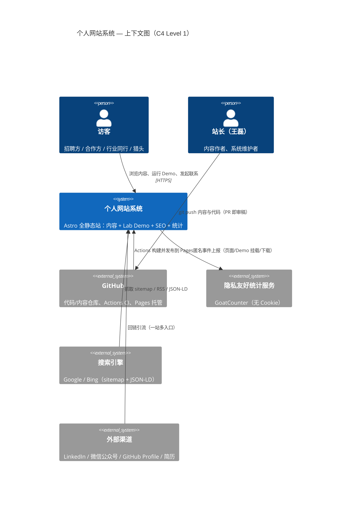
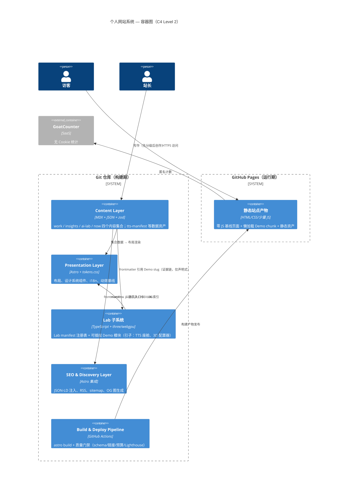
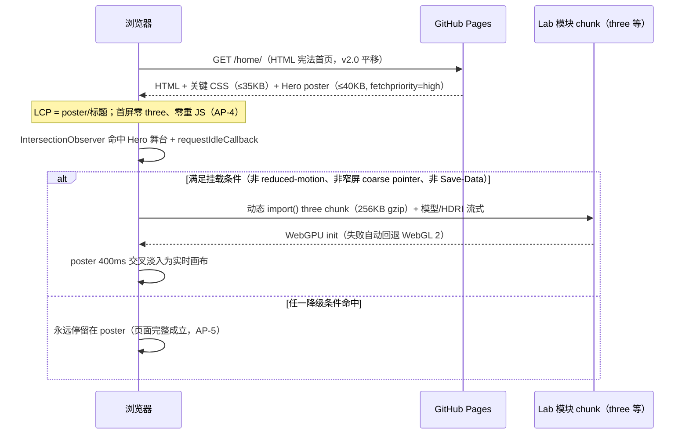
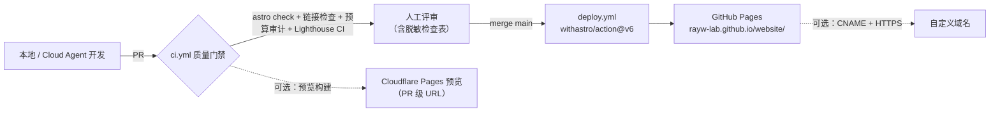
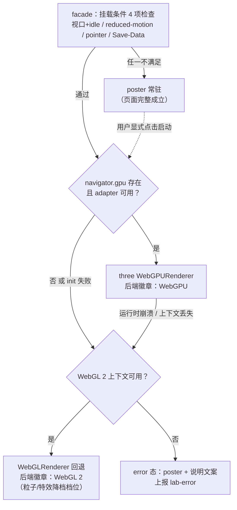

# 系统需求规格说明书（SRD — System Requirements Document）

个人网站系统：王磊｜汽车智能座舱与 AI 解决方案经理

---

## 1. 文档信息

| 项 | 内容 |
|----|------|
| 文档名称 | 个人网站系统需求规格说明书（SRD） |
| 版本 | v2.0 |
| 状态 | 评审稿（Draft for Review） |
| 日期 | 2026-08-25 |
| 读者 | 实施工程师（前端/全栈）、内容作者（站长本人）、外部协作代理（Cloud Agent） |
| 关联文档 | `docs/spec/PRD.md`（产品需求文档，定义"做什么与为什么"；本文定义"系统如何构成与如何实现"） |
| 上游输入 | `docs/website-plan/master-plan.md`（总纲，冲突时以其最新版为准）、`docs/website-plan/mvp-checklist.md`、`docs/website-plan/material-security-grading.md`、`docs/research/homepage-redesign-spec.md`、`docs/research/portfolio-inspiration-tech-showcase.md`、`docs/research/portfolio-inspiration-github.md`；v1.1 起新增：`docs/research/bruno-simon-teardown-adaptation.md`（Hybrid 路线决策来源，其 §10.2 六处 SRD 修订建议已在本版落实）、`docs/research/bruno-simon-teardown-tech.md`；v2.0 起新增：`docs/research/full-entry-world-proposal-tech.md`（Full Entry 门禁改造与引擎合体方案）、`docs/research/cyber-city-hero-design-proposal.md`（科技城首屏设计与王磊 D1–D6 终裁）、`docs/research/folio-gap-and-reuse-report.md`、`docs/research/world-spike-log.md` |
| 效力约定 | 本文为**系统架构与技术规格的唯一权威文档**。与上游调研文档冲突时以本文为准；与 master-plan 的定位/内容规范冲突时以 master-plan 为准（见第 14.4 节已知张力清单）。执行中如需变更架构决策，先修订本文再动工。**v2.0 起：正式采纳 Full Entry 智能座舱科技城决策（PRD v2.0 终裁）——凡涉及入口路由、首页职责与 3D 世界边界的条款，与本文旧表述（含 v1.1 Hybrid「`/world/` opt-in」字面）冲突时，一律以 Full Entry 科技城条款（AP-9 v2 + §12.7 v2.0 改写版）为准。** |

**版本修订记录**

| 版本 | 日期 | 修订内容 | 修订人 |
|------|------|---------|--------|
| v1.0 | 2026-08-24 | 初版：六子系统架构、数据模型、接口契约、NFR、部署与演进路线 | 云端子代理 |
| v1.1 | 2026-08-24 | **正式采纳 Hybrid 路线**（PRD §2.6，决策依据 `bruno-simon-teardown-adaptation.md`），落实其 §10.2 修订项 S1–S6：新增 AP-9（HTML 宪法 / world opt-in）；§2.5 C-2/C-3 增补按路由分层的适用范围说明（S1）；§8.2 `budgetClassEnum`/`kind` 增加 `'world'`、放宽 `viewTransitionName` 前缀（S2）；§9.2/§12.5 模式枚举扩展 `'world'`（S3）；§9.3 注册 `world-entry` 并扩展 `demo-car`/`demo-cockpit` 起点（S4）；§12.6 `public/` 配额 25MB→40MB、新增世界循环动画配额行（S5）；§13 Phase 2/4 加入 world spike 与收编、§14.1 新增 R8 工期黑洞风险（S6）。另新增 §12.7 world 模块专章（`/world/` 路由与 Astro 集成决策、独立运行时预算、降级链）、§7 目录树 `src/lab/world/` 目标态、§9.5 世界埋点事件、§10.1 NFR-P6 世界独立预算、术语表与参考索引更新 | 云端子代理 |
| v1.1.1 | 2026-08-24 | **P0 审计修订**（依据 `docs/spec/audit-report-v1.1.md` §9）：**P0-3** §8.1 insights `thesis` 改为必填（去 `.optional()`、删除 featured superRefine），对齐 PRD INS-03（P0 验收项）与 INS-01；**P0-2** §13 Phase 2 Spike 门禁行资产口径更正为「`public/world/` 新增 ≤ 1MB + CarConcept 3.5MB 复用显式豁免」；**P0-1** §8.1 work `modules` 注释经审计确认锚定 master-plan §4.1（无需改动，随裁决确认）；§14.4 追加 B0 一揽子修订执行状态注记 | 云端子代理 |
| v2.0 | 2026-08-25 | **正式采纳 Full Entry 智能座舱科技城路线**（对齐 PRD v2.0 终裁 D1–D6 + 「10–20 栋可扩展地图」硬需求；决策输入 `full-entry-world-proposal-tech.md`、`cyber-city-hero-design-proposal.md`）：效力约定改为冲突时以 Full Entry 条款为准；AP-9 改写为「HTML 备份路径零丢失 + `/` 可为 world 壳」；§2.3/§2.4/§2.5 入口边界重述与 C-2/C-3 双口径增补；§5.3 world 槽位升格；第 6 章物理选型 Rapier 转正（spike 运动学降级为回退档）、gsap/howler 列入 world 禁引清单；§7 目录树改为 `/` 入口壳 + `/home/` 宪法首页平移 + `src/lab/world/city/` 世界合一路径 + `src/data/cyber-city-buildings.json`；§9.2 facade 增补 `/` 条件自动挂载在册例外；§9.3 `world-entry` 起终点修订；§9.5 事件契约更新并新增 `world-transform:{to}`；§10.1 NFR-P1/P2/P6 改为双口径 Lighthouse 与分账预算；§11.2 CI 门禁改造（G-A/B/C 考核对象改 `home/index.html`、G-D 排除表加根 `index.html`、LHCI assertMatrix 双断言组、新增壳专项 G-A′ 与交互前零 world 字节冒烟）；**§12.7 全章改写**（路由 `/` + `/home/`、条件自动挂载策略、buildings JSON schema、TransformSystem 变形系统、十字路口出生与驾驶、城市流式 LOD、CC-P0/P1/P2 演进表——CC-P0 首屏即可变形可驾驶）；§13 Phase 4 world 候选项重述；§14.1 R8 更新并新增 R9/R10；§14.4 新增张力行；术语表与参考索引更新 | 云端子代理 |

**关键认知（先读）**：当前仓库已实现的 `/lab/tts-cockpit`（16 语种 TTS 座舱可视化）与 `/lab/car-configurator`（WebGPU 3D 车辆配置器）两个 Demo，是**能力证明的引子样本（proof-of-capability seed）**，不是系统终态。本文描述的是**完整目标系统**的架构：Demo 是其中 Lab 子系统的前两个注册模块，Lab 子系统本身是六个子系统之一。任何实施都不应把"维护好这两个 Demo"误解为系统边界。

---

## 2. 系统概述与边界

### 2.1 系统一句话定义

一套以 **Astro 全静态架构**承载的「个人专业信用系统」：内容子系统提供可信证据（案例/洞见/实验记录），Lab 子系统提供可运行证据（交互 Demo），两者通过证据链互相引用，经 GitHub Actions 构建后发布到 GitHub Pages，由隐私友好统计闭环度量。

### 2.2 与 master-plan 的关系

master-plan 是**业务总纲**：定位（第 1 章）、信息架构（第 2 章）、内容规范（第 4/5 章）、视觉定调（第 6 章）、SEO 与分发（第 8–10 章）、度量（第 12 章）与红线（第 13 章）均以其为准。本 SRD 承接其第 7 章（技术实现）并**将其展开为可施工的系统规格**：master-plan 7.x 给出的是选型与目录草图，本文给出模块分解、数据模型、接口契约、NFR 验收口径与演进路线。master-plan 7.2/7.3 中与本文不一致的细节（如 content config 文件路径、schema 字段完整度）以本文为准，属于"实现层细化"而非"总纲修订"。

### 2.3 In Scope（系统边界内）

| # | 范围 | 说明 |
|---|------|------|
| 1 | 全站静态站点系统 | Home / Work / Insights / AI Lab / About / Now / Contact 七类页面及索引页，URL 结构遵循 master-plan 2.3；v2.0 起 `/` 为科技城入口壳、`/home/` 为 HTML 宪法首页（§12.7.1 路由总表），全部内页 URL 不变 |
| 2 | 内容子系统（Content Layer） | Content Collections（work / insights / ai-lab / now）+ zod schema + MDX 渲染管线 |
| 3 | 呈现子系统（Presentation Layer） | 设计 token、布局、全站组件库、动效基线、i18n（中文主站 + 少量英文页） |
| 4 | Lab 子系统（Lab/Demo Subsystem） | 现有 2 个引子 Demo 的模块化改造 + 可插拔 Lab Module 扩展架构（manifest 注册、懒加载契约、降级链）；v2.0 起含 `/` Full Entry 智能座舱科技城旗舰模块（world 单例，§12.7） |
| 5 | 构建与部署管线 | GitHub Actions 构建、质量门禁（schema 校验/链接检查/性能预算）、GitHub Pages 发布、可选自定义域名与 PR 预览 |
| 6 | 统计与可观测性 | 无 Cookie 隐私友好统计、关键事件埋点（Demo 挂载、PDF 下载、滚动深度）、构建期产物体积审计 |
| 7 | SEO 与发现层 | meta/canonical/hreflang、JSON-LD 结构化数据、RSS、sitemap、构建期 OG 图 |
| 8 | 内容安全流程的技术承载 | 保密分级（P0/P1/P2）在 schema 与发布检查中的强制化 |

### 2.4 Out of Scope（明确不做）

依据 mvp-checklist 第 2 节与 master-plan 11.1，以下**不属于本系统任何阶段的默认范围**（除非未来修订本文）：

| 不做 | 理由 | 备注 |
|------|------|------|
| 会员/登录体系、后台/CMS | 静态站 + git-based 内容足够；引入服务端是负资产 | 永久不做倾向 |
| 评论系统 | 冷启动无讨论量，垃圾评论与合规成本高 | Phase 4 后再议 |
| AI 聊天机器人 | 与"深度内容"定位冲突，维护成本高 | 永久不做倾向 |
| 邮件订阅系统 | RSS 先行 | Phase 4 可选 |
| 全文搜索 | 内容 < 20 篇时无价值 | Phase 4 可选（Pagefind） |
| 服务端 API / Edge Function | GitHub Pages 纯静态约束；一切能力必须构建期完成或纯客户端实现 | 硬约束 |
| 英文全站 | 仅首页/About/Contact 提供英文版 + hreflang | Phase 3 局部 |
| 课程/商城/付费墙、密码保护页 | 无受众基础；密码页 ≠ 授权（保密分级第 4 节） | 永久不做 |
| **无 HTML 备份路径的全屏 3D 唯一入口**（v1.1 设立为「Full Bruno Clone 永久不做」，v2.0 修订边界） | 10 秒定位、SEO、无障碍不允许唯一依赖 canvas | v2.0 起 `/` 允许为 world 入口壳 + 条件自动挂载（Full Entry，§12.7），但三重底线不可让渡：① 壳自身是完整 HTML 页（定位语/楼宇快览导航/跳过出口/noscript）；② 原宪法首页**零丢失**平移至 `/home/`；③ `/home/` 与全部内容页对 world 零字节依赖（G-D）。裸 canvas、无跳过出口、无 HTML 备份的形态**永久不做** |
| 世界内多人在线/全局状态（WebSocket 玩法）（v1.1 新增） | C-1 纯静态无后端；与信用系统定位无关（Bruno 的 server 侧玩法不跟） | 永久不做 |

### 2.5 系统级硬约束（全文档反复引用，编号 C-1…C-6）

| 编号 | 约束 | 来源 |
|------|------|------|
| C-1 | 纯静态托管：无服务端、无 Edge Function；当前 `base: '/website'` 项目页路径 | master-plan 7.4 |
| C-2 | Lighthouse 四项（Performance / Accessibility / Best Practices / SEO）≥ 95（移动端预设） | master-plan 7.5 |
| C-3 | 首页首屏传输 < 200KB（gzip，不含字体）；常态目标 ≤ 120KB | master-plan 7.5、homepage-redesign-spec 8.2 |
| C-4 | 所有公开素材先过保密分级（P0/P1/P2），未通过检查表的内容不得进入构建 | material-security-grading |
| C-5 | URL 永不变更；确需变更必须 301（静态站上以 meta refresh + canonical 实现） | master-plan 2.3 |
| C-6 | 依赖红线：不引入 React/R3F、Lenis、Tailwind；GSAP 仅在专项审批后引入 | homepage-redesign-spec §6 |

> **v2.0 增补（C-2/C-3 适用范围说明，取代 v1.1 增补）**：「首页」这一考核对象在 v2.0 **一分为二**，C-2/C-3 按路由双口径考核——
> ① `/home/`（HTML 宪法首页）与全部内容页：C-2/C-3 **原样全额适用**（四项 ≥ 95、首屏 < 200KB gzip），且 **world 的任何 JS/资产不得出现在其关键路径**（`audit-budget.mjs` G-D 断言；`/home/` 上进入科技城的 CTA = 一个 `<a>` + 一段 CSS，零 JS 增量）；
> ② `/`（科技城入口壳，交互/自动挂载前的静态段）：**更严的壳专项预算 ≤ 90KB gzip**（HTML+CSS ≤ 35 / 引导 JS ≤ 15 / poster ≤ 40，门禁 G-A′）；Lighthouse 改用双口径——**Accessibility / Best Practices / SEO ≥ 95 阻断，Performance ≥ 90 目标 / ≥ 80 阻断**（median-run）；LCP 恒为 poster、CLS 维持满分口径，失分只允许来自 TBT/Speed Index 的世界挂载成本（§12.7.2）；
> ③ 世界运行态（挂载后）：不适用 Lighthouse（它不度量交互式应用的运行质量），改用 **§12.7.2 独立运行时预算**（NFR-P6）。`/home/` 的 200KB 预算与 world 预算完全分账，互不占用。

---

## 3. 架构原则

以下 9 条原则约束一切实现决策（v1.1 新增 AP-9，v2.0 改写 AP-9）。冲突时按编号优先级从高到低裁决。

**AP-1 静态优先，零 JS 基线（Static-first, Zero-JS baseline）**
每个页面的默认输出是纯静态 HTML + CSS。JavaScript 是逐项申请的例外而非默认：每一段进入首屏关键路径的 JS 必须在 PR 中列"预算行"（新增 KB / LCP 影响 / 降级路径）。无 JS 环境下，全部**内容**必须完整可读（Demo 允许降级为海报 + 文字说明）。

**AP-2 内容即代码（Content-as-Code）**
内容以 MDX/JSON 形式进入 git 仓库，是唯一事实源（single source of truth）；PR 即审稿流程，schema 校验失败即构建失败。不引入外部 CMS、不允许"只存在于线上而不在仓库中"的内容。

**AP-3 Demo 与内容解耦，以证据链耦合（Decoupled modules, coupled evidence）**
Lab 子系统与内容子系统在**代码与构建上完全解耦**：删除任意 Lab 模块不影响内容页构建，反之亦然。两者仅通过声明式引用耦合：案例/文章 frontmatter 以 slug 引用 Demo（作为 L2 证据展项），Lab manifest 以 slug 反向引用案例/文章。禁止内容组件直接 import Lab 模块代码。

**AP-4 性能预算是硬约束，不是优化目标（Budgets are gates, not goals）**
C-2/C-3 是合并门禁：任何 PR 使其不达标即阻断合并，没有"先合了再优化"。重资产（three chunk 256KB gzip、车模 3.5MB、HDRI 1.5MB）永不进入首屏关键路径，一律 facade + 按需加载。

**AP-5 渐进增强与分层降级（Progressive enhancement, layered fallback）**
每个增强能力必须声明完整降级链并逐层可验证：WebGPU → WebGL 2 → 静态海报 → 无 JS 文本；CSS 新特性一律 `@supports` 守卫；`prefers-reduced-motion` 三层响应（CSS 关动画 / JS 不初始化 / 资产不下载）。降级态本身必须是"完整成立的页面"，而非残缺态。

**AP-6 平台原生优先于依赖（Platform-native before dependencies）**
能用原生 CSS（View Transitions、scroll-driven animations、`@property`）与 WAAPI 实现的，不引库；能用 vanilla TS 实现的，不引框架。新增运行时依赖需在第 6 章决策表登记选型理由与淘汰条件。

**AP-7 安全分级前置（Security grading before creation）**
保密分级不是发布前的检查，而是**创作前的准入**：素材先分级、后创作、再发布。分级结果以 schema 字段强制化（`securityGrade`、`sanitizationChecked`），未标记通过的内容无法通过构建。

**AP-8 单一事实源与类型安全（Single source, typed end-to-end）**
设计 token 唯一来源是 `src/styles/tokens.css`；内容结构唯一来源是 `src/content.config.ts` 的 zod schema；Lab 模块元数据唯一来源是 Lab manifest。同一数据禁止在两处维护（如车漆预设 `presets.ts` 同时服务构建期 UI 与运行时 3D，已是范例）。

**AP-9 HTML 备份路径零丢失，`/` 可为 world 壳（HTML backup intact, world-shell entry allowed）**（v1.1 设立，v2.0 改写，承接 PRD v2.0 终裁）
10 秒定位、猎头 30 秒路径、SEO、无障碍的全部职责由 HTML 路径承担，这一宪法不变；v2.0 变更的只是宪法的**驻地**：`/` 允许成为全屏科技城入口壳并**条件自动挂载**世界（Full Entry，挂载策略 §12.7.1），原 HTML 宪法首页（五区块）**零丢失**整体平移至 `/home/`，全部内容页 URL 不动（C-5）。三条执行底线：① `/` 壳自身必须是完整成立的 HTML 页——定位语 0 秒可见且不可被 canvas 遮挡、「跳过 3D」为 DOM 首个可聚焦元素、楼宇快览 `<a>` 导航对爬虫与 noscript 可达；② 世界内可见的每一条信息在 HTML 路径两跳内必达（3D 只做「橱窗」，内容永不进 canvas）；③ 删除整个 world 模块，`/` 退化为完整成立的静态壳页、`/home/` 与全部内页零损失（AP-3 解耦的极限情形，CI 可验证）。任何「世界独占信息」「无跳过出口」或「world 资产渗入 `/home/`/内容页关键路径」的提案直接驳回。

---

## 4. 逻辑架构

### 4.1 C4 Context（系统上下文）



### 4.2 C4 Container（容器图）



### 4.3 运行期页面加载时序（HTML 宪法路径关键路径）

> v2.0 注：本时序描述 HTML 宪法路径（`/home/` 与内容页）的加载纪律；`/` 科技城入口壳的「条件自动挂载」时序见 §12.7.1。



---

## 5. 模块分解

系统分为六个子系统。每个子系统给出：职责、当前状态（Phase 0）、目标态构成、对外依赖。

### 5.1 Content Layer（内容子系统）

**职责**：以类型安全的 Content Collections 管理全部结构化内容，是站点信用资产的唯一载体。

**当前状态**：空缺（`src/content/` 不存在，首页为占位页）。

**目标态构成**：

| 集合 | 承载 | 路由 | 条目形态 | 关键规范来源 |
|------|------|------|---------|-------------|
| `work` | 案例库（12 模块结构、三旗舰 A/B/C） | `/work/`、`/work/{slug}/` | MDX | master-plan 第 4 章 |
| `insights` | 行业判断 / 方法论沉淀 / 复盘笔记 | `/insights/`、`/insights/{slug}/` | MDX | master-plan 5.1 |
| `ai-lab` | AI 工作流实验记录，**按工作阶段分类**（需求规划/设计开发/测试交付/运营复盘） | `/ai-lab/`、`/ai-lab/{slug}/` | MDX | master-plan 5.2 |
| `now` | 近况（正在研究/正在写/开放合作），单条滚动更新 | `/now/`（独立 URL 便于外链） | 数据条目（file loader） | master-plan 2.2 |

About 与 Contact 为**低频静态页**（`src/pages/about.astro`、`src/pages/contact.astro`），不建集合；About 内的履历时间线以页面内数据常量维护，Contact 的四交流方向与意愿说明模板按 mvp-checklist 第 5 节固化为文案。

**命名约定必须澄清的一点**：`/ai-lab/` 是**内容集合**（实验记录文章），`/lab/` 是 **Lab 子系统**（可运行 Demo）。二者是"记录"与"展项"的关系：ai-lab 文章可引用 Lab Demo 作为可复现载体，Lab Demo 的"工程说明"可回链 ai-lab 拆解文章。导航上 AI Lab 栏目同时呈现两者（索引页分"实验记录"与"Live Demo"两区）。

**对外依赖**：Presentation Layer（渲染）、SEO Layer（frontmatter → 结构化数据）；对 Lab 子系统仅有 slug 级声明式引用（AP-3）。

### 5.2 Presentation Layer（呈现子系统）

**职责**：设计 token、布局骨架、全站组件库、动效基线、主题（日间/夜间驾驶模式）、i18n。

**当前状态**：空缺（无 `src/layouts/`、无 `src/styles/`、组件仅有 Demo 内部脚本）；视觉规格已在 homepage-redesign-spec §3 定案。

**目标态构成**：

| 层 | 内容 | 规范来源 |
|----|------|---------|
| 设计 token | `src/styles/tokens.css`：色彩（工业橙强调色、日/夜双主题）、字体层级（中文系统黑体栈 + Inter + JetBrains Mono）、4px 间距基数、12 列栅格 | homepage-redesign-spec §3.1–3.3 |
| 布局 | `BaseLayout`（HTML 骨架/SEO 插槽/主题防闪烁）、`ArticleLayout`（insights/ai-lab 详情）、`CaseLayout`（work 12 模块详情）、`LabLayout`（Demo 页壳，见 5.3） | master-plan 7.2 |
| 全站组件 | SiteHeader / SiteFooter / ThemeToggle / SectionHeading / CtaButton / EvidenceBadge / TechChip | homepage-redesign-spec §5.2 |
| 首页区块组件 | HomeHero + HeroCarStage / PillarCard / LabBento + LabCardCar + LabCardTts / CaseCard / InsightList / NowCta | homepage-redesign-spec §5.3 |
| MDX 组件库 | 文章内可嵌组件（第 9.1 节 API 表）：证据徽章、前后对比块、架构图、可交互 island | 本文 9.1 |
| 动效基线 | `@view-transition` 全站、scroll-driven CSS 入场（`@supports` 守卫）、循环动画配额 ≤ 2 处、reduced-motion 三层降级 | homepage-redesign-spec §3.4 |
| i18n | 主站 zh-CN；`/en/`（首页摘要）、`/en/about/`、`/en/contact/` 英文版 + 双向 `hreflang`；不做全站翻译框架，英文页为独立 .astro 页面 | master-plan 8.1、mvp-checklist 第 1 节 |

**i18n 实现约定**：不引 i18n 库。中英文页面为独立文件，共享 BaseLayout 与组件；BaseLayout 接受 `lang` 与 `alternates` props 输出 `<html lang>` 与 `hreflang` link；导航在英文页只保留有英文版的条目。中文正文不加载 web font（系统黑体栈），西文/等宽字体 self-host 可变字体 latin 子集；多语种 Demo 页按需加载 Noto 子集（现有 `public/fonts/` 模式，unicode-range 命中才下载）。

### 5.3 Lab/Demo Subsystem（Lab 子系统）

**职责**：承载全部可运行的交互 Demo——系统中唯一允许重 JS/GPU 的区域；以统一 manifest、挂载契约与预算分级实现"可插拔"。

**当前状态（Phase 0，两个引子模块）**：

| 模块 | 路由 | 技术 | 资产 | 状态 |
|------|------|------|------|------|
| TTS 智能座舱可视化（LAB 编号 RA-01） | `/lab/tts-cockpit` | vanilla TS（536 行）：词级时间轴驱动字幕/SVG 路线/Canvas 频谱；16 语种 ×5 场景离线预生成 mp3+timeline.json（`public/demo/tts/` 约 3.4MB）；RTL 镜像；Noto 四子集按需加载 | `src/data/tts-manifest.json` + `scripts/generate-tts.py` 生成管线 | 已上线，手写 facade |
| 3D 车辆配置器（RB-01） | `/lab/car-configurator` | three 0.185 `three/webgpu`（WebGL 2 自动回退）；KTX2/Draco 资产（车模 3.5MB + HDRI 1.5MB）；8 车漆 ×2 轮毂 ×3 涂装；`?paint=` URL 状态 | `src/scripts/car-configurator/app.ts`（479 行）+ `presets.ts` 双端共享数据 | 已上线，手写 facade |

**目标态**：两个引子收编为标准 Lab Module（保持 URL 不变，C-5），新增模块按第 12 章扩展架构接入。规划扩展槽位（非承诺，纳入 backlog 评审）：

| 槽位 | 主题 | kind | 预算级 | 与定位的关系 |
|------|------|------|--------|-------------|
| `edge-cloud-llm-arch` | 端云大模型分层架构可视化：交互式数据流图，拖动"延迟/算力/成本"参数看任务在车端/云端的路由决策变化 | data-viz（SVG/Canvas，零 WebGL） | S | 旗舰案例 B 的 L2 证据展项 |
| `multimodal-hmi` | 多模态交互原型：语音（复用 TTS 资产管线）+ 触控 + 场景状态机的座舱多模态仲裁演示 | audio-viz + svg-hmi | M | 支柱 1/2 交叉证据 |
| 配置器「工程模式」 | 现有 3D 配置器加 ASCII/线框渲染切换彩蛋 | 现有模块的能力扩展，**不是新模块** | 增量 S | 工程品味信号 |
| `world`（v1.1 立项，**v2.0 升格为 `/` Full Entry**） | 智能座舱科技城（入口 `/`）：全屏赛博城市、座舱 AI 机器人↔CarConcept 变形、十字路口起步可驾驶、10–20 栋主题大楼即全站导航（PRD LAB-16~18 + v2.0 终裁 D1–D6；专章 §12.7） | world | world（§12.7.2 独立预算） | 三支柱交叉；证据链上最大的 L2 展项；「网站即案例」传播杠杆 |

**对外依赖**：Presentation Layer 的 LabLayout 与设计 token；构建管线的资产预算审计；统计层的挂载事件。禁止依赖 Content Layer 代码。

### 5.4 Build & Deploy Pipeline（构建与部署管线）

**职责**：把仓库内容确定性地变成静态产物并发布；把 NFR 变成机器可执行的门禁。

**当前状态**：`deploy.yml`（`withastro/action@v6` → `deploy-pages@v5`，main push 触发）已通；**无任何质量门禁**；存在遗留 `jekyll-gh-pages.yml`（技术债，见 14.2，必须删除——它与 deploy.yml 同触发条件、同 Pages 目标，存在互相覆盖风险）。

**目标态**：详见第 11 章。核心增量：CI 阶段化（build → check → gate → deploy），门禁包括 `astro check`（类型 + schema）、内部链接检查、产物体积预算审计脚本、Lighthouse CI（PR 上跑，非阻断报告 + 主干阻断）。

### 5.5 Analytics & Observability（统计与可观测性）

**职责**：隐私友好地回答 master-plan 第 12 章的四类指标；观测系统自身健康（体积、断链）。

**当前状态**：空缺。

**目标态**：

| 层 | 方案 | 说明 |
|----|------|------|
| 页面统计 | GoatCounter（托管版，`count.js` < 4KB，无 Cookie、无横幅） | 计数脚本从 BaseLayout 注入，`data-goatcounter` 指向独立子域；`localhost`/预览环境不上报 |
| 事件埋点 | GoatCounter 事件 API（`window.goatcounter.count`） | 标准事件名见 9.5 节：`pdf-download`、`lab-mount:{slug}`、`lab-backend:{webgpu\|webgl2}`、`scroll-75:{path}`、`contact-click` |
| 搜索表现 | Google Search Console + Bing Webmaster | 提交 sitemap；月度人工复盘（master-plan 12.2），不建仪表盘 |
| 构建期可观测 | 体积审计脚本（`scripts/audit-budget.mjs`）输出每页首屏传输估算表，进 CI 注释 | 守 C-3 |
| 运行期错误 | 不引入 Sentry 类服务（隐私与体积成本 > 收益）；Lab 模块的 init 失败走用户可见的错误态 + `lab-error:{slug}` 事件计数 | AP-6 |

### 5.6 SEO & Discovery Layer（SEO 与发现层）

**职责**：结构化数据、订阅与站点地图、社交分享卡片、多入口回流的技术支撑。

**当前状态**：仅 `@astrojs/sitemap` 已配置；无 JSON-LD、无 RSS、无 OG 图。

**目标态**：

| 能力 | 实现 | 规范来源 |
|------|------|---------|
| 标题/描述体系 | BaseLayout props：`title`（拼接 `｜王磊 - 汽车智能座舱与 AI 解决方案`）、每页手写 `description` | master-plan 8.1 |
| canonical / hreflang | BaseLayout 统一输出；英文页双向 hreflang | master-plan 8.1 |
| JSON-LD | BaseLayout 注入 `Person`+`WebSite`（全站）；布局按页型注入 `TechArticle`（work）/`BlogPosting`（insights、ai-lab）/`ProfilePage`（about）/`BreadcrumbList`（全内容页）。数据一律派生自 frontmatter，禁止手工维护第二份 | master-plan 8.2、本文 9.4 |
| RSS | `@astrojs/rss`：`/rss.xml` 合并 insights + ai-lab（work 更新低频，不进 RSS） | master-plan 2.3 |
| sitemap | `@astrojs/sitemap` 现有配置，排除 `/en/` 以外的草稿路由 | 已有 |
| OG 图 | Phase 3：构建期 satori + resvg 端点按 frontmatter 生成统一版式分享图；之前用静态默认 OG 图 | master-plan 8.1 |
| robots.txt | `public/robots.txt` 允许全站 + sitemap 指针 | master-plan 8.1 |

---

## 6. 技术栈决策表

每行含淘汰条件（触发即重新评估该选型并修订本表）。「状态」：✅ 已落地 / 🔜 目标态引入 / ⛔ 明确不引入。

| 组件 | 选型 | 状态 | 理由 | 替代方案 | 淘汰条件 |
|------|------|------|------|---------|---------|
| 站点框架 | Astro 7.x | ✅ | 零 JS 基线、Content Collections 类型安全、MDX 原生、纯静态输出与 C-1 完全匹配；2024–2026 内容站趋势收敛于此 | Next.js（需服务端才有优势）、SvelteKit | Astro 停止维护，或系统需求出现纯静态无法满足的服务端能力且该能力不可外置 |
| 语言 | TypeScript 5.x（strict） | ✅ | schema、组件 props、Lab 契约全程类型约束 | — | 无 |
| 内容格式 | MDX（@astrojs/mdx） | ✅ | 文章内嵌交互组件（joshwcomeau 模式）是内容型炫技核心机制 | 纯 Markdown + remark 插件 | MDX 编译性能成为构建瓶颈（>2min）且无内嵌组件需求 |
| 内容加载 | Astro Content Layer（glob/file loader）+ zod | 🔜 P1 | 构建期类型安全 + schema 即门禁（AP-2/AP-7） | — | 无 |
| 3D 渲染 | three 0.185 `three/webgpu`（vanilla，TSL 材质） | ✅ | WebGPURenderer r171+ 生产可用；TSL 一份代码编 WGSL/GLSL 双后端；已验证跑通 KTX2/Draco 管线；**Bruno folio-2025 同栈，world 模块零新增渲染选型** | Babylon.js、OGL（轻量但无 WebGPU 优势） | three WebGPU 路线破坏性变更成本连续两次升级超过收益 |
| 物理/车辆控制（world） | **Rapier**（`@dimforge/rapier3d` ^0.20.0，锁 0.20.x）+ folio `PhysicsVehicle` 参数表；spike 运动学控制器降级为 `KinematicFallback` 回退档 | ✅（v2.0 转正） | Spike 实测触发了原淘汰条件：运动学控制器「能开」但达不到 folio 级手感，而手感正是 Full Entry「高端炫技」的核心诉求（终裁 D3）；Rapier `DynamicRayCastVehicleController` + 参数表原封移植是唯一已验证路径；wasm ~1.5MB 计入 world 预算而非 `/home/`/内容页（分账，NFR-P6） | 手写运动学（保留为回退档：wasm 加载失败/超时 >10s 顶上，§12.7.5） | Rapier 破坏性变更成本连续两次升级超过收益，或参数语义漂移致手感回归失败 |
| 音频（world 场景音） | 手写 WebAudio（`AudioBufferSourceNode` + `GainNode`，预计 ~150 行） | 🔜 CC-P2（§12.7.7） | 世界场景音需求简单（引擎音/变形音/楼宇环境音）；语种问候直接复用 `public/demo/tts/` 资产零新增 | —（**howler 列入 world 禁引清单**，v2.0） | 无——v2.0 起 howler 与 gsap 一并禁引（folio 移植纪律：补间用 `Ticker.delay` + 手写缓动、音频用 WebAudio 原生）；确需引库须先修订本表并附预算行 |
| UI 框架（Lab 内） | 无（vanilla TS） | ✅ | 一个 React island = +45KB runtime；vanilla 已验证可行 | — | 无 |
| React / R3F | — | ⛔ C-6 | 见上；R3F 生态仅作参考阅读 | — | —（引入需修订本文） |
| CSS 方案 | 原生 CSS：token 变量 + Astro scoped style | 🔜 P1 | token 单一来源（AP-8）；免构建链依赖 | Tailwind v4 | 组件数 > 80 且样式重复率显著时重评（预计不会发生） |
| Tailwind | — | ⛔ C-6 | 与 token CSS 变量体系冲突，破坏一致性 | — | — |
| 页面转场 | 原生 `@view-transition`（跨文档） | 🔜 P1 | 零 JS、MPA 天然适配；Firefox 自动整页跳转零风险 | Astro `<ClientRouter />` | 若产品要求 Firefox 转场一致性，切换 ClientRouter（代价：引入 JS 路由，需重新审计 C-3） |
| 滚动动效 | CSS scroll-driven animations + `@supports` 守卫 | 🔜 P1 | 0KB JS、合成器线程 | GSAP ScrollTrigger | 出现 pin/scrub 叙事需求（Phase 4 滚动叙事）时局部引入 GSAP |
| 微交互 | 手写 WAAPI；超 ~100 行时引 `motion`（vanilla `animate()` ~3.8KB） | 🔜 P2 可选 | 最小成本覆盖数字滚动/编排 | GSAP core | motion 体积超 10KB 或 API 破坏性变更 |
| GSAP | 按需专项审批（3.13+ 全插件免费）；**world/`/` 入口科技城一律禁用（v2.0）**——folio 全部 gsap 补间以 `Ticker.delay()` + 手写缓动替代（Ticker/Nipple/Reveal 先例，缓动函数表 ~30 行） | 🔜 P2/P4 可选（仅内容页场景） | 仅 SplitText/ScrambleText/滚动叙事场景；core+插件 ~70–80KB gzip 占预算大 | — | 默认不装；每次引入须附预算行 |
| 平滑滚动（Lenis） | — | ⛔ C-6 | 本质轻度滚动劫持，违反总纲红线 | — | — |
| 统计 | GoatCounter 托管版 | 🔜 P1 | 无 Cookie/无横幅、<4KB、免费、可导出；纯静态站无法自托管 Umami | Umami Cloud、Cloudflare Web Analytics、Plausible | 服务关停或引入付费墙；则迁移 Umami Cloud |
| RSS | `@astrojs/rss` | 🔜 P1 | 官方集成，与 collections 直连 | 手写端点 | 无 |
| OG 图生成 | satori + @resvg/resvg-js（构建期端点） | 🔜 P3 | Astro 5+ 已验证可行；纯构建期，零运行时成本 | 预制模板手工出图 | 构建时长增量 > 60s 时改为仅为 featured 内容生成 |
| 全文搜索 | Pagefind | 🔜 P4 可选 | 静态索引、按需分片加载，与 C-1 匹配 | Fuse.js | 内容 < 20 篇前不引入 |
| 托管 | GitHub Pages | ✅ | 零成本、与仓库同源、Actions 原生 | Cloudflare Pages | 需要 PR 预览成为刚需且双平台维护成本可接受时，Cloudflare Pages 作为预览面（见 11.4） |
| CI | GitHub Actions（withastro/action@v6） | ✅ | 官方动作，pnpm 版本由 packageManager 字段决定 | — | 无 |
| TTS 生成 | eSpeak NG 离线预生成（`scripts/generate-tts.py`） | ✅ | 零第三方请求、零 API Key、可复现 | 商用 TTS（音质更好但引入密钥与授权问题） | 若音质影响 Demo 可信度，评审换用可离线分发授权的模型（如 Piper），保持"离线预生成"架构不变 |
| 字体 | `public/fonts/` 手放子集 woff2（不走 npm/fontsource） | ✅ | unicode-range 按需下载已验证；中文正文用系统栈不加载 web font | fontsource | 无 |

---

## 7. 目录与代码结构规范（目标态）

目标态 repo 树。标注 `[P0]` = 已存在；`[P1]`/`[P2]`/`[P3]` = 对应阶段新增（见第 13 章）。未标注者为已存在且不变。

```text
/
├── astro.config.mjs               # [P0] site/base、integrations（mdx、sitemap；P1 加 rss 端点无需集成）
├── package.json / pnpm-lock.yaml  # [P0] pnpm 10，Node ≥ 20
├── tsconfig.json                  # [P0] strict
├── AGENTS.md                      # [P0] 代理工作约定与环境说明
├── .github/workflows/
│   ├── deploy.yml                 # [P0] main → 构建 → Pages（保留）
│   ├── ci.yml                     # [P1] PR 门禁：astro check + 链接检查 + 预算审计 + Lighthouse CI
│   └── (jekyll-gh-pages.yml)      # [P1 删除] 遗留工作流，与 deploy.yml 冲突（14.2）
├── scripts/
│   ├── generate-tts.py            # [P0] TTS 资产离线生成管线
│   ├── tts-corpus.json            # [P0] TTS 语料源
│   ├── audit-budget.mjs           # [P1] 产物体积预算审计（读 dist/，输出每页首屏传输表）
│   ├── check-links.mjs            # [P1] 构建后内部链接与锚点检查
│   └── render-posters.mjs         # [P2] 构建期为每个车漆预渲染 poster 变体 WebP
├── public/
│   ├── fonts/                     # [P0] Noto 多语种子集；[P1] + inter-var-latin / jetbrains-mono-var-latin
│   ├── demo/tts/{scene}/{locale}.mp3|.timeline.json   # [P0] TTS 预生成资产
│   ├── models/car-concept/        # [P0] GLTF + KTX2 纹理
│   ├── models/hero-robot/         # [CC-P0·v2.0] 座舱 AI 机器人 GLB（原创块面机甲，Draco ≤800KB，零 IP 元素）
│   ├── hdri/                      # [P0] 环境贴图
│   ├── posters/                   # [P0] Demo facade 海报；[P2] + 车漆变体
│   ├── world/                     # [CC-P0/P1·v2.0] 科技城资产：`/` 壳页 poster、emissive 窗格 atlas（512 单张）、
│   │                              #      buildings/{id}.glb 大楼近景 GLB（Draco+KTX2，流式 LOD，CC-P1 起）、2D 等距地图 SVG
│   ├── downloads/profile-onepager.pdf   # [P1] 一页纸简介（过元数据检查后入库）
│   ├── robots.txt                 # [P1]
│   └── favicon / og-default.png   # [P1]
├── src/
│   ├── content.config.ts          # [P1] 全部集合 zod schema（第 8 章）。注意：Astro 5+ 规范位置在 src/ 根，
│   │                              #      master-plan 7.2 所写 src/content/config.ts 为旧版路径，以本文为准
│   ├── content/
│   │   ├── work/*.mdx             # [P1] 案例（旗舰 A 完整 + B/C 精简起步）
│   │   ├── insights/*.mdx         # [P1]
│   │   ├── ai-lab/*.mdx           # [P1] 实验记录（按阶段 frontmatter 分类）
│   │   └── now/entries.json       # [P1] Now 条目（file loader，最新一条驱动 /now/ 与首页区块 5）
│   ├── layouts/
│   │   ├── BaseLayout.astro       # [P1] HTML 骨架/SEO 插槽/JSON-LD/主题防闪烁/字体预载
│   │   ├── ArticleLayout.astro    # [P1] insights + ai-lab 详情（阅读进度条、面包屑、related）
│   │   ├── CaseLayout.astro       # [P1] work 12 模块详情（模块导航、证据徽章带）
│   │   └── LabLayout.astro        # [P2] Demo 页壳（读 manifest：编号/徽章/工程说明抽屉/回链）
│   ├── components/
│   │   ├── SiteHeader.astro / SiteFooter.astro / ThemeToggle.astro / SectionHeading.astro   # [P1]
│   │   ├── ui/                    # [P1] CtaButton / EvidenceBadge / TechChip
│   │   ├── home/                  # [P1] HomeHero / HeroCarStage / PillarCard / LabBento /
│   │   │                          #      LabCardCar / LabCardTts / CaseCard / InsightList / NowCta
│   │   ├── mdx/                   # [P1] 文章内嵌组件（9.1 节 API）：Figure / CompareBlock /
│   │   │                          #      EvidenceTag / StageBadge / DemoLink
│   │   └── islands/               # [P2] 可水合 island：TtsWavePlayer.ts 等（文章内嵌 Demo 切片）
│   ├── lab/                       # [P2] Lab 子系统（第 12 章）
│   │   ├── manifest.json          # 模块注册表（lab 集合 file loader 数据源）
│   │   ├── contracts.ts           # LabModule / LabMountOptions / LabInstance 类型与 zod schema
│   │   ├── facade.ts              # 统一 facade 控制器（观察/挂载/降级/事件上报）
│   │   ├── modules/
│   │   │   ├── tts-cockpit/       # 由 src/components/demo/tts-cockpit/ 迁入收编
│   │   │   │   └── index.ts       # 实现 mount() 契约
│   │   │   ├── car-configurator/  # 由 src/scripts/car-configurator/ 迁入收编
│   │   │   │   ├── index.ts       # mount() 契约入口（全功能）
│   │   │   │   ├── viewer.ts      # 精简 viewer（Hero 复用：自转+HDRI+接触阴影，无 UI/OrbitControls）
│   │   │   │   └── presets.ts     # 构建期/运行时共享数据（保持现状模式）
│   │   │   └── world/index.ts     # [已存在] world 的 mount() 薄入口——facade/manifest 认的唯一入口，
│   │   │                          #      内部动态 import 下方引擎；mode:'world' 契约（§12.5）在此层实现；
│   │   │                          #      其 spike/ 子目录在引擎合体后退役（§12.7.5）
│   │   └── world/                 # [v2.0] 唯一世界引擎（folio 架构 + spike 合体 + 科技城场景件，专章 §12.7）
│   │       ├── core/              #      Game 两阶段 init / Ticker / Events / Viewport / Quality / ResourcesLoader
│   │       ├── physics/           #      Rapier Physics + PhysicsVehicle（folio 参数表，第 6 章 v2.0 转正）
│   │       ├── player/            #      Player 意图层 + KinematicFallback（spike 遗产回退档）
│   │       ├── inputs/            #      Inputs 动作表 / Keyboard / Nipple / Pointer（spike 键位并入）
│   │       ├── rendering/         #      Rendering + MeshGridMaterial + PreRenderer（shader 预热）
│   │       ├── view/              #      View 相机（spike ChaseCamera 参数并入）
│   │       ├── city/              # [CC-P0] 科技城场景件（世界合一路径，不建平行 hero-cyber-city 模块——
│   │       │                      #      Premortem P9 双引擎分裂红线）：CitySilhouette / ThemeTowers /
│   │       │                      #      HeroRobot / HeroCar / TransformSystem / NeonRain / Crossroad
│   │       ├── world/             #      World 场景编排：流式 LOD、楼宇注册（读 buildings JSON）、Reveal、Grid、overlay
│   │       └── utils/             #      maths / ObservableSet / FpsMeter（spike 遗产）
│   ├── data/
│   │   ├── cyber-city-buildings.json   # [CC-P0·v2.0] 10–20 栋主题大楼单一事实源（schema 见 §12.7.3）
│   │   └── tts-manifest.json      # [P0] TTS 语种/场景清单（生成管线产物，勿手改）
│   ├── pages/
│   │   ├── index.astro            # [CC-P0·v2.0] `/` = 科技城入口壳：poster LCP + 定位语 + 楼宇快览 +
│   │   │                          #      跳过出口 + 条件自动挂载引导脚本 ≤15KB（§12.7.1）
│   │   ├── home/index.astro       # [CC-P0·v2.0] 原 HTML 宪法首页五区块整体平移（内容零丢失，AP-9 v2）
│   │   ├── work/index.astro / work/[slug].astro          # [P1]
│   │   ├── insights/index.astro / insights/[slug].astro  # [P1]
│   │   ├── ai-lab/index.astro / ai-lab/[slug].astro      # [P1] 索引含 Live Demo 区
│   │   ├── lab/index.astro        # [P2] Demo 索引（读 manifest 生成）
│   │   ├── lab/tts-cockpit.astro / lab/car-configurator.astro   # [P0] URL 不变，P2 接入 LabLayout
│   │   ├── (world/)               # [v2.0 不再建立] v1.1 Hybrid 规划的 /world/ 独立路由被 `/` 取代（§12.7.1）
│   │   ├── world-spike/index.astro # [已存在→归档] 引擎合体验证路径；合体完成后改 ≤1KB 占位页
│   │   │                          #      （noindex + canonical → `/`），一个版本周期后删除路由
│   │   ├── about.astro / now.astro / contact.astro        # [P1]
│   │   ├── en/index.astro / en/about.astro / en/contact.astro   # [P3]
│   │   ├── rss.xml.ts             # [P1]
│   │   └── og/[...slug].png.ts    # [P3] 构建期 OG 图端点
│   ├── scripts/                   # [P2 后仅存] 页面级轻脚本（theme.ts ≤1KB、lab-cards.ts ≤2KB、hero-car.ts）
│   └── styles/
│       ├── tokens.css             # [P1] 唯一 token 源（AP-8）
│       └── global.css             # [P1] reset/排版/@view-transition/@supports 动效/降级守卫
└── docs/                          # [P0] website-plan / research / spec（本文所在）
```

**分层守则**：

1. `components/mdx/` 只能依赖 `ui/` 与 token，禁止依赖 `home/` 或 `lab/`；
2. `lab/modules/*` 之间禁止互相 import；共享逻辑上提到 `lab/facade.ts` 或 `contracts.ts`；
3. `pages/` 只做组装，不写业务逻辑；任何超过 ~30 行的 `<script>` 必须抽为 `src/scripts/` 或 `lab/` 模块；
4. `src/data/` 与 `public/demo/` 中由脚本生成的文件头部/旁注 README 标明"生成产物勿手改"，修改一律走 `scripts/` 管线重新生成；
5. 迁移期兼容：Phase 0 → P2 收编时 `src/components/demo/` 与 `src/scripts/car-configurator/` 整体迁入 `src/lab/modules/`，git mv 保留历史，页面 URL 不变（C-5）；
6. （v1.1）`lab/world/` 与 `lab/modules/*` 之间同样禁止互相 import 运行时代码（`modules/world/index.ts` 作为 mount 薄入口动态 import 引擎属契约行为，不在此限）；**唯一在册例外**：纯数据文件 `modules/car-configurator/presets.ts`（车漆预设，无副作用）允许被 world 换漆与 Hero 消费（AP-8 单一事实源的空间化延伸）；若共享数据继续增多，收编时上提至 `src/lab/shared/` 并修订本条；
7. （v2.0）科技城场景件一律放在引擎内部目录 `src/lab/world/city/`（世界合一路径），**禁止建立平行的 `src/lab/modules/hero-cyber-city/` 模块**（Premortem P9 双引擎分裂红线）；大楼数据唯一事实源为 `src/data/cyber-city-buildings.json`（AP-8）——3D 楼宇实例、DOM 楼宇快览、noscript 列表、2D 降级地图一律由其派生。

---

## 8. 数据模型

### 8.1 Content Collections schema（`src/content.config.ts`，完整定义）

```ts
import { defineCollection, reference, z } from 'astro:content';
import { glob, file } from 'astro/loaders';

/* ---------- 公共枚举与片段 ---------- */

/** 三支柱（master-plan 1.3），全站统一口径 */
const pillarEnum = z.enum(['cockpit-i18n', 'edge-cloud-llm', 'ai-workflow']);

/** 证据等级（master-plan 附录 B） */
const evidenceEnum = z.enum(['L1', 'L2', 'L3', 'L4']);

/** 保密分级（material-security-grading）：只有 P2 允许出现在仓库内容目录 */
const securityGate = z.object({
  /** 素材分级判定结果；schema 层面锁死为 'P2'——P0/P1 内容根本不允许入库 */
  securityGrade: z.literal('P2'),
  /** 发布前检查表（分级体系 5.3 节）已逐项通过；false/缺失即构建失败 */
  sanitizationChecked: z.literal(true),
});

/** 所有可发布内容的公共字段 */
const publishable = z.object({
  title: z.string().min(4).max(60),
  /** 每页手写 meta description（master-plan 8.1），兼作列表页摘要 */
  description: z.string().min(20).max(160),
  publishDate: z.coerce.date(),
  updatedDate: z.coerce.date().optional(),
  /** 人工精选进入首页区块 4（master-plan 3 区块 4：featured 驱动，非最新自动列表） */
  featured: z.boolean().default(false),
  draft: z.boolean().default(false),
  /** SEO keywords → JSON-LD keywords 字段 */
  keywords: z.array(z.string()).max(8).default([]),
  /** 自定义 OG 图（可选；缺省用构建期生成或站点默认图） */
  ogImage: z.string().optional(),
});

/* ---------- work：案例（master-plan 第 4 章） ---------- */

const work = defineCollection({
  loader: glob({ pattern: '**/*.mdx', base: './src/content/work' }),
  schema: publishable.merge(securityGate).extend({
    /** 首页案例卡三行结构（区块 3），各一句话 */
    problem: z.string().max(80),
    action: z.string().max(80),
    result: z.string().max(80),
    pillar: pillarEnum,
    /** 案例整体证据等级（结果模块内部还可逐条标注） */
    evidenceLevel: evidenceEnum,
    /**
     * 本篇实际包含的 12 模块编号（master-plan 4.1；可按敏感度裁剪但顺序不变）。
     * 旗舰完整版 = 1..12；精简版最小集 = [1,2,6,9,10]（MVP 对案例 B/C 的要求）
     */
    modules: z.array(z.number().int().min(1).max(12)).min(5),
    /** 旗舰标识：'A' | 'B' | 'C'，非旗舰缺省 */
    flagship: z.enum(['A', 'B', 'C']).optional(),
    /** 证据链：关联 Lab Demo（以 manifest slug 引用，AP-3 声明式耦合） */
    demo: z.string().regex(/^[a-z0-9-]+$/).optional(),
    /** 站内网（模块 12）：关联洞见/实验记录 */
    related: z.array(z.union([reference('insights'), reference('ai-lab')])).default([]),
  }),
});

/* ---------- insights：洞见（master-plan 5.1） ---------- */

const insights = defineCollection({
  loader: glob({ pattern: '**/*.mdx', base: './src/content/insights' }),
  schema: publishable.merge(securityGate).extend({
    category: z.enum(['industry-judgment', 'methodology', 'retrospective']),
    /**
     * 一句话论点（首页区块 4 与索引页展示的是"结论"而非摘要）。
     * v1.1.1（审计 P0-3 裁决）：每篇必填——PRD INS-03 为 P0 验收项
     * （schema 校验缺失即构建失败），INS-01 要求索引页每篇显示一句话结论。
     */
    thesis: z.string().max(60),
    pillar: pillarEnum.optional(),
    related: z.array(z.union([reference('work'), reference('ai-lab')])).default([]),
  }),
});

/* ---------- ai-lab：AI 工作流实验记录（master-plan 5.2） ---------- */

const aiLab = defineCollection({
  loader: glob({ pattern: '**/*.mdx', base: './src/content/ai-lab' }),
  schema: publishable.merge(securityGate).extend({
    /** 按工作阶段分类（核心原则：不按工具分类） */
    stage: z.enum(['requirements-planning', 'design-development', 'test-delivery', 'ops-retrospective']),
    /** 场景一句话（该阶段中的具体工作场景） */
    scenario: z.string().max(80),
    /** 前后对比（每篇必须有，master-plan 5.2）：时间/质量维度的模糊化量化 */
    comparison: z.object({
      before: z.string().max(80),
      after: z.string().max(80),
      metric: z.string().max(40),          // 如 "耗时 -40%（约数）"
    }),
    /** 是否附可复用模板/提示词（正文含下载或代码块） */
    hasTemplate: z.boolean().default(false),
    /** 局限与失败记录为必填叙事段——以布尔声明存在性，CI 抽查正文含「局限」章节 */
    hasLimitations: z.literal(true),
    evidenceLevel: evidenceEnum,
    /** 关联可运行 Demo（Lab manifest slug） */
    demo: z.string().regex(/^[a-z0-9-]+$/).optional(),
    related: z.array(z.union([reference('work'), reference('insights')])).default([]),
  }),
});

/* ---------- now：近况条目（master-plan 2.2 / 3 区块 5） ---------- */

const now = defineCollection({
  loader: file('./src/content/now/entries.json'),
  schema: z.object({
    id: z.string(),                        // 形如 "2026-08"
    updated: z.coerce.date(),
    researching: z.array(z.string().max(60)).min(1).max(3),
    writing: z.array(z.string().max(60)).max(3).default([]),
    openTo: z.array(z.enum(['tech-exchange', 'collaboration', 'speaking-writing', 'career'])).default([]),
    note: z.string().max(200).optional(),
  }),
});

/* ---------- lab：Demo 模块注册表（第 12 章，file loader 读 src/lab/manifest.json） ---------- */
// schema 见 8.2 节 labModuleSchema

export const collections = { work, insights, 'ai-lab': aiLab, now, lab };
```

**schema 守则**：

1. `securityGrade: z.literal('P2')` 与 `sanitizationChecked: z.literal(true)` 是 AP-7 的机器化形态：不是"记录分级"，而是**只放行已定级为 P2 且过检的内容**；P0/P1 素材根本不允许出现在仓库；
2. `draft: true` 条目参与本地 dev、不进生产构建（页面层 `filter(!draft)`），且被 sitemap/RSS 排除；
3. 所有日期用 `z.coerce.date()`，frontmatter 写 `YYYY-MM-DD`；
4. 集合间引用优先用 `reference()` 获得构建期存在性校验；跨子系统（内容 → lab manifest）用 slug 字符串 + CI 一致性检查（见 12.3），维持 AP-3 解耦。

### 8.2 Lab Module manifest 格式（`src/lab/manifest.json` + `contracts.ts`）

```ts
import { z } from 'astro:content';

/** 资源预算分级（gzip / 磁盘）——超级需在 PR 中专项审批 */
export const budgetClassEnum = z.enum(['S', 'M', 'L', 'world']);
// S：懒加载 JS ≤ 50KB gzip，资产 ≤ 1MB   —— 数据可视化 / SVG HMI 类
// M：懒加载 JS ≤ 300KB gzip，资产 ≤ 6MB  —— WebGPU 3D 类（现配置器：256KB + 5MB，达标）
// L：超出 M —— 默认拒绝，引入需修订本文并评审
// world（v1.1 新增，落实 adaptation §10.2 S2 的意图，以独立枚举而非 L 例外形式表达）：
//   仅限 slug='world' 的单例模块。预算：首屏可玩 JS ≤ 500KB gzip、JS 全量 ≤ 900KB gzip、
//   资产首包 ≤ 5MB、分区流式合计 ≤ 12MB（详见 §12.7.2）。任何超出需重新评审本文。

export const labModuleSchema = z.object({
  /** 路由 slug：/lab/{slug}/，全小写短横线（C-5：一经发布永不变更） */
  slug: z.string().regex(/^[a-z0-9-]+$/),
  /** LAB 编号（页面页眉展示），格式 R[A-Z]-\d{2}，如 RA-01 / RB-01 */
  code: z.string().regex(/^R[A-Z]-\d{2}$/),
  title: z.string().max(40),
  description: z.string().max(160),
  status: z.enum(['live', 'wip', 'archived']),
  /** 模块类别（决定 LabLayout 的默认壳与审计规则）；'world' 为 v1.1 新增（专用壳见 §12.7.1） */
  kind: z.enum(['webgpu-3d', 'audio-viz', 'svg-hmi', 'data-viz', 'world']),
  /** 动态 import 入口，相对 src/lab/（常规模块位于 modules/{slug}/；world 的 mount 薄入口
   *  同样位于 modules/world/index.ts，内部动态 import src/lab/world/ 引擎——v2.0 与代码现实对齐），
   *  必须导出 mount()（9.2 节契约） */
  entry: z.string(),
  /** facade 海报（public/ 相对路径）；无 JS / 降级态的视觉底座 */
  poster: z.string(),
  budgetClass: budgetClassEnum,
  /** 实测预算数字（构建审计脚本据此校验，超 10% 即 CI 告警） */
  budget: z.object({
    lazyJsKbGzip: z.number().positive(),
    assetsMb: z.number().nonnegative(),
  }),
  /** 能力需求声明（facade 据此决定探测与降级链） */
  capabilities: z.object({
    webgpu: z.enum(['preferred', 'unused']).default('unused'),   // preferred = WebGPU 优先
    webgl2: z.enum(['fallback', 'required', 'unused']).default('unused'),
    audio: z.boolean().default(false),
    pointerFine: z.boolean().default(false),  // true = 移动端默认不自动挂载
  }),
  /** 深链参数白名单（URL 状态契约，9.2 节）；不在此表的 query 参数一律忽略 */
  deepLinkParams: z.array(z.string()).default([]),
  /** View Transitions 跨页 morph 名（9.3 节注册表，全站唯一）；v1.1 放宽前缀以容纳 world-entry */
  viewTransitionName: z.string().regex(/^(demo|world)-[a-z0-9-]+$/),
  /** 首页/索引卡片角标（工程外显） */
  techChips: z.array(z.string().max(16)).max(6),
  /** 证据链反向引用：作为哪些案例/文章的 L2 展项 */
  relatedWork: z.array(z.string()).default([]),
  relatedArticles: z.array(z.string()).default([]),
});

export type LabModule = z.infer<typeof labModuleSchema>;
```

**现有两模块的注册示例**（收编后 `manifest.json` 内容，数字为 2026-08-24 实测）：

```json
[
  {
    "slug": "tts-cockpit",
    "code": "RA-01",
    "title": "多语言 TTS × 智能座舱可视化",
    "description": "16 语种 × 5 场景座舱播报对照：词级时间轴驱动字幕、SVG 路线与真实频谱波形，离线预生成、零第三方请求。",
    "status": "live",
    "kind": "audio-viz",
    "entry": "modules/tts-cockpit/index.ts",
    "poster": "posters/tts-cockpit-poster.webp",
    "budgetClass": "S",
    "budget": { "lazyJsKbGzip": 8, "assetsMb": 3.4 },
    "capabilities": { "webgpu": "unused", "webgl2": "unused", "audio": true, "pointerFine": false },
    "deepLinkParams": ["locale", "scene"],
    "viewTransitionName": "demo-cockpit",
    "techChips": ["16 语种", "逐词时间轴", "RTL ×2", "零 API Key"],
    "relatedWork": ["multilingual-cockpit"],
    "relatedArticles": []
  },
  {
    "slug": "car-configurator",
    "code": "RB-01",
    "title": "3D 车辆配置器",
    "description": "WebGPU 实时渲染（WebGL 2 自动回退）的概念车虚拟展厅：8 车漆 × 2 轮毂 × 3 涂装，KTX2/Draco 资产管线。",
    "status": "live",
    "kind": "webgpu-3d",
    "entry": "modules/car-configurator/index.ts",
    "poster": "posters/car-configurator-poster.webp",
    "budgetClass": "M",
    "budget": { "lazyJsKbGzip": 256, "assetsMb": 5.0 },
    "capabilities": { "webgpu": "preferred", "webgl2": "fallback", "audio": false, "pointerFine": true },
    "deepLinkParams": ["paint", "wheel", "livery", "gl"],
    "viewTransitionName": "demo-car",
    "techChips": ["WebGPU", "WebGL 2 回退", "KTX2", "Draco", "HDRI IBL"],
    "relatedWork": ["edge-cloud-llm-arch-case"],
    "relatedArticles": []
  }
]
```

> 注：TTS 模块当前无 poster（页面自身即静态可读），收编时补一张 ≤30KB 的静态海报以满足统一 facade 契约；`assetsMb` 计入 `public/demo/tts/` 全量，但运行时按 场景×语种 单文件流式拉取（单次 ≤ ~60KB），不构成一次性加载。

### 8.3 tts-manifest 数据格式（现状固化为规格）

`src/data/tts-manifest.json` 由 `scripts/generate-tts.py` 从 `scripts/tts-corpus.json` 生成，是 TTS 模块的驱动数据，格式冻结如下（新增语种/场景只允许扩展数组，不允许改字段语义）：

```ts
interface TtsManifest {
  engine: string;            // "eSpeak NG 1.51"
  sampleRate: number;        // 22050
  peakIntervalMs: number;    // 波形峰值采样间隔，50
  locales: Array<{
    code: string;            // BCP-47，如 "zh-CN" / "ar-SA"
    voice: string;           // 引擎音色 id
    name: string;            // 中文名
    nativeName: string;      // 本语种自称
    dir: 'ltr' | 'rtl';      // RTL 驱动布局镜像
  }>;
  scenes: Array<{
    id: string;              // "nav" | "lane" | "park" | "tour" | "travel"
    label: string;
    tag: string;             // HUD 标签，如 "NAV / ROUTE"
    hmi: string;             // HMI 视图类型（驱动 SVG 场景）
    actions: string[];       // 时间轴动作指令序列
    user: Record<string, string>;   // 每语种用户指令文本，key = locale code
  }>;
}
// 音频与时间轴资产寻址约定：public/demo/tts/{scene.id}/{locale.code}.mp3 与 .timeline.json
```

---

## 9. 接口与集成

### 9.1 MDX 组件 API（内容作者可用的组件白名单）

MDX 内**只允许**使用以下注册组件（经 `ArticleLayout`/`CaseLayout` 的 components 映射注入，无需逐篇 import）。白名单之外的组件出现即 review 驳回。

| 组件 | Props | 输出 | JS 成本 |
|------|-------|------|---------|
| `<EvidenceTag level="L2" note="脱敏后重绘" />` | `level: 'L1'\|'L2'\|'L3'\|'L4'`；`note?: string` | 行内证据等级徽章（等宽字体） | 0 |
| `<StageBadge stage="test-delivery" />` | `stage`: ai-lab 阶段枚举 | 阶段标签 | 0 |
| `<CompareBlock before="人工 3 天" after="AI 辅助 0.5 天" metric="耗时 -83%（约数）" />` | 三个 string | 前后对比块（ai-lab 必备版式） | 0 |
| `<Figure src alt caption?" />` | 标准图片 props | `astro:assets` 优化图 + 编号图注 | 0 |
| `<ArchDiagram>`（slot 包 mermaid 代码块） | slot | 构建期 mermaid → 线框风 SVG（remark 插件渲染，运行时零 JS） | 0 |
| `<DemoLink slug="tts-cockpit" params={{ locale: 'ar-SA', scene: 'nav' }} />` | `slug`: manifest slug；`params?` | 带深链参数与 techChips 角标的 Demo 引用卡；构建期校验 slug 存在于 manifest | 0 |
| `<TtsWavePlayer scene="nav" locale="ar-SA" client:visible />` | 场景/语种；island | 文章内嵌迷你 TTS 播放器（joshwcomeau 模式；复用 `public/demo/tts/` 资产） | ~4KB，client:visible |

**约定**：新 MDX 组件的准入条件——(a) 至少两篇内容需要；(b) 零 JS 或 island 化且 ≤ 5KB；(c) 登记进本表。

### 9.2 Demo 懒加载契约（facade 协议）

所有 Lab 模块与 Hero 舞台共用同一 facade 控制器（`src/lab/facade.ts`），契约如下：

**状态机**：`idle → observing → loading → ready | error`，宿主元素以 `data-state` 暴露当前态供 CSS 使用。

**挂载条件（全部满足才进入 loading）**：

1. 宿主进入视口（IntersectionObserver，`rootMargin: 200px`）**且** `requestIdleCallback` 已回调；或用户显式点击启动按钮（点击跳过 idle 等待）；
2. `matchMedia('(prefers-reduced-motion: reduce)')` 为 false —— 否则永久停留 poster（资产层降级：不发起任何 chunk 请求）；
3. 若 manifest `capabilities.pointerFine: true`：`(pointer: fine)` 或视口 ≥ 960px —— 否则展示 poster + 显式"启动"按钮，绝不自动挂载；
4. `navigator.connection?.saveData !== true`。

> **v2.0 在册例外（仅 slug='world'，`/` 入口壳）**：条件 1「视口 + idle 或显式点击」替换为「`window.load` 事件后自动挂载」（保证 LCP/FCP 不受 world 分包影响）；条件 2/3/4 全数保留，并新增「WebGPU 或 WebGL 2 可用」前置探测。任一拦截条件命中 → 壳静态呈现（poster + 显式「进入 3D」按钮 + 完整 HTML 内容）。该例外不外溢：其余全部模块与 `/home/` Hero 维持本节原纪律。挂载策略全文与一键回退开关见 §12.7.1。

**模块入口契约**（每个 `lab/modules/{slug}/index.ts` 必须实现）：

```ts
export interface LabMountOptions {
  host: HTMLElement;                     // 舞台容器（含 canvas 或由模块自建 DOM）
  mode: 'full' | 'viewer' | 'world';     // full = Lab 页全功能；viewer = Hero/嵌入精简态；
                                         // world = 世界消费态（v1.1，§12.5/§12.7：viewer 能力 +
                                         //         材质热更接口 + 位置/状态序列化接口）
  params: URLSearchParams;               // 已按 manifest.deepLinkParams 白名单过滤
  onProgress?(loaded: number, total: number): void;   // 驱动 facade 进度条
  onBackend?(backend: 'webgpu' | 'webgl2' | 'canvas2d' | 'dom'): void;  // 实时后端徽章
}

export interface LabInstance {
  pause(): void;      // 离屏 / visibilitychange=hidden 时由 facade 调用（RAF 必须停）
  resume(): void;
  dispose(): void;    // View Transitions 离页/SPA 化后卸载；必须释放 GPU 资源与事件监听
  setParam?(key: string, value: string): void;   // 深链参数运行时热更（如 ?paint=）
}

export default function mount(opts: LabMountOptions): Promise<LabInstance>;
```

**降级与错误**：`mount()` reject 时 facade 切 `error` 态，展示 manifest 声明的错误文案 + poster 常驻，并上报 `lab-error:{slug}` 事件；`<noscript>` 恒定输出文字说明。poster → 画布切换统一为 400ms 交叉淡入。

**URL 状态（深链）契约**：Demo 状态编码进 query（如 `/lab/car-configurator?paint=crimson`）；参数名单由 manifest `deepLinkParams` 声明；模块内状态变更以 `history.replaceState` 同步回 URL（不产生历史条目）；外部入口（`/home/` 卡片、案例 DemoLink、科技城楼宇触发区）以同名参数深链。保留参数 `gl=1` 强制 WebGL 2（降级链人工验证入口）。

### 9.3 View Transitions 跨页 morph 约定

- 全站 `src/styles/global.css` 声明 `@view-transition { navigation: auto; }`（跨文档，零 JS；Firefox 自动退化为整页跳转）；
- **命名注册表**（`view-transition-name` 全站唯一、一页至多出现一次；新增须登记于此）：

| 名称 | 起点（列表/卡片） | 终点（详情页） |
|------|------------------|---------------|
| `demo-car` | `/home/` LabCardCar 海报图 / `/lab/` 索引卡 / **科技城内对应主题楼触发区（v2.0 修订，`?paint=` 状态随转场携带）** | `/lab/car-configurator` 舞台容器 |
| `demo-cockpit` | `/home/` LabCardTts 视觉区 / `/lab/` 索引卡 / **科技城内 Voice Pod 楼触发区（v2.0 修订）** | `/lab/tts-cockpit` HMI 主视区 |
| `case-cover-{slug}` | Work 索引/`/home/` 案例卡封面 | 案例详情页头图 |
| `site-header` | 全站页眉（跨页保持稳定，避免导航条闪跳） | 同 |
| `world-entry`（v2.0 修订） | `/home/` Hero 车模舞台容器（进入科技城 CTA 点击，返回世界入口） | `/` 壳页加载屏 poster——「同一辆车开回科技城」，车的视觉连续性是叙事锚点 |

- 动态命名（`case-cover-{slug}`）在列表页由每张卡的 inline style 赋值，详情页在头图赋同名；
- 禁止对正文文本块设置 morph 名（避免大面积伪元素截图开销）；
- 若 Phase 4 评审切换 Astro `<ClientRouter />`（第 6 章淘汰条件），本注册表语义不变，属性写法迁移为 `transition:name`。

### 9.4 RSS / sitemap / JSON-LD

| 集成 | 规格 |
|------|------|
| RSS（`/rss.xml`） | `@astrojs/rss`；条目 = insights ∪ ai-lab（排除 draft），按 publishDate 倒序，`<link>` 为绝对 URL（site+base 拼接）；`<description>` 用 frontmatter description；全文不入 feed（引流回站） |
| sitemap | `@astrojs/sitemap` 现配置；`filter` 排除 draft 路由与 `/og/` 端点 |
| JSON-LD 注入点 | `BaseLayout` 尾部单个 `<script type="application/ld+json">`，内容由布局按页型拼装（数据全部派生自 frontmatter/站点常量，AP-8）：全站 `Person`+`WebSite`；work → `TechArticle`；insights/ai-lab → `BlogPosting`；about → `ProfilePage`；全部内容页附 `BreadcrumbList` |
| Person 常量 | name=王磊；jobTitle=汽车智能座舱与 AI 解决方案经理；knowsAbout=[智能座舱, 多语种本地化, 端云大模型, AI 工作流]；sameAs=[GitHub, LinkedIn, 公众号]——集中在 `src/data/site.ts` 单点维护 |
| canonical | 每页 `rel=canonical` 绝对 URL；英文页与中文页互设 `hreflang`（`zh-CN` / `en` / `x-default`→zh） |

### 9.5 统计事件契约（GoatCounter）

| 事件名 | 触发点 | 说明 |
|--------|--------|------|
| （页面浏览） | BaseLayout 注入脚本 | 自动；SPA 化后需手动 count（当前 MPA 无需） |
| `pdf-download` | `/downloads/profile-onepager.pdf` 链接点击 | mvp-checklist 指标"履历下载数" |
| `lab-mount:{slug}` | facade 进入 ready | Demo 实际挂载率 |
| `lab-backend:{webgpu\|webgl2}` | `onBackend` 回调 | WebGPU 覆盖率实测（支撑 14.1 风险监测） |
| `lab-error:{slug}` | facade error 态 | 降级链健康度 |
| `scroll-75:{path}` | 内容详情页滚动 75%（一次性） | master-plan 12.1"案例页浏览深度" |
| `contact-click` | Contact 页邮件/社交链接点击 | 转化漏斗 |
| `world-enter`（v2.0 修订） | `/` 世界挂载完成（条件自动挂载或显式「进入 3D」点击，区分维度随事件携带） | PRD §10 世界子指标：入口→进入漏斗 |
| `world-skip`（v2.0 修订） | `/` 壳「跳过 3D」出口点击（→ `/home/` 等 HTML 路径） | 跳过出口健康度 |
| `world-transform:{robot\|car}`（v2.0 新增） | TransformSystem 变形完成（§12.7.4） | 首屏核心交互漏斗（PRD 终裁 D4） |
| `world-poi:{slug}`（v1.1，v2.0 语义更新） | 世界内展项交互（slug = buildings JSON `id`；overlay 打开 / Demo 跳转 / 招牌点击） | 世界→内容转化率分子 |
| `world-exit-to:{path}`（v1.1） | 从世界跳出到 HTML 路径（overlay「独立页打开」/退出按钮/招聘方速览） | 世界→内容转化归因 |

事件脚本合计 ≤ 1KB，内联于相应布局；`prefers-reduced-motion` 与 Do-Not-Track 不影响计数（无个体追踪，仅匿名聚合），但 `localhost` 与 `*.github.io` 之外的预览域不上报。

---

## 10. 非功能需求（NFR）

### 10.1 性能（NFR-P）

| # | 需求 | 验收口径 |
|---|------|---------|
| NFR-P1（v2.0 双口径） | Lighthouse 门禁（移动端预设）**按路由分组**：`/home/`、全部内容页与 Lab 壳页四项 ≥ 95；`/` 科技城入口壳 Accessibility/Best Practices/SEO ≥ 95 阻断 + **Performance ≥ 90 目标 / ≥ 80 阻断** | `pnpm build && pnpm preview` 后对在册 URL 执行 LHCI（`lighthouserc.json` assertMatrix 按 URL 分组断言，明细见 §12.7.2）；Phase 2 起追加 4x CPU throttle + Fast 4G 复测 |
| NFR-P2（v2.0 考核对象修订） | HTML 宪法首页首屏传输 < 200KB gzip（不含字体），常态 ≤ 120KB——**考核对象 = `/home/`**；`/` 壳静态段另设 ≤ 90KB 专项（G-A′） | `scripts/audit-budget.mjs` 对 `dist/home/index.html` 按 8.2 节预算表核算：HTML+CSS ≤ 35KB、Hero poster ≤ 40KB、JS ≤ 15KB（引 GSAP 专项放宽至 80KB）、图标 ≤ 30KB、three chunk/模型/HDRI = 0；`/` 壳走 G-A′（§12.7.2） |
| NFR-P3 | LCP 元素恒为 poster 或 H1（禁止 canvas）；CLS < 0.1；中端机（4x throttle）TTI < 3.5s | Lighthouse + 手工核验 LCP 元素 |
| NFR-P4 | 重资产永不进首屏关键路径；Lab 模块预算不超 manifest 声明值 +10% | CI 审计脚本对照 manifest `budget` 字段 |
| NFR-P5 | 循环动画全站同时可见 ≤ 2 处，且视口外/标签页隐藏必须暂停 | 人工核验清单（Hero 车模自转、TTS 语种轮播两个配额）；世界内另设 ≤ 5 处同屏配额，与本条分账（§12.6） |
| NFR-P6（v1.1 设立，v2.0 改写） | **`/` 世界预算与 `/home/` 宪法预算完全分账**：`/` 壳静态段（交互/自动挂载前）≤ 90KB gzip 且 LCP = poster；世界段——首屏可玩 JS ≤ 500KB gzip、JS 全量 ≤ 900KB gzip、资产首包 ≤ 5MB（其中科技城净新增 ≤ 2MB）、流式合计 ≤ 12MB、机器人可见 ≤ 2.5s、变形动画 1.0–1.2s、加载→可驾驶 ≤ 8s @Fast 4G、桌面 60fps / 中端移动 30fps；`/home/` 与全部内容页对 world 零字节依赖 | `audit-budget.mjs` G-A′/G-D/G-G 对照 manifest `budget` 与 §12.7.2 预算总表核算；LHCI 双口径断言（§12.7.2）；Playwright 冒烟断言 `/` 自动挂载触发前零 world 网络请求 |

### 10.2 可访问性（NFR-A，WCAG 2.1 AA）

| # | 需求 |
|---|------|
| NFR-A1 | 文字对比度 ≥ 4.5:1（大标题 ≥ 3:1）；`--accent` 仅用于达标文本，装饰用 `--accent-strong`；Lighthouse a11y 无 contrast 报错 |
| NFR-A2 | 键盘可完整操作：全站导航、全部 CTA、Demo 启动按钮与控制面板；焦点样式可见；触控目标 ≥ 44×44px |
| NFR-A3 | 信息不得仅在 hover 呈现；`prefers-reduced-motion` 三层降级（CSS 关动画 / JS 不初始化 / 资产不下载）逐条人工验证 |
| NFR-A4 | 语义结构：每页唯一 H1、地标区（header/main/footer/nav）、面包屑 `aria-label`；文字动画（若引 SplitText）必须保留可读 DOM 给屏幕阅读器 |
| NFR-A5 | 多语种内容标注 `lang`/`dir`（TTS 模块的 RTL 镜像已是实现基线）；音频类 Demo 提供文字等价物（字幕即等价物） |

### 10.3 安全与保密（NFR-S）

| # | 需求 |
|---|------|
| NFR-S1 | 素材保密分级流程强制化：schema 层 `securityGrade`/`sanitizationChecked` 门禁（8.1）；发布后复核按分级体系 6.4 节执行 |
| NFR-S2 | CI 敏感词扫描：维护一份**不入库**的敏感词表（本地/私密环境执行 `scripts/` 扫描），CI 内仅做通用检查（图片 EXIF 清除校验、PDF 元数据字段为空校验） |
| NFR-S3 | 无密钥架构：仓库与构建不含任何 secret（当前无必需环境变量）；未来密钥一律走 Cursor/GitHub Secrets 注入，`.env*` 已 gitignore |
| NFR-S4 | 无第三方运行时请求（统计除外）：字体、Demo 资产、脚本全部同源；统计脚本为唯一白名单外呼 |
| NFR-S5 | 文件名/URL/alt/OG 不含客户名、项目号、内部代号（分级体系 6.3）；Demo 语料/模型必须为原创或虚构改编并附免责声明（TTS 页现有免责声明为模板） |

### 10.4 浏览器支持矩阵（NFR-B）

基线：**内容在任何 ES2020 浏览器完整可读（含无 JS）**；增强能力按下表分层。

| 能力 | 完整体验 | 降级体验 | 降级机制 |
|------|---------|---------|---------|
| 核心内容/布局 | 所有现代浏览器 | 相同 | 纯 HTML/CSS |
| 跨文档 View Transitions | Chrome/Edge 126+、Safari 18.2+ | Firefox 等：普通整页跳转 | `@view-transition` 不识别即整体跳过 |
| scroll-driven animations | Chrome 115+、Firefox 132+、Safari 18+（~84% 全球） | 直接呈现终态，无闪烁 | `@supports (animation-timeline: scroll())` |
| WebGPU（3D 类 Demo） | Chrome/Edge 桌面与 Android 近版 | WebGL 2 自动回退（three 内建，`?gl=1` 可强制验证） | 渲染后端探测 |
| WebGL 2 亦不可用 | — | poster 常驻 + 错误说明 + 文字介绍 | facade error 态 |
| JavaScript 禁用 | — | 内容页 100% 可读；Demo 页 = poster + noscript 说明 | AP-1 |

### 10.5 离线与降级策略（NFR-O）

- v1 不做 PWA/Service Worker（mvp 不做清单精神：无收益先不加复杂度）；Phase 4 可选评审"文章离线阅读"；
- 断网中途态：Demo 资产流式加载失败进入 error 态（不白屏，poster 兜底）；音频文件单个 ≤ ~60KB，失败仅影响当前语种切换并给出可重试提示；
- 所有降级路径必须在 PR 描述中列明并在验收时逐条人工走查（挂载条件 4 项 × 后端 3 层）。

### 10.6 可维护性（NFR-M）

- 单人维护假设：任何周期性人工操作（如统计复盘）≤ 30 分钟/月；内容发布全流程（写作→PR→上线）无需本地环境以外的工具；
- 生成产物（tts 资产、poster 变体、OG 图）必须可由 `scripts/` 一键重建；
- 依赖升级：每季度 `pnpm outdated` 审视一次；three 升级必须回归 WebGPU/WebGL 双后端与 KTX2/Draco 加载。

---

## 11. 部署架构

### 11.1 拓扑



### 11.2 生产部署（现状保留 + 增量）

- **保留**：`deploy.yml`——main push → `withastro/action@v6` 构建 → `actions/deploy-pages@v5` 发布；pnpm 版本由 `package.json#packageManager` 决定；
- **删除**：`jekyll-gh-pages.yml`（Phase 1 首个 PR 内完成，见 14.2）；
- **新增** `ci.yml`（PR 触发）：① `pnpm astro check`（TS + content schema）；② `pnpm build`；③ `node scripts/check-links.mjs dist/`（内部链接与锚点、`DemoLink` slug 与 manifest 一致性、buildings JSON `link.href` 存在性）；④ `node scripts/audit-budget.mjs dist/`（NFR-P2/P4/P6，输出预算表为 PR 注释。**v2.0 改造**：G-A/G-B/G-C 考核对象由 `dist/index.html` 改为 `dist/home/index.html`；G-D 零 world 字节断言的排除表加入根 `index.html` 一行——`/home/` 与全部内容页继续受保护；新增 `/` 壳专项 G-A′：HTML+CSS ≤ 35KB / 引导 JS ≤ 15KB / poster ≤ 40KB，且壳 HTML 静态标签零重资产——world 分包只允许经引导脚本动态 import，禁止 three/GLB/HDRI 的 `<script src>`/`<link rel=preload>`）；⑤ Lighthouse CI（`treosh/lighthouse-ci-action`。**v2.0 改造**：`lighthouserc.json` 改用 assertMatrix 双断言组——`/` 入口壳 A11y/BP/SEO ≥ 95 阻断 + Perf ≥ 90 目标 / ≥ 80 阻断，`/home/` 与其余在册 URL 四项 ≥ 95 阻断；URL 表增补 `/website/home/`）；⑥ **v2.0 新增** Playwright 冒烟：`/` 打开后、自动挂载触发前，无任何 `_astro/world*`/`models/`/`hdri/` 网络请求（§12.7.2）。

### 11.3 自定义域名（可选，独立开关）

绑定域名时的**一次性迁移清单**（做完才算完成，防 URL 断裂违反 C-5）：

1. `public/CNAME` 写入域名；DNS 配 A/AAAA（apex）或 CNAME（www）指向 GitHub Pages；
2. `astro.config.mjs`：`site` 改为正式域名，**删除 `base: '/website'`**；
3. 全局搜索 `BASE_URL` 拼接逻辑回归（现有页面已统一走 `import.meta.env.BASE_URL`，理论零改动，仍须回归）；
4. GitHub Pages 强制 HTTPS 勾选；旧 `rayw-lab.github.io/website/*` 由 GitHub 自动 301 到新域名；
5. Search Console 添加新资产 + 地址变更通知；RSS 订阅者公告一次。

### 11.4 PR 预览（可选增强，Phase 2 后评审）

GitHub Pages 无原生 PR 预览。两个方案按序评估：

| 方案 | 机制 | 成本 |
|------|------|------|
| A（推荐） | Cloudflare Pages 免费层挂同一 repo，仅做 PR 预览域（生产仍在 GitHub Pages）；构建命令相同，`base` 以环境变量切换 | 双平台配置漂移风险，需把构建参数收敛进 `package.json` scripts |
| B | CI 产物 artifact + `actions/upload-pages-artifact` 到独立预览分支 Pages | 无第三方，但预览 URL 管理繁琐 |

在此之前，评审以本地 `pnpm preview` + CI 报告为准。

### 11.5 环境与回滚

- 环境仅两个：本地/Agent dev（`pnpm dev`，端口 4321）与生产。无 staging——PR 预览承担该职责；
- 回滚 = `git revert` + push main（构建确定性：锁文件 + 无外部数据源，同 commit 必出同产物）；
- 构建失败不影响线上（Pages 保留上一次成功产物）。

---

## 12. Lab 子系统扩展架构

本章回答：**两个"引子 Demo"如何演进为可插拔的 Lab Module 体系**。

### 12.1 演进路径：从手写页面到注册模块

| 阶段 | 形态 | 说明 |
|------|------|------|
| Phase 0（现状） | 两个自包含 .astro 页 + 各自手写 facade/加载/降级逻辑 | 已验证全部关键技术（WebGPU 回退、KTX2/Draco、词级时间轴、RTL、facade），但逻辑不可复用、元数据散落页面内 |
| Phase 2（收编） | manifest 注册 + 统一 facade + `mount()` 契约 + LabLayout 页壳 | URL 不变（C-5）；页面瘦身为「LabLayout + 静态控制面 + facade 挂载点」；配置器抽出 `viewer.ts` 供 Hero 复用 |
| Phase 2+（扩展） | 新模块按第 12.2 节六步接入 | 每个新模块是一个目录 + 一条 manifest 记录 + 一页薄壳 |

### 12.2 新模块接入六步（施工清单）

1. **立项审查**：主题必须与三支柱强相关（"炫的正是你卖的"）；确定 kind 与预算级（S/M/L，L 默认拒绝）；素材过保密分级（Demo 语料/模型必须 P2：原创、虚构改编或公开授权）；
2. **注册 manifest**：按 8.2 schema 新增记录；slug 一经合并永不变更；`viewTransitionName` 登记进 9.3 注册表；
3. **实现模块**：`src/lab/modules/{slug}/index.ts` 实现 `mount()` 契约（9.2）；模块内禁止 import 其他模块；重依赖（three 等）必须在 `mount()` 内动态 import，禁止顶层静态 import（保证不进任何页面首屏 chunk）；
4. **提供降级资产**：poster（≤ 40KB WebP）、error 文案、noscript 说明；`capabilities` 如声明 `webgpu: preferred` 必须实测 `?gl=1` 回退路径；
5. **接入呈现层**：新建 `src/pages/lab/{slug}.astro` 薄壳（LabLayout + manifest 数据 + 模块专属静态控制面）；`/lab/` 索引与首页 Bento 卡自动从 manifest 生成，无需改动；
6. **过门禁**：预算审计（实测值写回 manifest `budget`）、降级链人工走查表、Lighthouse 回归（Lab 页本身也须四项 ≥ 95——静态壳保证这一点）。

### 12.3 一致性校验（解耦下的完整性）

AP-3 要求内容与 Lab 仅以 slug 弱耦合，完整性由 CI 的 `check-links.mjs` 保证：

- 内容 frontmatter `demo` 字段的 slug 必须存在于 manifest 且 `status: live`；
- manifest `relatedWork`/`relatedArticles` 的 slug 必须存在于对应集合（允许指向 draft，渲染时隐藏）；
- 校验失败 = CI 失败，但**不产生编译期 import 依赖**。

### 12.4 WebGPU 降级链（规范化）



**配套纪律**：自定义材质一律 TSL 编写（GLSL `ShaderMaterial` 在 WebGPURenderer 不可用，TSL 自动编译 WGSL/GLSL 双后端）；DPR 封顶桌面 2 / 移动 1.5；`visibilitychange` 与离屏暂停 RAF（`LabInstance.pause()`）；WebGL 回退档位由模块自行声明（如粒子数降档），不由 facade 干预。

### 12.5 Hero / world 复用契约（模式枚举，v1.1 扩展）

宪法首页（v2.0 起为 `/home/`）的 Hero 舞台是 Lab 模块的**嵌入消费方**，不是特例：调用同一 `mount()`，`mode: 'viewer'`——模块须在该模式下裁剪为「无 UI 面板、无 OrbitControls、自转 + 单 HDRI + 接触阴影」的最小场景；Hero 的挂载条件比 Lab 页更严（移动端一律不自动挂载）。这保证 Hero 与 `/lab/car-configurator` 是**同一套渲染资产的两种展示模式**（homepage-redesign-spec §4.1），无第二套代码。

**v1.1（落实 adaptation §10.2 S3）**：模式枚举由 `'full' | 'viewer'` 扩展为 **`'full' | 'viewer' | 'world'`**。`world` 模式契约 = viewer 能力 + 两个附加接口：

1. **材质热更接口**：供世界内换漆（数据源直接 import 现有 `presets.ts`，AP-8 单一事实源的空间化延伸）；换色后玩家在整个世界开的都是该配色，`?paint=` 状态与配置器、`/home/` Hero 三处共享；
2. **位置/状态序列化接口**：供 `?poi=` 深链出生与从内容页返回世界时恢复车辆位置/形态/配色（sessionStorage）。

world 模式仍是「同一套渲染资产的第三种展示模式，无第二套代码」。

### 12.6 资源预算与配额总账

| 配额 | 上限 | 现状占用 |
|------|------|---------|
| 单模块懒加载 JS | S≤50KB / M≤300KB gzip / world 见 §12.7.2 | tts 8KB（S）；car 256KB（M） |
| 单模块磁盘资产 | S≤1MB / M≤6MB / world 流式合计 ≤12MB | tts 3.4MB*（流式豁免，单次拉取 ≤60KB）；car 5.0MB |
| `public/` 总量 | **≤ 40MB**（v1.1 由 25MB 上调：为 world 分区资产预留 12MB + 余量；Pages 软限额 1GB 下仍充裕） | 约 8.8MB |
| 同页并存模块 | 1（Lab 页与 `/` 世界均适用）；`/home/` Hero viewer + 卡片微动画不构成第二模块；世界跳转真实 Demo 页前必须 `dispose()` 释放 GPU（两个 WebGPU 上下文并存必炸预算） | 达标 |
| 世界内同屏循环动画（v1.1 新增） | ≤ 5 处（与 `/home/` ≤ 2 处配额**分账**，NFR-P5）；overlay 打开与离屏/隐藏标签页全停 | —（CC-P0 起核验：机器人 idle 呼吸灯+环顾计 1 处、城市窗格脉动计 1 处、招牌全息字计 1 处） |

### 12.7 world 模块专章（v2.0 全章改写）：`/` Full Entry 智能座舱科技城——路由、挂载、大楼数据、变形系统、运行时预算与降级

本节是 PRD v2.0 终裁（D1–D6 + 「10–20 栋可扩展地图」硬需求）与 LAB-16~18 的技术承接；首屏设计输入见 `cyber-city-hero-design-proposal.md`，门禁改造与引擎合体方案见 `full-entry-world-proposal-tech.md`。**模块身份不变**：world 仍是 Lab 子系统的单例旗舰模块——注册进同一 manifest（`kind: 'world'`、`budgetClass: 'world'`）、走同一 facade 状态机与 `mount()` 契约（薄入口 `src/lab/modules/world/index.ts`）、受同一 CI 审计，不是平行子系统（AP-3）。v2.0 改变的是它的**入口位置（`/`）与首幕内容（赛博智能座舱科技城）**，不是它与系统其余部分的边界（AP-9 v2）。

**场景一句话**：访客落在霓虹「智能座舱科技城」——中央十字路口一尊座舱 AI 机器人（原创块面机甲，非 IP 复刻），四周 10–20 栋主题大楼（多语种 / 座舱 TTS / Master Agent / 智驾…）；点「变形 · 巡航态」→ 机器人变形为 CarConcept 概念车，落在十字路口，WASD 即刻可开。3D 是舞台，信息在 DOM 霓虹 HUD（可读、可 SEO、可跳过）。

#### 12.7.1 路由架构与挂载策略

**路由总表（v2.0）**：

| 路由 | 内容 | SEO 口径 |
|------|------|---------|
| `/` | 科技城入口壳 + 条件自动挂载世界。壳含（全部 DOM 层）：H1 定位语（0 秒可见、不可被 canvas 遮挡）、三支柱硬数字、楼宇快览 `<a>` 列表（由 buildings JSON 构建期生成，爬虫与 noscript 可达）、「跳过 3D」链接（DOM 首个可聚焦元素 → `/home/`）、poster（LCP 元素） | canonical 自指；`WebSite` + `Person` JSON-LD 留在 `/`（首页权重不外流）；index,follow |
| `/home/` | 原 HTML 宪法首页整体平移（五区块、Bento、Hero poster 舞台），内容零丢失 | index,follow；与 `/` 职责分离（`/` 体验入口 / `/home/` 内容总览），非 canonical 重复；即时进 sitemap |
| 内页（`/work/`、`/insights/`、`/ai-lab/`、`/lab/`、`/about/` 等） | 完全不动（C-5） | 不变 |
| `/world-spike/` | **归档**：引擎合体完成后改 ≤ 1KB 静态占位页（noindex + canonical → `/`），一个版本周期后删除路由 | noindex |
| `/world/` | **不再建立**——v1.1 Hybrid 规划的独立路由被 `/` 取代；世界只有一个入口，避免双路由双份考核 | — |

**站内链接调整**：全站页头 logo/「首页」→ `/`；页脚与面包屑补「站点总览」→ `/home/`；内容页「返回科技城」→ `/`（`?poi=` + sessionStorage 恢复位置/形态/配色）。

**壳页形态**：独立 HTML 壳（v1.1「壳 vs islands」判定沿用）——壳页零重 JS（条件自动挂载引导脚本 ≤ 15KB gzip），与 Lab 页薄壳模式（§12.2 第 5 步）同构；islands 拼装维持否决：世界是单 canvas、全局状态（车辆位置/形态/配色）的单体交互应用，多水合边界只会割裂状态且不省任何首屏字节。**HUD 与逃生出口一律 DOM 层**（非 canvas 内渲染）：定位语、跳过/退出、楼宇快览、变形 CTA、键位提示常驻 DOM，保证屏幕阅读器与键盘可达（NFR-A2）；对比度 ≥ 4.5:1（霓虹过曝防线，Premortem P10）。

**挂载策略（条件自动挂载——facade 在册例外，仅 slug='world'，§9.2）**：

```text
window.load 事件后（关键路径已清空，LCP/FCP 不受 world 分包影响）
  └─ 满足全部条件才自动挂载：
       ① 非 prefers-reduced-motion   ② 非 Save-Data
       ③ 视口宽 ≥ 768px，或用户此前显式点过「进入 3D」
       ④ WebGPU 或 WebGL 2 可用
  └─ 任一不满足 → 壳静态呈现（poster + 显式「进入 3D」按钮 + 完整 HTML 内容）；
     触屏窄屏默认此态（虚拟摇杆世界 = 显式进入，与 facade pointerFine 规则一致）
  └─ 挂载后：进度圆环吃 ResourcesLoader 进度 → Reveal（Grid 亮起 → 城市渐显 →
     机器人光柱落地 → 大楼招牌 stagger 点亮）
  └─ 壳页常量 AUTO_MOUNT 一键切回「显式进入」模式（风险 R9 止损开关：
     壳即恢复四项 ≥95 口径，路由架构不回滚）
```

**overlay 机制**（内容永不进 3D 的技术执行，v1.1 条款全文沿用）：

- 轻内容（案例/文章/About/Contact）：`<dialog>` + `<iframe src="{canonical URL}?embed=1">`——BaseLayout 增加 `embed` 模式 prop（隐藏页头页脚），内容零重复、URL 权威性天然保持；打开时世界 `pause()`（RAF 停、音频停），关闭时 `resume()`；「在独立页打开」链接常驻 overlay 右上角；
- 重 Demo（TTS、配置器）：真实跳转 + View Transitions morph（`demo-cockpit`/`demo-car`，§9.3）——Demo 页独占 GPU，跳转前世界 `dispose()`；
- 深链参数经 manifest `deepLinkParams` 白名单：`?poi=`（出生大楼/位置）、`?paint=`（车漆，与配置器、`/home/` Hero 三处共享）。

**world 的 manifest 注册示例**（CC-P0 路由切换 PR 写入，数字为预算上限而非实测）：

```json
{
  "slug": "world",
  "code": "RX-01",
  "title": "智能座舱科技城",
  "description": "全屏赛博科技城入口：座舱 AI 机器人一键变形为概念车，十字路口起步可驾驶，10–20 栋主题大楼即全站导航。",
  "status": "wip",
  "kind": "world",
  "entry": "modules/world/index.ts",
  "poster": "world/city-poster.webp",
  "budgetClass": "world",
  "budget": { "lazyJsKbGzip": 500, "assetsMb": 5.0 },
  "capabilities": { "webgpu": "preferred", "webgl2": "fallback", "audio": true, "pointerFine": true },
  "deepLinkParams": ["poi", "paint"],
  "viewTransitionName": "world-entry",
  "techChips": ["WebGPU", "TSL", "Rapier", "机器人↔车变形", "10–20 楼流式 LOD"],
  "relatedWork": ["multilingual-cockpit", "llm-capability-layering", "ai-native-workflow"],
  "relatedArticles": []
}
```

#### 12.7.2 运行时预算与双口径 Lighthouse（NFR-P6 明细；与 `/home/` 完全分账）

**预算总表**：

| 预算项 | 上限 | 考核方式 |
|--------|------|---------|
| `/` 壳静态段（交互/自动挂载前，不含字体） | ≤ 90KB gzip（HTML+CSS ≤ 35 / 引导 JS ≤ 15 / poster ≤ 40） | `audit-budget.mjs` 壳专项 G-A′ |
| 首屏可玩 JS | ≤ 500KB gzip（引擎合体完成前维持 Spike 门禁 ≤ 400KB） | G-G 按 manifest `budgetClass:'world'` 实测（chunk 按 slug 命名） |
| JS 全量（含按需 chunk） | ≤ 900KB gzip | 同上 |
| 资产首包（首帧可见物：城市 + 机器人 + HDRI） | ≤ 5MB 硬上限；目标 ≈ 2.35MB——科技城净新增 ≤ 2MB（机器人 Draco GLB ≤ 0.8MB + 主题楼低模/emissive atlas ≤ 1.2MB）+ HDRI 0.35MB 复用 | G-G + 资产台账 |
| CarConcept 高清 GLB（3.5MB 豁免复用件） | **不进首包**：挂载后 idle 预取，变形触发前须就位（充能 0.9s 为最后缓冲窗）；计入流式合计 | 资产台账 |
| 大楼近景 GLB 流式合计（CC-P1 起） | ≤ 12MB（含 CarConcept 预取；单楼 ≤ 1.2MB） | G-G |
| 机器人可见 | ≤ 2.5s（poster 先显，LCP 不等 GLB） | e2e 冒烟计时 |
| 变形动画 | 1.0–1.2s（充能 0.15 + 光幕 0.35 + 热交换 + 落地 0.4） | 人工走查表 |
| 加载 → 可驾驶 | ≤ 8s @Fast 4G | e2e 冒烟计时断言 |
| 帧率 | 桌面 60fps / 中端移动 30fps；连续 2s 低于阈值自动降档（DPR 降、雨丝/粒子关、远景楼实例减半）+ toast；手动画质档常驻 ESC 菜单 | FpsMeter `#debug` 读数 + 人工走查 |
| shader 预热 | 加载屏末拍 PreRenderer 离屏预编译全部材质；低端设备跳过防上下文丢失 | 实现走查 |
| `/home/` 首屏 | < 200KB gzip（常态 ≤ 120KB）+ 四项 ≥ 95——原首页宪法一字不改由它继承 | G-A/B/C/D + LHCI |
| `/home/` 与内容页 world 增量 | **0 字节** | G-D（排除表只加根 `index.html` 一行） |
| `public/` 总量 | ≤ 40MB | G-E |

**双口径 Lighthouse**（`lighthouserc.json` 用 assertMatrix 按 URL 分组断言，PRD 终裁 D6）：

| 页面 | Performance | Accessibility | Best Practices | SEO |
|------|-------------|---------------|----------------|-----|
| `/`（科技城入口壳） | **≥ 90 目标 / ≥ 80 阻断**（median-run） | ≥ 95 阻断 | ≥ 95 阻断 | ≥ 95 阻断 |
| `/home/` | ≥ 95 阻断 | ≥ 95 阻断 | ≥ 95 阻断 | ≥ 95 阻断 |
| 其余在册 URL（work / about / lab…） | ≥ 95 阻断 | 同 | 同 | 同 |

- **Perf 降级的边界**：只降 `/` 一页、只降 Perf 一项、阻断线 80 写死在 assertMatrix——不是放弃考核而是「换一把对的尺」；LCP（poster）与 CLS 维持满分口径，失分只允许来自 TBT/Speed Index（世界挂载成本），CI 报表逐项留痕。拒绝「把挂载推迟 5 秒骗过打分窗口」的延时魔术（体验倒退回「进去不是」）。
- **保 a11y（阻断线不动）**：壳 HTML 语义完整（H1/landmark/楼宇快览链接）；「跳过 3D」首个可聚焦；HUD 与退出按钮在 DOM 层；reduced-motion 不自动挂载；canvas `aria-label` + 键位说明常驻；焦点顺序：跳过 → 变形 CTA → 楼宇链接 → 次 CTA。
- **保 SEO**：壳预渲染完整文案（定位语 + 三支柱 + 楼宇导航）；`WebSite`/`Person` JSON-LD 与 canonical 留在 `/`；`/home/` 进 sitemap 承接长文案权重；Search Console 每月复盘首页关键词曝光，连续两月下滑触发 R10 止损评估。

#### 12.7.3 大楼数据 schema：`src/data/cyber-city-buildings.json`

主题大楼是「楼即导航」的单一事实源（AP-8）：3D 楼宇实例、DOM 楼宇快览、noscript 列表、2D 降级地图全部由本文件派生，禁止第二份维护。**10–20 栋可扩展**（PRD v2.0 硬需求）：首版交付 ≥ 10 栋可见地标——其中 ≥ 4 栋 live 主题楼（Lingua Tower 多语种 / Voice Pod 座舱 TTS / Agent Nexus Master Agent / AutoDrive Lab 智驾），其余可为 planned 占位楼——槽位预留到 20；超 20 栋或变更字段语义须修订本节。

```ts
/** src/data/cyber-city-buildings.json 条目 schema（zod，构建期校验；数组长度 10–20） */
const cyberCityBuilding = z.object({
  /** 唯一 id，如 "lingua-tower"；一经发布不变（?poi= 深链与 world-poi 事件引用它） */
  id: z.string().regex(/^[a-z0-9-]+$/),
  /** 楼顶全息招牌（中文主行）与英文副行 */
  name: z.string().max(20),
  nameEn: z.string().max(30).optional(),
  /** 主题（决定招牌图标与默认配色语义） */
  theme: z.enum(['i18n', 'tts', 'master-agent', 'autodrive',
                 'work', 'insights', 'ai-lab', 'about', 'contact', 'ambient']),
  /** 霓虹主色（须为 tokens.css 色板在册 hex，CI 校验） */
  accent: z.string().regex(/^#[0-9a-fA-F]{6}$/),
  /** 相对十字路口原点的世界坐标 [x, z]（y 由地面决定）与朝向 */
  position: z.tuple([z.number(), z.number()]),
  rotationY: z.number().default(0),
  /** 占地 [宽, 深]（米——生成街区布局与碰撞体）与楼高 */
  footprint: z.tuple([z.number().positive(), z.number().positive()]),
  height: z.number().min(10).max(120),
  /** 流式 LOD 声明（§12.7.6）；near 缺省 = 程序化到底（零资产楼） */
  lod: z.object({
    near: z.string().optional(),          // 近景 GLB：public/world/buildings/{id}.glb（Draco+KTX2，≤1.2MB）
    nearRadius: z.number().default(60),   // 玩家进入该半径才流式拉取近景
  }).default({}),
  /** 楼的导航语义：href 为站内路由（check-links 存在性校验）；纯氛围楼可缺省 */
  link: z.object({
    href: z.string(),
    kind: z.enum(['overlay', 'navigate']),  // 轻内容 overlay / 重 Demo 真实跳转（§12.7.1 纪律）
  }).optional(),
  /** live = 可交互主题楼；planned = 占位楼（亮灯、招牌灰显、不可进） */
  status: z.enum(['live', 'planned']),
  /** 流式预取权重（小者先；四主题楼 = 0–3） */
  priority: z.number().int().min(0),
});
```

**守则**：① `link.href` 走 `check-links.mjs` 一致性校验（同 §12.3；指向 Lab Demo 时校验 manifest slug 存在且 `status: live`）；② 近景 GLB 逐楼 ≤ 1.2MB、合计计入流式 12MB 总额（G-G）；③ 招牌文字构建期生成纹理与 DOM 双份产物，源头只有本 JSON；④ 新增一栋楼 = 追加一条 JSON +（可选）一个 GLB，**零代码改动**即出现在世界与全部降级态——这是「10–20 可扩展」的机器保证。

#### 12.7.4 TransformSystem：机器人 ↔ 车变形（LAB-17 落地）

**叙事**（与 PRD 一致）：机器人 = 座舱 AI / Master Agent 人格化（站岗、讲解、交互）；车 = 量产交付载体（巡航、试驾、工程能力）。变形是**用户主动的模式切换**（点击「变形 · 巡航态」或按 Space，首屏唯一主操作），不自动触发。

**状态机**（3D 与 DOM HUD 同步，宿主以 `data-state` 暴露；v0.1 提案的 `car_idle`/`car_ready` 两态按终裁 D4 合并——变形完即可开）：

| 状态 | 输入 | 3D | DOM HUD |
|------|------|-----|---------|
| `robot_idle` | 初始 | 机器人 idle（胸甲 HUD 呼吸灯 + 头部环顾，占世界循环动画配额） | CTA「变形 · 巡航态」 |
| `transforming` | `transform()` | 遮蔽式变形序列 | 按钮 disabled + 进度 |
| `car_ready` | 变形完成 | 车落地同一锚点，**WASD 即刻可开**（CC-P0 含驾驶第一拍，终裁 D4） | 键位提示 + 楼宇快览可点 |

**V1 遮蔽式变形**（不做骨骼 IK；V2 预烘焙动画 CC-P2 评审）：地面充能环（TSL，复用进度圆环 shader 思路）半径 0→4m 0.15s → 全屏截面光幕（additive 平面，opacity 0→1→0）0.35s → 光幕峰值热交换 `robot.visible=false; car.visible=true`（同 transform 锚点、同接触阴影——防「PPT 切页」感，Premortem P4）→ 车 y 从 +2m 落至 0，easeOutBack 落地弹跳 0.4s。总时长 1.0–1.2s。`prefers-reduced-motion`：instant swap + 文字状态切换。补间一律 `Ticker.delay` + 手写缓动（第 6 章 gsap 禁令）。

**接口**（world 引擎内部系统，`src/lab/world/city/TransformSystem.ts`）：

```ts
export interface TransformSystem {
  readonly state: 'robot_idle' | 'transforming' | 'car_ready';
  /** 幂等：transforming 期间的重复调用被忽略 */
  transform(to: 'robot' | 'car'): Promise<void>;
  onStateChange(cb: (s: TransformSystem['state']) => void): () => void;
}
```

- 车形态启用 Player 车辆挂点（PhysicsVehicle）；机器人形态物理体冻结为静态 collider；
- 双向可逆（车 → 机器人回到讲解态，CC-P1 起）；形态随 `?poi=`/sessionStorage 序列化恢复（§12.5 world 模式契约②）；
- 变形完成上报 `world-transform:{to}`（§9.5）；
- 资产：机器人原创块面机甲 Draco GLB ≤ 800KB（零 Transformers 商标元素，终裁 D2）；车 = CarConcept 同源（§12.5 契约①，`?paint=` 三处共享）。

#### 12.7.5 十字路口出生与驾驶（CC-P0 即可开）

- **出生点** = 科技城主十字路口中心（四栋 live 主题楼分居四象限视野内）；机器人站位即出生锚点，变形后车落地同点；`?poi={buildingId}` 深链 → 出生于对应楼前（朝向楼门）；
- **可驾驶范围（CC-P0）** = 十字路口 + 四条主街（隐形围栏 + 尽头全息路障「CC-P1 开放」）；楼前停车触发进楼（overlay / View Transition）为 CC-P1 交付；
- **物理主路径** = Rapier `DynamicRayCastVehicleController`（folio `PhysicsVehicle` 参数表原封起步，第 6 章 v2.0 转正）；**回退档** = spike 运动学控制器（`player/KinematicFallback.ts`）：Rapier wasm 加载失败/超时 > 10s 顶上，两者对 Player 暴露同一 `PlayerVehicle` 接口——「世界永远能开」；
- **引擎合体**（执行 `full-entry-world-proposal-tech.md` §4 映射表）：`src/lab/world/` 为唯一引擎；spike 四模块按既定约定并入（carRig → VisualVehicle、ChaseCamera 参数 → View、键位 → Inputs 动作表、锥桶 → World 动态体清单）；`spike/engine.ts` 装配器与 `?impl=` 分叉退役，`/world-spike/` 归档。**施工顺序**（每步独立验证、独立止损）：① PhysicsVehicle + VisualVehicle 上车（`/world-spike/?impl=engine` 原地验证手感）→ ② Grid/MeshGridMaterial/PreRenderer/Reveal + 科技城场景件（`city/`）→ ③ spike 并入、单实现 → ④ 路由切换 + CI 改造（**唯一动用户可见面的原子 PR**，含 `/home/` 平移，可整体回滚）。

#### 12.7.6 城市流式 LOD（10–20 楼的预算解法）

| 层 | 内容 | 资产 | 加载时机 |
|----|------|------|---------|
| L2 远景 | 天际线剪影 12–20 楼块：程序化几何 + 随机 emissive 窗格 | 0（代码 + 共享 512 atlas 单张） | 首包 |
| L1 中景 | 全部在册大楼的程序化体块 + 楼顶全息招牌（构建期纹理 / TextCanvas） | ≈ 0（atlas 复用） | 首包 |
| L0 近景 | `lod.near` 声明了 GLB 的大楼高模（Draco + KTX2，单楼 ≤ 1.2MB） | 计入流式 12MB | 玩家进入 `nearRadius`，按「行进朝向 × priority」预取（朝哪开、预取哪） |

- **卸载**：驶离 `nearRadius × 1.5` 释放 L0（几何/贴图显存回收），防 10–20 楼常驻爆显存；
- 中景雾 + 飞行光轨粒子 ≤ 800 点、近景雨丝（屏幕空间）——两者均在低配/降档档位关闭；
- **高端不降级承诺（终裁 D3）的执行方式**：桌面高配走「L0 高模 + 全特效」，预算压力全部由 LOD 分层与流式吃掉，而非砍首包精度冒充交付。

#### 12.7.7 Full Entry 演进表（阶段门禁）

| 阶段 | 交付 | 门禁 |
|------|------|------|
| **CC-P0（首屏）** | `/` 入口壳 + 条件自动挂载；城市 ≥ 10 栋可见地标（L1/L2 全量 + ≥ 4 栋 live 主题楼招牌）；机器人 idle；**变形可用**（TransformSystem V1）；**十字路口可驾驶**（WASD 第一拍，Rapier 主路径 + 运动学回退）；`/home/` 平移；CI 三件套改造（G-A/B/C 改 home、G-D 排除根 index、LHCI assertMatrix）；八跳过出口 | §12.7.2 预算总表全量 + 双口径 LHCI 全绿 + G-A′/G-D 改造后全绿 + 降级链人工走查 + Persona 2 门禁（PRD §7.4） |
| **CC-P1（进楼与全图）** | 四条主街全图开放；楼前停车触发进楼（overlay / View Transition）；L0 近景 GLB 流式上线；`?poi=` 深链出生；2D 等距地图降级态；车↔机器人双向变形 | 流式 12MB 台账 + 帧率降档实测 + 世界→内容转化事件通路验证 |
| **CC-P2（丰满）** | 手写 WebAudio 音效（引擎/变形/楼宇环境）；V2 预烘焙变形评审；planned 楼逐栋转 live；全内容映射 | 数据阀门：世界→内容转化率 < 25% 冻结本阶段（PRD §7.4 沿用） |

**CC-P0 的「可变形 + 可开」是硬门禁**：变形不可用或十字路口不可驾驶，路由切换 PR（§12.7.5 步④）不得合并——首屏炫技承诺（终裁 D1/D3/D4）不允许打折上线。

#### 12.7.8 降级链与跳过出口（PRD LAB-18 的技术口径）

```text
WebGPU 科技城（完整体验：全特效 + L0 高模）
  ↓ 无 WebGPU（three 自动回退，粒子/雨丝/阴影降档；变形同样可播——TSL 双后端）
WebGL 2 科技城（同一世界）
  ↓ 无 WebGL2 / reduced-motion / saveData / 触屏窄屏默认
`/` 静态壳（poster + 定位语 + 楼宇快览 + 显式「进入 3D」按钮）——完整成立的页面（AP-5）
  ↓ 继续降级 / 用户选择
2D 等距地图（SVG 插画：大楼可点、键盘可达、hover 微动效）——独立设计资产，非残缺态
  ↓ 无 JS
楼宇文字列表 + 主导航链接（noscript，由 buildings JSON 构建期生成）
```

- 触屏窄屏默认呈现静态壳 + 显式「仍要进入 3D（实验性）」按钮（虚拟摇杆 + 画质降档），与 facade `pointerFine` 规则一致；
- 八条跳过出口（v2.0 修订第①条，其余沿用 v1.1）：①「跳过 3D」链接与 `/home/` 对 world 零字节依赖；② 加载屏第 0 秒可跳过；③ 右上角退出常驻；④ ESC 招聘方速览；⑤ overlay 即真实 URL；⑥ 能力降级直达静态壳/2D 地图；⑦ noscript 列表；⑧ `?poi=` 深链直达。逐条列入人工走查表，**任一失效 = P0 bug**；
- 每阶段合并前追加 Persona 2 门禁走查（PRD §7.4）。

#### 12.7.9 与既有基建的复用关系（零新增子系统）

| 既有基建 | v2.0 复用方式 |
|---------|----------------|
| facade（§9.2） | 同一状态机；`/` 的条件自动挂载为在册例外（仅 slug='world'），拦截条件全数保留 |
| `LabInstance`（§9.2） | `pause()`/`resume()`（overlay 打开、离屏）、`dispose()`（跳转 Demo 页前释放 GPU）、`setParam()`（`?paint=` 热更） |
| manifest + CI 一致性校验（§12.3） | buildings JSON 的 `link.href` 走同一 `check-links.mjs` 校验；招牌文字构建期生成，内容单源不漂移 |
| folio 引擎层（`src/lab/world/`） | 唯一引擎底盘：Game/Ticker/Physics/Inputs/View/Quality/ResourcesLoader 全量复用，科技城场景件为其 `city/` 子目录（§7 守则 7） |
| spike 驾驶层（`modules/world/spike/`） | 按 §12.7.5 合体：参数表留档为 A/B 基线、运动学降级为回退档、装配器与 `?impl=` 退役 |
| TTS 资产管线 | Voice Pod 楼环境音直接流式拉取 `public/demo/tts/`（单文件 ≤ 60KB，零新增资产） |
| CarConcept 资产 | 玩家车 = 配置器 = `/home/` Hero 同一源文件（3.5MB 豁免复用；首包外 idle 预取，§12.7.2） |
| 统计事件（§9.5） | `world-enter` / `world-skip` / `world-transform:{to}` / `world-poi:{slug}` / `world-exit-to:{path}` 五事件支撑 PRD §10 数据阀门 |

---

## 13. 演进路线图

阶段间是**门禁关系**：Phase N 验收未过不得合并 Phase N+1 的成果。本表整合 master-plan 11 章（30 天 MVP）、homepage-redesign-spec §7（P1/P2/P3）与本文架构增量；homepage-redesign-spec 把 content collections 放在其 P3，本文将其**提前到 Phase 1**（内容基建是 MVP 门禁，master-plan 11.1 要求案例 A 上线），此为对上游文档的一处显式修正。

| 阶段 | 主题 | 交付物 | 架构变更点 | 验收门禁 |
|------|------|--------|-----------|---------|
| **Phase 0（现状）** | 骨架与引子 | 占位首页；`/lab/` 两个 Demo；部署链路；调研与规划文档 | —（基线：Astro 7 + three/webgpu 管线已验证） | 已达成 |
| **Phase 1（MVP）** | 视觉系统 + 内容基建 + 首批内容 | tokens/global.css、BaseLayout 族、全站组件库、五区块首页（Hero 为 poster 静态舞台）、`content.config.ts` 四集合、旗舰案例 A（12 模块）+ B/C 精简版、Insights×2、AI Lab×2、About/Now/Contact、RSS/sitemap/JSON-LD/robots、GoatCounter 接入、`ci.yml` 门禁上线、删除 jekyll 遗留工作流、一页纸 PDF | 新增 Presentation Layer 与 Content Layer 全量；SEO 层就位；管线从"只部署"升级为"门禁+部署" | C-2/C-3 达标；10 秒定位测试通过（homepage-redesign-spec 8.3）；脱敏检查表逐篇通过；首页无占位文案/断链 |
| **Phase 2（炫技层）** | Lab 子系统化 + 活的首页 | Lab manifest/contracts/facade 落地，两引子收编（URL 不变）；`viewer.ts` 抽取，Hero 升级实时车模（facade+徽章+车漆深链）；LabCard 微动画（语种轮播/假波形）；`/lab/` 索引页；View Transitions morph 全线打通；poster 变体构建管线；**（v1.1 可选尾项）World Phase A Spike**：隐藏路由 `/world-spike/`（noindex）灰盒验证操控/物理选型/双后端帧率/移动端摇杆——前置条件为本阶段 Lab 子系统化完成（world 复用 facade/manifest/mount() 全套基建），Spike 可丢弃，止损点见 PRD §7.4 | Lab 子系统从"两个页面"变为"注册模块体系"（第 12 章全量生效）；Hero 复用契约生效；world 模块启动条件达成 | Phase 1 全指标回归 + 4x throttle Performance ≥ 95 + 降级链逐条人工走查 + 循环动画配额核验；Spike（若启动）：JS ≤ 400KB gzip、**新增资产（`public/world/`）≤ 1MB + CarConcept 3.5MB 复用显式豁免**（记录在案，不计入；v1.1.1 审计 P0-2 裁决）、帧率基线达标或触发止损 |
| **Phase 3（内容饱和）** | 内容密度 + 分发闭环 | 稳态节奏（每 2 周 1 篇 insights/ai-lab 交替；每季度 1 案例）；featured 精选区上线；OG 图构建期生成；`/en/` 三页 + hreflang；Search Console 基线与月度复盘机制运转；案例↔Demo 证据链全部挂钩 | SEO 层补全（OG 端点）；i18n 局部生效；无新子系统 | 内容量达 mvp-checklist 第 1 节数量表；月度指标表开始记录；自然外链 ≥ 3 |
| **Phase 4（可选增强）** | 按数据决策的增强池 | 候选（逐项独立评审，非承诺）：**（v2.0）Full Entry 科技城落地**——按 §12.7.7 演进表执行：**CC-P0 首屏（城市 + 机器人 + 变形可用 + 十字路口可驾驶）** + 路由原子切换（`/` 入口壳 / `/home/` 平移 / CI 三件套改造，§12.7.5 施工顺序①–④），CC-P1 进楼与 10–20 楼流式 LOD 全图，CC-P2 音效与全内容映射（取代 v1.1「World Phase B/C 收编到 `/world/`」方案）；新 Lab 模块（端云架构可视化 / 多模态原型）；配置器工程模式彩蛋；滚动叙事段（需先修订 master-plan 第 6 章豁免）；TSL 自定义车漆 shader（可与 CC-P2 合并评审）；Pagefind 搜索（内容 ≥ 20 篇后）；自定义域名迁移（11.3 清单）；文章离线阅读 | world 作为单例模块收编进 Lab manifest（`kind/budgetClass: 'world'`），无平行子系统；v2.0 新增架构变更点：`/` 职责转移为世界入口壳 + `/home/` 新路由承接宪法首页；其余每项增强按第 12.2 六步或第 6 章决策表流程走 | 逐项预算行 + 既有全部 NFR 回归；world 各阶段按 §12.7.2 双口径预算 + §12.7.7 阶段门禁 + PRD §7.4 数据阀门（世界→内容转化率 < 25% 冻结 CC-P2） |

**跨阶段不变量**：URL 永不变更（C-5）；每阶段合并即可上线（无长寿分支）；任何阶段允许内容先行（内容生产不被工程阶段阻塞，只被分级流程阻塞）。

---

## 14. 风险与技术债

### 14.1 技术风险

| # | 风险 | 影响 | 概率 | 缓解 |
|---|------|------|------|------|
| R1 | **WebGPU 兼容性碎片化**：Safari/移动端实现进度与行为差异；three WebGPU 路线仍在快速演进，升级可能破坏 TSL/KTX2 管线 | 3D 类 Demo 在部分设备退化或报错 | 中 | WebGL 2 回退已内建且 `?gl=1` 可强制验证；`lab-backend` 事件实测真实覆盖率，若 WebGPU 挂载占比 < 30% 下调宣传口径；three 升级绑定回归清单（NFR-M）；`onError` 全路径进 poster 兜底 |
| R2 | **中文字体体积**：若未来引入中文 web font（品牌字型冲动），单字重全量 3–7MB，直接击穿 C-3 | 性能门禁失守 | 中 | 架构决策已锁定：中文正文永远走系统黑体栈（第 5.2 节）；确需品牌字型仅限 Hero H1 单页少量字符的 unicode-range 子集（≤ 30KB），且须走第 6 章决策表流程新增记录 |
| R3 | **内容脱敏流程是单点人工环节**：分级判定与"组合定位"检查依赖站长自查，疲劳或赶工时可能漏检 | 保密红线事故（法律/职业风险，不可逆） | 低频高危 | 流程三重化：schema 门禁（8.1）强制声明 + 发布前检查表逐条勾选存档 + 发布后无痕复核（分级体系 6.4）；灰区一律升级处理；案例类内容强制"第三方组合定位测试"后才允许 `sanitizationChecked: true` |
| R4 | **master-plan 与 homepage-redesign-spec 的张力未消解**：总纲第 3 章"无大图 banner"与第 6 章"动效仅 hover 与渐入" vs 实时渲染 Hero 与 ≤2 处循环动画 | 文档间冲突导致实施依据不明，或事后被总纲尾注条款推翻 | 高（若不处理） | **行动项（Phase 2 动工前必须完成）**：按总纲尾注流程修订 master-plan 第 6 章，补入两条豁免（Hero 同源实时渲染层豁免、循环动画 ≤2 处配额），已有论证见 homepage-redesign-spec 附录与 tech-showcase 附录 A；修订合并前，Phase 2 的 Hero 实时化不得合并（Phase 1 poster 舞台不受影响） |
| R5 | **`base: '/website'` 迁移风险**：绑定自定义域名要求删 base，所有绝对路径假设一次性翻转 | 外链/收录断裂违反 C-5 | 低 | 全站已统一 `import.meta.env.BASE_URL`；迁移走 11.3 一次性清单；迁移前用 CI 链接检查全量回归 |
| R6 | **单人维护的公交因子**：架构知识集中于文档而非团队 | 维护中断 | 中 | 本文 + AGENTS.md 保持"可交给任意工程师/Agent 按图施工"的完备度；生成管线全部脚本化可重建（NFR-M） |
| R7 | **eSpeak NG 音质影响 Demo 可信度**：合成音质明显机械，行家可能低估工程含金量 | 引子效果打折 | 低 | 页面已明示引擎与"离线预生成"卖点（工程叙事优先于音质）；第 6 章已登记淘汰条件（可换 Piper 类可分发模型，架构不变） |
| R8（v1.1 新增，v2.0 更新） | **world 工期黑洞**：Bruno folio-2025 为全职约一年 + 十余年 three.js 积累，单人兼职复刻是未定义行为；世界可能长期挤占 Lab 路线图与内容生产 | 交付停滞、内容断更（连坐 master-plan 13.1 内容密度风险） | 中-高 | 分阶段止损点（v2.0）：CC-P0 施工前三步全部在隐藏路径（`/world-spike/?impl=engine`）迭代，路由切换是唯一动用户可见面的原子 PR、可整体回滚（§12.7.5）；每阶段独立可上线、独立门禁（§12.7.7）；数据阀门（世界→内容转化率 < 25% 冻结 CC-P2）；门禁分层 + `AUTO_MOUNT` 开关使 world 失败只影响 `/` 一页且现网可即时恢复（§2.5 增补/AP-9 v2）；不做时间承诺，内容生产优先级恒高于世界施工 |
| R9（v2.0 新增） | **`/` Lighthouse Perf 跌破 80 阻断线**：Rapier wasm 编译 + world 分包解析压 TBT，LHCI 移动模拟 4x throttle 下尤甚 | 入口页 CI 阻断、发布停摆 | 中 | 挂载压 `window.load` 之后（LCP/FCP 窗口干净）；PreRenderer 预热移入挂载段；wasm 与资源并行加载（引擎既有结构）；LCP=poster/CLS 维持满分口径 | 一键开关：壳页常量 `AUTO_MOUNT=false` 切回「显式进入」模式（壳恢复四项 ≥ 95），产品口径退半步为「首页一键进入世界」，路由架构不回滚（§12.7.1） |
| R10（v2.0 新增） | **首页 SEO 受损**：`/` 内容变薄 + 权重分流 `/home/`，Search Console 曝光下滑 | 自然流量入口下滑 | 中 | 壳保留完整定位文案与 `WebSite`/`Person` JSON-LD + canonical 自指；`/home/` 即时进 sitemap；路由切换 PR 合并日记录 Search Console 基线 | 连续两月核心词曝光降 > 30% → `/` 与 `/home/` 内容互换回滚（宪法页回 `/`，世界退独立路由）——内页零改动，回滚只动两个页面文件 + CI 三处配置（§12.7.2） |

### 14.2 技术债登记（现状即债，按优先级）

| # | 债项 | 位置 | 清偿计划 |
|---|------|------|---------|
| D1 | **遗留 Jekyll 部署工作流**：与 `deploy.yml` 同为 main push 触发、同一 Pages 目标，存在部署互相覆盖的竞态隐患 | `.github/workflows/jekyll-gh-pages.yml` | Phase 1 首个 PR 删除（高优先级） |
| D2 | 占位首页：内联样式、硬编码文案、只链一个 Demo | `src/pages/index.astro` | Phase 1 重写为五区块（自然清偿） |
| D3 | 两个 Demo 页各自手写 facade/降级/字体注入逻辑，约 1000 行页面级代码不可复用；元数据（编号/徽章/免责声明）散落页面内 | `src/pages/lab/*.astro`、`src/components/demo/`、`src/scripts/car-configurator/` | Phase 2 收编为 Lab Module（第 12.1 节） |
| D4 | 配置器 `app.ts` 单体 479 行：渲染、UI 绑定、URL 状态耦合，Hero 复用被阻塞 | `src/scripts/car-configurator/app.ts` | Phase 2 拆 `index.ts`（契约入口）/`viewer.ts`（精简场景）/UI 绑定层 |
| D5 | 无任何 CI 质量门禁：schema/链接/预算/Lighthouse 全靠人工 | `.github/workflows/` | Phase 1 `ci.yml`（11.2） |
| D6 | TTS 模块无 poster、`assetsMb` 未在任何机器可读位置登记 | `public/posters/`、未来 manifest | Phase 2 收编时补齐 |
| D7 | `src/data/tts-manifest.json` 为生成产物但无"勿手改"标注与再生成说明 | `src/data/`、`scripts/` | Phase 1 顺手补 README 注记（低成本） |
| D8 | master-plan 7.2 所写 `src/content/config.ts` 为 Astro 旧版路径 | 文档 | 本文 8.1 已修正为 `src/content.config.ts`；无需改总纲（实现层细节） |

### 14.3 内容与运营风险（架构相关部分）

- **内容密度不足反噬信用**（master-plan 13.1）：架构上以 featured 人工精选 + draft 门禁支撑"宁缺毋滥"，索引页在内容 < 5 篇时自动隐藏筛选器（避免"空分类"观感）；
- **渠道回流失效**：一站多入口策略要求所有渠道深链具体页——URL 稳定性（C-5）与 UTM 约定（渠道链接附 `utm_source`，GoatCounter 可读）是技术承载。

### 14.4 已知文档张力清单（汇总）

| 张力 | 双方 | 本文裁决 |
|------|------|---------|
| Hero 实时渲染 vs "无大图 banner" | homepage-redesign-spec §4 vs master-plan 第 3 章 | 支持豁免，但生效前置条件是修订总纲（R4 行动项） |
| 循环动画配额 vs "动效仅 hover 与渐入" | homepage-redesign-spec §3.4 vs master-plan 第 6 章 | 同上 |
| `/world/` 沉浸式展项 vs "动效仅 hover 与渐入"（v1.1 新增；**v2.0 注：入口已改 `/`，本行裁决由下方 v2.0 行取代**） | 本文 §12.7 / PRD LAB-16 vs master-plan 第 6 章 | 支持豁免：独立路由的沉浸式展项不受该条约束，受 §12.7.2 运行时预算约束。**执行方式：与 R4 行动项同一次总纲修订顺带加入第三条豁免（adaptation §10.3 M1），避免二次修订**；master-plan 修订不属本次 spec v1.1 范围，故此处登记为待办而非已落实 |
| content collections 时序 | homepage-redesign-spec P3 vs master-plan 30 天 MVP | 提前到 Phase 1（13 章已明确，属实施排序非原则冲突） |
| content config 路径 | master-plan 7.2 vs Astro 5+ 规范 | 以本文 `src/content.config.ts` 为准（D8） |
| MVP 内容数量口径 | mvp-checklist（案例 3/文章 6/实验 2）vs master-plan 11.1（案例 A 全 + B/C 简 + Insights 2 + AI Lab 2） | Phase 1 按 master-plan 11.1 执行（后者为总纲且更克制）；mvp-checklist 数量表作为 Phase 3 内容饱和目标 |
| `/` Full Entry vs C-2「首页四项 ≥ 95」与 master-plan 首页五区块/「无大图 banner」字面（v2.0 新增） | 本文 §12.7 / PRD v2.0 终裁 D1/D5/D6 vs master-plan 第 3/6 章、C-2 旧口径 | v2.0 裁决：「首页」考核对象一分为二——`/home/` 全额继承宪法口径（四项 ≥ 95 + 200KB + 零 world 字节），`/` 按 NFR-P6 双口径（Perf ≥ 90 目标/≥ 80 阻断，A11y/BP/SEO ≥ 95）；10 秒定位由 `/` 壳 DOM 定位语（0 秒可见、不可被 canvas 遮挡）+「跳过 3D」+ `/home/` 双承载。master-plan 对应修订（首页职责转移 + 「赛博朋克」白名单为「智能座舱科技城」领域强相关，终裁 D5）随 PRD v2.0 一揽子登记为待办；**批准前路由切换 PR（§12.7.5 步④）锁死不合** |

> **v1.1.1 注（审计 P0-5 执行状态）**：上表前三行所需的 master-plan 修订已随 P0 审计一揽子修订（鸟瞰图 B0，扩容版）写入 **master-plan v1.1** 第 6 章——动效豁免两条（首页 Hero 实时渲染层 + 循环动画 ≤2 处配额；`/world/` 沉浸展项按 §12.7.2 运行时预算考核），连同 §2.3 URL 结构、§4.1 12 模块 canonical 注记、§8.1 英文范围、§2.2 更新频率、第 12 章 KPI 映射一并落笔；待王磊终审批准后，R4 行动项与 B0 即告关闭（批准前 Hero 实时化与 world 代码合并锁死规则不变）。

---

## 15. 附录

### 15.1 术语表

| 术语 | 定义 |
|------|------|
| 引子 Demo（seed demo） | Phase 0 已上线的两个能力证明样本，是 Lab 子系统的前两个模块而非系统终态 |
| Lab Module | 满足 manifest 注册 + `mount()` 契约 + 预算分级 + 降级链声明的可插拔交互 Demo 单元 |
| facade（门面） | 重资产懒加载模式：先渲染静态海报，满足挂载条件后动态 import 真实模块并交叉淡入 |
| viewer 模式 | Lab 模块的嵌入精简态（`mode: 'viewer'`），供 `/home/` Hero 等消费方复用同一渲染资产 |
| 证据等级 L1–L4 | master-plan 附录 B：可公开验证 / 有形产出 / 量化自述 / 定性自述 |
| 保密分级 P0/P1/P2 | material-security-grading：禁止公开 / 受控使用（须脱敏降级）/ 可公开 |
| 三支柱 | 智能座舱多语种（cockpit-i18n）/ 端云大模型（edge-cloud-llm）/ AI 原生工作流（ai-workflow） |
| Content Layer / Collections | Astro 构建期内容加载体系；glob/file loader + zod schema 类型安全 |
| TSL | Three.js Shading Language：节点式材质语言，一份代码编译 WGSL（WebGPU）与 GLSL（WebGL 2） |
| View Transitions morph | 跨页共享 `view-transition-name` 的元素在导航时的平滑形变过渡 |
| scroll-driven animations | CSS `animation-timeline: scroll()/view()`：零 JS、合成器线程的滚动驱动动画 |
| 预算行 | PR 描述中必附的性能声明：新增 KB / LCP 影响 / 降级路径 |
| 深链（deep link） | 以 URL query 编码 Demo 状态（如 `?paint=crimson`），使外部入口可直达特定配置 |
| 八问题模板 | master-plan 附录 A：案例/文章成文前的自访谈问题集，保证内容密度 |
| 一站多入口 | master-plan 第 9 章：主站唯一内容资产库，各渠道深链回流 |
| Hybrid 路线（v1.1，历史） | v1.1 采纳的 3D 世界收编方案：HTML 首页原样保留，3D 世界为 opt-in 独立路由 `/world/`。**v2.0 注**：入口位置已被 Full Entry 决策取代（`/` 即世界入口），「HTML 备份路径零丢失 + 内容永不进 canvas」的内核由 AP-9 v2 延续 |
| Full Entry 科技城（v2.0） | 已正式采纳的入口方案（PRD v2.0 终裁 D1–D6）：`/` = 全屏智能座舱科技城入口壳 + 条件自动挂载世界，`/home/` = 宪法首页平移，内页零改动（§12.7） |
| world 模块（v1.1 立项，v2.0 升格） | 智能座舱科技城（入口 `/`）：Lab 子系统的单例旗舰模块（`kind/budgetClass: 'world'`），全屏赛博城市 + 机器人↔车变形 + 十字路口驾驶 + 10–20 栋主题大楼导航（§12.7） |
| `/home/`（宪法首页，v2.0） | 原 HTML 首页五区块的零丢失平移驻地：全额继承四项 ≥ 95 + 200KB + 零 world 字节的「首页宪法」考核口径（AP-9 v2） |
| 入口壳（entry shell，v2.0） | `/` 的静态 HTML 段（挂载前）：poster LCP + 定位语 + 楼宇快览 + 跳过出口 + 引导脚本 ≤ 15KB；预算 ≤ 90KB gzip（G-A′），同时是加载屏与降级态 |
| TransformSystem（v2.0） | 机器人↔车变形系统（`src/lab/world/city/TransformSystem.ts`）：三态状态机（robot_idle / transforming / car_ready），V1 遮蔽式变形 1.0–1.2s，变形完即可驾驶（§12.7.4） |
| buildings JSON（v2.0） | `src/data/cyber-city-buildings.json`：10–20 栋主题大楼的单一事实源（AP-8）——3D 实例、DOM 快览、noscript 列表、2D 地图全部派生自它（schema §12.7.3） |
| 十字路口出生（v2.0） | 世界默认出生点 = 科技城主十字路口（四栋 live 主题楼分居四象限）；机器人站位即锚点，变形后车落地同点、WASD 即刻可开（终裁 D4，§12.7.5） |
| 流式 LOD（v2.0） | 城市三层加载策略：L2 程序化剪影 / L1 程序化体块 + 招牌（首包）/ L0 近景 GLB（进 `nearRadius` 按朝向 × priority 预取，驶离即卸载）——10–20 楼的预算解法（§12.7.6） |
| POI（v1.1，v2.0 语义更新） | Point of Interest：世界内交互展项（v2.0 主形态 = 主题大楼招牌/楼前触发区）——只做「橱窗」（标题+一句话+证据徽章），深度内容一律 HTML overlay/真实 URL |
| morph（载具变形，v1.1） | 车（交付载体）↔ 机器人（座舱 AI 人格化）双形态切换，隐喻端云分层；v2.0 由 TransformSystem 执行（§12.7.4）：V1 遮蔽式变形，V2 预烘焙动画。区别于 View Transitions morph（页面元素过渡） |
| 2D 等距地图（v1.1） | world 的降级态：Blender 等距渲染描线成 SVG 的大楼可点导览图（v2.0 从 buildings JSON 派生）——独立设计资产而非残缺态（AP-5） |
| Start here（v1.1，v2.0 语义更新） | `/home/` Hero 车模旁进入 `/` 科技城的 CTA（v2.0 起 `/` 本身即世界入口，此 CTA 语义变为「进入/返回科技城」）：纯 `<a>`+CSS，点击前 `/home/` 零 world 字节 |

### 15.2 参考架构模式

**模式一：joshwcomeau「MDX 交互 widget」模式**（本系统 9.1 节 `TtsWavePlayer` 等 island 的原型）
文章正文（MDX）中直接内嵌可交互演示组件，把"读文章"变成"玩演示"。要点：① widget 是独立 island，`client:visible` 懒水合，不拖累文章 LCP；② widget 与文章解耦——组件从公共资产（如 `public/demo/tts/`）取数，删除文章不影响组件、反之亦然；③ 每个 widget 是文章论点的证据而非装饰。本系统的移植：TTS 波形播放器、前后对比块、未来端云架构参数滑块，都循此模式进入 work/insights/ai-lab 正文。

**模式二：craftz.dog「轻 3D 门面」模式**（本系统 9.2 节 facade 协议与 12.5 节 Hero 复用的原型）
3D 是名片点缀不是页面主体：独立 chunk 懒加载、加载中有占位、加载失败页面完全成立、移动端/弱机降级。本系统在其基础上强化为**四条件挂载 + 三层 reduced-motion 响应 + WebGPU→WebGL2→poster→noscript 四级降级**的规格化契约，并以 manifest 使之对所有未来模块可复制。

**模式三（辅助）：brittanychiang「编号章节」信息架构**——SectionHeading（`01 / CAPABILITIES` + hairline）承载的层级秩序，与总纲"技术编辑部"定调同源；只抄结构不抄技术栈。

### 15.3 参考文档索引

- 总纲与规划：`docs/website-plan/master-plan.md`、`mvp-checklist.md`、`material-security-grading.md`、`positioning-onepager.md`、`case-outlines.md`
- 调研输入：`docs/research/homepage-redesign-spec.md`、`portfolio-inspiration-tech-showcase.md`、`portfolio-inspiration-github.md`、`portfolio-inspiration-community.md`、`portfolio-inspiration-index.md`、`tts-cockpit-visualization.md`、`3d-car-configurator.md`
- Hybrid 决策输入（v1.1）：`docs/research/bruno-simon-teardown-adaptation.md`（决策与整合设计）、`bruno-simon-teardown-tech.md`（folio-2025/2019 源码级拆解）、`bruno-simon-teardown-ux.md`、`bruno-simon-teardown-index.md`
- Full Entry 决策输入（v2.0）：`docs/research/full-entry-world-proposal-tech.md`（门禁改造清单与引擎合体方案）、`full-entry-world-proposal-ux.md`、`full-entry-world-proposal-roadmap.md`、`cyber-city-hero-design-proposal.md`（科技城首屏设计 + 王磊 D1–D6 终裁）、`cyber-city-competitive-research.md`、`cyber-city-hero-fable5-tasks.md`、`folio-gap-and-reuse-report.md`、`bruno-simon-folio-source-teardown.md`、`world-spike-log.md`（spike 双实现与合体约定）
- 产品需求：`docs/spec/PRD.md`（v2.0 终裁 D1–D6 为本版效力来源）
- 工程约定：`AGENTS.md`（环境、命令、Lighthouse 测试方法）

---

*本 SRD 为系统架构与技术规格唯一权威文档（v2.0，Full Entry 智能座舱科技城）。实施工程师按第 7 章目录规范、第 8 章数据模型、第 9 章接口契约、§12.7 world 专章与第 13 章阶段门禁施工；任何偏离先修订本文再动工。*
