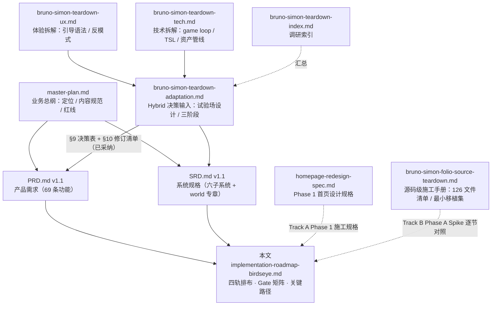
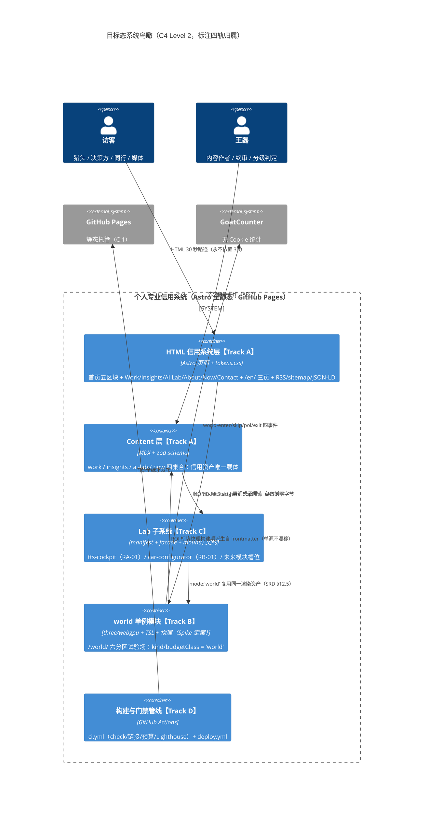
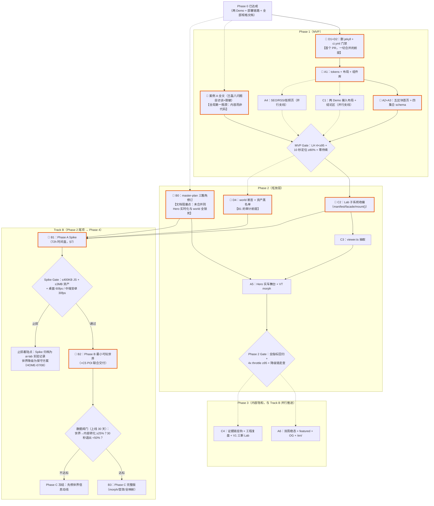

# 实施路径鸟瞰图 — 四轨并行 Hybrid 落地总路线图

**Implementation Roadmap (Bird's-Eye View)：让决策者 5 分钟看懂全局，让工程师 30 分钟能开工**

---

## 0. 文档信息与阅读指南

| 项 | 内容 |
|----|------|
| 文档名称 | 实施路径鸟瞰图（Implementation Roadmap · Bird's-Eye View） |
| 版本 | v1.0 |
| 状态 | 评审稿（Draft for Review） |
| 日期 | 2026-08-24 |
| 读者 | 决策者（王磊）、实施工程师 / Cloud Agent、后续任何接手者 |
| 上游权威 | `docs/spec/PRD.md` v1.1（需求唯一权威）、`docs/spec/SRD.md` v1.1（架构唯一权威）、`docs/website-plan/master-plan.md`（定位与红线） |
| 效力约定 | 本文**不新增任何需求或架构决策**——只回答「按什么顺序做、谁来做、每一步怎么算过门」。凡本文数字/条款与 PRD/SRD 冲突，一律以 PRD/SRD 为准并回修本文（见 §11 维护规则） |

**两条阅读路径：**

- **决策者 5 分钟**：读 §2（北极星与硬门禁）→ §4.0（四轨一页总览）→ §6（关键路径图）→ §9（风险 Top 10）。看完应能回答：钱花在哪四条线上、什么会阻塞什么、哪里止损。
- **工程师 30 分钟**：读 §2 → §3（目标态地图）→ §4（本轨里程碑）→ §5（当前 Phase 的 Gate 表）→ §12（命令 cheatsheet）；若接手 `/world/`，加读 §7（Spike 72 小时清单）与 §8（资产计划），随后逐节对照 `bruno-simon-folio-source-teardown.md` 开工。

---

## 1. 文档定位：与 PRD / SRD / 各调研文档的关系

三份规格文档各管一件事，互不越权：

| 文档 | 回答的问题 | 权威范围 |
|------|-----------|---------|
| `PRD.md` v1.1 | 做什么？为谁做？做到什么算成功？ | 功能清单（69 条）、优先级、KPI、Out of Scope |
| `SRD.md` v1.1 | 系统怎么拆？用什么技术？怎么验收？ | 架构原则 AP-1~9、数据模型、接口契约、NFR、Phase 0~4 门禁 |
| **本文** | 按什么顺序？谁来做？每步的过门命令和阻断条件是什么？ | 四轨排布、Gate 交叉矩阵、关键路径、Spike 执行清单、风险登记簿 |

### 1.1 文档依赖图



### 1.2 各轨的「开工前必读」清单

| 轨道 | 开工前必读（按序） |
|------|------------------|
| Track A（HTML 信用系统） | PRD §5/§6.1–6.3/§6.5 → SRD §5.1/§5.2/§8 → `homepage-redesign-spec.md` 全文 |
| Track B（/world/ 试验场） | PRD §2.6/§7.4/LAB-16~18 → SRD AP-9/§12.7 → `bruno-simon-teardown-adaptation.md` 全文 → `bruno-simon-folio-source-teardown.md`（施工时逐节对照） |
| Track C（Demo 整合） | PRD §7.1/§7.3 → SRD §12（全章）→ 现有 `src/pages/lab/*.astro` 源码 |
| Track D（工程基建） | SRD §11/§14.2 技术债表 → `AGENTS.md`（环境与命令） |

---

## 2. North Star 与不可妥协约束

### 2.1 三条北极星（一切排期让路于此）

| # | 北极星 | 定义 | 来源 |
|---|--------|------|------|
| N1 | **月度高质量 inbound 联系 ≥ 2** | 合作/机会/深度交流三类，人工台账逐条归因来源页面；上线 90 天内稳定达标 | PRD §10.1 |
| N2 | **10 秒定位达成率 ≥ 80%** | 3–5 名测试者手机端 10 秒内答对「是谁/做什么/找他能干嘛」≥ 2 问 | PRD §10.2 指标 1、HOME-01 |
| N3 | **「HTML 是宪法，3D 是公民」永远成立** | 删除整个 `/world/` 模块，站点构建与信息完整性零损失（CI 可验证）；世界内每条信息 HTML 两跳内必达 | PRD §2.6 承诺一、SRD AP-9 |

**排期裁决规则**：任何工程决策与 N1–N3 冲突时，工程让路。特别地：**内容生产的优先级恒高于世界施工**（SRD R8 缓解措施）——王磊的双周内容节奏不为任何 Track B 里程碑让路。

### 2.2 六条硬门禁（CI 阻断级，不过不合并）

| # | 门禁 | 口径 | 来源 |
|---|------|------|------|
| G1 | Lighthouse 四项 ≥ 95，**按路由考核** | 首页 + 全部内容页 + Lab 壳页 + `/world/` 静态壳页全部适用（移动端预设）；世界运行态改用独立运行时预算 | SRD C-2 + §2.5 增补 |
| G2 | 首页首屏传输 < 200KB gzip（常态 ≤ 120KB），且**首页/内容页对 world 零字节增量** | `audit-budget.mjs` 核算 + 关键路径断言无 world chunk/资产；Start here 按钮 = 一个 `<a>` + 一段 CSS | SRD C-3、NFR-P2/P6 |
| G3 | 保密分级前置：未过 P2 判定 + 检查表的素材不得进入构建 | schema 层 `securityGrade: 'P2'` + `sanitizationChecked: true` 双字面量锁死 | SRD C-4、AP-7、PRD GOV-01/02 |
| G4 | URL 永不变更（变更必须 301） | 两个 Demo 现有 URL、未来全部内容 slug 一经发布冻结 | SRD C-5 |
| G5 | 依赖红线：不引入 React/R3F、Lenis、Tailwind；GSAP 仅专项审批 | 新增运行时依赖必须登记 SRD 第 6 章决策表 + PR 预算行 | SRD C-6、AP-6 |
| G6 | 世界八条跳过出口任一失效 = P0 bug；每 Phase 合并前过 Persona 2 门禁走查 | 用猎头剧本走 30 秒路径，相对无世界版本任何劣化（多一次点击/慢 100ms/多一个视觉干扰）即门禁失败 | PRD LAB-18、§7.4 |

---

## 3. 目标态系统鸟瞰

### 3.1 C4 容器视角（含四轨归属）



### 3.2 全站地图（ASCII，四层结构）

```text
════════════ HTML 信用系统层（宪法 · Track A · 猎头 30 秒路径全在这层）════════════
  /                    首页五区块：Hero(poster→实车舞台) + 三支柱 + Lab bento
  │                    + 三案例卡 + 精选观点 + Now/CTA   ── 传输 <200KB · LH 4×≥95
  ├── /work/           案例索引（支柱×证据等级筛选）
  │     └── /work/{slug}/          12 模块详情 + 30 秒结论区 + 证据徽章
  ├── /insights/       洞见索引（行业判断/方法论/复盘）
  │     └── /insights/{slug}/      文章详情 + thesis + 行内证据标签
  ├── /ai-lab/         Lab 索引：实验记录（按工作阶段）+ Live Demo 专区
  │     └── /ai-lab/{slug}/        实验记录（六段结构）
  ├── /about/  /now/  /contact/    叙事·近况·四方向联系
  ├── /en/ /en/about/ /en/contact/ 英文三页（hreflang）
  └── /rss.xml  /sitemap.xml  /404
        │                                    │
        │ HOME-10「Start here · 进入试验场」  │ Lab 入口卡 / DemoLink 证据链挂钩
        │ （纯 <a>+CSS，点击前零 world 字节）  │ （View Transitions morph）
        ▼                                    ▼
═════════ /world/ 层（Track B · opt-in）══════   ═════ Lab 层（Track C）══════════
  /world/  静态壳页（LH 4×≥95，LCP=poster）      /lab/tts-cockpit      RA-01 · S 级
  │  加载屏 = 30 秒结论区（定位语逐条点亮）        /lab/car-configurator RB-01 · M 级
  │  「跳过 3D」第 0 秒起常驻 · noscript 出口     /lab/  索引页（manifest 生成）
  ▼  确认进入后才加载（≤500KB JS + ≤5MB 首包）    未来槽位：LAB-08 端云可视化
  ┌────────── 智能座舱试验场 ──────────┐          LAB-09 Prompt 对比台
  │      📚档案馆(Insights) 🗼控制塔(About)│      LAB-10 多语种 QA 检查器 …
  │   ╔══════ 环形试车道（主动线）══════╗ │          ▲
  │   ║ 🔬实验区(AI Lab)   🏁出发广场   ║ │          │ 重 Demo：真实跳转 + VT morph
  │   ║  TTS电台塔·涂装车间  (出生点)    ║◄┼──────────┘ （跳转前世界 dispose()）
  │   ║        🏗️案例岛(Work)  📡联络站 ║ │
  │   ╚═════════════════════════════════╝ │  轻内容：<dialog>+iframe overlay
  │   车↔机器人 morph（Phase C）           │  = canonical URL（?embed=1）
  └───────────────────────────────────────┘  ── 内容永不进 canvas
        ▼ 降级链：WebGPU → WebGL2 → 2D 等距地图 SVG → noscript 文字列表
═════════ Content 层（单一事实源 · 构建期派生一切）═════════════════════════════
  src/content/{work,insights,ai-lab}/*.mdx + now/entries.json + src/lab/manifest.json
  → 首页卡片 / 索引页 / JSON-LD / RSS / OG 图 / 世界 POI 标牌纹理 全部构建期生成
```

**一句话读图**：HTML 层独立完整（删掉下面三层照常营业）；Lab 层是「可运行证据」工厂；world 层是 Lab 层的单例旗舰模块（不是平行系统）；Content 层是所有层的数据地基——四轨分别施工这四层，Track D 给全部四层上门禁。

---

## 4. 四轨并行实施模型

### 4.0 一页总览

| 轨道 | 一句话使命 | 对应 SRD Phase | 起点条件 | 终点标志 |
|------|-----------|---------------|---------|---------|
| **Track A** HTML 信用系统 | 把占位站建成完整信用系统：五区块首页 + 四集合内容 + SEO/RSS + 英文页 | Phase 1 主体 + Phase 2 Hero + Phase 3 全部 | 即刻可开工 | 内容量达 mvp-checklist 数量表；北极星台账开始记录 |
| **Track B** /world/ 试验场 | 三阶段（Spike→最小可玩→完整版）交付 Hybrid 旗舰 Lab | Phase 2 尾项（Spike）+ Phase 4（B/C） | Track C 收编完成 + master-plan 豁免修订合并 | Phase C 全指标回归 + 世界工程复盘长文发布 |
| **Track C** 现有 Demo 整合 | 两个引子从「手写页面」升格为注册 Lab 模块，再空间化进世界 | Phase 1 轻改 + Phase 2 主体 + Phase 4 POI | 即刻可开工（Phase 1 部分） | manifest 体系生效；Hero 复用 viewer；世界内电台塔/涂装车间可交互 |
| **Track D** 工程基建 | 把 NFR 变成机器可执行的门禁：CI、预算审计、断言 | Phase 1 起持续 | 即刻可开工 | 全部门禁在 CI 阻断线运行；技术债 D1–D7 清零 |

**负责人角色分工（全轨通用）**：

| 角色 | 职责 | 不可代理的事 |
|------|------|-------------|
| **王磊**（产品负责人/内容作者） | 内容生产（案例/文章/实验记录）、保密分级判定与脱敏终审、10 秒定位测试组织、Persona 2 门禁走查、每月 KPI 复盘、Blender 美术（或外采决策） | 保密分级判定（GOV-01 灰区升级）、证据等级如实标注、北极星台账归因 |
| **Agent**（施工工程师） | 全部代码施工、文档修订执行、CI/脚本建设、资产管线（压缩/生成）、folio 模块移植、测试与走查记录 | —（产出一律过王磊终审后合并） |

### 4.1 Track A：HTML 信用系统

**使命**：承诺一的物质载体。首页五区块、Content Collections、Work/Insights/About/Now/Contact 全量建成——这条轨道完成即 MVP 上线，与 Track B 是否存在完全无关。

| 里程碑 | 内容 | 依赖 | 可并行窗口 | 负责人 |
|--------|------|------|-----------|--------|
| A1 视觉系统与布局 | `tokens.css`/`global.css`、BaseLayout/ArticleLayout/CaseLayout、SiteHeader/Footer/ThemeToggle 等全站组件（homepage-redesign-spec §3/§5） | 无（即刻开工） | 与 D1/D2 同 PR 波次并行 | Agent |
| A2 首页五区块 | HOME-01~04/06 全量（Hero 为 poster 静态舞台）；替换占位页（清偿 SRD D2 债） | A1 | 与 A3 并行（不同文件域） | Agent |
| A3 Content Collections + 首批内容 | `src/content.config.ts` 四集合 zod schema（SRD §8.1 全文照抄）；案例 A 全文 + B/C 精简、Insights×2、ai-lab×2、Now 首条 | A1；**内容侧依赖王磊八问题自访谈 + 分级判定** | 工程骨架与内容写作双线并行（内容先行不被工程阻塞，SRD 跨阶段不变量） | Agent（工程）+ 王磊（内容） |
| A4 SEO/发现层 + 低频页 | About/Now/Contact 三页、RSS/sitemap/JSON-LD/robots、GoatCounter 接入 | A1~A3 | 与 A2/A3 收尾并行 | Agent |
| A5 V1 增强 | HOME-07 Hero 实车舞台（**前置：master-plan 豁免修订 + Track C viewer.ts**）、GLB-09 View Transitions、WORK-08 筛选、ABT-02/05/06（时间线/PDF/英文三页）、HOME-09 性能自证行 | A2~A4 + C2 + master-plan 修订 | Hero 实时化与英文页/PDF 互不阻塞 | Agent |
| A6 内容饱和（Phase 3） | 双周节奏稳态、featured 精选、OG 图构建期生成、证据链全挂钩（WORK-05） | A5 | 与 Track B Spike/Phase B 完全并行 | 王磊（内容）+ Agent（OG 管线） |

### 4.2 Track B：/world/ 智能座舱试验场

**使命**：PRD §7.4 三阶段的执行轨。**不做工期承诺**（校准锚点：Bruno 全职约 14 个月交付 folio-2025），以门禁 + 止损点 + 数据阀门控制推进。

| 里程碑 | 内容 | 依赖 | 可并行窗口 | 负责人 |
|--------|------|------|-----------|--------|
| B0 文档前置 | master-plan 第 6 章三豁免一次修订（Hero 实时渲染 + 循环动画配额 + world 沉浸展项，SRD R4 行动项 + adaptation M1 搭车） | 无（可即刻起草） | 与 Phase 1 任何工作并行；**是 A5/B1 的合并前置** | Agent 起草 + 王磊批准 |
| B1 Phase A Spike | 隐藏路由 `/world-spike/`（noindex）：灰盒地面 + 环形道 + CarConcept 可驾驶 + 锥桶碰撞；验证操控手感/物理选型/双后端帧率/移动端摇杆（详见 §7 执行清单） | **C2 收编完成**（复用 facade/manifest/mount() 基建）+ B0 合并 | 与 A6 内容饱和并行（不争抢内容评审池） | Agent |
| B2 Phase B 最小可玩 | `/world/` 正式路由：出发广场 + 主直道 + 案例岛（旗舰 A 展馆 + B/C 标牌）+ 实验区（电台塔 + 涂装车间）+ Start here 全流程 + 八出口全套（LAB-18）+ 2D 等距地图 + iframe overlay + 四事件埋点 | B1 门禁通过（未过 → 止损归档）；与 C5 联合交付 | 世界美术资产（王磊/外采）与代码施工并行 | Agent（代码）+ 王磊（Blender 资产决策） |
| B3 Phase C 完整版 | 车↔机器人 morph（V1 遮蔽式，LAB-17）+ 音效体系 + 档案馆/控制塔/联络站全内容映射 + 昼夜联动 + 彩蛋 ≤3 + **世界工程复盘长文（旗舰级 ai-lab 文章）** | B2 上线 30 天数据阀门通过（世界→内容转化率 ≥ 25%，否则冻结） | 复盘长文写作与 Phase C 施工并行 | Agent（代码）+ 王磊（复盘长文终审） |

### 4.3 Track C：现有 Demo 整合（TTS + 配置器 → Lab 卡片 + 世界 POI）

**使命**：两个引子 Demo 是已验证的种子资产，分四步升格：接入全站 → 收编为注册模块 → 反哺 Hero → 空间化进世界。

| 里程碑 | 内容 | 依赖 | 可并行窗口 | 负责人 |
|--------|------|------|-----------|--------|
| C1 MVP 轻改 | 两 Demo 接入 BaseLayout/导航 + 30 秒结论区 + 跳过出口（LAB-03/04/05）；URL 不变（G4） | A1（布局就绪） | 与 A2/A3 并行 | Agent |
| C2 Lab 子系统收编 | `src/lab/` manifest.json + contracts.ts + facade.ts 落地；两 Demo 迁入 `lab/modules/`（git mv 保历史）；`/lab/` 索引页；清偿 SRD D3/D4/D6 债 | A 系 Phase 1 全量回归通过（Phase 门禁关系） | manifest/契约代码与 LabLayout 开发并行 | Agent |
| C3 viewer 抽取反哺 Hero | 配置器拆 `index.ts`/`viewer.ts`/UI 绑定层；Hero 以 `mode:'viewer'` 挂载同一资产（HOME-07）；`?paint=` 深链三处互通预埋 | C2 + B0（master-plan 豁免） | 与 A5 其余项并行 | Agent |
| C4 证据链与工程复盘 | WORK-05 案例↔Demo 双向挂钩；LAB-06 每 Demo ≥ 5 条具名取舍 + ≥ 1 失败项；LAB-07 状态徽章 | C2 + A3（案例已上线） | 与 A6 并行 | Agent（组件）+ 王磊（复盘内容） |
| C5 世界 POI 空间化 | TTS → 电台塔（复用 mp3+timeline.json 零新增资产）；配置器 → 涂装车间（`mode:'world'` 材质热更，presets.ts 单源）；`demo-cockpit`/`demo-car` VT 起点扩展 | C2/C3 + B2 同期（联合交付进 Phase B） | 归入 B2 交付批次 | Agent |

### 4.4 Track D：工程基建

**使命**：AP-4「预算是门禁不是目标」的执行机构。每条门禁上线越早，后面三轨的返工越少。

| 里程碑 | 内容 | 依赖 | 可并行窗口 | 负责人 |
|--------|------|------|-----------|--------|
| D1 删除 jekyll 遗留工作流 | 删 `.github/workflows/jekyll-gh-pages.yml`（与 deploy.yml 同触发同目标，部署竞态隐患）——**Phase 1 首个 PR 内完成**（SRD D1 债，高优先级） | 无 | 单独小 PR，随时可发 | Agent |
| D2 ci.yml 门禁一期 | PR 触发：`astro check` + `build` + `check-links.mjs`（内部链接 + DemoLink↔manifest 一致性）+ `audit-budget.mjs`（预算表进 PR 注释） | 无（脚本可先于内容存在） | 与 A1 并行 | Agent |
| D3 Lighthouse CI | `treosh/lighthouse-ci-action`：首页 + 1 内容页 + 1 Lab 页；PR 报告 + main 合并线四项 ≥ 95 阻断 | D2 | 与 A2~A4 并行 | Agent |
| D4 world 断言预埋 | `audit-budget.mjs` 增加：首页/内容页关键路径无 world chunk/资产断言（NFR-P6）；资产黑名单（禁 `.wav`/母带/encoder 出库，§8.4 教训）；`public/` ≤ 40MB 配额 | D2；**必须先于 B1 合并** | 与 C2 并行 | Agent |
| D5 统计与埋点 | GoatCounter 事件契约（SRD §9.5）全量：`lab-mount`/`lab-backend`/`scroll-75`/`pdf-download`；Phase B 起加 world 四事件 | A4 | 随各轨页面交付渐进接入 | Agent |
| D6 生成管线 | `render-posters.mjs`（车漆 poster 变体）、OG 图端点（satori+resvg，构建时长 > 60s 触发降级为仅 featured）、TTS 管线 README 注记（清 D7 债） | D2 | Phase 2/3 内随需交付 | Agent |

---

## 5. 阶段 Gate 表（Phase 0→4 × 四轨交叉矩阵）

> 阶段间是**门禁关系**（SRD §13）：Phase N 验收未过不得合并 Phase N+1 成果。每格 = 交付物 + 验收命令 + 阻断条件。「验收命令」中的脚本自 D2 起可用；人工走查项标注【人工】。

### Phase 0（现状，已达成）

| 轨 | 交付物 | 验收命令 | 阻断条件 |
|----|--------|---------|---------|
| A | 占位首页（已知债 D2） | — | — |
| B | 全部调研与决策文档（PRD/SRD v1.1 + 四份 teardown + adaptation） | 文档齐备性人工核对【人工】 | — |
| C | 两个 Demo 已上线（`/lab/tts-cockpit`、`/lab/car-configurator`），WebGPU/KTX2/Draco/RTL 管线已验证 | `pnpm build` 通过；两 Demo 手工可玩【人工】 | Demo 回归损坏 = 立即修复（信用资产） |
| D | `deploy.yml` 可用；**遗留 jekyll workflow 未删（D1 债）** | `gh run list --workflow=deploy.yml` | — |

### Phase 1（MVP：视觉系统 + 内容基建 + 首批内容）

| 轨 | 交付物 | 验收命令 | 阻断条件 |
|----|--------|---------|---------|
| A | A1+A2+A3+A4 全量：tokens/布局/组件、五区块首页（Hero=poster）、四集合 schema、案例 A 全文 + B/C 精简、Insights×2、ai-lab×2、About/Now/Contact、RSS/sitemap/JSON-LD/robots | `pnpm astro check && pnpm build`；`node scripts/check-links.mjs dist/`；`node scripts/audit-budget.mjs dist/`（<200KB）；`npx lighthouse http://localhost:4321/website/ --chrome-flags='--headless --no-sandbox'`（四项 ≥95）；10 秒定位测试 ≥80%【人工，3–5 人手机端】 | 案例 A 存在【待填】残留（WORK-02 构建阻断）；首页残留占位文案/断链；脱敏检查表任一未过（G3） |
| B | 仅 B0 文档前置：master-plan 第 6 章三豁免修订草案提交评审 | 修订 PR 经王磊批准合并【人工】 | **禁止任何 world 代码进入本阶段**；B0 未合并则 A5 Hero 实时化与 B1 一并锁死 |
| C | C1：两 Demo 接入全站布局 + 30 秒结论区 + 跳过出口；URL 不变 | 两 Demo 页 Lighthouse 四项 ≥95；结论区无交互可读 + 4x throttle 下进度指示可见【人工】 | Demo 任何功能回归；URL 变更（G4 违约） |
| D | D1（删 jekyll）+ D2（ci.yml 一期）+ D3（Lighthouse CI）+ GoatCounter 接入 | PR 上 CI 全绿；`gh run view <id> --log` 抽查门禁真实执行 | D1 未删不得发任何后续部署 PR；门禁未上线不得合并 Phase 2 任何成果 |

### Phase 2（炫技层：Lab 子系统化 + 活的首页 + 可选 Spike）

| 轨 | 交付物 | 验收命令 | 阻断条件 |
|----|--------|---------|---------|
| A | A5 中的 HOME-07 Hero 实车舞台 + GLB-09 View Transitions + LabCard 微动画 + HOME-09 性能自证行 | Phase 1 全指标回归 + 4x CPU throttle 下 Performance ≥95；reduced-motion/窄屏/无 WebGL 永停 poster 逐条走查【人工】 | master-plan 豁免（B0）未合并；4x throttle 不达标 → 触发 HOME-08 降级路线，实时 Hero 不合并 |
| B | B1 Phase A Spike（可选尾项）：`/world-spike/` 灰盒可驾驶（§7 清单） | 懒加载 JS ≤400KB gzip（`gzip -kc dist/_astro/<chunk>.js \| wc -c`）；资产 ≤3MB；桌面 60fps / 中端安卓 30fps【人工录测】；壳页 noindex 验证 | 前置未满足（C2 未完成）不得开工；帧率止损：中端安卓持续 <24fps 且无优化空间 → **Spike 整体丢弃**，归档 ai-lab 实验记录，世界降级为保守方案（HOME-07/08 路线） |
| C | C2 收编（manifest/contracts/facade + 两 Demo 迁入 + `/lab/` 索引）+ C3 viewer 抽取 | `pnpm astro check`（manifest schema）；两 Demo URL 不变回归；`?gl=1` WebGL2 回退实测【人工】；预算实测值写回 manifest `budget` 字段 | 收编导致任何 Demo 行为差异；模块间出现 import（分层守则违约） |
| D | D4（world 断言 + 资产黑名单 + 40MB 配额）+ D6 poster 管线 | `node scripts/audit-budget.mjs dist/` 输出含首页零 world 字节断言行 | D4 未合并则 B1 不得合并（Spike 预算无从审计） |

### Phase 3（内容饱和 + 分发闭环）

| 轨 | 交付物 | 验收命令 | 阻断条件 |
|----|--------|---------|---------|
| A | A6：稳态双周节奏、featured 精选区、OG 图构建期生成、`/en/` 三页 + hreflang、案例 B/C 补全 12 模块 | 内容量对齐 mvp-checklist 数量表【人工盘点】；OG 构建增量 <60s（超则降级 featured-only）；hreflang 校验工具零错误 | 内容密度未达标时**禁止**开启 Track B Phase B（避免「世界很炫、内容空洞」的反噬，PRD 风险 1×SRD R8 连坐） |
| B | （若 B1 已通过）Phase B 施工窗口开启，交付计入 Phase 4 | — | 数据阀门尚不适用（Phase B 未上线） |
| C | C4：WORK-05 双向挂钩全部三旗舰、LAB-06 工程复盘、LAB-07 徽章；V1 三新 Lab（LAB-08/09/10）按 §12.2 六步接入 | `check-links.mjs` 证据链 slug 一致性；每 Demo 复盘 ≥5 条取舍 + ≥1 失败项【人工抽查】 | 新 Lab 未过立项审查（支柱挂钩/预算级/分级）不得注册 manifest |
| D | Search Console 基线 + 月度指标表机制运转 + OG 端点构建监控 | 月度复盘记录存在【人工】 | — |

### Phase 4（增强池：world 转正 + 按数据决策）

| 轨 | 交付物 | 验收命令 | 阻断条件 |
|----|--------|---------|---------|
| A | 回归保护角色：首页与内容页在 world 上线前后零差异 | 每个 world PR 附首页 Lighthouse 回归 + audit-budget 零字节断言；Persona 2 门禁走查【人工，G6】 | 30 秒路径任何劣化 = 门禁失败，world PR 打回 |
| B | B2 Phase B 转正（含 LAB-18 八出口 + 2D 地图 + overlay + 埋点）→ 30 天数据阀门 → B3 Phase C（morph/音效/全映射/复盘长文） | `/world/` 壳页 Lighthouse 四项 ≥95（LCP=poster）；加载→可驾驶 ≤8s @Fast 4G【人工计时】；八出口逐条走查表留档【人工】；加载屏文案完整播完一轮【人工】；Phase C 追加：morph 在 `?gl=1` 回退路径可播、音效全可关、世界同屏循环动画 ≤5 | 八出口任一失效 = P0（G6）；**数据阀门：世界→内容转化率 <25% 冻结 Phase C**；30 秒退出率 >50% 触发加载屏/教学专项复盘 |
| C | C5 世界 POI 联合交付（电台塔/涂装车间 world 模式 + VT 起点扩展 + `?paint=` 三处互通） | 世界跳转 Demo 页前 `dispose()` 释放 GPU 验证（同页单 GPU 上下文，SRD §12.6）【人工 + DevTools】 | 两个 WebGPU 上下文并存（必炸预算）即打回 |
| D | CI 增 `/world/` 壳页 Lighthouse + world 预算行审计（≤500KB/≤900KB/≤5MB/≤12MB）；world 四事件埋点验收 | `audit-budget.mjs` world 预算表 + GoatCounter 事件实测【人工抽查】 | 预算超 manifest 声明 +10% 即 CI 告警、超 §12.7.2 上限即阻断 |

---

## 6. 关键路径（Critical Path）

> 依 PRD §7.4 与 SRD R8 的既定原则，本图**不标注日历工期**，只标注依赖与阻塞。粗框（红）为关键路径节点——它们延误则全局延误；虚线为可并行支线。



**四个必须盯死的阻塞项**：

| # | 阻塞项 | 阻塞什么 | 谁能解 | 解法 |
|---|--------|---------|--------|------|
| 1 | **案例 A 全文的内容生产**（八问题自访谈 + 12 模块 + 脱敏三重检查） | MVP Gate → 后续一切 | 只有王磊 | PRD 风险 1 对策：W2 整周只做案例 A；工程骨架先行用占位 schema 数据开发，内容到位即换 |
| 2 | **B0 master-plan 三豁免修订** | A5 Hero 实时化 + 全部 Track B | 王磊批准 | 修订量小（第 6 章加三条豁免注记），Phase 1 期间即可完成，不要拖到 Phase 2 动工时 |
| 3 | **C2 Lab 子系统收编** | B1 Spike（world 复用 facade/manifest/mount() 全套基建） | Agent | Phase 2 主体工作；收编质量直接决定 world 的地基 |
| 4 | **Phase B 数据阀门** | B3 Phase C | 数据说话 | 唯一不可人为加速的节点：上线满 30 天才读数；期间 Track A/C 照常推进 |

---

## 7. Phase A Spike 72 小时执行清单

> **性质声明**：72 小时是 Spike 的**时间盒（timebox）**，即止损装置——到点必须出「通过 / 止损」结论，防止 SRD R8 工期黑洞；它不是工期承诺，也不豁免任何门禁。产出物默认可丢弃（全部价值在于验证结论 + 参数记录）。前置条件：C2 收编完成、B0 修订合并、D4 断言上线。

### 7.0 开工前检查（约 30 分钟）

```bash
# 1. 确认前置
ls src/lab/manifest.json src/lab/facade.ts    # C2 已收编
rg -n "world" docs/website-plan/master-plan.md | head   # B0 豁免已入总纲

# 2. vendor 参考仓库（已 gitignore，缺失时按 vendor/README.md 重新获取）
ls vendor/folio-2025/sources/Game/ 2>/dev/null || cat vendor/README.md
# 行号基线：folio-2025 @ 41046b5 / folio-2019 @ 540f135（source-teardown §1.1）

# 3. 新分支
git checkout -b feat/world-spike
```

### 7.1 第一个 24 小时：目录搭建 + 引擎层移植 + 灰盒出画面

**Step 1 — 依赖与配置（source-teardown §9.3）**

```bash
pnpm add @dimforge/rapier3d          # 物理备选（wasm ~1.5MB，动态 import 不进首屏）
pnpm add -D vite-plugin-wasm vite-plugin-top-level-await
```

`astro.config.mjs` 增补：

```js
vite: { plugins: [wasm(), topLevelAwait()] }   // Rapier wasm 必需；three/webgpu 与解码器已就绪
```

**Step 2 — 目录搭建**（SRD §7 目标态 + source-teardown §9.1 布局）

```text
src/pages/world-spike/index.astro    # 静态壳页：noindex + poster + 「进入」按钮 + noscript 说明
src/lab/world/
├── index.ts        # mount() 契约入口（走既有 facade 协议挂载）
├── core/           # Events / Ticker / Game / Viewport / Quality / ResourcesLoader / Objects
├── rendering/      # Rendering（可先砍后处理）
├── physics/        # Physics / PhysicsVehicle（或手写运动学控制器）
├── inputs/         # Inputs / Keyboard / Pointer / Nipple
├── player/         # Player（意图层精简版）
├── view/           # View（跟随相机精简版）
└── world/          # World（灰盒场景，自写）+ Zones / Respawns / References
```

**Step 3 — 移植 folio 最小模块集**（≤15 约束，实际 14 项，约 3,900 行源码 → 预计 2,800 行 TS；逐项对照 source-teardown §9.1 表）：

| 顺序 | 模块 | 改写量 | 当日验证点 |
|------|------|--------|-----------|
| 1–2 | `Events.ts` + `Ticker.ts` | 零 / 低 | **`Ticker.scale=2` 全局倍速必须保留**——folio 全部手感参数按 2 倍速标定（source-teardown §5.4 隐藏参数） |
| 3 | `Game.ts`（276→~120 行） | 中 | 两阶段异步 init 结构照抄；系统列表换成本清单 |
| 4–6 | `Viewport.ts` / `Quality.ts` / `ResourcesLoader.ts` | 零 / 低 | loader 路径接本站 `public/` |
| 7 | `Rendering.ts` | 低 | WebGPURenderer 自动回退；后处理全砍（Spike 不需要） |
| 8–9 | `Physics.ts` + `PhysicsVehicle.ts` | 低 | 见 7.2 物理决策点 |
| 10 | `Objects.ts` | 低 | Blender 命名约定（`physical/dynamic` + `cuboid*` 等）原样保留 |
| 11 | `inputs/` 四件（Inputs/Keyboard/Pointer/Nipple） | 中 | V1 砍 Gamepad/Wheel/InteractiveButtons |
| 12 | `Player.ts`（676→~200 行） | 中 | 砍音效/成就/里程，留意图层 + respawn + 翻车自救 |
| 13 | `View.ts`（788→~350 行） | 中 | 留 focusPoint/zoom/spherical/optimalArea，砍 speedLines/cinematic |
| 14 | `Zones.ts` + `Respawns.ts` + `References.ts`（三小件算 1 项） | 零 | POI 注册底座，Phase B 才真正用到 |

**启动序列四坑**（source-teardown §4，直接编码进 Game.ts）：① Inputs 初始 filter 必须 `['intro']`（防加载期按键漏进不存在的车）；② `rendering.start()` 先于世界构建（进度显示需要渲染循环已跑）；③ `world.step(1)` 必须晚于 physics/objects；④ `ticker.wait(3)` 再 reveal（等 shader 编译，防白帧）。

**Step 4 — 灰盒地面**：单 plane 地面 + 程序化网格贴图（或 `MeshGridMaterial` 简化版）+ 环形道贴图（一张 KTX2 即可）+ 3 个碰撞锥桶（`cuboid`/`ball` primitive，不建模）。**一切正式美术零投入**——灰盒是 Spike 的纪律。

*第 24 小时检查点*：`pnpm dev` 下 `/website/world-spike/` 出画面（灰盒地面 + 静态相机），WebGPU 徽章正确显示，`?gl=1` 回退不报错。

### 7.2 第二个 24 小时：CarConcept 上车 + WASD 驱动

**Step 5 — 物理选型决策点（Spike 的核心问题）**

按 SRD 第 6 章选型顺序执行：

1. **先手写运动学控制器**（raycast 贴地 + 简单碰撞，AP-6 平台原生优先）：底盘沿地面射线贴地、速度/转向用阻尼插值、锥桶用球形距离碰撞。预计 ~300 行。
2. **半日内主观评估手感**（加速跟手度、转向阻尼、过锥桶反馈）。不达标 → 立即切 Rapier 路线，**不恋战**：
   - Rapier `DynamicRayCastVehicleController` + folio 参数表**原封不动起步**（source-teardown §5.2）：底盘三 collider（主体 mass 2.5 + `centerOfMass.y=-0.5` 压质心 / 车顶零质量 / bumper 推铲）；轮子 `frictionSlip 0.9`、`sideFrictionStiffness 3`（漂移手感核心旋钮）、悬挂三档 restLength 0.88/1.23/1.63；
   - 引擎力 `accel × 300 / (1+overflow) × deltaScaled` 软限速；松油门 `idleBrake 0.06`；反向先刹停（0.4）再倒车；
   - 车辆控制器 dt 用 30 帧滑动平均（与 world.step 瞬时 dt 分离，防帧尖峰打乱悬挂）。
3. 结论（含参数记录与手感评语）写入 Spike 决策记录——**这就是 SRD 第 6 章「物理/车辆控制」行的淘汰条件裁决材料**。

**Step 6 — CarConcept 上车**

```bash
du -sh public/models/car-concept/     # 现状 3.5MB（Draco+KTX2）
# Spike 直接复用现有产物；Draco 重压缩减面 LOD（目标 ≤2MB）允许放到 Phase B 再做
```

- 车模视觉挂载到底盘刚体（物理→视觉位姿同步走 `Objects.ts` 既有模式）；
- 授权合规：CC BY 4.0，页脚署名沿用配置器现有写法（NFR-S5）。

**Step 7 — WASD 驱动 + 相机跟随**：动作表照抄 `Player.js` L220-239 模式（forward/backward/left/right/boost/brake/respawn）；View 跟随相机（focusPoint 磁吸 + zoom）；翻车自救 `flip.jump()`（向上冲量 + 姿态扭矩）。

*第 48 小时检查点*：键盘可驾驶灰盒一圈，碰撞锥桶有反馈，翻车可自救，相机跟随不穿地。

### 7.3 第三个 24 小时：移动端 + 帧率测试 + 决策记录

**Step 8 — 触摸虚拟摇杆**：移植 `Nipple.ts`（自绘摇杆 + forward 扇区判定）；触屏窄屏默认不自动挂载（facade `pointerFine` 规则），显式「进入 3D（实验性）」按钮。

**Step 9 — 帧率与预算测试（门禁读数）**

```bash
# —— 构建与体积 ——
pnpm build && pnpm preview --host 0.0.0.0 &
ls -lS dist/_astro/ | head -20                       # 找 world chunk
gzip -kc dist/_astro/<world-chunk>.js | wc -c        # 门禁：≤ 400KB gzip（Spike 比正式 500KB 更严）
node scripts/audit-budget.mjs dist/                  # 首页零 world 字节断言必须仍然全绿
du -sh public/world/ 2>/dev/null                     # 门禁：Spike 资产 ≤ 3MB

# —— 帧率（桌面）——
# Chrome 打开 http://localhost:4321/website/world-spike/
#   → DevTools → Performance → CPU 4x slowdown → 录制 20s 连续驾驶（含急转/撞锥桶）
#   → FPS 轨道均值 ≥ 60（原生）且 4x throttle 下无长帧尖峰
# 路由加 #debug 挂 Tweakpane + stats（照抄 folio 的 Debug.ts 模式）

# —— 帧率（移动端，止损判据所在）——
# chrome://inspect USB 连接中端安卓真机（无真机时 4x throttle + 触摸模拟为近似下界）
#   → 连续驾驶 60s，持续帧率 ≥ 30fps；若 < 24fps，先试三板斧：DPR 降 1.5→1、
#     关阴影、装饰实例减半——仍 < 24fps 即触发止损

# —— 双后端 ——
# ?gl=1 强制 WebGL2 复测上述全部（渲染差异容忍，功能零差异）
```

**Step 10 — 决策记录（Spike 的真正交付物）**

写入 `docs/spec/` 或 PR 描述，五项必填：① 物理选型结论 + 参数表快照；② 双后端帧率读数（桌面/移动 × WebGPU/WebGL2 四格）；③ JS/资产实测体积 vs 门禁；④ 移动端摇杆可用性评语；⑤ 结论——**通过**（Phase B 排期开启，Spike 代码转正或重写）或**止损**（代码归档，整理为 ai-lab 实验记录发布——失败入档是信用资产，PRD §7.3 规则 5；世界方案降级为保守方案）。

---

## 8. 资源与资产计划

### 8.1 资产清单（按阶段，含来源与授权）

| # | 资产 | 阶段 | 来源与方案 | 授权 | 体积纪律 |
|---|------|------|-----------|------|---------|
| 1 | 玩家车 = CarConcept | A（复用）/B（LOD） | **复用现有** `public/models/car-concept/`（配置器/Hero/世界三位一体，叙事锚点）；Phase B 出减面 LOD 副本（烘掉内饰、Occlusion 降分辨率） | CC BY 4.0（Khronos + DGG），页脚署名 | 现 3.5MB；LOD 目标 ≤ 1.5MB |
| 2 | 地形 + 环形试车道 + 主直道 | A 灰盒 / B 正式 | Spike 用程序化灰盒；Phase B Blender 低模单网格 + 路面标线烘焙纹理；碰撞用 primitive（`colBox_*` 命名约定自动转物理体） | 原创 | folio 全岛地形仅 0.7MB——低模 + Draco 是量级保证 |
| 3 | 出发广场（定位大屏/教学锥桶/标定门） | B | 大屏文字**构建期脚本生成纹理**（文案改动不进 Blender） | 原创 | 计入首包 ≤ 5MB |
| 4 | Work 三展馆 + 标牌系统 | B | 每馆 ≤ 3k 三角面；标牌纹理构建期从 frontmatter 生成（problem/action/result + 证据徽章，单源不漂移） | 原创 | 分区流式配额内 |
| 5 | TTS 电台塔 + 涂装车间 | B | 塔身语种铭牌纹理由 `tts-manifest.json` 构建期生成；转盘复用配置器 `presets.ts` 色板 | 原创 + 复用 | 环境音直接流式拉 `public/demo/tts/`（单文件 ≤ 60KB，**零新增音频资产**） |
| 6 | 档案馆 / 控制塔 / 联络站 | C | 控制塔盘旋坡道需可驾驶（碰撞网格认真做） | 原创 | 分区流式合计 ≤ 12MB 内 |
| 7 | 机器人模型 | C | **首选 three.js 官方 RobotExpressive**（CC0，自带 Idle/Walking/Wave 等十余段骨骼动画，开箱覆盖驻点交互）；备选 Quaternius/Poly Pizza CC0；V2 变形立项时才 Blender 自建拓扑对应套装；**明确不用**任何真实车企机器人形象（NFR-S5 + 组合定位风险） | CC0 优先 | ~1MB 量级 |
| 8 | 装饰件（锥桶/轮胎墙/围挡/塔吊/夜测灯组） | B/C | 全部 instancing（单资产多实例，抄 folio `Benches.js` 模板） | 原创或 Kenney CC0 | 单资产 ≤ 100KB 级 |
| 9 | 2D 等距地图 SVG | B | Blender 等距渲染 → 描线成 SVG → 六分区热区；**独立设计资产而非残缺态**（AP-5），兼作 OG 分享图素材 | 原创 | SVG 数十 KB |
| 10 | 音效（引擎/morph/UI） | C | freesound CC0 筛选 / Kenney Audio；音频库先手写 WebAudio（超 ~150 行再评审 Howler.js ~7KB） | CC0 | **音效合计 ≤ 2MB，不上 BGM** |
| 11 | 天空/环境 | B | TSL 程序化渐变天空 + 昼夜插值（零资产成本，兼 TSL 技能展示点）；或复用现有 `studio_small_08_1k.hdr` | 原创/已有 | 0–1.5MB |
| 12 | 世界内 HUD 字体 | B | 复用现有 Inter/JetBrains Mono 子集，**禁止新增字体**（SRD R2 既有结论） | 已有 | 0 新增 |

### 8.2 129MB wav 教训 → 三条机器化纪律

folio-2025 仓库 66% 的体积（129.7MB）是三个忘删的 `.wav` 母带（同目录已有同名 mp3，实际加载的是 mp3）；另有重复的 `draco_encoder.js`（0.9MB×2，运行时只需 decoder）混入产物目录。**去掉母带与 encoder 后，一个 14 分区开放世界的实际网络负载 < 15MB**——这既是本站 `/world/` 可行性的证明，也是资产纪律失守的反面样本。落地为 Track D 三条 CI 纪律（D4）：

1. **格式黑名单**：`audit-budget.mjs` 断言 `public/` 与 `dist/` 中不存在 `.wav`/`.blend`/`.band`/`*encoder*`/未压缩母带类文件；
2. **配额总账**：`public/` 总量 ≤ 40MB（SRD §12.6，含 world 12MB 预留）；单模块资产超 manifest 声明 +10% 即告警；
3. **成对产物检查**：凡 `xxx.glb` 必须存在 `xxx-compressed.glb`（或直接只入库压缩版）；创作源文件（.blend 等）一律走 `resources/` 类目录并 gitignore，绝不进 `public/`。

### 8.3 美术风格张力的既定裁决

CarConcept 是写实 PBR，世界建筑是低模风格化——张力**已知且接受**（adaptation §8.2）：Phase A/B 车作为「hero asset」允许精度高一档（赛车游戏惯例）；Phase C 若 V2 预烘焙变形立项，则 Blender 自建「风格化概念车 + 机器人」套装一并解决风格统一与变形拓扑（对应 `3d-car-configurator.md` §3.2 的「A 起步，C 收尾」策略）。**不允许**为统一风格而在 Phase A/B 重做车模——那是把止损点烧掉的镀金行为。

---

## 9. 风险登记簿 Top 10

> 编号 RR-01~10（Roadmap Risk）；「来源」列映射 PRD §13 / SRD §14.1 原编号，规范性裁决以原文为准。

| # | 风险 | 来源 | 概率×影响 | 缓解（进行时） | 止损方案（触发即执行） |
|---|------|------|----------|---------------|----------------------|
| RR-01 | **world 工期黑洞**：Bruno 全职 14 个月 + 十余年 three.js 积累，单人兼职复刻是未定义行为；世界挤占内容生产 | SRD **R8** | 中-高 × 高 | 三阶段独立门禁 + 每阶段独立可上线；Spike 72h 时间盒；内容优先级恒高于世界施工；门禁分层使失败只影响 `/world/` 一条路由 | Spike 止损 → 代码归档为 ai-lab 实验记录（失败入档）；世界降级保守方案（HOME-07/08），信用系统零损失 |
| RR-02 | **内容空洞**：案例【待填】清不完，站点沦为「只有装修没有内容」——关键路径第一瓶颈（§6） | PRD 风险 1 | 中 × 高 | 八问题模板为排期准入闸门（GOV-03）；【待填】未清零构建阻断（WORK-02）；「上限即目标」不超编 | 下调 V1 内容目标、Lab 路线图顺延，**MVP 范围不变**；Phase 3 内容不达标则 Track B Phase B 禁启 |
| RR-03 | **morph 动画成本失控**：骨骼绑定/变形状态机是全链路最大美术风险 | PRD LAB-17、source-teardown §10 | 中 × 中 | V1 只做遮蔽式变形（0.9–1.2s 特效遮蔽 + 模型热交换，无需拓扑对应）；TransformSystem ~250 行是唯一核心新代码（插 tick order 1.5）；**不做实时骨骼 IK** | 降级为「局部变形」（车顶展开讲解臂）或车形态跑全程——Phase B 本就无 morph，砍掉不影响任何门禁 |
| RR-04 | **移动端帧率不达标**：Bruno 站移动端实测 stutter、iOS 冻结 30s 的前车之鉴 | adaptation §5、UX §11 | 中 × 高 | 帧预算自适应降档（DPR/阴影/实例减半 + toast）；触屏窄屏默认 2D 地图；DPR 封顶移动 1.5；shader 加载屏末拍预热 | Spike 阶段即读数：中端安卓持续 < 24fps 且三板斧无效 → RR-01 止损路径 |
| RR-05 | **保密泄露**：案例细节/元数据/组合特征被反推出雇主 | PRD 风险 3、SRD R3 | 低 × 极高 | 三重防线：schema 门禁（G3）→ 发布检查表 → 无痕复核；第三方组合定位测试后才允许 `sanitizationChecked: true`；灰区一律升级 | 存疑不发布；已发布内容立即下架 + 复盘入档；该风险无「接受」选项 |
| RR-06 | **WebGPU 兼容碎片化**：three WebGPU 路线快速演进，升级可能破坏 TSL/KTX2 管线 | SRD R1 | 中 × 中 | WebGL2 回退内建 + `?gl=1` 人工验证入口；`lab-backend` 事件实测真实覆盖率；three 升级绑定双后端回归清单 | WebGPU 挂载占比 < 30% → 下调宣传口径；升级破坏成本连续两次超收益 → 触发第 6 章淘汰条件重评选型 |
| RR-07 | **master-plan 张力未消解**：总纲第 6 章「动效仅 hover 与渐入」与 Hero 实时化/world 冲突 | SRD R4、§14.4 | 高（若不处理）× 中 | B0 一次修订三豁免（Hero + 循环动画配额 + world 沉浸展项），Phase 1 期间完成，不拖到 Phase 2 动工时 | 修订未合并前：Hero 实时化与全部 world 代码**不得合并**（poster 舞台不受影响，MVP 不被阻塞） |
| RR-08 | **资产体积失控**：129MB wav 教训的本站重演（母带/源文件/未压缩产物混入库） | source-teardown §8 | 中 × 中 | §8.2 三条 CI 纪律（格式黑名单/40MB 配额/成对产物检查）；KTX2+Draco 管线强制 | 超配额 CI 阻断；资产回炉压缩；创作源文件迁出 `public/` |
| RR-09 | **美术风格张力**：写实 CarConcept vs 低模世界 | adaptation §8.2 | 中 × 低 | Phase A/B 显式接受（hero asset 惯例）；§8.3 裁决已冻结 | Phase C 按数据评审 Blender 自建风格化套装；**不允许**提前重做车模 |
| RR-10 | **世界信息动线失效**：进得来玩得爽但不看内容（转化率 < 25%）或进来就走（30 秒退出 > 50%） | PRD §10.3 阀门 | 中 × 中 | 加载屏 = 30 秒结论区（定位保底曝光）；出生点 15 秒车程达旗舰 A 馆；发光引导线 + M 键传送；四事件埋点全量 | **Phase C 冻结**，先修信息动线；退出率越线 → 加载屏与教学流程专项复盘后才允许恢复推进 |

---

## 10. 度量仪表盘

### 10.1 产品 KPI（PRD §10 摘录，权威以 PRD 为准）

| 指标 | 目标（90 天基线） | 观测方式 | 失守动作 |
|------|-----------------|---------|---------|
| 北极星：月度高质量 inbound | ≥ 2 个/月，逐条归因 | 人工台账 | 月复盘定一个调整动作 |
| 10 秒定位达成率 | ≥ 80% | 每次首页改版后 3–5 人手机端人工测试 | 首页文案/层级回炉 |
| 首页 → 证据点击率 | ≥ 20% | GoatCounter 事件 | 卡片信息密度审视 |
| 旗舰案例阅读深度 | 停留 > 3 分钟；滚动 75%+ 持续观测 | `scroll-75:{path}` | 30 秒结论区/结构调优 |
| Demo 参与度 | 交互率 ≥ 40%；案例→Demo 转化 ≥ 15% | `lab-mount:{slug}` 等 | 证据链挂钩位置审视 |
| 自然搜索 / 外链 / 回访 | 品牌词稳定展示；自然外链 ≥ 3；回访趋势为正 | Search Console + 反链 + RSS | 内容选题复盘 |

### 10.2 world 子指标（LAB-16 Phase B 上线后激活，PRD §10.2 指标 4 扩展）

| 指标 | 目标/阀门 | 埋点 | 阀门动作 |
|------|----------|------|---------|
| Start here 点击率 | 预期 8–15%（低于 5% 审视入口文案，高于 20% 审视是否挤占主 CTA） | `world-enter` ÷ 首页 PV | 入口视觉层级微调 |
| 世界 → 内容页转化率 | **≥ 25%（硬阀门）** | (`world-poi:*` + `world-exit-to:*`) ÷ `world-enter` | **不达标冻结 Phase C**，先修信息动线 |
| 进入后 30 秒退出率 | **< 50%（警戒线）** | 会话时长分布 | 越线触发加载屏 + 教学流程专项复盘 |
| 跳过出口健康度 | `world-skip` 占比持续观测（异常升高 = 加载体验劣化信号） | `world-skip` ÷ 壳页 PV | 加载性能专项 |

### 10.3 工程指标（Track D 持续核算，按路由分账）

| 指标 | 上限/目标 | 验收命令 | 来源 |
|------|----------|---------|------|
| 首页首屏传输 | < 200KB gzip（常态 ≤ 120KB）；其中 JS ≤ 15KB、HTML+CSS ≤ 35KB、poster ≤ 40KB | `node scripts/audit-budget.mjs dist/` | C-3、NFR-P2 |
| Lighthouse 分路由 | `/`、`/work/{slug}`、`/insights/{slug}`、`/lab/*` 壳、`/world/` 壳：四项全部 ≥ 95（移动端预设）；首页 Phase 2 起加 4x throttle 复测 | `npx lighthouse <url> --chrome-flags='--headless --no-sandbox'` | C-2、NFR-P1 |
| 首页/内容页 world 增量 | **0 字节**（CI 断言） | audit-budget 断言行 | NFR-P6、AP-9 |
| Lab 模块预算 | S ≤ 50KB / M ≤ 300KB gzip；资产 S ≤ 1MB / M ≤ 6MB；实测超 manifest 声明 +10% 告警 | audit-budget 对照 manifest `budget` | §12.6 |
| world 运行时预算 | 首屏可玩 JS ≤ 500KB（Spike ≤ 400KB）；JS 全量 ≤ 900KB；资产首包 ≤ 5MB；分区流式合计 ≤ 12MB；加载→可驾驶 ≤ 8s @Fast 4G；桌面 60fps / 中端移动 30fps | audit-budget world 预算表 + 人工计时/录测 | §12.7.2 |
| `public/` 总量 | ≤ 40MB（现状约 8.8MB） | `du -sh public/` + CI 配额 | §12.6 |
| 循环动画配额 | 首页同屏 ≤ 2 处；世界内同屏 ≤ 5 处（分账）；离屏/隐藏全停 | 人工核验清单 | NFR-P5 |
| CI 构建时长 | OG 图增量 > 60s 触发降级（仅 featured 生成） | Actions 时长面板 | 第 6 章淘汰条件 |
| LCP 元素 | 恒为 poster 或 H1，禁止 canvas；CLS < 0.1 | Lighthouse + 手工核验 | NFR-P3 |

---

## 11. 文档维护规则

### 11.1 修订触发矩阵（改哪类事，先动哪份文档）

| 变更类型 | 先修订 | 再同步 | 举例 |
|---------|--------|--------|------|
| 定位、红线、内容规范 | `master-plan.md` | PRD §2 → 本文 §2 | 三支柱口径调整 |
| 功能范围、优先级、KPI、新 Lab 立项、P2 提前 | `PRD.md`（登记版本） | 本文 §4/§5/§10 | 某 V2 Lab 因强需求信号提前 |
| 架构、预算、接口契约、依赖选型、NFR | `SRD.md`（登记版本） | 本文 §5/§10.3 | Spike 定案物理选型 → SRD 第 6 章「淘汰条件」行落笔 |
| 排期顺序、门禁状态、风险读数、Spike/阀门结论 | **本文** | —（不反向约束 PRD/SRD） | Phase Gate 通过、数据阀门读数 |
| Phase 1 首页施工细节 | `homepage-redesign-spec.md` | 本文 §4.1 | Hero 布局微调 |

### 11.2 本鸟瞰图的更新时机（五个钩子）

1. **每个 Phase Gate 裁决后**：更新 §5 对应格的状态（通过/失败/带条件通过），失败须附原因与复测计划；
2. **PRD/SRD 版本升级后**：全文核对引用编号（功能 ID、C-x/AP-x/NFR-x/R-x），失配处回修——本文引用永远指向最新版编号；
3. **Spike 结论落地后**：§7 从「执行清单」改写为「执行记录」（保留原清单为附录），物理选型结论同步进 SRD 第 6 章；
4. **数据阀门读数后**：§10.2 填入实测值，§9 RR-10 状态更新；
5. **季度盘点**（与 PRD §10.3 复盘机制合拍）：核对四轨里程碑完成度与关键路径图是否仍然成立。

### 11.3 单一事实源纪律

- 本文所有规范性数字（预算、门禁阈值、KPI 目标）均为**转录**，权威在 PRD/SRD；两处数字冲突 = 本文的 bug，按 §11.1 矩阵回修；
- 本文**不得**被用作「PRD/SRD 没写但鸟瞰图写了所以可以做」的依据——排期文档不产生需求；
- 版本修订记录：

| 版本 | 日期 | 修订内容 | 修订人 |
|------|------|---------|--------|
| v1.0 | 2026-08-24 | 初版：四轨并行模型、Phase 0–4 Gate 矩阵、关键路径、Spike 72h 清单、资产计划、风险 Top 10、度量仪表盘 | 云端子代理 |

---

## 12. 附录：一键命令 Cheatsheet

> 环境约定见 `AGENTS.md`：Node ≥ 20、pnpm 10（`packageManager` 字段锁定）、`base: '/website'`。标注【P1+】的脚本自 Phase 1 交付后可用，【PA+】自 Phase A Spike 起可用。

```bash
# ───── 环境自检 ─────
node -v && pnpm -v                  # 期望 v20+ / 10.x
pnpm install                        # 锁文件存在时 CI 用 --frozen-lockfile

# ───── 日常开发 ─────
pnpm dev --host 0.0.0.0             # http://localhost:4321/website/
pnpm build                          # 产物 → dist/
pnpm preview --host 0.0.0.0         # 预览 dist/

# ───── 类型与 schema 门禁 ─────
pnpm astro check                    # TS + Content Collections zod 校验【P1+】

# ───── Lighthouse（按路由考核，移动端预设）─────
pnpm build && pnpm preview --host 0.0.0.0 &
npx lighthouse http://localhost:4321/website/ \
    --output=json --output=html --chrome-flags='--headless --no-sandbox'
npx lighthouse http://localhost:4321/website/work/multilingual-cockpit/ \
    --chrome-flags='--headless --no-sandbox'                    # 内容页抽查【P1+】
npx lighthouse http://localhost:4321/website/lab/car-configurator \
    --chrome-flags='--headless --no-sandbox'                    # Lab 壳页
npx lighthouse http://localhost:4321/website/world/ \
    --chrome-flags='--headless --no-sandbox'                    # world 壳页【Phase B+】
# Phase 2 起追加：DevTools Performance 面板 4x CPU throttle 复测首页 ≥ 95

# ───── 预算与链接门禁 ─────
node scripts/check-links.mjs dist/  # 内链/锚点/DemoLink↔manifest 一致性【P1+】
node scripts/audit-budget.mjs dist/ # 每页首屏传输表 + 首页零 world 字节断言【P1+】
du -sh public/                      # 总配额 ≤ 40MB 粗测
ls -lS dist/_astro/ | head -20      # chunk 体积排行
gzip -kc dist/_astro/<chunk>.js | wc -c   # 单 chunk gzip 实测

# ───── 资产管线 ─────
python3 scripts/generate-tts.py     # TTS mp3 + timeline.json 再生成（勿手改产物）
node scripts/render-posters.mjs     # 车漆 poster 变体【P2+】

# ───── world 开发【PA+】─────
pnpm dev --host 0.0.0.0             # 访问 /website/world-spike/（noindex 隐藏路由）
#   URL 开关：#debug → Tweakpane 调参面板；?gl=1 → 强制 WebGL2 回退验证；
#             ?poi=work-a → 指定分区出生（Phase B+）；?paint=crimson → 车漆三处互通
cat vendor/README.md                # folio 参考仓库缺失时的重新获取方式
git -C vendor/folio-2025 log -1     # 行号基线核对（41046b5）

# ───── CI 观测（gh 只读）─────
gh run list --limit 10              # 最近工作流
gh run view <run-id> --log          # 门禁执行日志抽查
```

---

*本文是实施顺序与门禁排布的单一事实来源（v1.0）。需求以 PRD v1.1 为准、架构以 SRD v1.1 为准；任何 Phase Gate 裁决、Spike 结论与数据阀门读数按 §11 规则回写本文。开工者从 §1.2「开工前必读」进入自己的轨道。*
