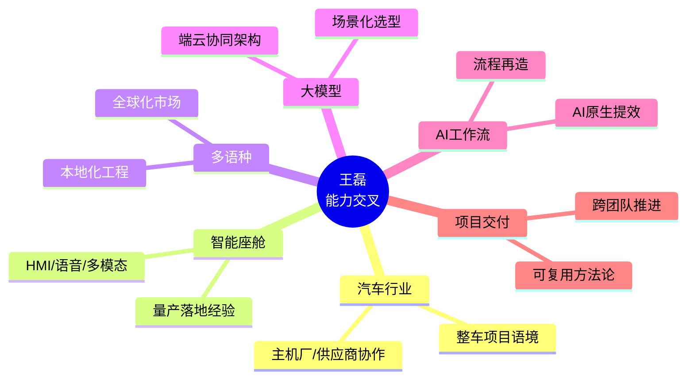
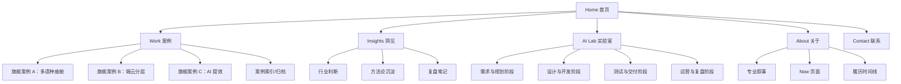
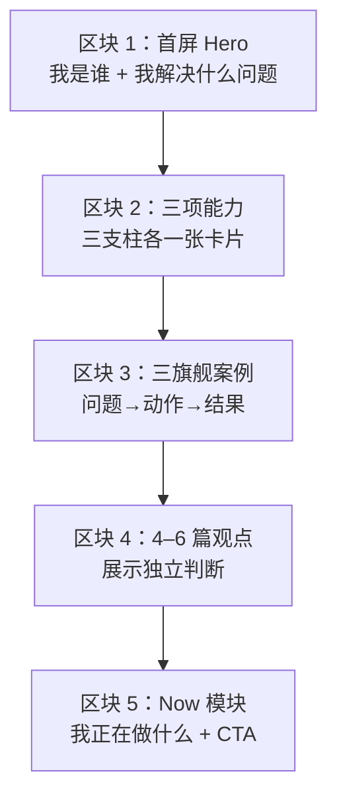
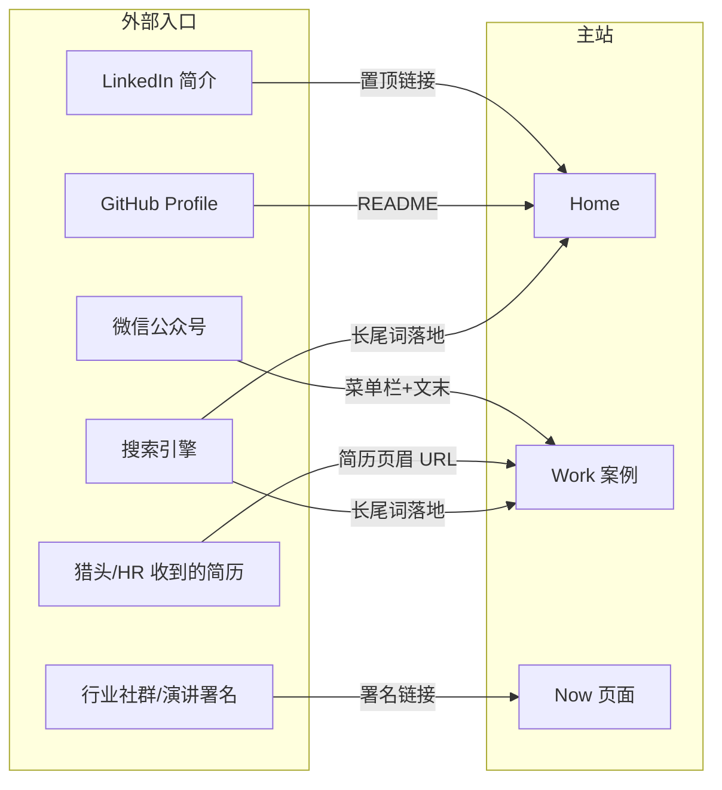
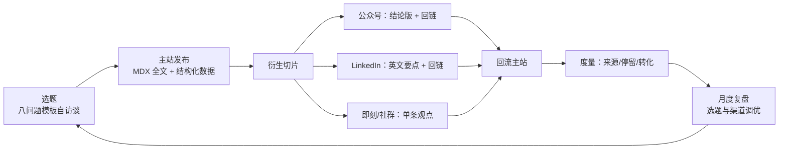

# 个人网站综合方案书（Master Plan）

> **站点主体**：王磊｜汽车智能座舱与 AI 解决方案经理
> **标语（Tagline）**：把复杂技术转化为可决策、可交付、可复用的解决方案
> **文档性质**：结构化、可执行的建站总方案，覆盖定位、信息架构、首页设计、视觉、技术、SEO、分发与度量
> **版本**：v1.0

---

## 目录

- [1. 网站定位与四大作用](#1-网站定位与四大作用)
- [2. 信息架构（六大导航 + 子栏目）](#2-信息架构六大导航--子栏目)
- [3. 首页五区块设计](#3-首页五区块设计)
- [4. 案例（Work）内容规范](#4-案例work内容规范)
- [5. 洞见（Insights）与 AI Lab 内容规范](#5-洞见insights与-ai-lab-内容规范)
- [6. 视觉风格](#6-视觉风格)
- [7. 技术实现（Astro + TypeScript + MDX + GitHub Pages）](#7-技术实现astro--typescript--mdx--github-pages)
- [8. SEO 与结构化数据](#8-seo-与结构化数据)
- [9. 一站多入口策略](#9-一站多入口策略)
- [10. 内容分发闭环](#10-内容分发闭环)
- [11. MVP 范围与 30 天执行节奏](#11-mvp-范围与-30-天执行节奏)
- [12. 成效度量](#12-成效度量)
- [13. 避坑清单与红线规范](#13-避坑清单与红线规范)
- [附录 A：案例八问题访谈模板](#附录-a案例八问题访谈模板)
- [附录 B：证据等级定义](#附录-b证据等级定义)

---

## 1. 网站定位与四大作用

### 1.1 一句话定义

**这不是一个简历站，而是一套「个人专业信用系统」。**

简历回答"我做过什么职位"；个人网站回答"我能为你解决什么问题、凭什么信我、如何与我合作"。所有内容围绕**建立并持续累积专业信用**这一目标组织。

### 1.2 四大作用

| # | 作用 | 回答的问题 | 站内承载 | 成功标志 |
|---|------|-----------|---------|---------|
| 1 | **职业定位** | 我是谁？在哪个交叉领域不可替代？ | 首页首屏、About | 访客 10 秒内能复述我的定位 |
| 2 | **能力证明** | 凭什么信我？证据在哪？ | Work 案例库（12 模块结构 + 证据等级） | 案例被猎头/合作方在沟通中主动引用 |
| 3 | **知识影响力** | 我对行业有什么独立判断？ | Insights 观点文章、AI Lab 实验记录 | 文章被搜索/转发带来自然流量 |
| 4 | **关系转化** | 看完之后下一步做什么？ | Contact、Now 模块、各页 CTA | 每月产生高质量 inbound 联系 |

### 1.3 核心能力交叉（差异化护城河）

单项能力可被替代，交叉组合难以复制：



**定位表述（全站统一口径）**：

- 中文：**王磊｜汽车智能座舱与 AI 解决方案经理**
- 标语：**把复杂技术转化为可决策、可交付、可复用的解决方案**
- 三支柱（能力的三个对外切面）：
  1. **智能座舱多语种**：多语种座舱产品从需求到量产的全链路
  2. **端云大模型**：车端/云端大模型分层架构与场景化落地
  3. **AI 原生工作流**：用 AI 重构个人与团队的交付流程

---

## 2. 信息架构（六大导航 + 子栏目）

### 2.1 导航总览



### 2.2 各栏目定义

| 导航 | 定位 | 子栏目 | 更新频率 | 核心 CTA |
|------|------|--------|---------|---------|
| **Home** | 10 秒建立定位认知，分流到深度内容 | —（五区块单页） | 随内容联动 | 看案例 / 联系我 |
| **Work** | 能力证明主阵地，案例库 | 三旗舰案例；按支柱/行业/角色筛选的索引 | 每 1–2 月新增或迭代 1 篇 | 联系我聊类似问题 |
| **Insights** | 知识影响力，独立判断输出 | 行业判断、方法论沉淀、复盘笔记 | 每 2 周 1 篇 | 订阅 RSS / 关注 |
| **AI Lab** | AI 工作流实验记录，**按工作阶段分类**（不是按工具分类） | 需求规划 / 设计开发 / 测试交付 / 运营复盘 四阶段 | 每 2 周 1 篇 | 复用模板 / 交流 |
| **About** | 专业叙事 + 近况 | 专业叙事、Now 页面、履历时间线 | Now 每月更新 | 下载一页简介 / 联系 |
| **Contact** | 关系转化终点 | 合作方向说明、联系方式、常见问题 | 稳定 | 邮件 / 预约沟通 |

### 2.3 URL 结构

```text
/                       # Home
/work/                  # 案例索引
/work/{slug}/           # 单篇案例（如 /work/multilingual-cockpit/）
/insights/              # 洞见索引
/insights/{slug}/       # 单篇文章
/ai-lab/                # AI Lab 索引（按阶段分组展示）
/ai-lab/{slug}/         # 单篇实验记录
/about/                 # 关于
/now/                   # Now 页面（About 子页，独立 URL 便于外链）
/contact/               # 联系
/rss.xml  /sitemap.xml  # 订阅与站点地图
```

原则：URL 全小写、短横线分隔、永不变更（变更必须 301）；每篇内容独立 URL，便于外部单点引用。

---

## 3. 首页五区块设计

首页是"电梯陈述"，五个区块自上而下完成**定位 → 能力 → 证据 → 观点 → 近况**的信任递进。



### 区块 1：首屏 Hero

| 要素 | 内容 |
|------|------|
| 主标题 | 王磊｜汽车智能座舱与 AI 解决方案经理 |
| 副标题 | 把复杂技术转化为可决策、可交付、可复用的解决方案 |
| 一句话展开 | 聚焦"汽车 × 座舱 × 多语种 × 大模型 × AI 工作流 × 项目交付"的交叉地带 |
| 双 CTA | 主：查看三个旗舰案例 → `/work/`；次：联系合作 → `/contact/` |
| 设计要求 | 无轮播、无大图 banner；首屏文字信息在 3 秒内可读完 |

### 区块 2：三项能力（三支柱）

三张等宽卡片，每张 = 支柱名 + 一句能力描述 + 一个量化锚点 + 指向对应旗舰案例的链接。

| 卡片 | 能力描述示例 | 链接目标 |
|------|------------|---------|
| 智能座舱多语种 | 多语种座舱产品从需求定义到量产交付的全链路把控 | 旗舰案例 A |
| 端云大模型 | 车端/云端大模型分层架构设计与场景化选型落地 | 旗舰案例 B |
| AI 原生工作流 | 用 AI 重构需求、开发、测试、复盘全流程的提效体系 | 旗舰案例 C |

### 区块 3：三旗舰案例

每个案例卡片固定三行结构：**问题（客户/业务痛点）→ 动作（我做了什么）→ 结果（量化或可验证的产出）**，附证据等级标识（见附录 B），点击进入案例详情页。

### 区块 4：4–6 篇精选观点

- 从 Insights 与 AI Lab 中人工精选 4–6 篇（非"最新文章"自动列表），体现**判断力密度**；
- 每篇展示：标题 + 一句话论点（不是摘要，是结论）+ 发布日期；
- 该区块由 frontmatter 中 `featured: true` 字段驱动，人工控制。

### 区块 5：Now 模块

- 同步 `/now/` 页面的最新内容摘要：当前在研究什么、在写什么、开放什么类型的合作；
- 显示"最后更新于 YYYY-MM"，传达站点是活的；
- 收尾 CTA：邮件联系 + 社交入口（微信公众号 / LinkedIn / GitHub）。

---

## 4. 案例（Work）内容规范

### 4.1 案例 12 模块结构

每篇案例统一使用以下 12 模块（MDX 模板固化），可按敏感度裁剪但顺序不变：

| # | 模块 | 说明 |
|---|------|------|
| 1 | 背景与语境 | 行业、项目类型、时间跨度（脱敏后） |
| 2 | 问题定义 | 业务/技术痛点，为什么难 |
| 3 | 约束条件 | 资源、时间、组织、合规约束 |
| 4 | 我的角色 | 明确职责边界，不夸大不含糊 |
| 5 | 备选方案与取舍 | 考虑过什么、为什么放弃 |
| 6 | 解决方案 | 架构/流程/机制，配图 |
| 7 | 关键决策点 | 2–3 个最难的决策及依据 |
| 8 | 落地过程 | 推进方式、阻力与化解 |
| 9 | 结果与量化 | 数据、对比、验收结论 |
| 10 | 证据 | 按证据等级标注（附录 B） |
| 11 | 复盘与迁移 | 如果重来会怎么做；方法论如何复用到其他场景 |
| 12 | 相关链接 | 关联的 Insights / AI Lab 文章，形成站内网 |

### 4.2 三大旗舰案例

| 旗舰 | 主题 | 对应支柱 | 核心叙事 |
|------|------|---------|---------|
| **A** | 多语种智能座舱 | 智能座舱多语种 | 多语种/多市场座舱产品如何从需求歧义走到量产交付 |
| **B** | 端云大模型分层 | 端云大模型 | 车端算力约束下的端云分层架构决策与场景化落地 |
| **C** | AI 提效体系 | AI 原生工作流 | 用 AI 工作流重构团队交付流程的量化提效实践 |

---

## 5. 洞见（Insights）与 AI Lab 内容规范

### 5.1 Insights 三类内容

| 类型 | 判断标准 | 示例选题方向 |
|------|---------|------------|
| 行业判断 | 有明确的、可被证伪的观点 | 座舱大模型落地的真实瓶颈在哪 |
| 方法论沉淀 | 可被他人直接套用 | 多语种需求评审的检查清单 |
| 复盘笔记 | 有真实教训与迁移结论 | 一次跨时区交付延期的归因 |

### 5.2 AI Lab：按工作阶段分类（核心原则）

**不做工具大全，不按"提示词/插件/模型"分类，一律按工作阶段分类**——读者带着阶段性问题来，按阶段找答案：

| 阶段 | 覆盖场景示例 |
|------|------------|
| 需求与规划 | 需求澄清、竞品调研、PRD 起草中的 AI 用法 |
| 设计与开发 | 方案设计、代码评审、文档生成中的 AI 用法 |
| 测试与交付 | 用例生成、多语种验证、发布材料中的 AI 用法 |
| 运营与复盘 | 数据分析、会议纪要、复盘报告中的 AI 用法 |

每篇 AI Lab 文章必须包含：**场景 → 原流程痛点 → AI 介入方式 → 前后对比（时间/质量）→ 可复用模板/提示词 → 局限与失败记录**。

### 5.3 内容生产：八问题访谈模板

所有案例与深度文章先用附录 A 的八问题模板自我访谈成草稿，再成文，保证内容密度与结构一致性。

---

## 6. 视觉风格

**定调：技术编辑部 × 工业设计**——像一本严肃的技术刊物，又有工业产品的克制与精密感。

| 维度 | 规范 |
|------|------|
| 整体气质 | 编辑排版优先、内容即界面；拒绝营销感、拒绝模板感 |
| 版式 | 单栏阅读主轴（正文约 68–72ch），大量留白；网格对齐 |
| 字体 | 中文：思源黑体/系统黑体栈；西文与数字：Inter；代码与数据：JetBrains Mono |
| 色彩 | 近黑（#111）正文 + 纸白（#FAFAF8）底 + 单一强调色（工业橙或信号蓝，全站唯一）；暗色模式为一等公民 |
| 图形语言 | 架构图/流程图统一线框风格（与 mermaid 输出风格对齐）；照片仅用于证据类内容 |
| 组件 | 案例卡、证据等级徽章、阶段标签、Now 时间戳为固定视觉组件 |
| 动效 | 仅保留必要的 hover 与页面渐入；无滚动劫持、无视差 |
| 密度 | 首页信息密度高但层级清晰；详情页阅读体验优先 |

---

## 7. 技术实现（Astro + TypeScript + MDX + GitHub Pages）

### 7.1 选型理由

| 选型 | 理由 |
|------|------|
| **Astro** | 内容站首选：默认零 JS 输出、Content Collections 类型安全、MDX 原生支持、构建产物纯静态 |
| **TypeScript** | 内容 schema、组件 props 全程类型约束，重构安全 |
| **MDX** | 文章内可嵌入交互组件（对比表、证据徽章、前后对比块） |
| **GitHub Pages** | 零成本、与内容仓库同源、GitHub Actions 自动部署；自定义域名 + HTTPS |

### 7.2 仓库结构

```text
/
├── astro.config.mjs          # site、integrations（mdx、sitemap）
├── src/
│   ├── content/
│   │   ├── config.ts         # zod schema：work / insights / ai-lab 三个 collection
│   │   ├── work/*.mdx
│   │   ├── insights/*.mdx
│   │   └── ai-lab/*.mdx
│   ├── layouts/              # BaseLayout / ArticleLayout / CaseLayout
│   ├── components/           # Hero、PillarCard、CaseCard、EvidenceBadge、NowBlock…
│   ├── pages/                # index、work、insights、ai-lab、about、now、contact、rss.xml.ts
│   └── styles/               # 设计 token（CSS 变量）+ 全局样式
├── public/                   # favicon、og 默认图、robots.txt
└── .github/workflows/deploy.yml
```

### 7.3 内容 Schema（关键字段）

```ts
// src/content/config.ts（节选）
const work = defineCollection({
  schema: z.object({
    title: z.string(),
    summary: z.string(),          // 问题→动作→结果 一句话
    pillar: z.enum(['cockpit-i18n', 'edge-cloud-llm', 'ai-workflow']),
    evidenceLevel: z.enum(['L1', 'L2', 'L3', 'L4']),
    featured: z.boolean().default(false),
    publishDate: z.date(),
    updatedDate: z.date().optional(),
  }),
});
```

### 7.4 部署流水线

`main` 分支 push → GitHub Actions（`withastro/action`）构建 → 产物发布到 GitHub Pages → 自定义域名（CNAME + `astro.config` 中 `site` 字段）→ 强制 HTTPS。PR 预览可选接 Cloudflare Pages 免费层。

### 7.5 性能与质量门槛

- Lighthouse 四项 ≥ 95；首页传输体积 < 200KB（不含字体）；
- 字体子集化（中文按需子集）、图片 `astro:assets` 自动压缩为 AVIF/WebP；
- 构建时链接检查 + schema 校验失败即阻断部署。

---

## 8. SEO 与结构化数据

### 8.1 基础 SEO

| 项 | 做法 |
|----|------|
| 标题体系 | `{页面标题}｜王磊 - 汽车智能座舱与 AI 解决方案`；首页直接用定位语 |
| Meta description | 每页手写，包含目标搜索词（智能座舱、多语种、端云大模型、AI 工作流） |
| 站点地图/robots | `@astrojs/sitemap` 自动生成；robots.txt 允许全站抓取 |
| 规范链接 | 每页 `rel=canonical`；旧 URL 一律 301 |
| Open Graph | 每篇内容构建时生成 OG 图（标题 + 定位语版式统一） |
| 国际化 | 站点以中文为主；About/Work 摘要提供英文版并加 `hreflang` |

### 8.2 结构化数据（JSON-LD）

| 页面 | Schema 类型 | 关键字段 |
|------|------------|---------|
| 全站 | `Person` + `WebSite` | name、jobTitle（汽车智能座舱与 AI 解决方案经理）、knowsAbout（座舱/多语种/LLM/AI 工作流）、sameAs（GitHub/LinkedIn/公众号） |
| 案例页 | `Article`（或 `TechArticle`） | headline、about、author→Person、datePublished/dateModified |
| Insights / AI Lab | `BlogPosting` | 同上 + keywords |
| About | `ProfilePage` | mainEntity → Person |
| 面包屑 | `BreadcrumbList` | 全内容页输出 |

实现方式：Astro 布局组件内统一注入 `<script type="application/ld+json">`，数据源自 content frontmatter，避免手工维护漂移。

---

## 9. 一站多入口策略

**一个内容主站，多个渠道入口；所有外部入口最终回流主站。**



| 入口 | 落地页 | 配置动作 |
|------|-------|---------|
| 简历/名片 | `/work/`（直接看证据） | 简历页眉固定 URL；可加 UTM 区分渠道 |
| LinkedIn | `/`（英文摘要 About 备用） | 简介区置顶 + Featured 挂旗舰案例 |
| 微信公众号 | 对应文章页 | 文章为"预告+核心结论"，全文回主站；菜单栏挂主站 |
| GitHub | `/ai-lab/` | Profile README 挂主站与 AI Lab |
| 搜索引擎 | 各内容页 | 依赖第 8 章 SEO；长尾词由案例与 AI Lab 承接 |
| 演讲/播客/社群 | `/now/` | 署名统一带 `/now/`，展示实时近况 |

---

## 10. 内容分发闭环

**原则：主站是唯一的内容资产库（single source of truth），渠道只做衍生与引流。**



执行规则：

1. **先主站后渠道**：任何内容 24 小时内先发主站，渠道版本必须带回链；
2. **一文三切**：每篇深度内容至少衍生 3 条渠道切片（结论卡片、金句、图表）；
3. **回链落到具体页**：渠道链接指向具体文章/案例，不指首页；
4. **月度复盘**：按第 12 章指标复盘选题命中率与渠道效率，淘汰低效渠道。

---

## 11. MVP 范围与 30 天执行节奏

### 11.1 MVP 定义（第 30 天上线基线）

| 必须有 | 明确不做（v1 后再说） |
|--------|---------------------|
| 首页五区块完整 | 评论系统 |
| 旗舰案例 A（12 模块完整版） | 全文搜索 |
| 案例 B、C（精简版：模块 1/2/6/9/10） | 英文全站 |
| Insights ×2、AI Lab ×2 | 深色模式切换动画等打磨 |
| About + Now + Contact | 邮件订阅系统（先用 RSS） |
| SEO 基础 + JSON-LD + RSS + Sitemap | 数据可视化交互组件 |

### 11.2 30 天节奏（四周冲刺）

| 周 | 主题 | 交付物 | 验收标准 |
|----|------|-------|---------|
| **W1（D1–7）** | 骨架与文案 | Astro 工程初始化、部署流水线打通、全站信息架构落地、首页文案定稿 | 空壳站可通过自定义域名 HTTPS 访问；首页五区块占位完成 |
| **W2（D8–14）** | 旗舰案例 A | 用八问题模板完成访谈稿 → 12 模块成文 → 配 2 张架构/流程图 | 案例 A 上线；证据等级标注完整；脱敏自查通过 |
| **W3（D15–21）** | 案例 B/C + 首批文章 | 案例 B、C 精简版；Insights ×1；AI Lab ×1 | Work 索引页三案例齐全；首页区块 3/4 用真实内容替换占位 |
| **W4（D22–30）** | 内容补齐与上线 | Insights ×1、AI Lab ×1；About/Now/Contact 定稿；SEO/JSON-LD/OG 图核验；渠道入口全部配置 | Lighthouse ≥95；Search Console 提交 sitemap；对外正式宣发 |

### 11.3 上线后的稳态节奏

- **每 2 周**：1 篇 Insights 或 AI Lab（交替）；
- **每月**：更新 Now 页面；1 次数据复盘（第 12 章）；
- **每季度**：新增或深度迭代 1 篇案例；检视定位语与三支柱是否需要微调。

---

## 12. 成效度量

### 12.1 指标体系（按四大作用对齐）

| 作用 | 指标 | 工具 | 基线目标（上线 90 天） |
|------|------|------|----------------------|
| 职业定位 | 品牌词搜索展示（"王磊 智能座舱"等）；首页跳出率 | Search Console / 站点分析 | 品牌词有稳定展示；首页跳出率 < 60% |
| 能力证明 | 案例页浏览深度（滚动 75%+ 比例）、平均停留时长 | 轻量分析（Umami/GoatCounter 自托管） | 旗舰案例停留 > 3 分钟 |
| 知识影响力 | 自然搜索点击、RSS 订阅数、外部引用/回链数 | Search Console / RSS 统计 | 月自然点击环比增长；≥3 个自然外链 |
| 关系转化 | inbound 联系数与质量（合作/机会/交流分类记录） | Contact 表单/邮箱人工台账 | 每月 ≥2 个有效联系 |

### 12.2 复盘机制

- **月度**（30 分钟）：看四类指标 → 标记表现最好/最差的内容 → 决定下月 1 个调整动作；
- **季度**（2 小时）：内容资产盘点（哪些案例被引用、哪些文章带来联系）→ 更新首页精选区块 → 修订选题方向；
- **原则**：只用指标驱动"下一个动作"，不做仪表盘堆砌；隐私友好（无 Cookie 弹窗的自托管统计）。

---

## 13. 避坑清单与红线规范

### 13.1 四大避坑

| 坑 | 表现 | 对策 |
|----|------|------|
| **简历搬运站** | 按时间罗列职位职责，无问题-动作-结果叙事 | 一切内容以"解决了什么问题"组织；履历时间线只作为 About 的附属 |
| **工具大全站** | AI Lab 变成提示词/工具收藏夹 | 严格按工作阶段分类；每篇必须有前后对比与失败记录 |
| **内容密度不足** | 大量短文、感想式更新稀释信用 | 宁少勿滥：单篇不达"八问题模板"深度不发布；首页只挂人工精选 |
| **脱敏失守** | 泄露雇主数据、客户名、未公开项目细节 | 见 13.2 红线规范，发布前逐条自查 |

### 13.2 脱敏红线规范（发布前 Checklist）

- [ ] 不出现客户/合作方真实名称，用"某头部主机厂/某 Tier1"指代；
- [ ] 数据一律模糊化处理：用倍数、百分比、区间替代绝对值（"提效约 40%"而非内部工时数）;
- [ ] 不使用内部系统截图、内部文档照片；架构图一律重绘并抽象化；
- [ ] 不透露未发布车型、项目代号、时间点等可反推信息；
- [ ] 涉及在职期间成果，遵守劳动合同与保密协议约束，存疑内容不发布;
- [ ] 每篇案例的"证据"模块按附录 B 如实标注等级，不虚标。

---

## 附录 A：案例八问题访谈模板

成文前先书面回答以下八问，答案即案例草稿骨架（对应 12 模块结构）：

1. 这个项目最初要解决的**业务问题**是什么？谁最痛？
2. 当时有哪些**硬约束**（时间/资源/组织/合规）？
3. 摆在面前的**备选方案**有哪几个？各自代价是什么？
4. 我做出的**最关键的 2–3 个决策**是什么？依据什么信息？
5. 推进中**最大的阻力**来自哪里？我如何化解？
6. 最终**结果**如何？有哪些可量化或可验证的证据？
7. 如果**重来一次**，我会改变什么？
8. 这套做法可以**迁移**到什么其他场景？抽象出的方法论是什么？

## 附录 B：证据等级定义

| 等级 | 定义 | 示例 |
|------|------|------|
| **L1 可公开验证** | 有公开链接/产品/署名可直接核实 | 已上市车型功能、公开演讲、开源仓库 |
| **L2 有形产出** | 有脱敏后的文档/图表/演示可展示 | 重绘架构图、脱敏流程文档、Demo 录屏 |
| **L3 量化自述** | 有内部数据支撑但仅能以模糊化数字自述 | "多语种覆盖 N 个市场，交付周期缩短约 X%" |
| **L4 定性自述** | 仅有过程描述，无法量化 | 组织协调、跨团队推进类工作 |

规范：每篇案例的结果模块必须标注证据等级；首页旗舰案例优先选用 L1/L2 占比高的内容；L4 内容不可作为案例核心结论，仅作过程补充。

---

*本方案书为建站唯一总纲。执行中如与后续单项设计文档冲突，以本文件最新版本为准；重大定位调整须先修订第 1 章再动工。*
