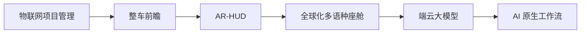

# 个人定位一页纸｜王磊

> 网站 = 个人专业信用系统。本页 30 秒读完：我是谁、擅长什么、能带来什么价值。

---

## 一句话定位

**汽车智能座舱与 AI 解决方案经理**——站在技术、产品、客户与交付的交叉位置，把模糊需求变成可决策、可交付、可复用的方案。

## 核心标语

**把复杂技术转化为可决策、可交付、可复用的解决方案。**

## 首页文案（可直接使用）

- **主标题**：王磊｜汽车智能座舱与 AI 解决方案经理
- **副标题**：从物联网、整车前瞻和 AR-HUD，到全球化多语种座舱、端云大模型与 AI 提效——十余年始终在技术与落地之间架桥。

---

## 三大内容支柱

1. **智能座舱与全球化多语种**——海外市场座舱方案、多语种语音与本地化交付
2. **汽车大模型与端云协同**——端侧/云侧大模型选型、架构与芯片适配
3. **AI 原生解决方案工作流**——用 Agent、Benchmark 与自动化重构方案生产方式

## 差异化交叉能力

汽车行业经验 × 智能座舱 × 多语种全球化 × 大模型 × AI 工作流 × 复杂项目交付——单项不稀缺，交叉即壁垒；差异化标签是 **AI 原生方案工作流**。

## 目标受众

汽车智能化企业（主机厂/Tier 1）· AI 产品团队 · 解决方案与售前组织

## 领域标签

`智能座舱` `多语种/全球化` `端云大模型` `AR-HUD` `车规芯片` `解决方案架构` `AI Agent` `Benchmark` `知识管理` `项目交付`

---

## 职业演进主线

统一主题：始终处于**技术 / 产品 / 客户 / 交付**的交叉位置。

## 两个岗位入口

- **汽车 AI 座舱方向**：座舱方案 · 多语种全球化 · 端云大模型 · 芯片选型 · 复杂交付 → 看旗舰案例与方案方法论
- **AI 提效 / Agent 方向**：AI 工作流 · Benchmark 评测 · Agent 搭建 · 知识管理 · 自动化 → 看工作流实践与工具沉淀

## Now｜我现在在做什么（草稿）

- 深化端云协同大模型座舱方案，跟进车规芯片与部署实践
- 用 AI Agent 重构方案工作流：需求拆解 → 竞品 Benchmark → 方案生成 → 交付复盘
- 建设个人网站与三个旗舰案例，沉淀可复用的方法论

---

## 第一版成功标准

- [ ] 招聘方/同行 30 秒内说得出「我是谁 + 差异化」
- [ ] 首页主/副标题与核心标语直接可上线，无需改写
- [ ] 三支柱与领域标签覆盖两个岗位入口的关键词
- [ ] 演进主线一图讲清十余年职业逻辑
- [ ] Now 模块可每月低成本更新
- [ ] 后续动作已排队：素材保密分级 → 三个旗舰案例大纲
